

---

 

## *Brute It* on TryHackMe
#### February 4th 2023

Topics:       

All the brute forcing in this one. Good practice if you're looking to brush up on tools such as hydra, John the Ripper, and hashcat.

[**Brute It Walkthrough**](walkthroughs/2023-02-04-Brute-It.md)

 

---

 

## *Mr. Phisher* on TryHackMe
#### February 1st 2023

Topics:    

This one was a little frustrating. Not because of the challenge, but because of how slow the machine was that you had to use for the challenge.

[**Mr. Phisher Walkthrough**](walkthroughs/2023-02-01-Mr-Phisher.md)

 

---

 

## *One Year!*
#### January 31st 2023

Topics: 

Today marks two milestones. The first is that one year ago today I created my first post and put this blog online! I've had a lot of fun keeping this blog going and don't see myself stopping it anytime soon.

The second milestone, also one year ago today, is that I started the Evolve Academy cybersecurity bootcamp. That was the beginning of me going all in with cybersecurity and thankfully with a lot of hard work and effort it paid off and I now have a job in the industry.

Thanks to those of you who are readers of this blog and I hope you all find it useful and manage to learn something from it!

 

---

 

## *VulnNet Internal* on TryHackMe
#### January 28th 2023

Topics:         

I really liked this CTF because it had you using services like Redis, NFS, and rsync which aren't seen in many CTF's. It also required you to set up an SSH tunnel to access services on their internal network.

[**VulnNet Internal Walkthrough**](walkthroughs/2023-01-28-VulnNet-Internal.md)

 

---

 

## *eJPT v2 Certification*
#### January 22nd 2023

Topics: 

Even though I just finished the training materials a couple days ago I decided to take the certification exam over the weekend...and passed! The exam was fair in that if you went through the training you have everything you need to pass the exam without studying elsewhere which was good to see. I don't think their detection system is 100% though. It docked me a question on transferring files to and from a system even though I did this on multiple hosts with multiple tools and methods. So it would be nice if they told you what they were looking for regarding how that should be done exactly. Either way, I'm glad I took the time to go for this cert since the training was very well done.

Now on to working towards the OSCP!

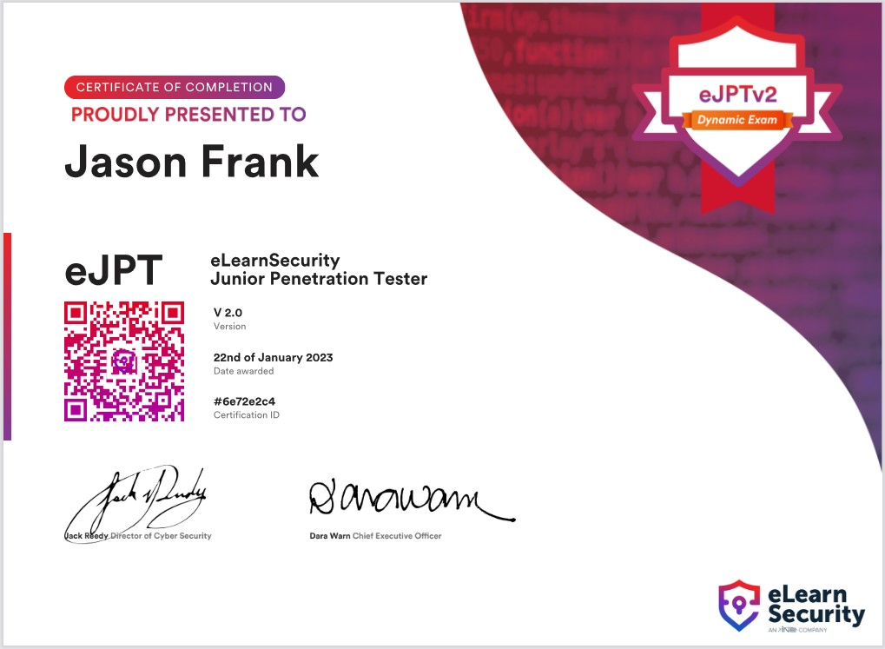

 

---

 

## *eJPT v2 Studying - COMPLETE!*
#### January 19th 2023

Topics: 

After finishing the web application penetration testing module I've completed all 144 hours of the eJPT v2 training. Overall I really enjoyed the training format with videos followed up by hands on labs and thought they covered a lot of good materials and techniques. Certification incoming soon!

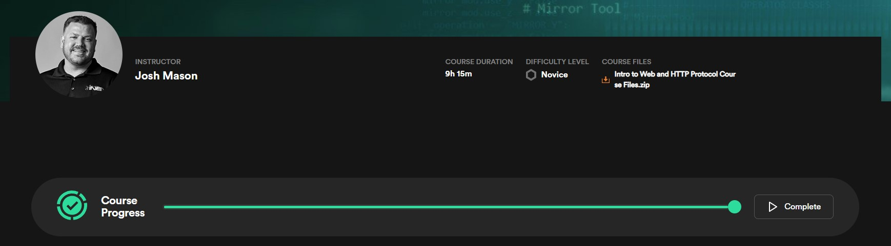

 

---

 

## *Plotted-TMS* on TryHackMe
#### January 16th 2023

Topics:           

This one was a bit longer than the usual easy CTF's and required initial access and then escalating twice to get to root.

[**Plotted-TMS Walkthrough**](walkthroughs/2023-01-16-Plotted-TMS.md)

 

---

 

## *eJPT v2 Studying*
#### January 14th 2023

Topics: 

Decided to finish this section today as well since it was only an hour and a half. 1 section to go on web application penetration testing.

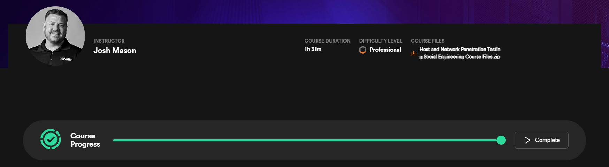

 

---

 

## *eJPT v2 Studying*
#### January 14th 2023

Topics: 

Another section of the eJPTv2 down - the 26 hour and 33 minute post-exploitation module. This leaves only 2 sections to complete and the last 2 are nowhere near as long so I'm almost done!

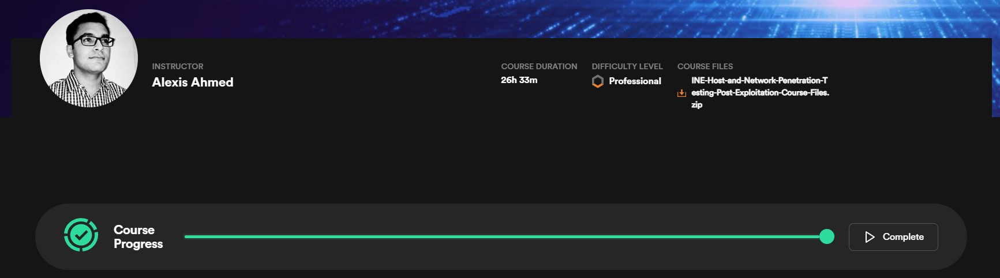

 

---

 

ejptv2-journey-post-exploitation.jpg

## *eJPT v2 Studying*
#### January 1st 2023

Topics: 

Happy New Year to you all!

I've just completed another section of the eJPTv2 course materials, this time the 20 hour and 49 minute exploitation section. Time to move on to the post-exploition training.

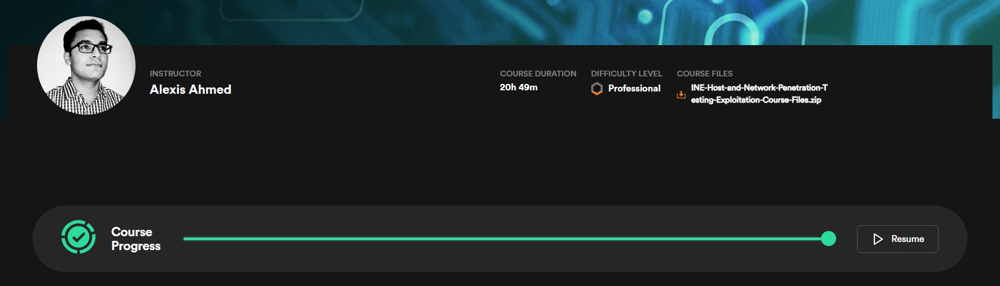

 

---

 

## *Overpass* on TryHackMe
#### December 29th 2022

Topics:         

We find a website with broken access control, and some questionable "encryption", which we exploit to get access to the webserver.

[**Overpass Walkthrough**](walkthroughs/2022-12-29-Overpass.md)

 

---

 

## *Advent of Cyber 4*
#### December 24th 2022

Topics: 

I had a lot of fun going through this years Advent of Cyber challenges over at TryHackMe [**and even won one of the daily prizes believe it or not**](https://mobile.twitter.com/RealTryHackMe/status/1602352579404603393), so that was cool. I ended up giving the voucher away to a student I was teaching in the bootcamp who had started using THM and liked it.

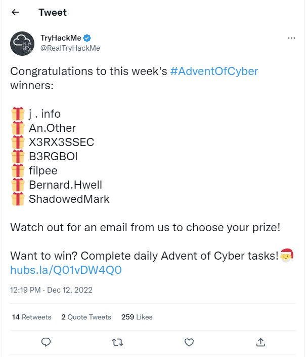

I'd have to say my favorite challenges this year were the game hacking and the MQTT web cam challenge with the video flag at the end. Thanks to THM for putting on another great year of challenges!

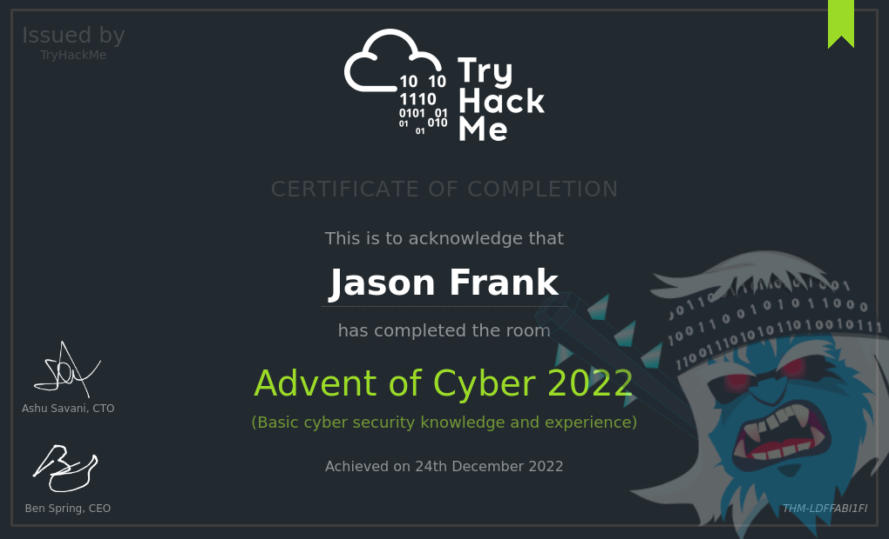

 

## *eJPT v2 Studying*
#### December 11th 2022

Topics: 

I haven't updated on the eJPTv2 studying lately because I had to put that on hold for a bit. But, I'm back at it, and just finished the **34 hour Metasploit training module**. That's not a typo it actually was 34 hours. I knew a good portion of the things covered here but I definitely learned quite a few things as well. This puts me at 62% complete on the training for eJPTv2, so I'm getting there, just a bit slower than I had hoped.

My nights are going to be opening up again since the cybersecurity bootcamp I'm a teaching assistant at is winding down with less than a week left. Once that happens it's full steam ahead on this certification now that it's finally officially released!

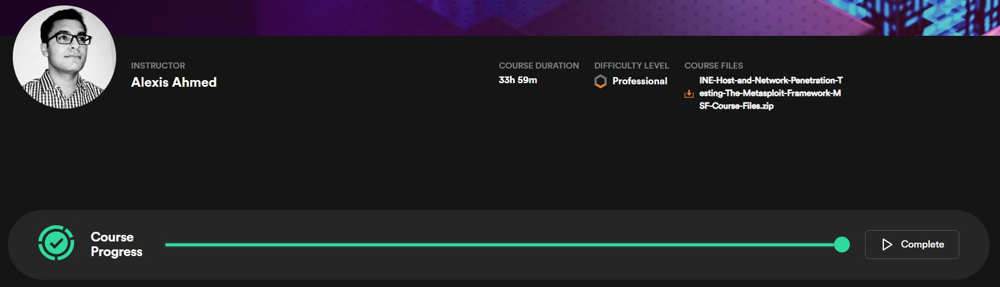

 

---

 

## *Basic Pentesting* on TryHackMe
#### December 9th 2022

Topics:           

This CTF had multiple escalation paths and options which made it fun to hunt down the different ways.

[**Basic Pentesting Walkthrough**](walkthroughs/2022-12-09-Basic-Pentesting.md)

 

---

 

## *IDE* on TryHackMe
#### December 4th 2022

Topics:          

I really liked the privilege escalation path in this one.

[**IDE Walkthrough**](walkthroughs/2022-12-04-IDE.md)

 

---

 

## *Year of the Rabbit* on TryHackMe
#### November 25th 2022

Topics:          

This is a very CTF style CTF with rabbit holes all over the place and things you'd never find in the real word. That being said it was a fun challenge to solve!

[**Year of the Rabbit Walkthrough**](walkthroughs/2022-11-25-Year-of-the-Rabbit.md)

 

---

 

## *Lian_Yu* on TryHackMe
#### November 20th 2022

Topics:         

A quick CTF that's beginner friendly.

[**Lian_Yu Walkthrough**](walkthroughs/2022-11-20-Lian_Yu.md)

 

---

 

## *ToolsRus* on TryHackMe
#### November 15th 2022

Topics:        

A good CTF if you want to get yourself familiar with several different tools.

[**ToolsRus Walkthrough**](walkthroughs/2022-11-15-ToolsRus.md)

 

---

 

## *Wgel CTF* on TryHackMe
#### November 12th 2022

Topics:    

A quick and fun CTF that has you enumerate the website and use what you've found to ssh over to the system.

[**Wgel CTF Walkthrough**](walkthroughs/2022-11-12-Wgel-CTF.md)

 

---

 

## *Physical Security Assessment*
#### November 4th to 9th 2022

Topics: 

I got to do my first on-site physical security assessment at a customer location these past several days which was a lot of fun!

 

---

 

## *Brooklyn Nine Nine* on TryHackMe
#### November 2nd 2022

Topics:           

Everyone's favorite super serious police show in CTF form!

[**Brooklyn Nine Nine Walkthrough**](walkthroughs/2022-11-02-Brooklyn-Nine-Nine.md)

 

---

 

## *OhSINT* on TryHackMe
#### October 31st 2022

Topics: 

A beginner OSINT related CTF that gives you just a picture to start and has you go from there.

[**OhSINT Walkthrough**](walkthroughs/2022-10-31-OhSINT.md)

 

---

 

## *Skynet* on TryHackMe
#### October 27th 2022

Topics:            

A terminiator themed CTF requiring the use of several different exploit methods.

[**Skynet Walkthrough**](walkthroughs/2022-10-27-Skynet.md)

 

---

 

## *Bounty Hacker* on TryHackMe
#### October 24th 2022

Topics:      

Enumeration finds sensitive information on an FTP server that allows anonymous logins and we use that to brute force our way onto the system. After that I show 2 different ways to get root.

[**Bounty Hacker Walkthrough**](walkthroughs/2022-10-24-Bounty-Hacker.md)

 

---

 

## *Startup* on TryHackMe
#### October 22nd 2022

Topics:     

This CTF had one of the funniest things I've seen in a CTF. One of the users on the system had a file in their directory with the following in it:

> I got banned from your library for moving the "C programming language" book into the horror section. Is there a way I can appeal? --Lennie

[**Startup Walkthrough**](walkthroughs/2022-10-22-Startup.md)

 

---

 

## *tomghost* on TryHackMe
#### October 16th 2022

Topics:        

The website has a vulnerable tomcat version running that allows us to use the Ghostcat exploit to view sensitive files on the system and obtain login credentials. From there we find an encrypted message, and after decrypting it with GPG it contains additional login credentials allowing us to laterally move to another user. That user can run zip as root and we escalate over to root with it.

[**tomghost Walkthrough**](walkthroughs/2022-10-16-tomghost.md)

 

---

 

## *LazyAdmin* on TryHackMe
#### October 12th 2022

Topics:       

We find a public facing MySQL database with a username, and password hash, which we crack and gain access to the website. From the admin panel we can upload a .php reverse shell to get our initial foothold on the system. From there we find a backup script we can run as sudo that calls another script we have write access to, and use that to escalate to root.

[**LazyAdmin Walkthrough**](walkthroughs/2022-10-12-LazyAdmin.md)

 

---

 

## *RootMe* on TryHackMe
#### October 9th 2022

Topics:   

A very beginner friendly machine. Through initial enumeration a webpage with file uploads is found that allows us to upload a reverse shell. From there we find a binary with SUID set that shouldn't have it and use it to escalate to root.

[**RootMe Walkthrough**](walkthroughs/2022-10-09-RootMe.md)

 

---

 

## *Ignite* on TryHackMe
#### October 4th 2022

Topics:      

We find a vulnerable CMS with POC code that gives us RCE on the machine and use that to get a reverse shell. After that we find some credentials in a config file and use them to escalate to root.

[**Ignite Walkthrough**](walkthroughs/2022-10-04-Ignite.md)

 

---

 

## *Team* on TryHackMe
#### September 28th 2022

Topics:        

This was a long one. We start off on a webserver and find an LFI vulnerability, then use that LFI issue with Burp to fuzz files on the system and recover a private SSH key for an initial foothold. Then we break out of a program we had sudo access to and laterally move to another user. Finally we have write permissions on a bash script that root executes via crontab and reverse shell back to us with it.

[**Team Walkthrough**](walkthroughs/2022-09-28-Team.md)

 

---

 

## *Agent Sudo* on TryHackMe
#### September 24th 2022

Topics:          

There was a lot going on in this CTF from modifying requests and fuzzing with Burp, steganography, reverse image searching, and more. This one was definitely very much a CTF and not as real world applicable as some of the others out there but it was still fun to go through!

[**Agent Sudo Walkthrough**](walkthroughs/2022-09-24-Agent-Sudo.md)

 

---

 

## *Git Happens* on TryHackMe
#### September 18th 2022

Topics:   

We find a git repository on an external webpage but cloning it doesn't work, so a work around is needed. Once it's downloaded to our system we browse the commits and find the flag.

[**Git Happens Walkthrough**](walkthroughs/2022-09-18-Git-Happens.md)

 

---

 

## *DC-2* on Proving Grounds
#### September 12th 2022

Topics:         

Continuing on to the next CTF in the DC series we tackle DC-2 this time. This CTF has us enumerate a WordPress site, build a custom wordlist, and hydra our way into it. Ultimately we're able to just ssh in with the website credentials and find ourselves in a very restricted shell which we break out of, laterally move to another user, and then escalate to root.

[**DC-2 Walkthrough**](walkthroughs/2022-09-12-DC-2.md)

 

---

 

## *DC-1* on Proving Grounds
#### September 10th 2022

Topics:    

We find a website running a vulnerable version of Drupal and exploit it for initial access to the system. After that we find misconfigured SUID files which we use to escalate to root.

[**DC-1 Walkthrough**](walkthroughs/2022-09-10-DC-1.md)

 

---

 

## *b3dr0ck* on TryHackMe
#### September 2nd 2022

Topics:      

We find a couple open services running on the system that allow us to recover ssh keys and certificates. Using those with another service allowed us to recover passwords and get a foothold on the system. From there we laterally move and decode / crack the root password.

[**b3dr0ck Walkthrough**](walkthroughs/2022-09-02-b3dr0ck.md)

 

---

 

## *eJPT v2 Studying*
#### August 28th 2022

Topics: 

Completed the System/Host Based Attacks section 3-1 of the eJPT v2 training. This was 20.5 hours of training on Windows and Linux covering host based attacks, Windows/Linux vulnerabilities, Windows/Linux privilege escalation, Windows/Linux credential dumping, and Windows file system vulnerabilities.

I'm still very happy with the quality of the training put out in v2 of this course. Learned a lot of new things to try during actual assessments.

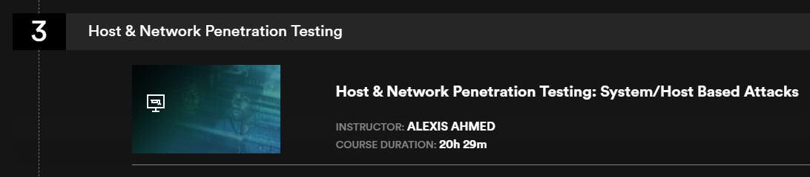

 

---

 

## *Annie* on TryHackMe
#### August 23rd 2022

Topics:       

This was a fun CTF where we found a vulnerable version of AnyDesk and exploited it for an initial foothold. After that we abuse SUID and capabilities to escalate over to root.

[**Annie Walkthrough**](walkthroughs/2022-08-23-Annie.md)

 

---

 

## *Confidential* on TryHackMe
#### August 21st 2022

Topics:  

Brand new CTF that was just released 2 days ago that focuses on DFIR techniques to uncover a QR code that has images overlayed on top of it. This was a fun challenge!

[**Confidential Walkthrough**](walkthroughs/2022-08-21-Confidential.md)

 

---

 

## *DEF CON!*
#### August 15th 2022

Topics: 

I had such a good time at DEF CON meeting up with my new co-workers at Evolve Security as well as people from the bootcamp I went through, it was great to meet everyone in person.

The conference itself was something to experience for sure. So many smart and interesting people to meet, hang out with, and learn from. The talks were very well done and the hands on activities were also great. They had a really cool badge this year too which was a musical keyboard with challenges to complete on it.

Some of the things I went and saw / did:

- Practical Dark Web Hunting using Automated Scripts
- Intro to Lockpicking
- Vulnerability Assessment of a Satellite Simulator
- The Big Rick: How I Rickrolled my High School District and Got Away With It
- Tor: Darknet Opsec By a Veteran Darknet Vendor & the Hackers Mentality
- Offensive Wireless Security 101
- Hands on lockpicking and tamper proof hacking
- Wandering around to all of the villages and meeting people

Outside of that I went and saw the OmegaMart exhibit which was really fun and attended several of the DEF CON parties.

If you haven't been I highly recommend it!

 

---

 

## *DEF CON!*
#### August 9th 2022

Topics: 

I'll be attending my first DEF CON in a couple days! Can't wait to see what it's all about and meet some interesting folks along the way.

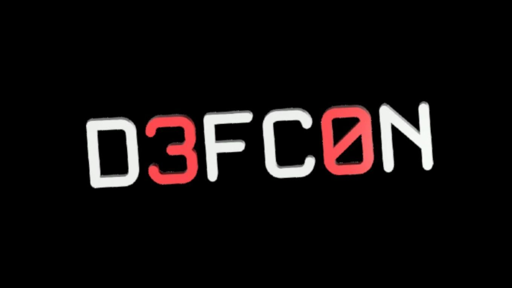

 

---

 

## *Dig Dug* on TryHackMe
#### August 7th 2022

Topics:   

I'm not sure why they turned this into a CTF when the solution was running a single dig command, but I finished it.

[**Dig Dug Walkthrough**](walkthroughs/2022-08-07-DigDug.md)

 

---

 

## *eJPT v2 Studying*
#### August 4th 2022

Topics: 

Section 2 of 4 down in the eJPT v2 training. This was a much shorter section covering general auditing. The next section is host and network pen testing, and it's over 100 hours of training, so that one's going to take a bit to complete!

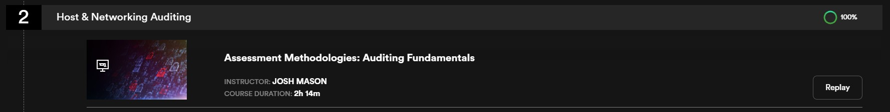

 

---

 

## *CyberHeroes* on TryHackMe
#### August 3rd 2022

Topics:   

This is a very beginner friendly challenge and running the nmap scan took longer than solving the actual challenge here. No shell or anything like that you just need to figure out the username and password to login to the website and that's the end of the challenge.

[**CyberHeroes Walkthrough**](walkthroughs/2022-08-03-CyberHeroes.md)

 

---

 

## *New Job!*
#### August 1st 2022

Topics: 

I started my first full time job in cybersecurity today! I was hired on at Evolve Security as a Security Analyst and will be primarily performing vulnerability assessments with some penetration testing thrown in as well. Very excited to continue to learn and grow in this field!

 

---

 

## *Brute* on TryHackMe
#### July 31st 2022

Topics:       

This CTF was just released 2 days ago and it was heavy on brute forcing as the name suggests. Some other techniques such as log poisoning were needed which mixed things up a bit.

[**Brute Walkthrough**](walkthroughs/2022-07-31-Brute.md)

 

---

 

## *eJPT v2 Studying*
#### July 30th 2022

Topics: 

With the Security+ certification down my next goal is to move towards the eJPT v2 certification. It's currently in a transitional phase moving from a multiple choice exam (v1) to a practical exam (v2), but the course materials are already out there for v2 since it will be going live in the not too distant future.

I signed up for the INE service earlier this week and have been going through the course. In total there are 144 hours of training across 4 sections, so it's quite extensive and so far I have to say it's very well done. It's in a video lecture and then practice what you learned in a lab format which I really like.

I just completed section 1 which was 24 hours of training and covered the following with subsections under each:

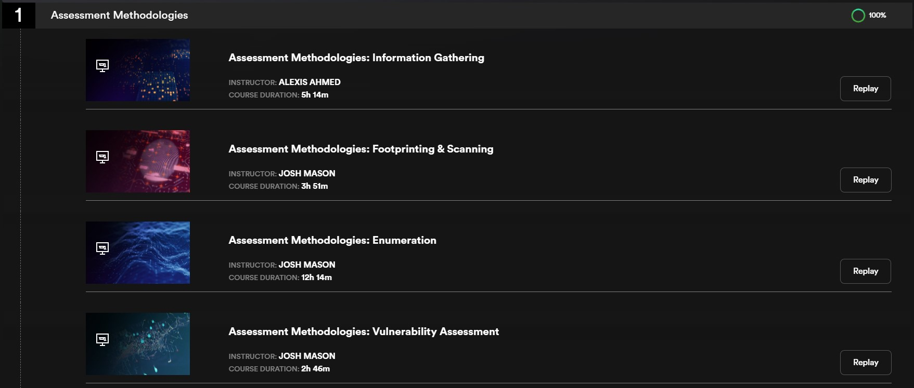

 

---

 

## *OnSystemShellDredd* on Proving Grounds
#### July 25th 2022

Topics:   

This one was quick and easy with our nmap scan showing only 2 ports open: FTP and a non-standard SSH port. FTP allowed anonymous access and on the FTP server we found a private ssh key that allowed us on the system. From there we find a SUID file that allowed us to escalate to root.

[**OnSystemShellDredd Walkthrough**](walkthroughs/2022-07-25-OnSystemShellDredd.md)

 

---

 

## *Olympus* on TryHackMe
#### July 22nd 2022

Topics:        

A new room that was just released a few days ago. This was an SQL injection heavy CTF which was used along with hashcat to establish an initial foothold. After that we find a non-standard SUID file which allows us to laterally move to another user. We then find a backdoor installed on the system and are able to escalate to root through it. Had a good time going through this one!

[**Olympus Walkthrough**](walkthroughs/2022-07-22-Olympus.md)

 

---

 

## *Road* on TryHackMe
#### July 19th 2022

Topics:     

This was a fun CTF that saw us exploiting a password reset mechanism to gain admin access on the website and then using that to get an initial foothold on the system. From there we found some credentials in a Mongo database and were able to laterally move to another user. Finally that user had sudo access to run a backup utility along with LD_PRELOAD being set allowing us to create a malicious .c script, compile it, and use it to escalate to root while calling the backup utility.

[**Road Walkthrough**](walkthroughs/2022-07-19-Road.md)

 

---

 

## General Update
#### July 18th 2022

Topics: 

These past 3 weeks have been pretty crazy leaving me no time to update this blog. The Security+ exam I was supposed to take on June 29th had to be rescheduled due to technical issues at the testing center and was moved to July 12th. I passed on my first try!

[**View Certificate**](https://www.credly.com/badges/37096bdd-da9f-4655-93f8-b8f9d2f54bd2)

The intensive 5 month Evolve Security Academy bootcamp I was in came to a close and we had 2 weeks to complete the multi-part finals, which are now done. Just before the finals our capstone project was a real world vulnerability assessment on a company Evolve Security lined up and the students were responsible for finding vulnerabilities, creating a deliverable report for the customer, and presenting the findings to the customer over Zoom. I was one of the 4 presenters selected to go over findings with the customer.

And as a huge bonus I was offered a job as a Teachers Assistant in the next bootcamp starting at the end of July. I've accepted and will be joining the Evolve Security Academy team as a result.

[**View Certificate**](https://www.credly.com/badges/85e94015-66b4-4eb9-8ff7-f92d9e12d6df)

And on top of that I've been spending a lot of time searching for a full time position in cybersecurity. I've had some good leads and interviews but haven't found the right fit yet.

Now that things have calmed down a bit it's back to your regularly scheduled programming and you should be seeing some new CTF walkthroughs posted here soon. I've missed doing these and am excited to get back to it.

 

---

 

## Antisyphon - Intelligence Investigations: Business
#### June 21st and 22nd 2022

Topics: 

This was a 2 day course taught by Joe Gray that focused on advanced OSINT topics. Some of the topics covered were:
- Deep dive into DNS for use in investigations
- Public filings: where you can find them and what you can learn from them
- Using social media sites to gather information for use in social engineering campaigns
- Building technology maps, associated vendors, and more from job postings

It rounded out with a CTF that required the use of techniques learned throughout the course to find required information which was a lot of fun. Thanks to Antisyphon for yet another great pay what you can course!

[**View Certificate**](certs/as-intelligenceinvestigations.pdf)

 

---

 

## *SunsetNoontide* on Proving Grounds
#### June 20th 2022

Topics:    

Very easy machine. We find an UnrealIRCd server running on the system that's vulnerable to an RCE exploit and use that to establish a foothold on the system. Then we find default credentials for the root user and escalate our privileges that way.

[**SunsetNoontide Walkthrough**](walkthroughs/2022-06-20-SunsetNoontide.md)

 

---

 

## SANS Ransomware Summit 2022
#### June 16th and 17th 2022

Topics: 

This summit was 14 hours split over 2 days and had some very interesting and useful information covering a wide range of ransomware topics. Some of the presentations I found the most interesting were:

+ How to engage with an attacker after you've fallen victim to an attack
+ Cryptocurrency and it's role in organized cybercrime
+ The cybercriminal supply chain and how it's different pieces are getting more and more specialized, and how they're starting to function more like legit businesses would
+ And an incident response retelling from a targetted ransomware attack in the industrial sector

This is the 3rd summit I've attended from SANS and they're always such great events.

[**View Certificate**](certs/sans-ransomwaresummit.pdf)

 

---

 

## *FunboxRookie* on Proving Grounds
#### June 12th 2022

Topics:     

A quick finish on this one. We find password protected .zip files on an FTP server that we can login to anonymously. We download the .zip files, crack the passwords, and unzip them to find they contain id_rsa files. We use one of those to ssh into the system and find clear text credentials inside of a .mysql_history file, and use credentials to check sudo -l which shows us we can run anything as root.

[**FunboxRookie Walkthrough**](walkthroughs/2022-06-12-FunboxRookie.md)

 

---

 

## *FunboxEasy* on Proving Grounds
#### June 9th 2022

Topics:     

This box has several websites to investigate and we eventually find one we're able to login as admin to and use a php reverse shell to gain our initial foothold. After that we find user credentials in a file and use those to laterally move. The user we move to has sudo privileges for both pkexec and time, and we can use either to escalate to root.

[**FunboxEasy Walkthrough**](walkthroughs/2022-06-09-FunboxEasy.md)

 

---

 

## Security+ Certification
#### June 6th 2022

Topics: 

The Evolve bootcamp I've been in since January will be ending in a little over 2 weeks so I'm preparing for the final project and test there, as well as spending a lot of time studying for the Security+ certification.

The bootcamp includes an exam voucher for the Security+ and I decided to take a work backwards approach and schedule a date to sit for the exam. I've always liked this approach since it let's you avoid the trap of drawing the process out longer than it needs to be and forces you to really focus on the objective.

So with that said I'll be taking the exam on June 29th, and because of that you'll see less CTF walkthroughs here than normal since I'm focusing on finishing the bootcamp and studying for the Security+.

 

---

 

## *PyExp* on Proving Grounds
#### June 4th 2022

Topics:      

An interesting box that finds us brute forcing our way into an exposed MySQL database to find some Fernet encrypted credentials which we decrypt to establish an initial foothold. Then we find a python script that can be executed as root to escalate our privileges.

[**PyExp Walkthrough**](walkthroughs/2022-06-04-PyExp.md)

 

---

 

## *Katana* on Proving Grounds
#### June 3rd 2022

Topics:    

A lot of website enumeration was required on this CTF since there were 3 different websites and rabbit holes to dig into. We eventually find an upload form that allows us to send a php reverse shell and establish our initial foothold on the system. After that we find cap_setuid+ep set on python2.7 and use it to escalate to root.

[**Katana Walkthrough**](walkthroughs/2022-06-03-Katana.md)

 

---

 

## *CyberSploit1* on Proving Grounds
#### June 1st 2022

Topics:   

This system we find a username in the web pages source code, a password in robots.txt, and then ssh over for our initial foothold. Then we see the system was running a very old version of Ubuntu that's vulnerable to the **CVE-2015-1328** aka **overlayfs** exploit which we use to escalate our privileges to root.

[**CyberSploit1 Walkthrough**](walkthroughs/2022-06-01-CyberSploit1.md)

 

---

 

## SANS Emergency Webcast - MSDT "Follina" (CVE-2022-30190)
#### May 31st 2022

Topics: 

I attended this emergency webcast today where Jake Williams from the SANS Institute covered Follina (CVE-2022-30190) and ways to detect, mitigate, and hunt for it.

This exploit abuses the ms-mdt protocol handler and there are already several POC published. In addition it's pretty trivial to exploit.

### A couple ways to mitigate:
- Disable the MSDT protocol:
> [**Microsoft MSRC Blog**](https://msrc-blog.microsoft.com/2022/05/30/guidance-for-cve-2022-30190-microsoft-support-diagnostic-tool-vulnerability/)
- Disable troubleshooting tools via GPO:
> reg add "HKLM\SOFTWARE\Policies\Microsoft\Windows\ScriptedDiagnostics" /t REG_DWORD /v EnableDiagnostics /d 0

 

### A few ways to detect:
- Check for msdt.exe running, this is the one thing that will always be a constant in this exploit
- sdiagnhost.exe will be the parent process
- Check to see if winword.exe connects to websites other than *.microsoft.com or *.office.com
 
 

### Forensics and hunting:
- Check the Microsoft Office internet cache:
> reg query "hkcu\software\microsoft\office\16.0\common\internet\server cache"
- Yara rule by Joe Security:
> [**joesecurity.org Yara Rule**](https://joesecurity.org/resources/follina.yara)
- Sigma rules by Chris Peacock or Kostas:
> [**Chris Peacock GitHub**](https://github.com/securepeacock/sigma/blob/963289fbbc961454979d3b0219ac103a4142e1b4/rules/windows/process_creation/proc_creation_win_msdt_follina.yml) or
>[**Kostas GitHub**](https://github.com/tsale/Sigma_rules/blob/main/windows_exploitation/ms-msdt_exploitation.yml)

 

---

 

## *Thompson* on TryHackMe
#### May 30th 2022

Topics:      

This was a quick and easy box with default credentials that let us into the Apache Tomcat manager panel. From there we were able to deplaoy a WAR reverse shell and ended up finding a cron job that ran as root calling a script we could modify for privilege escalation.

[**Thompson Walkthrough**](walkthroughs/2022-05-30-Thompson.md)

 

---

 

## *AllSignsPoint2Pwnage* on TryHackMe
#### May 27th 2022

Topics:     

This was a fun Windows based box that had us using FTP, SMB, PHP reverse shells, VNC, and plenty of manual enumeration.

[**AllSignsPoint2Pwnage Walkthrough**](walkthroughs/2022-05-27-AllSignsPoint2Pwnage.md)

 

---

 

## Antisyphon: Active Defense & Cyber Deception
#### May 26th 2022

Topics: 

This was a 4 day class taught by former SANS instructor John Strand. A few of the topics covered were:
+ Various open source tools that can be easily configured and setup in your environment to detect, delay, and gather information on attackers
+ The legality of active defense: what to avoid and what is ok based on actual legal precedence
+ The MITRE Engage framework
+ Canarytokens, port spoofing, honeypots, honeyports, and other honey measures
+ 9 different hands on labs
+ And much more

This course really drove home how you can use active defense and cyber deception not just for malicious "hackback" type activies, but also for attribution, detection capabilities, and slowing attackers down giving you more time to respond. I had a great time taking this training and look forward to additional Antisyphon classes soon!

[**View Certificate**](certs/as-activedefensecyberdeception.pdf)

 

---

 

## *Biblioteca* on TryHackMe
#### May 23rd 2022

Topics:        

New box that came out a couple days ago. We find ourselves with a website vulnerable to SQLi which we use to obtain an initial foothold on the system. From there we laterally move after taking advantage of a weak password. And finally we use Python library hijacking to escalate to root.

[**Biblioteca Walkthrough**](walkthroughs/2022-05-23-Biblioteca.md)

 

---

 

## *Gaara* on Proving Grounds
#### May 20th 2022

Topics:     

This box has us manually enumerate a website to find encoded text, and when decoding we find a system username that we're able to brute force with hydra. After that we find that the GNU Debugger has a SUID bit set on it which allows us to escalate to root.

[**Gaara Walkthrough**](walkthroughs/2022-05-20-Gaara.md)

 

---

 

## *Anonforce* on TryHackMe
#### May 18th 2022

Topics:      

This was also a pretty quick CTF. We only had 2 ports open: FTP and SSH, and when connecting to the FTP server and logging in as anonymous we find the entire file system available to us. We find a private PGP key and encrypted backup file and then crack the password on the PGP key and use it to decrypt the backup which gives us a copy of the /etc/shadow file. We then crack the root hash and login to the system.

[**Anonforce Walkthrough**](walkthroughs/2022-05-18-Anonforce.md)

 

---

 

## *Simple CTF* on TryHackMe
#### May 17th 2022

Topics:     

A quick and simple CTF. We brute forced our way in via SSH using Hydra and used GTFOBins to escalate to root.

[**Simple CTF Walkthrough**](walkthroughs/2022-05-17-SimpleCTF.md)

 

---

 

## *RazorBlack* on TryHackMe
#### May 16th 2022

Topics:               

This was a long box but I learned a lot and it was well done and fun to go through. We initially found files on a public NFS share that we deduced usernames from, and then used crackmapexec to find the hash of a user which we cracked and began to enumerate SMB with. 3 lateral movements later we finally land on a user who has the backup operators group and are able to exploit robocopy to escalate our privileges to system.

[**RazorBlack Walkthrough**](walkthroughs/2022-05-16-RazorBlack.md)

 

---

 

## *VulnNet: Active* on TryHackMe
#### May 14th 2022

Topics:            

This box had us exploiting an exposed Redis instance to view files and run commands on the system, using responder to capture hashes and then cracking them with hashcat, enumerating SMB shares, creating payloads with msfvenom, and exploiting PrintNightmare for privilege escalation.

[**VulnNet: Active Walkthrough**](walkthroughs/2022-05-14-VulnNet-Active.md)

 

---

 

## *Chill Hack* on TryHackMe
#### May 10th 2022

Topics:           

There was a lot going on with this box from cracking, to decoding, and even steganography. We used a webshell embedded into the website for initial access and then found credentials for a SQL database, which led us to additional credentials we could use to ssh in. After that we were able to laterally move to a user who was a member of the docker group which allowed us to mount an image as root to find our final flag.

[**Chill Hack Walkthrough**](walkthroughs/2022-05-10-Chill-Hack.md)

 

---

 

## *Kubernetes for Everyone* on TryHackMe
#### May 7th 2022

Topics:          

Brand new machine that was just released yesterday. We exploited a CVE in the Grafana web application to enumerate the system with directory traversal. After we established a foothold on the system we used the k0s distro of Kubernetes for several things, as well as finding hidden information in a local git repository. Decoding and cracking were also required on this one.

[**Kubernetes for Everyone Walkthrough**](walkthroughs/2022-05-07-Kubernetes-for-Everyone.md)

 

---

 

## Web Fundamentals Learning Path on TryHackMe
#### May 6th 2022

Topics: 

I've been working my way through this learning path and completed it today. It consists of 32 hours of training and covers the following:
- Using Burp suite intruder, repeater, encoder/decoder, comparer, sequencer, BApp store, and more
- Went through the OWASP top 10 and also had you go complete the OWASP Juice Shop challenges
- Covered many standard vulnerability types such as IDOR, LFI, RFI, SSRF, XSS, RCE, SQLi, and more

That's 5 of the 7 learning paths complete now, and the last two I'm over 50% of the way through already. Almost there!

[**Certificate link**](https://tryhackme-certificates.s3-eu-west-1.amazonaws.com/THM-IBJZFTD0XY.png)

 

---

 

## *Net Sec Challenge* on TryHackMe
#### May 5th 2022

Topics:  

This was a quick challenge that asked us to perform enumeration with nmap, brute force a couple users on an FTP server with Hydra, and then use a stealthy nmap scan to avoid IDS detection.

[**Net Sec Challenge Walkthrough**](walkthroughs/2022-05-05-Net-Sec-Challenge.md)

 

---

 

## Level 13 on TryHackMe
#### May 4th 2022

Topics: 

I finally did it! Level 13 is the highest level you can achieve on TryHackMe and I got there today. Out of 1.1 million users on the site I'm currently ranked number 4683. Given the relatively short amount of time I've been using the site I hope that reflects the amount of time and effort I've been putting into furthering my learning.

I found and started using TryHackMe a little over 5 months ago right in the middle of their annual Advent of Cyber 3 Christmas event and have been loving it ever since. I've learned so much since then and will continue to do so on a daily basis until I get to where I want to be in cybersecurity.

 

 

---

 

## *Gotta Catch'em All!* on TryHackMe
#### May 3rd 2022

Topics:   

This was clearly an easy and for fun box that doesn't have a lot that would apply to anything real world, but it was a fun machine to walkthrough regardless!

[**Gotta Catch'em All! Walkthrough**](walkthroughs/2022-05-03-Gotta-Catchem-All.md)

 

---

 

## *Dogcat* on TryHackMe
#### April 30th 2022

Topics:        

We use LFI and Apache2 log poisoning to establish initial access on the system and find we're inside of a docker container as the www-data user. Then we figure out how to escalate to container root and eventually escape the container to the host system.

[**Dogcat Walkthrough**](walkthroughs/2022-04-30-Dogcat.md)

 

---

 

## *Wpwn* on Proving Grounds
#### April 28th 2022

Topics:    

On this box we find a Wordpress site that's vulnerable to CVE-2019-9978 and use that for an initial foothold on the system. We're able to escalate privileges using a password we found in the wp-config.php file. And finally gain root via sudo.

[**Wpwn Walkthrough**](walkthroughs/2022-04-28-Wpwn.md)

 

---

 

## *Fowsniff CTF* on TryHackMe
#### April 26th 2022

Topics:         

We find ourselves visiting a companies website that is currently down due to a breach and end up finding that hackers posted a message on Twitter with a link to Pastebin containing password hashes for the companies employees. We crack these, use them to login to a POP3 mail server to find additional credentials, and finally get system access. Finally we take advantage of being able to write to a bash script that root runs to escalate privileges.

[**Fowsniff CTF Walkthrough**](walkthroughs/2022-04-26-Fowsniff-CTF.md)

 

---

 

## *UltraTech* on TryHackMe
#### April 22nd 2022

Topics:     

With this box we find an API vulnerable to command injection and use it to gather credentials and compromise the system. After that we find we're a member of the docker group, and use that to obtain the root private ssh key.

[**UltraTech Walkthrough**](walkthroughs/2022-04-22-UltraTech.md)

 

---

 

## *Tech_Supp0rt: 1* on TryHackMe
#### April 20th 2022

Topics:     

This is a brand new box that just came out and it let's us interact with the **Subrion** CMS system to find it's weaknesses.

[**Tech_Supp0rt: 1 Walkthrough**](walkthroughs/2022-04-20-Tech_Supp0rt1.md)

 

---

 

## *Hacker Rank* on Hack the Box
#### April 18th 2022

Topics: 

And as a bonus to my first medium rated HTB machine it also bumped me up in level to **Hacker** on completion!

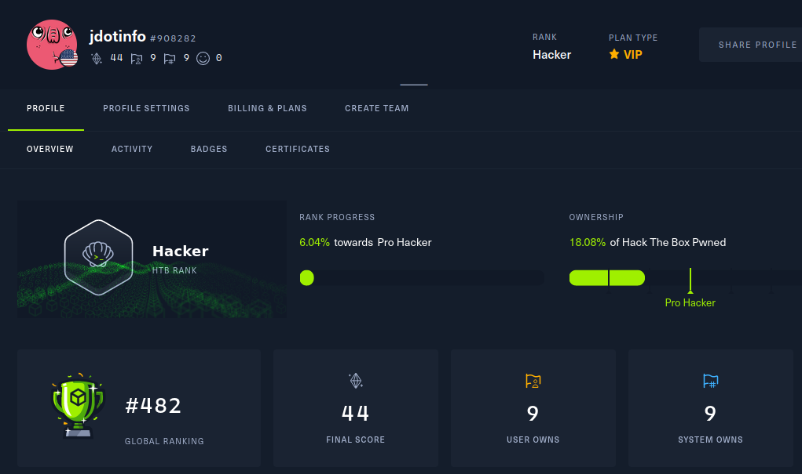

 

---

 

## *Meta* on Hack the Box
#### April 18th 2022

Topics:       

Since I ran out of still active easy boxes on HTB I decided to give my first medium rated HTB machine a try. After a lot of enumeration, use of multiple CVE's, and some modification of config files and environmental variables I was successful! This was a fun one to go through.

No walkthrough yet since this is still an active box.

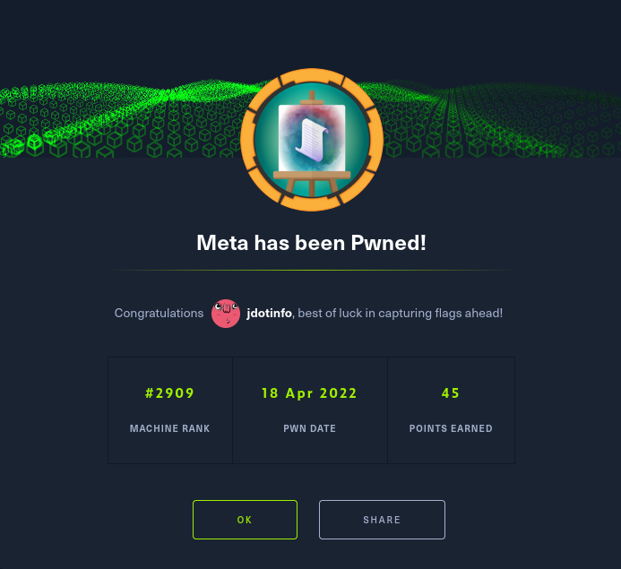

 

---

 

## *Sumo* on Proving Grounds
#### April 14th 2022

Topics:  

This was my first Proving Grounds box and I had a lot of fun going through it. To fully complete this it required the use of 2 different CVE's.

[**Sumo Walkthrough**](walkthroughs/2022-04-14-Sumo.md)

 

---

 

## *Timelapse* on Hack the Box
#### April 13th 2022

Topics:       

This was a fun Windows based box that was just released a couple weeks ago so I can't post the walkthrough quite yet. When it's retired I'll be sure to come and add it.

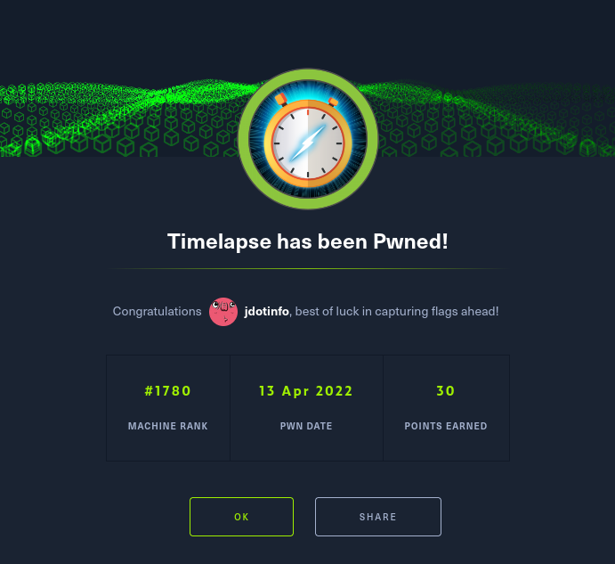

 

---

 

## *Ninja Skills* on TryHackMe
#### April 12th 2022

Topics: 

And now I know why I haven't done a lot of Windows boxes on TryHackMe...I'm already running out of ones to choose from. If there are more they're likely hidden in the hard and above rating which I'll have to check out.

This ended up being a very quick and easy refresher on basic linux commands.

[**Ninja Skills Walkthrough**](walkthroughs/2022-04-12-Ninja-Skills.md)

 

---

 

## *Anthem* on TryHackMe
#### April 10th 2022

Topics:   

This Windows based CTF has us enumerate a website running the Umbraco CMS system to find our initial system access, and then manually enumerate the system after connecting via RDP to find admin credentials.

[**Anthem Walkthrough**](walkthroughs/2022-04-10-Anthem.md)

 

---

 

## SANS OSINT Summit 2022
#### April 7th 2022

Topics: 

I attended the all day OSINT summit hosted by SANS today and it was such a fun and great day of learning. You can see from the list of topics and speakers that there were a wide variety of OSINT areas covered, as well as some truly exceptional speakers.

At the end of her talk [**Alethe Denis**](https://twitter.com/AletheDenis) had a mini OSINT challenge that she gave to everyone attending where you had to search out her previous jobs and private message her the 2nd job she ever had, as well as where it was located.

**I was the first person to complete the challenge!**

Unexpected given I'm still a beginner with OSINT and the conference had veteran industry pros attending. So either they weren't competing, or I got lucky, but either way it was a lot of fun!

Thanks to **SANS** for hosting this wonderful event and I look forward to next years!

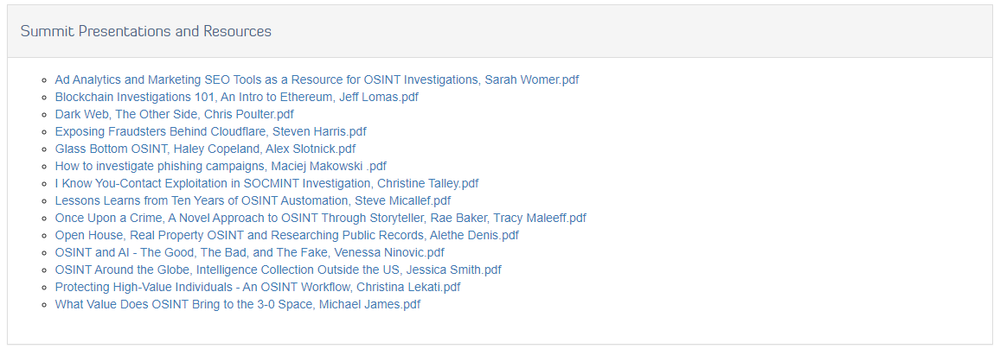

 

---

 

## *Blueprint* on TryHackMe
#### April 6th 2022

Topics:     

In this CTF we get to poke around osCommerce to obtain a shell, and then use mimikatz to pull credentials out of memory.

[**Blueprint Walkthrough**](walkthroughs/2022-04-06-Blueprint.md)

 

---

 

## *VulnNet: Roasted* on TryHackMe
#### March 31st 2022

Topics:         

I've done quite a few Linux based boxes and am starting to feel more and more comfortable in that realm, but haven't done nearly as many Windows boxes. Because of that I'm going to start getting out of my comfort zone and working on Windows boxes to increase my skills there.

[**VulnNet: Roasted Walkthrough**](walkthroughs/2022-03-31-VulnNet-Roasted.md)

 

---

 

## Antisyphon - Intro to Social Engineering
#### March 29th 2022

Topics: 

I completed my first Antisyphon class today and it was very well done. I can see why their classes have been so highly praised and recommended!

Ed Miro ([**@c1ph0r on Twitter**](https://twitter.com/c1ph0r)) taught us the basics about social engineering in a fun and engaging way and covered the following topics:

- Common attack vectors
- Good foundational books to get started with
- Influence
- Nonverbal communication
- Effective pretexting
- Sock puppets
- Red flags to look out for if you think somebody is trying to target you

He also did live demos for:

- SEToolkit
- Metasploit
- GoPhish

 

---

 

## *Aratus* on TryHackMe
#### March 26th 2022

Topics:       

Brand new box that just came out yesterday and I had a lot of fun going through this one.

[**Aratus Walkthrough**](walkthroughs/2022-03-26-Aratus.md)

 

---

 

## *Pandora* on Hack the Box
#### March 23rd 2022

Topics:         

This one took awhile to finish with 2 lateral movements, both an internal and external webpage, and other things to trip you up along the way such as restricted shells. I had a great time going through it though!

This was also the last easy rated active machine on HTB that I needed to finish, so they're all complete for now until the next one is released.

No walkthrough since this box isn't officially retired yet.

 

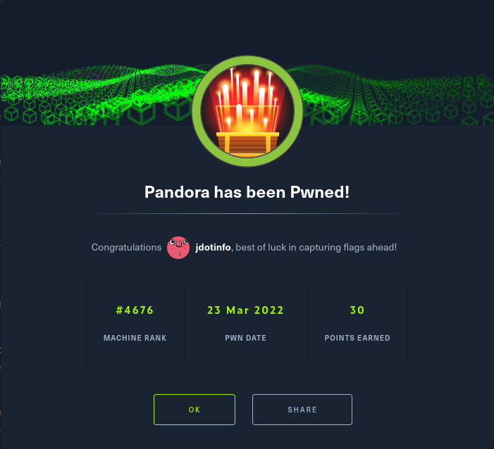

 

---

 

## *Napping* on TryHackMe (TOP 10 FINISH at #9!!!)
#### March 19th 2022

Topics:        

[**Napping Walkthrough**](walkthroughs/2022-03-19-Napping.md)

 

---

 

## *Backdoor* on Hack the Box
#### March 17th 2022

Topics:       

This was an interesting box with several vulnerabilities that required a bit more enumeration than other boxes I've done up to this point. Especially the part where you had to figure out what was running on port 1337. I definitely enjoyed this one!

No walkthrough since this box isn't officially retired yet.

 

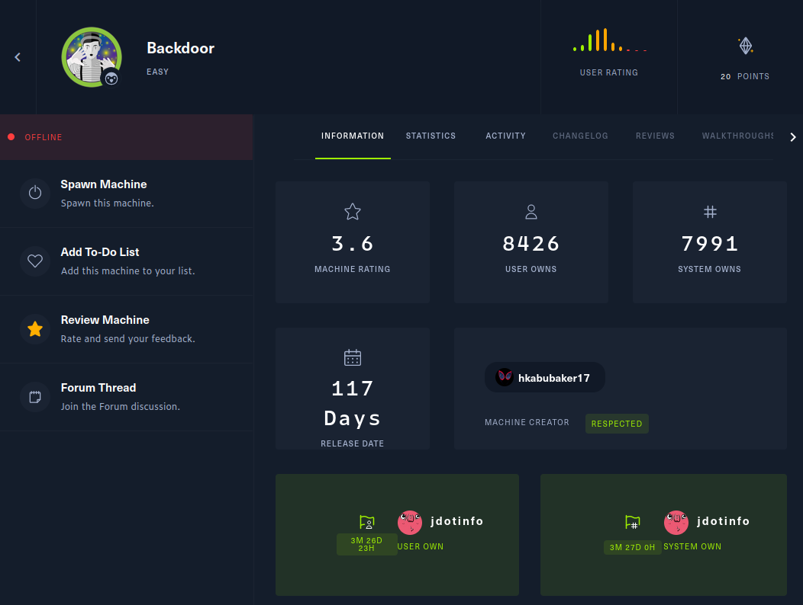

 

---

 

## *Validation* on Hack the Box
#### March 14th 2022

Topics:     

[**Validation Walkthrough**](walkthroughs/2022-03-14-Validation.md)

 

---

 

## *Source* on TryHackMe
#### March 13th 2022

Topics:   

[**Source Walkthrough**](walkthroughs/2022-03-13-Source.md)

 

---

 

## Level 12 on TryHackMe
#### March 11th 2022

Topics: 

I advanced to level 12 on TryHackMe today! Out of almost a million users I'm currently #5518 in the overall rankings.

 

 

---

 

## *Cyborg* on TryHackMe
#### March 10th 2022

Topics:     

[**Cyborg Walkthrough**](walkthroughs/2022-03-10-Cyborg.md)

 

---

 

## *Oh My WebServer* on TryHackMe
#### March 7th 2022

Topics:    

[**Oh My WebServer Walkthrough**](walkthroughs/2022-03-07-Oh-My-WebServer.md)

 

---

 

## 90 Day Badge on TryHackMe!
#### March 6th 2022

Back in December I set a goal to take learning much more seriously, and today I hit a milestone. 90 days in a row of learning something new without missing a single day on TryHackMe! Make learning a daily habit.

 

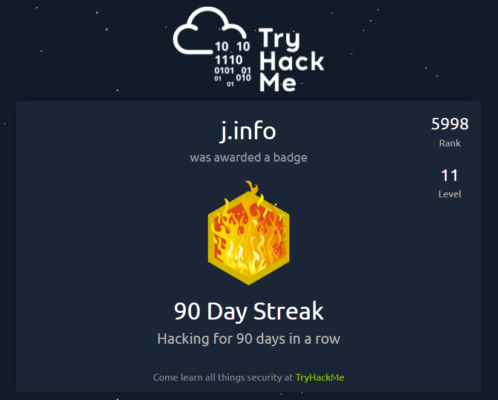

 

---

 

## *RouterSpace* on Hack the Box
#### March 3rd 2022

Topics:     

This was a pretty frustrating box because of the Android emulation. I ran into problem after problem that I had to look up fixes for in order to be able to install and launch the .apk file. But in the end I got it, and boy was I glad when it was finally done!

No walkthrough since this is a brand new box that isn't officially retired yet.

 

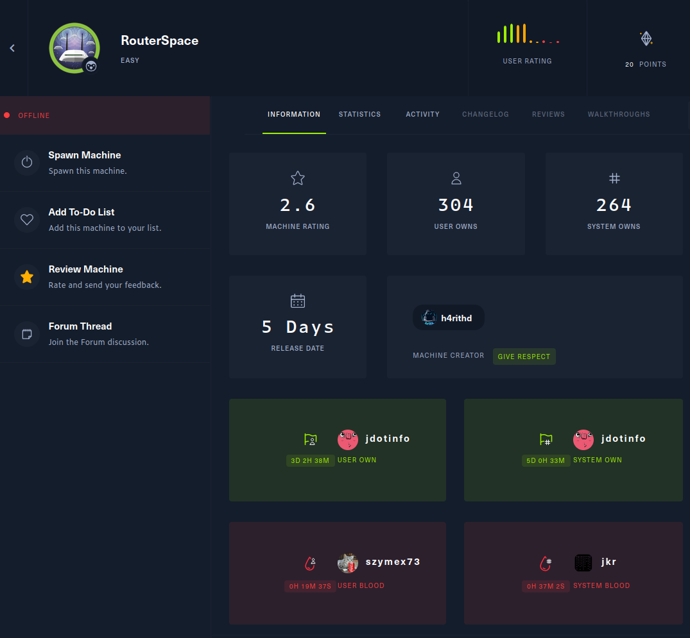

 

---

 

## *Return* on Hack the Box
#### February 25th 2022

Topics:   

[**Return Walkthrough**](walkthroughs/2022-02-25-Return.md)

 

---

 

## *Archangel* on TryHackMe
#### February 22nd 2022

Topics:       

[**Archangel Walkthrough**](walkthroughs/2022-02-22-Archangel.md)

 

---

 

## *Plotted-TMS* on TryHackMe
#### February 19th 2022

Topics:       

[**Plotted-TMS Walkthrough**](walkthroughs/2022-02-19-Plotted-TMS.md)

 

---

 

## *Chocolate Factory* on TryHackMe
#### February 16th 2022

Topics:     

[**Chocolate Factory Walkthrough**](walkthroughs/2022-02-16-Chocolate-Factory.md)

 

---

 

## *Mustacchio* on TryHackMe
#### February 15th 2022

Topics:     

[**Mustacchio Walkthrough**](walkthroughs/2022-02-15-Mustacchio.md)

 

---

 

## *Boiler* on TryHackMe
#### February 13th 2022

Topics:      

[**Boiler Walkthrough**](walkthroughs/2022-02-13-Boiler.md)

 

---

 

## *Gallery* on TryHackMe
#### February 12th 2022

Topics:    

[**Gallery Walkthrough**](walkthroughs/2022-02-12-Gallery.md)

 

---

 

## *Secret* on Hack the Box
#### February 10th 2022

Topics:        

This was pretty challenging for an easy rated box and it took awhile and a lot of google searching to figure out how to do some things that were new to me like using curl to interact with an API, forge JWT tokens, create and interact with core dumps to pull information out of memory, and more.

Again, no walkthrough since this box is not officially retired.

 

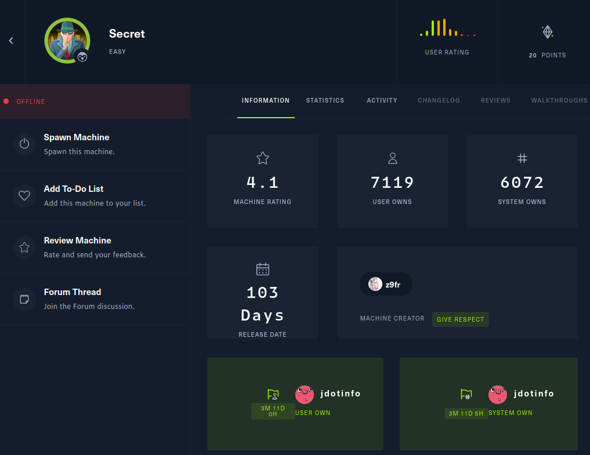

 

---

 

## *Internal* on TryHackMe
#### February 9th 2022

Topics:          

[**Internal Walkthrough**](walkthroughs/2022-02-09-Internal.md)

 

---

 

## *Paper* on Hack the Box
#### February 7th 2022

Topics:    

This is my first actual HTB machine other than the starting point so it was a lot of fun comparing how things are on HTB vs how they are on THM. HTB definitely holds your hand less so the difficulty I'd say is a bit higher than comparably rated machines on THM.

I also went through this with somebody from my **Evolve** bootcamp and when you see the term **I** you can take it as **we** since we both spent several hours in Discord banging our heads against a wall figuring out each piece of the puzzle. Despite that we loved every second of it!

I won't post the actual walkthrough yet since this box is only 2 days old and it's against the HTB terms of service, but here's a completion screenshot:

 

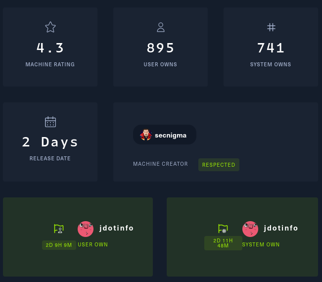

 

---

 

## Level 11 on TryHackMe
#### February 6th 2022

Topics: 

Made it to level 11 finally. I've learned so much from this site already, and there's so much more to learn!

 

---

 

## *Relevant* CTF on TryHackMe
#### February 4th 2022

Topics:  

[**Relevant Walkthrough**](walkthroughs/2022-02-06-Relevant.md)

 

---

 

## Week 1 of the Evolve Bootcamp Complete
#### February 4th 2022

Topics: 

I couldn't be happier with how well the first week went. The lead instructor, Michael Creaney, is not only extremely knowledgeable but is good at teaching as well. Sometimes you get one or the other, but not this time thankfully.

The assistant instructors are also very good and seem like they truly care. They're all Evolve alumni so they've been through the bootcamp and can help out with any general questions we have in addition to providing insight on what we're learning.

So far so good!

 

---

 

## *Wonderland* CTF on TryHackMe
#### February 4th 2022

Topics:     

[**Wonderland Walkthrough**](walkthroughs/2022-02-04-Wonderland.md)

 

---

 

## Today is the day my Evolve Security Bootcamp Starts!
#### January 31st 2022

Topics: 

About 3 months ago I finished some local college courses in their Cybersecurity learning path, and it turned out that the next step in the path wasn't available in the spring semester and I'd have to wait many months until the summer semester to be able to continue on. That was too long to wait so I decided to look around for other learning opportunities.

There were several choices but I eventually ended up seriously looking at the bootcamp that **Evolve Security** offered. It had great reviews, they seemed to be well respected in the industry, and many other features such as help with job placement, a voucher for the Security+ certification at the end of the bootcamp, and other bonuses.

It was a definitely a bit pricey, but in the end I believed it would be well worth the cost given everything I found during my research. So I took the plunge and officially signed up.

Today, it finally starts! It's going to be a lot of work with classes meeting 4 days a week and every other Saturday, which equates to roughly 20-30 hours of work per week split between in class work, out of class studying, and hands on labs.

I'm excited and can't wait to get started!

 

---

 

## *GamingServer* CTF on TryHackMe
#### January 30th 2022

Topics:      

[**GamingServer Walkthrough**](walkthroughs/2022-01-30-GamingServer.md)

 

---

 

## *Corp* CTF on TryHackMe
#### January 28th 2022

Topics:      

[**Corp Walkthrough**](walkthroughs/2022-01-28-Corp.md)

 

---

 

## *Retro* CTF on TryHackMe
#### January 27th 2022

Topics:    

[**Retro Walkthrough**](walkthroughs/2022-01-27-Retro.md)

 

---

 

## *Game Zone* CTF on TryHackMe
#### January 25th 2022

Topics:          

[**Game Zone Walkthrough**](walkthroughs/2022-01-25-Game-Zone.md)

 

---

 

## *Anonymous* CTF on TryHackMe
#### January 24th 2022

Topics:     

[**Anonymous Walkthrough**](walkthroughs/2022-01-24-Anonymous.md)

 

---

 

## *Crack the hash* CTF on TryHackMe
#### January 21st 2022

Topics:   

[**Crack the hash Walkthrough**](walkthroughs/2022-01-21-Crack-the-hash.md)

 

---

 

## *Pickle Rick* CTF on TryHackMe
#### January 20th 2022

Topics:   

[**Pickle Rick Walkthrough**](walkthroughs/2022-01-20-Pickle-Rick.md)

 

---

 

## *Inclusion* CTF on TryHackMe
#### January 20th 2022

Topics:    

[**Check out my first walkthrough**](walkthroughs/2022-01-20-Inclusion.md) of the **Inclusion** CTF on TryHackMe.

 

---

 

## *Hello World*
#### January 31st 2022

Hello everyone who may have stumbled across this site and thank you for visiting. I'm creating this primarily as a place to post walkthroughs for CTF challenges I complete as a way to:

- Reinforce my learning
- Get in the habit of documenting everything
- And give back the community / help those who are learning as well

I'll try and publish new walkthroughs at least once a week but will often add more than that.

I'm currently learning with the eventual goal of career switching into Cybersecurity so I'll also sometimes add accomplishments or other Cybersecurity related items to this blog as well.

If you have questions, comments, or would like to set something like this up yourself and need a little help there please feel free to get in touch with me on Twitter - [**@jdotinfo**]

Again, thanks for visiting and I hope you find this resource useful!