# Retro
**Date:** January 27th 2022

**Author:** j.info

**TryHackMe Link:** [**Retro**](https://tryhackme.com/room/retro)

**TryHackMe Difficulty Rating:** Hard

<br>

## Objectives
- A web server is running on the target. What is the hidden directory which the website lives on?
- user.txt flag
- root.txt flag

<br>

## Initial Enumeration

### Nmap Scans

I start out with an Nmap scan as usual but it does not work, so it's likely a Windows machine:
```
sudo nmap -sC -sV -A -T4 -oN retro.txt 10.10.2.100
```
```
Note: Host seems down. If it is really up, but blocking our ping probes, try -Pn
```

Running another scan with -Pn added:
```
sudo nmap -Pn -sC -sV -A -T4 -oN retro.txt 10.10.2.100
```
And yes, it's definitely a Windows machine. We can see that the http and rdp ports are open:
```
PORT     STATE SERVICE       VERSION
80/tcp   open  http          Microsoft IIS httpd 10.0
|_http-title: IIS Windows Server
| http-methods: 
|_  Potentially risky methods: TRACE
|_http-server-header: Microsoft-IIS/10.0
3389/tcp open  ms-wbt-server Microsoft Terminal Services
| rdp-ntlm-info: 
|   Target_Name: RETROWEB
|   NetBIOS_Domain_Name: RETROWEB
|   NetBIOS_Computer_Name: RETROWEB
|   DNS_Domain_Name: RetroWeb
|   DNS_Computer_Name: RetroWeb
|   Product_Version: 10.0.14393
```

<br>

### Gobuster Scans

My inital gobuster scan only shows up with one additional result to check out, but it does give us the answer to objective number 1:
```
gobuster dir -u http://10.10.2.100 -t 50 -r -x txt,php,html,htm -w dir-med.txt
```

Further enumerating with another gobuster scan targeted at that directory:
```
gobuster dir -u http://10.10.2.100/<REDACTED> -t 50 -r -x txt,php,html,htm -w dir-med.txt
```
Gives us the following to examine:
```
/wp-content           (Status: 200) [Size: 0]
/index.php            (Status: 200) [Size: 30515]
/wp-login.php         (Status: 200) [Size: 2743] 
/license.txt          (Status: 200) [Size: 19935]
/wp-includes          (Status: 403) [Size: 1233] 
/readme.html          (Status: 200) [Size: 7447] 
/wp-trackback.php     (Status: 200) [Size: 135]  
/xmlrpc.php           (Status: 405) [Size: 42]
```

<br>

## Website Digging

Lets go take a look at the website and see what we can find.

Going to the base website only shows us a default IIS page:

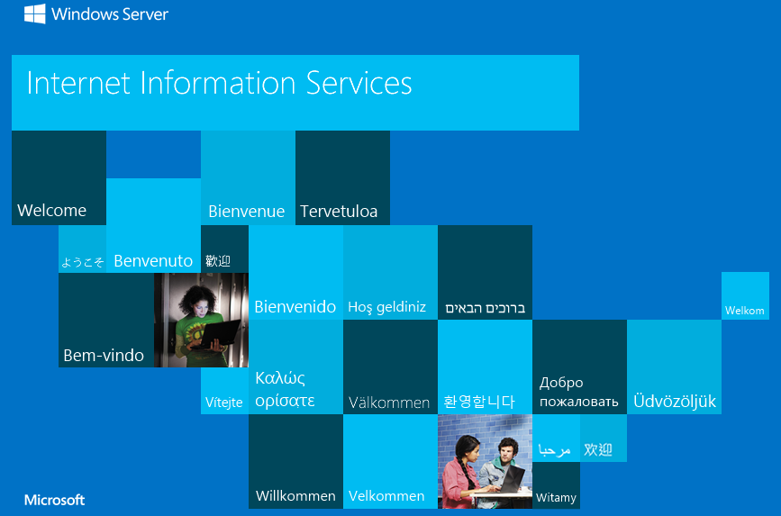

I looked at the page source code and checked to see if any info was hidden in robots.txt but couldn't find anything useful.

Moving on to the other webpage we discovered:

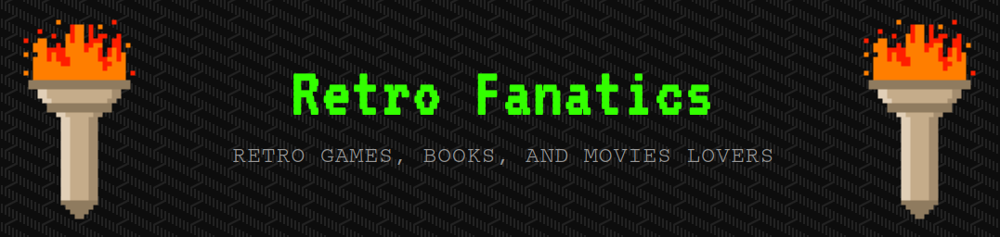

Looking at **Wappalyzer** shows us some interesting information. The website is running **WordPress v5.2.1** on top of **IIS 10.0** and has a **MySQL** database.

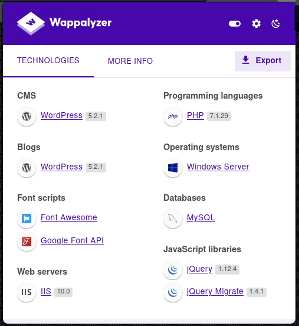

It seems that all of the blog posts are from a user named Wade, and clicking on his name from any of these posts will bring up everything he's done:

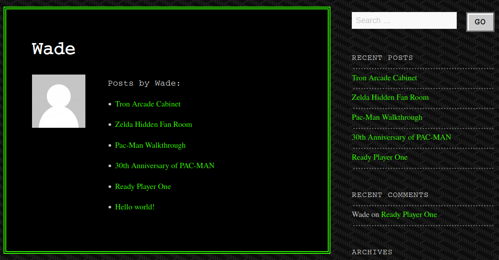

I looked through all of these posts to see if there were any clues and the only piece of information that stuck out to me was in the **Ready Player One** review under the **comment section**:

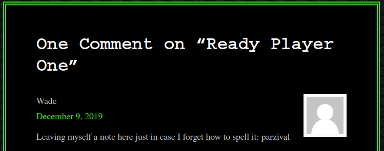

I further investigated the directories and files from the targetted gobuster scan above:
```
/wp-content         Comes up blank when navigating to it
/index.php          This is the main page
/wp-login.php       This gives us a WordPress login page
/license.txt        Default license information
/wp-includes        Unable to access
/readme.html        Default setup instructions for WordPress
/wp-trackback.php   Shows: "I really need an ID for this to work." but I couldn't figure out anything useful to do with this.
/xmlrpc.php         An API that allows you to do several things with your WordPress site. This has several vulnerabilities
                    if not properly configured including a way to brute force login credentials.
```

This website allows username enumeration on the lost password screen. If you enter a valid username it responds back saying an email could not be sent. If you enter an invalid username it tells you there is no account with that username or email address. I tried Wade and it is a valid username.

Let's try and login to the website as Wade using the info from the **Ready Player One** comment as the password to see if it works:

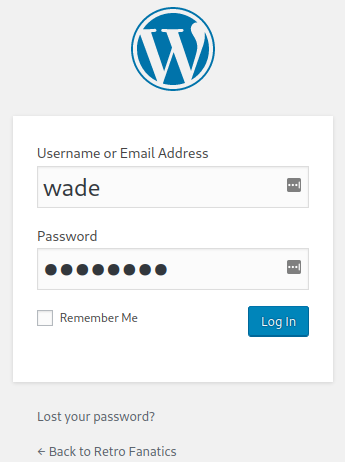

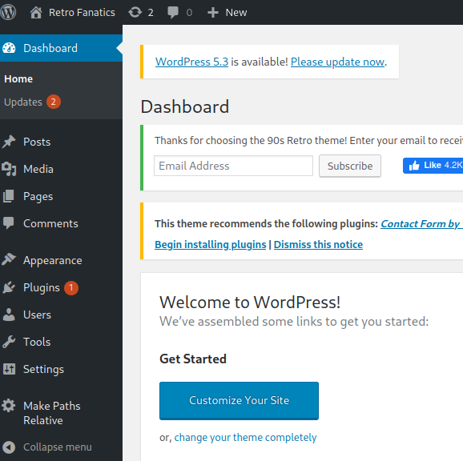

That's a start, we have a login! The users section on the left menu looks like a good place to check out:

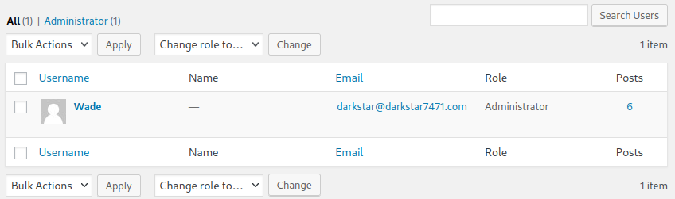

We find that Wade is the only user on the system, get an email address, and notice that he's an administrator on the site.

I look around through the menu system under tools, settings, etc and it looks like we can potentially upload a reverse shell under the **media menu**. I give this a try and there are filters in place preventing that from happening.

<br>

## Getting a shell

Still on the website under the **appearance menu** is an option to edit the blogs theme. I've previously had success doing this by modifying existing .php files with reverse shell code so let's see if we can do that here.

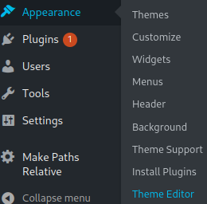

I used [**this reverse shell**](https://github.com/ivan-sincek/php-reverse-shell/blob/master/src/reverse/php_reverse_shell_older.php). This one is nice because it can be used for Linux, Windows, or MacOS.

Then I edit the **90s Retro: Main Index Template (index.php)** file found on the right hand menu and insert the reverse shell code at the top.

I start up a listener on my system, and then click the blue **Update File** button back on the WordPress site. As soon as I do I get a shell back!
```
┌──(kali㉿kali)-[~/work/shells]
└─$ nc -nvlp 4444
listening on [any] 4444 ...
connect to [10.6.127.197] from (UNKNOWN) [10.10.2.100] 49780
SOCKET: Shell has connected!
Microsoft Windows [Version 10.0.14393]
(c) 2016 Microsoft Corporation. All rights reserved.

C:\inetpub\wwwroot\retro>
```

At this point I tried quite a few things to escalate privileges and was ultimately unsuccessful. Back to the drawing board.

<br>

## RDP

Let's go investigate the RDP port we saw open on the nmap scan.

I fire up `remmina` and try to connect which works. I use the same username and password from the WordPress site and that also works getting me to his desktop:

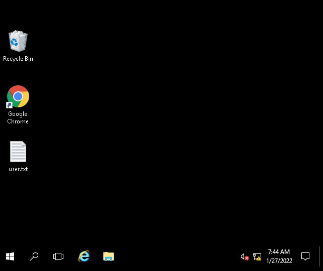

You can see the **user.txt** file on the desktop, and opening that gives you the answer to the **user.txt** objective.

I notice that the recycle bin appears to have deleted files in it which is interesting:


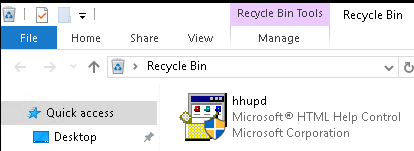

I did a google search for **hhupd** to see what this file was and it immediately had results containing **CVE-2019-1388** so that's promising. I watched this [**YouTube video**](https://www.youtube.com/watch?v=3BQKpPNlTSo) that walks you through how to perform this exploit and gave it a try.

Unfortunately it did not work for me. No matter what I did when clicking on the **VeriSign** link it would give me the following screen and not allow me to click the OK button.

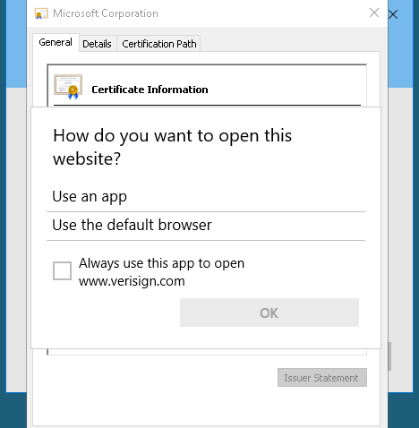

Another rabbit hole perhaps?

I open up the Chrome browser and notice that the same CVE-2019-1388 is in the bookmark bar:

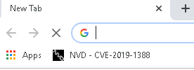

Maybe it's not a rabbit hole and I'm just doing something wrong?

I do some google searching to read up on this exploit and happen upon a TryHackMe forum post where other users are having the same issue with this exploit and it's recommended that as a work around to look into **CVE-2017-0213**.

I find a GitHub repository that has pre-compiled binaries in it [**here**](https://github.com/eonrickity/CVE-2017-0213) and download the x64 version.

I then start up a http server on my system with `python3 -m http.server 80` and on the target system open Chrome and download the file:
```
└─$ python3 -m http.server 80
Serving HTTP on 0.0.0.0 port 80 (http://0.0.0.0:80/) ...
10.10.2.100 - - [27/Jan/2022 15:13:23] "GET /CVE-2017-0213_x64.exe HTTP/1.1" 200 -
```

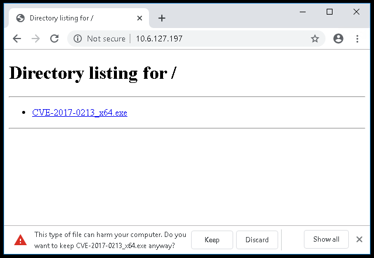

It will warn you that this type of file can harm your computer so make sure to select keep or it will not download.

Opening a command prompt the file shows downloaded:

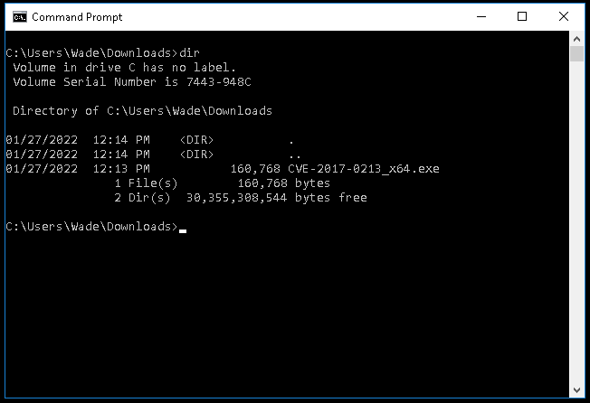

Time to run the exploit:

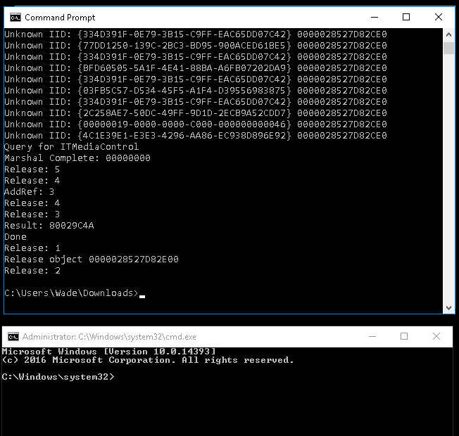

We get an elevated command prompt! I change to the administrators desktop to see if the flag **root.txt** flag is hidden there and it is:

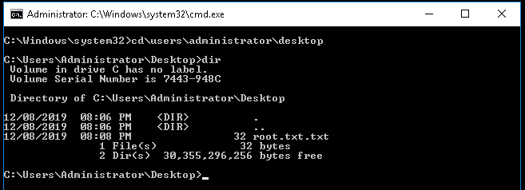

With that we now have all flags and have completed this CTF.

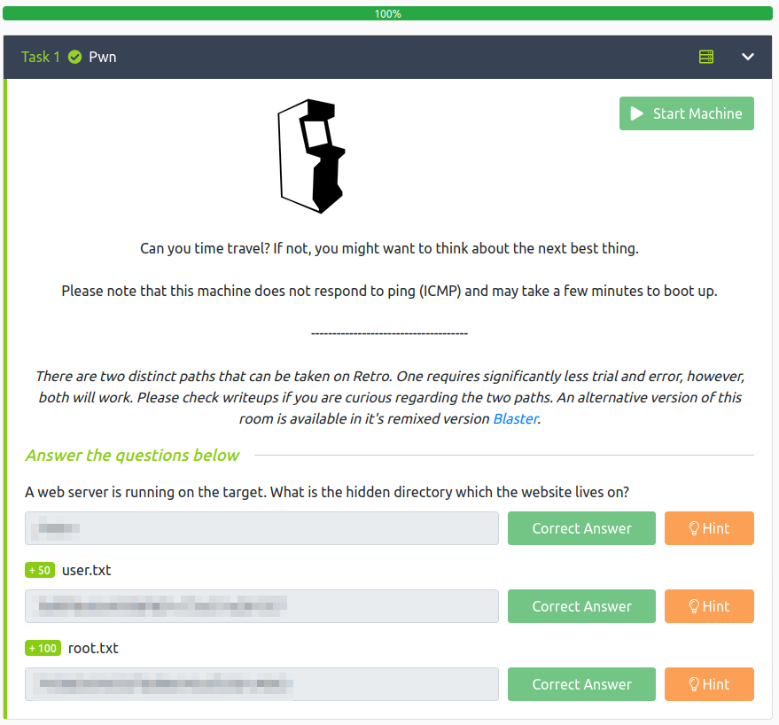

<br>

## SQL

This section is not at all necessary to read and I'm just adding it for curiosities sake.

I was curious about the MySQL server that **Wappalyzer** showed us earlier on and dug around that for a little while. It didn't yield much other than showing us the same information from the logged in website admin console, but in case you were also curious here's what I found:
```
Database info

Name: wordpress567
Username: wordpressuser567
Database password: YSPgW[%C.mQE

C:\Users\Wade\Downloads>mysql -h localhost -D wordpress567 -u wordpressuser567 -p
Enter password: ************
Welcome to the MySQL monitor.  Commands end with ; or \g.
Your MySQL connection id is 38
Server version: 5.1.73-community MySQL Community Server (GPL)

Copyright (c) 2000, 2013, Oracle and/or its affiliates. All rights reserved.

Oracle is a registered trademark of Oracle Corporation and/or its
affiliates. Other names may be trademarks of their respective
owners.

Type 'help;' or '\h' for help. Type '\c' to clear the current input statement.

mysql> show databases;
+--------------------+
| Database           |
+--------------------+
| information_schema |
| wordpress567       |
+--------------------+
2 rows in set (0.00 sec)

mysql> use wordpress567
Database changed

mysql> show TABLES;
+------------------------+
| Tables_in_wordpress567 |
+------------------------+
| wp_commentmeta         |
| wp_comments            |
| wp_links               |
| wp_options             |
| wp_postmeta            |
| wp_posts               |
| wp_term_relationships  |
| wp_term_taxonomy       |
| wp_termmeta            |
| wp_terms               |
| wp_usermeta            |
| wp_users               |
+------------------------+
12 rows in set (0.00 sec)

mysql> SELECT * FROM wp_users;
+----+------------+------------------------------------+---------------+---------------------------+----------+---------------------+---------------------+-------------+--------------+
| ID | user_login | user_pass                          | user_nicename | user_email                | user_url | user_registered     | user_activation_key | user_status | display_name |
+----+------------+------------------------------------+---------------+---------------------------+----------+---------------------+---------------------+-------------+--------------+
|  1 | Wade       | $P$B2Czd9p2Vzf.i2pV3XOs7NvE4Y7D8y. | wade          | darkstar@darkstar7471.com |          | 2019-12-09 00:09:37 |                     |           0 | Wade         |
+----+------------+------------------------------------+---------------+---------------------------+----------+---------------------+---------------------+-------------+--------------+
1 row in set (0.00 sec)
```


## Conclusion

A quick run down of what we covered in this CTF:
- Basic enumeration using nmap and gobuster
- Manually browsing the webpage for clues
- Username enumeration on a lost password page
- Navigating around a WordPress admin console
- Editing the WordPress theme to insert reverse shell code
- Starting a netcat listener and connecting back to it
- Connecting to the system via RDP
- Noticing deleted files in the recycle bin and investigating CVE-2019-1388
- Finding another privilege escalation method via CVE-2017-0213
- Downloading the CVE-2017-0213 binary and hosting it via http server
- Downloading and running CVE-2017-0213 on the target system
- A quick overview of working with MySQL databases

<br>

Many thanks to:
- [**DarkStar7471**](https://tryhackme.com/p/DarkStar7471) for creating this CTF.
- **TryHackMe** for hosting this CTF.

You can visit them at: [**https://tryhackme.com**](https://tryhackme.com)
