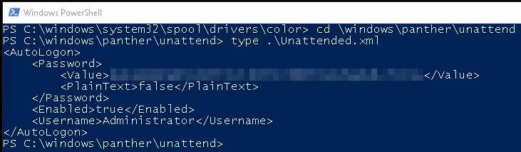

# Corp
**Date:** January 28th 2022

**Author:** j.info

**Link:** [Corp](https://tryhackme.com/room/corp) CTF on TryHackMe.

**TryHackMe Difficulty Rating:** Easy

<br>

## Objectives
- Access the file and and obtain the flag.
- Running that command, we find an existing SPN. What user is that for?
- Crack the hash. What is the users password in plain text?
- Login as this user. What is his flag?
- What is the decoded password?
- Now we have the Administrator's password, login as them and obtain the last flag.

<br>

## Initial Enumeration

Normally I'd start with an nmap scan and other enumeration, but it's not necessary in this CTF.

<br>

## Task 1 - Deploy the Windows machine

They just ask you to launch the virtual machine and give you the login credentials in this task.

<br>

## Task 2 - Bypassing Applocker

I connect over to the system using `remmina` and logging in with the credentials provided in task 1.

They ask that you use PowerShell to download an executable file of your choice to the following directory and execute it:
```
C:\Windows\System32\spool\drivers\color
```

By default this directory is whitelisted by AppLocker so it will not stop you if the program is ran from this directory.

**Note:** Left clicking the start menu and search icons on the taskbar did not work for me on this machine. You can however right click the start menu icon and choose run, then launch powershell or cmd that way.

In PowerShell I navigate to the whitelisted directory and then download winPEAS from my system as a test:


I run winPEAS and AppLocker does let me run it.

The next task asks you to open the following file to find the first flag:


That's it for task 2 let's move on to task 3.

<br>

## Task 3 - Kerberoasting

This task has us start out by running `setspn -T medin -Q */*` inside of PowerShell:


And we can see from the results the answer to the question about what user the SPN is for.

It then asks us to download a PowerShell script to the target machine which I had some issues with since it was not able to connect to GitHub. I took the same link and on my machine downloaded the PowerShell script, started a http server up, and then used PowerShell to download it from my machine which worked:


We're then asked to run the PowerShell script and export the hash into a format that hashcat will be able to crack. `Invoke-Kerberoast -OutputFormat hashcat | fl` :


**Note:** It can be a little tricky to get this hash formatted properly given the way it's output in PowerShell. If you're having issues with it saying **Seperator unmatched** when you try and crack the password it's more than likely because you don't have it in the proper format. You can find [**the official hashcat.net example hashes page here**](https://hashcat.net/wiki/doku.php?id=example_hashes). Make sure the hash is a single continuous line and doesn't have newline characters, etc and you should be ok.

Now that we have a hash, let's crack it with hashcat. They give you the hash type in the description so I run `hashcat -m 13100 -a 0 hash.txt rockyou.txt --force` and it cracked the password very quickly:
```
Status...........: Cracked
```

Next we're to RDP over to the machine as the new user:


You can see the flag.txt file on the desktop which gives us the answer to the last question in this task.

<br>

## Task 4 - Privilege Escalation

It asks us to download another PowerShell script, which I do the same way as before off of my own machine rather than directly from GitHub:


Then we're to check the **C:\Windows\Panther\Unattend\Unattended.xml** file which gives us an encoded password for the Administrator user:



You can run the encoded password through [**CyberChef**](https://gchq.github.io/CyberChef/) or other hash identifiers to figure out it's encoded in base64. And a tip, when you see an encoded string of text end in either a singe or double = sign it's likely base64.

Linux has a built in base64 decoder and I run that on my system:
```
echo '<hash>' | base64 --decode
```

We now have the administrators password let's login and get our final flag. The password for the account has expired and you need to change it:


And we're in. The flag.txt file is on the desktop:


And with that we've completed this CTF!


<br>

## Conclusion

A quick run down of what we covered in this CTF:
- Connecting to remote systems via RDP
- Bypassing AppLocker by running scripts and executables from a whitelisted location
- Looking at command history in the **ConsoleHost_history.txt** file
- Using the `setspn` command to find which users are in the Service Principal Names (SPN) directory
- Transferring files from one system to another using PowerShell
- Kerberoasting and getting a password hash
- Cracking that password hash using **hashcat**
- Running the **PowerUp1.ps1** script to enumerate the system for privilege escalation methods
- Decoding base64 encoded strings

<br>


<br>

Many thanks to **TryHackMe** for creating and hosting this CTF.

You can visit them at: [**https://tryhackme.com**](https://tryhackme.com)
