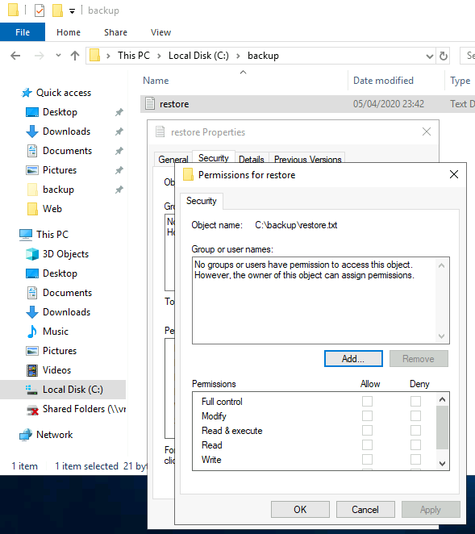

# Anthem
**Date:** April 10th 2022

**Author:** j.info

**Link:** [**Anthem**](https://tryhackme.com/room/anthem) CTF on TryHackMe

**TryHackMe Difficulty Rating:** Easy

<br>


<br>

## Objectives

### Task 1
- What port is for the web server?
- What port is for remote desktop service?
- What is a possible password of the pages web crawlers check for?
- What CMS is the website using?
- What is the domain of the website?
- What's the name of the Administrator
- Can we find the email address of the administrator?

### Task 2
- What is flag 1
- What is flag 2
- What is flag 3
- What is flag 4

### Task 3
- Gain initial access to the machine, what is the contents of user.txt?
- Can we spot the admin password?
- Escalate your privileges to root, what is the contents of root.txt?

<br>

## Initial Enumeration

### Nmap Scan

`sudo nmap -sV -sC -Pn -T4 10.10.68.154`

```
PORT     STATE SERVICE       VERSION
80/tcp   open  http          Microsoft HTTPAPI httpd 2.0 (SSDP/UPnP)
3389/tcp open  ms-wbt-server Microsoft Terminal Services
| ssl-cert: Subject: commonName=WIN-LU09299160F
| rdp-ntlm-info: 
|   Target_Name: WIN-LU09299160F
|   NetBIOS_Domain_Name: WIN-LU09299160F
|   NetBIOS_Computer_Name: WIN-LU09299160F
|   DNS_Domain_Name: WIN-LU09299160F
|   DNS_Computer_Name: WIN-LU09299160F
|   Product_Version: 10.0.17763
|_  System_Time: 2022-04-11T01:04:11+00:00
```

These results answer the first 2 questions of the task 1 flags.

<br>

### Gobuster Scan

`gobuster dir -u http://10.10.68.154 -t 100 -r -x php,txt,html -w dir-med.txt`

```
/robots.txt           (Status: 200) [Size: 192]
/search               (Status: 200) [Size: 3418]
/rss                  (Status: 200) [Size: 1863]
/blog                 (Status: 200) [Size: 5394]
/archive              (Status: 200) [Size: 5394]
/sitemap              (Status: 200) [Size: 1041]
/categories           (Status: 200) [Size: 3541]
/authors              (Status: 200) [Size: 4115]
/tags                 (Status: 200) [Size: 3594]
/INSTALL              (Status: 200) [Size: 4078]
/1073                 (Status: 200) [Size: 5394]
```

<br>

## Website Digging

Visiting the main page and looking at the very bottom answers the 3rd question in task 1:


<br>

Looking at **robots.txt** shows us the following and answers the 4th and 5th questions in task 1:

```
UmbracoIsTheBest!

# Use for all search robots
User-agent: *

# Define the directories not to crawl
Disallow: /bin/
Disallow: /config/
Disallow: /umbraco/
Disallow: /umbraco_client/
```

Visiting **/umbraco** directs us to the CMS login page but we don't have a login yet.


<br>

Looking at the 1st blog post "We are hiring" shows us a potential username:

```
jd@anthem.com
```

And the 2nd blog post has a poem on it about the admin:


<br>

If you do a google search for that poem you'll find it describes a character from **DC Comics** and it also answers the 6th question under task 1:


<br>

Given we know that the poem is about the admin of the site we can guess the admins name based on the search results. Also, since we found the jd@anthem.com email address from the hiring blog post we can guess the actual login name for the admin answering the final question in task 1.

<br>

Further digging around the website reveals the 4 flags for task 2.

Flag 1 - view the page source of **/archive/we-are-hiring/**:


Flag 2 - view the page source of the main page:


Flag 3 - Visit the **/authors** page:


Flag 4 - View the page source of **/archive/a-cheers-to-our-it-department/**


<br>

## System Access

**NOTE:**

> You can login to the CMS system umbraco with the SG username and look around if you want to see how it works before continuing on. Most of the flags we found for task 2 can be found inside the CMS system as well.

Since we have the admins username, and the likely password from the **robots.txt** file we can try logging in via RDP since that port is open. Running the following and logging in with the password we found:

`xfreerdp /v:10.10.68.154 -u:sg`


<br>

And we're in! The user.txt flag is on the desktop waiting for us and answers the 1st question in the final stage section.

I take a look around the file system and after turning on view hidden files find the following folder:


<br>

And inside that folder:


<br>

When trying to open the file it says we don't have access but if you look at the file properties we own the file, so we should be able to change the permissions on it.


<br>

Looking at the security permissions:



<br>

Clicking add and then entering the SG account we're logged in as:


<br>

It allows us to add the SG user and give them full control of the file:


<br>

And finally opening up the file:


<br>

## Privilege Escalation

That looks like a password to me. I take a look in the **Users folder** and the only other user on the system is **Administrator** so I'm going to try and RDP over as them with this new found password:

`xfreerdp /v:10.10.68.154 -u:administrator`


<br>

And with that we've completed this CTF!


<br>

## Conclusion

A quick run down of what we covered in this CTF:

- Basic enumeration with **nmap** and **gobuster**
- Manually enumerating the webpage to find several flags hidden in source code and other places
- Connecting to the system via RDP using credentials we found on the website
- Digging through files on the Windows system to find a backup file with a password stored inside of it
- Connecting to the system via RDP as the administrator with the password we found inside the backup file

<br>

Many thanks to:
- [**Chevalier**](https://tryhackme.com/p/Chevalier) for creating this CTF
- **TryHackMe** for hosting this CTF

<br>

You can visit them at: [**https://tryhackme.com**](https://tryhackme.com)
