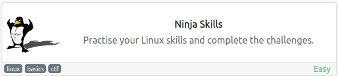
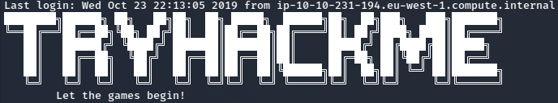
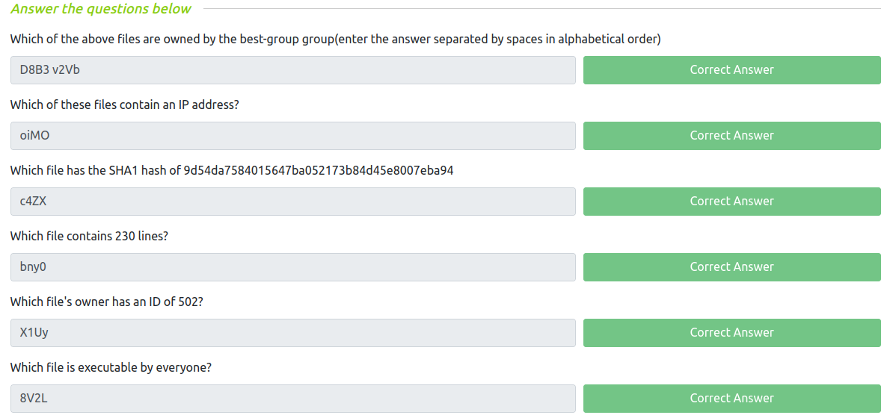

# Ninja Skills
**Date:** April 12th 2022

**Author:** j.info

**Link:** [**Ninja Skills**](https://tryhackme.com/room/ninjaskills) CTF on TryHackMe

**TryHackMe Difficulty Rating:** Easy

<br>



<br>

## Objectives
- Which of the above files are owned by the best-group group(enter the answer separated by spaces in alphabetical order)
- Which of these files contain an IP address?
- Which file has the SHA1 hash of 9d54da7584015647ba052173b84d45e8007eba94
- Which file contains 230 lines?
- Which file's owner has an ID of 502?
- Which file is executable by everyone?

We're asked to answer those questions using the following files:

```
8V2L
bny0
c4ZX
D8B3
FHl1
oiMO
PFbD
rmfX
SRSq
uqyw
v2Vb
X1Uy
```

<br>

## Connecting to the System

This box gives you credentials to ssh over to the machine and the username and password are both **new-user**.

`ssh new-user@10.10.159.225`

Upon logging in somebody made a banner for the system:



<br>

## Finding the Files

I look around in my home directory but the files listed above are not there, just an empty directory called files. I change over to that directory and start searching for the files.

With the following command I assign the results of the find command to a variable called cpvar, and then use the cp command to copy it into the current directory using verbose mode so we can see it copy over:

`cpvar=$(find / -name 8V2L 2>/dev/null); cp -v $cpvar .`

```
‘/etc/8V2L’ -> ‘./8V2L’
```

I use the same command to get all files copied over except **bny0** which was not found on the system. I look around further for that file but cannot find it anywhere.

<br>

## Questions

### Question 1 - Which of the above files are owned by the best-group group(enter the answer separated by spaces in alphabetical order)

This can be done with the **find command** and searching for that group:

`find / -group best-group 2>/dev/null

```
/mnt/D8B3
/home/v2Vb
```

### Question 2 - Which of these files contain an IP address?

I run an **extended grep** against all of the files with a **regex pattern** that will match anything that looks like an IP address:

`grep -E -o "([0-9]{1,3}[\.]){3}[0-9]{1,3}" *`

```
oiMO:1.1.1.1
```

### Question 3 - Which file has the SHA1 hash of 9d54da7584015647ba052173b84d45e8007eba94

For this I run the **shasum** command against all files in the directory:

`shasum *`

```
0323e62f06b29ddbbe18f30a89cc123ae479a346  8V2L
9d54da7584015647ba052173b84d45e8007eba94  c4ZX
2c8de970ff0701c8fd6c55db8a5315e5615a9575  D8B3
d5a35473a856ea30bfec5bf67b8b6e1fe96475b3  FHl1
5b34294b3caa59c1006854fa0901352bf6476a8c  oiMO
256933c34f1b42522298282ce5df3642be9a2dc9  PFbD
4ef4c2df08bc60139c29e222f537b6bea7e4d6fa  rmfX
acbbbce6c56feb7e351f866b806427403b7b103d  SRSq
57226b5f4f1d5ca128f606581d7ca9bd6c45ca13  uqyw
7324353e3cd047b8150e0c95edf12e28be7c55d3  v2Vb
59840c46fb64a4faeabb37da0744a46967d87e57  X1Uy
```

### Question 4 - Which file contains 230 lines?

`wc -l *`

```
   209 c4ZX
   209 D8B3
   209 FHl1
   209 oiMO
   209 PFbD
   209 rmfX
   209 SRSq
   209 uqyw
   209 v2Vb
   209 X1Uy
  2090 total

```

Since we have all files except **bny0** it has to be that.

### Question 5 - Which file's owner has an ID of 502?

Since I copied all files over to a directory in my home this piece of information did not get preserved. Looking through the files again shows us that it's **/X1Uy**:

`ls -ln /`

```
-rw-rw-r--  1 502 501 13545 Oct 23  2019 X1Uy
```

### Question 6 - Which file is executable by everyone?

And another one with the **ls command**:

`ls -al`

```
-rwxrwxr-x 1 new-user new-user 13545 Apr 13 01:27 8V2L
-rw-rw-r-- 1 new-user new-user 13545 Apr 13 01:31 c4ZX
-rw-rw-r-- 1 new-user new-user 13545 Apr 13 01:32 D8B3
-rw-rw-r-- 1 new-user new-user 13545 Apr 13 01:32 FHl1
-rw-rw-r-- 1 new-user new-user 13545 Apr 13 01:32 oiMO
-rw-rw-r-- 1 new-user new-user 13545 Apr 13 01:32 PFbD
-rw-rw-r-- 1 new-user new-user 13545 Apr 13 01:32 rmfX
-rw-rw-r-- 1 new-user new-user 13545 Apr 13 01:32 SRSq
-rw-rw-r-- 1 new-user new-user 13545 Apr 13 01:32 uqyw
-rw-rw-r-- 1 new-user new-user 13545 Apr 13 01:33 v2Vb
-rw-rw-r-- 1 new-user new-user 13545 Apr 13 01:33 X1Uy
```

File **8V2L** has execute permissions across the board.

<br>

With that we've completed this CTF!



<br>

## Conclusion

A quick run down of what we covered in this CTF:

- Using the **find** command to locate files on the system, and see which groups they belong to
- Using **extended grep** with **regex matching** to search files for IP addresses
- Using the **shasum** command to check file hashes
- Using the **wc -l** command to count the total lines in files
- Using **ls -ln** to view ower/group ID

<br>

Many thanks to:
- **TryHackMe** for creating and hosting this CTF

<br>

You can visit them at: [**https://tryhackme.com**](https://tryhackme.com)