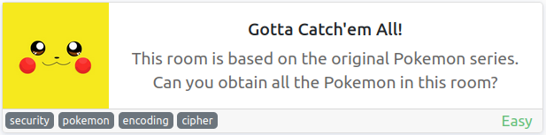
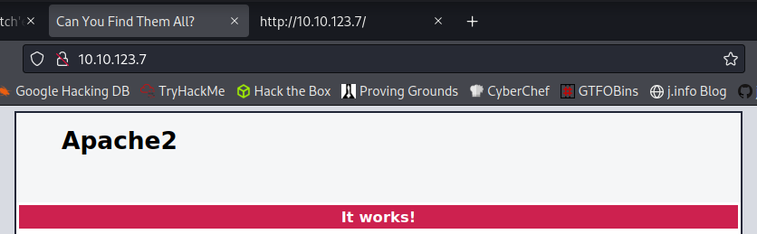

# Gotta Catch'em All!
**Date:** May 3rd 2022

**Author:** j.info

**Link:** [**Gotta Catch'em All!**](https://tryhackme.com/room/pokemon) CTF on TryHackMe

**TryHackMe Difficulty Rating:** Easy

<br>



<br>

## Objectives
- Find the Grass-Type Pokemon
- Find the Water-Type Pokemon
- Find the Fire-Type Pokemon
- Who is Root's Favorite Pokemon?

<br>

## Initial Enumeration

### Nmap Scan

`sudo nmap -sV -sC -Pn -T4 10.10.123.7`

```bash
PORT   STATE SERVICE VERSION
22/tcp open  ssh     OpenSSH 7.2p2 Ubuntu 4ubuntu2.8 (Ubuntu Linux; protocol 2.0)
80/tcp open  http    Apache httpd 2.4.18 ((Ubuntu))
|_http-title: Can You Find Them All?
```

<br>

### Gobuster Scan

`gobuster dir -u http://10.10.123.7 -t 100 -r -x php,txt,html -w dir-med.txt`

```bash
/index.html           (Status: 200) [Size: 11217]
```

<br>

## Website Digging

Visiting the main page makes it appear to be a standard Apache2 default page, but the title is set so I take a look at the page source and find a few things that have been added:



```js
   </style>
    <script type="text/javascript">
    	const randomPokemon = [
    		'Bulbasaur', 'Charmander', 'Squirtle',
    		'Snorlax',
    		'Zapdos',
    		'Mew',
    		'Charizard',
    		'Grimer',
    		'Metapod',
    		'Magikarp'
    	];
    	const original = randomPokemon.sort((pokemonName) => {
    		const [aLast] = pokemonName.split(', ');
    	});

    	console.log(original);
```

```js
        </div>
        <pokemon>:<hack_the_pokemon>
        	<!--(Check console for extra surprise!)-->
      </div>
```

Looking in the console shows me the defined array of Pokemon but it doesn't display anything else interesting.

This however looks like it could be a username and password:

```js
<pokemon>:<hack_the_pokemon>
```

<br>

## System Access

I try and ssh over with that and it works:

```bash
The authenticity of host '10.10.123.7 (10.10.123.7)' can't be established.
ED25519 key fingerprint is SHA256:pLr5hKfcRZWD4ZBMz/8vFWnJ2xslYHSX94C4KXwOLVg.
This key is not known by any other names
Are you sure you want to continue connecting (yes/no/[fingerprint])? yes
Warning: Permanently added '10.10.123.7' (ED25519) to the list of known hosts.
pokemon@10.10.123.7's password: 
Welcome to Ubuntu 16.04.6 LTS (GNU/Linux 4.15.0-112-generic x86_64)

 * Documentation:  https://help.ubuntu.com
 * Management:     https://landscape.canonical.com
 * Support:        https://ubuntu.com/advantage

84 packages can be updated.
0 updates are security updates.


The programs included with the Ubuntu system are free software;
the exact distribution terms for each program are described in the
individual files in /usr/share/doc/*/copyright.

Ubuntu comes with ABSOLUTELY NO WARRANTY, to the extent permitted by
applicable law.

pokemon@root:~$
```

<br>

## System Enumeration

I check `sudo -l` and we're not allowed, even though there is a **.sudo_as_admin_successful** file in our home directory.

Checking for **SUID** files doesn't show anything out of the ordinary. Same goes for **SGID** files and files with capabilities.

<br>

## Grass-type

In the Desktop folder is:

```bash
-rw-rw-r--  1 pokemon pokemon  383 Jun 22  2020 P0kEmOn.zip
```

Unzipping and changing to the folder that was created shows us a file that contains hex codes rather than a clear text flag.

```bash
-rw-rw-r-- 1 pokemon pokemon   53 Jun 22  2020 grass-type.txt
```

`cat grass-type.txt`

```
50 6f 4b 65 4d 6f 4e 7b 42 75 6c 62 61 73 61 75 72 7d
```

And decoding via xxd gives us the answer to the first grass-type pokemon question:

`echo "50 6f 4b 65 4d 6f 4e 7b 42 75 6c 62 61 73 61 75 72 7d" | xxd -r -p`

```
PoKeMoN{Bulbasaur}
```

<br>

## Water-type

I find another file in the **/var/www/html** folder called **water-type.txt** and this time the contents are in cipher text:

```
Ecgudfxq_EcGmP{Ecgudfxq}
```

Figuring it to be **rot13** I run it through a decoder for that, but it isn't.

Using the Pokemon types from the page source code earlier I determine that a water type is probably going to be **squirtle**, and the number characters in that matches **Ecgudfxq**, so we can use that as a key to decode the text. I count the number of places from E to S and it's 14, and give that a try for the rest of the letters and it gives us the message. Nice one, wasn't expecting **rot14** for sure.

```
Squirtle_SqUaD{Squirtle}
```

<br>

## Fire-type

Now to find a fire type.

The last files were called **grass-type.txt** and **water-type.txt** so I do a search for **fire-type.txt** and it finds a result:

`find / -name fire-type.txt 2>/dev/null`

```bash
/etc/why_am_i_here?/fire-type.txt
```

Looking in this file it appears to be **base64**:

```
DBrM20wbntDaGFybWFuZGVyfQ==
```

I run it through the **base64** command to decode it:

`cat fire-type.txt | base64 -d`

```
P0k3m0n{Charmander}
```

<br>

## Root's Favorite

Looking in **/home** shows us the following file but we can't view it:

```bash
-rwx------  1 ash     root       8 Jun 22  2020 roots-pokemon.txt
```

I eventually stumble upon this directory:

```bash
/home/pokemon/Videos/Gotta/Catch/Them/ALL!
```

And inside the folder is a file called:

```bash
-rw-r--r-- 1 pokemon root      78 Jun 22  2020 Could_this_be_what_Im_looking_for?.cplusplus
```

Displaying it:

```cpp
# include <iostream>

int main() {
        std::cout << "ash : pikapika"
        return 0;
}
```

Looks a lot like more credentials to me, let's try and login as **ash**.

`su ash`

```bash
Password: 
To run a command as administrator (user "root"), use "sudo <command>".
See "man sudo_root" for details.

bash: /home/ash/.bashrc: Permission denied
ash@root:/home/pokemon/Videos/Gotta/Catch/Them/ALL!$
```

After logging in I display the **roots-pokemon.txt** file and it shows us the answer to our final question:

```
Pikachu!
```

<br>

With that we've completed this CTF!


<br>

## Conclusion

A quick run down of what we covered in this CTF:

- Basic enumeration with **nmap** and **gobuster**
- Finding credentials inside of page source code allowing us an initial access point
- Manually enumeration to find various required files
- Using hex, rot14, and base64 decoders to display our flags
- Finding additional credentials inside of c++ code and using them to move laterally to get to our last flag

<br>

Many thanks to:
- [**GhostlyPy**](https://tryhackme.com/p/GhostlyPy) for creating this CTF
- **TryHackMe** for hosting this CTF

<br>

You can visit them at: [**https://tryhackme.com**](https://tryhackme.com)