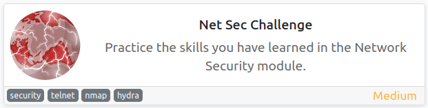
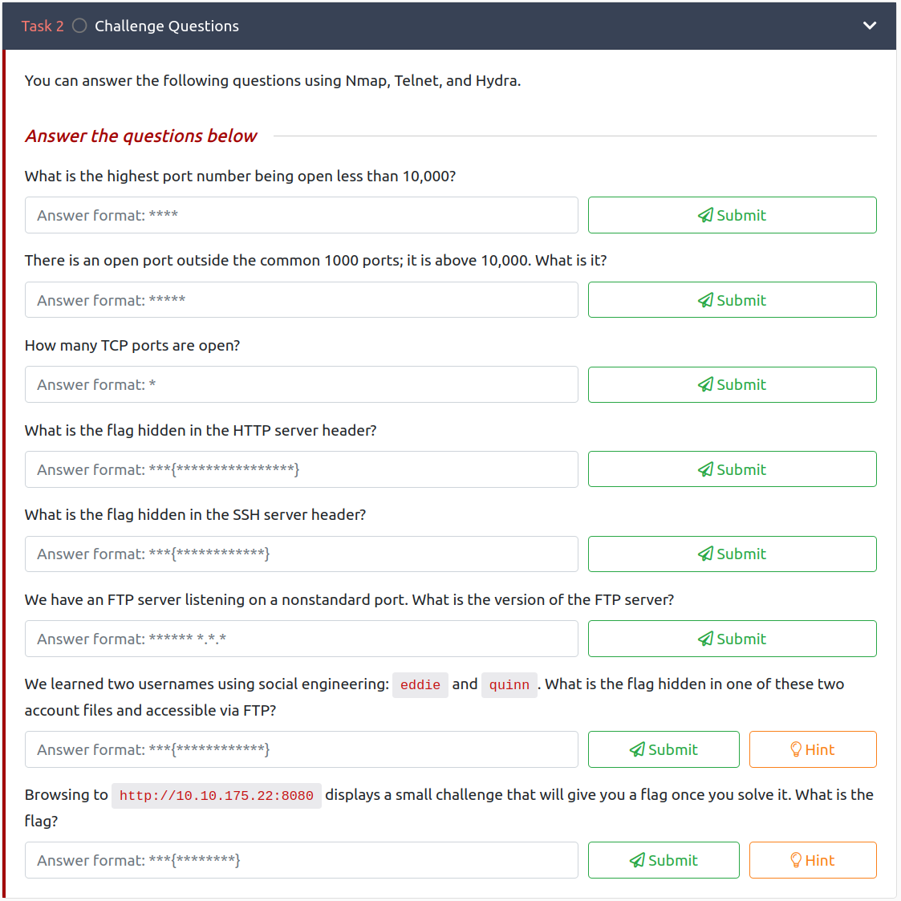
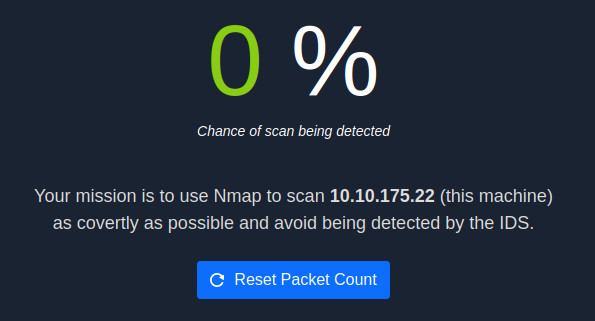
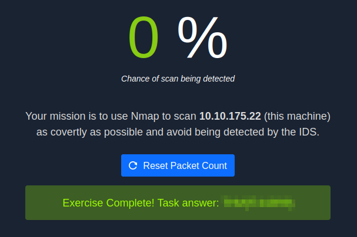
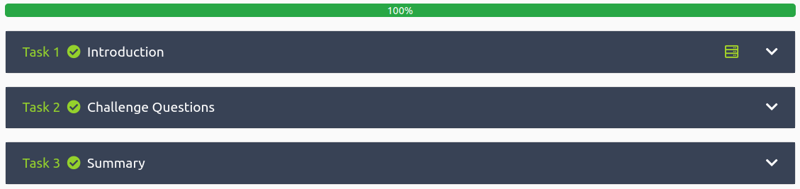

# Net Sec Challenge
**Date:** May 5th 2022

**Author:** j.info

**Link:** [**Net Sec Challenge**](https://tryhackme.com/room/netsecchallenge) CTF on TryHackMe

**TryHackMe Difficulty Rating:** Medium

<br>



<br>

## Objectives



<br>

## Initial Enumeration

### Nmap Scan

`sudo nmap -sV -sC -T4 10.10.175.22`

```
22/tcp   open  ssh         (protocol 2.0)
| fingerprint-strings: 
|   NULL: 
|_    SSH-2.0-OpenSSH_8.2p1 <REDACTED>
| ssh-hostkey: 
|   3072 da:5f:69:e2:11:1f:7c:66:80:89:61:54:e8:7b:16:f3 (RSA)
|   256 3f:8c:09:46:ab:1c:df:d7:35:83:cf:6d:6e:17:7e:1c (ECDSA)
|_  256 ed:a9:3a:aa:4c:6b:16:e6:0d:43:75:46:fb:33:b2:29 (ED25519)
80/tcp   open  http        lighttpd
|_http-server-header: lighttpd <REDACTED>
|_http-title: Hello, world!
139/tcp  open  netbios-ssn Samba smbd 4.6.2
445/tcp  open  netbios-ssn Samba smbd 4.6.2
<REDACTED>/tcp open  http        Node.js (Express middleware)
<REDACTED>/tcp open  ftp     vsftpd <REDACTED>
```

An additional full port scan finds 10021 open.

This answers questions 1 through 6 in the objectives.

<br>

## FTP Digging

The challenge mentions **hydra** so I try and brute force the usernames mentioned in the objectives and both are found:

`hydra -l eddie -P rockyou.txt -s 10021 10.10.175.22 ftp`

`hydra -l quinn -P rockyou.txt -s 10021 10.10.175.22 ftp`

```
[10021][ftp] host: 10.10.175.22   login: eddie   password: <REDACTED>
[10021][ftp] host: 10.10.175.22   login: quinn   password: <REDACTED>
```

Logging in as **eddie** doesn't lead to anything.

Logging in as **quinn** shows us the following file:

```
-rw-rw-r--    1 1002     1002           18 Sep 20  2021 ftp_flag.txt
```

`wc -c ftp_flag.txt`

```
18 ftp_flag.txt
```

That answers the 7th objective.

<br>

## Website Challenge

The objectives mention a challenge waiting for us on port 8080 and visiting displays:



So we need to stealthily nmap scan the machine in order for a flag to be displayed. I will say that after playing around with this for a little while it's pretty finicky and sometimes seemed to work and other times not.

I tried very stealthy scans changing the rate up, using decoy IP addresses, the -f -Pn -n etc flags, and the website never registered the scan as having happened so it wouldn't trigger the flag, even though the scans completed.

In the end I paired it down to this which worked:

`sudo nmap -p- -sN 10.10.175.22`



<br>

With that we've completed this CTF!



<br>

## Conclusion

A quick run down of what we covered in this CTF:

- Basic enumeration with **nmap**
- Using **hydra** to brute force the ftp server for two users we knew about
- Using stealthy **nmap** scans to avoid **IDS detection**

<br>

Many thanks to:
- [**strategos**](https://tryhackme.com/p/strategos) for creating this CTF
- **TryHackMe** for hosting this CTF

<br>

You can visit them at: [**https://tryhackme.com**](https://tryhackme.com)