# Road
**Date:** July 19th 2022

**Author:** j.info

**Link:** [**Road**](https://tryhackme.com/room/road) CTF on TryHackMe

**TryHackMe Difficulty Rating:** Medium

<br>

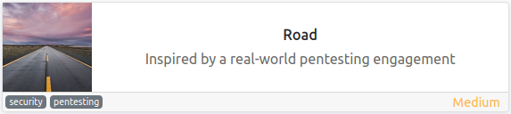

<br>

## Objectives
- user.txt flag
- root.txt flag

<br>

## Initial Enumeration

### Nmap Scan

`sudo nmap -sV -sC -T4 10.10.222.24`

```
PORT   STATE SERVICE VERSION
22/tcp open  ssh     OpenSSH 8.2p1 Ubuntu 4ubuntu0.2 (Ubuntu Linux; protocol 2.0)
80/tcp open  http    Apache httpd 2.4.41 ((Ubuntu))
|_http-title: Sky Couriers
```

<br>

### Gobuster Scans

`gobuster dir -u http://10.10.222.24 -t 100 -r -x php,txt,html -w dir-med.txt`

```
/index.html           (Status: 200) [Size: 19607]
/assets               (Status: 200) [Size: 1505]
/career.html          (Status: 200) [Size: 9289]
/phpMyAdmin           (Status: 200) [Size: 19290]
/v2                   (Status: 200) [Size: 2619]
```

/assets scan:

```
/img                  (Status: 200) [Size: 3394]
/css                  (Status: 200) [Size: 4078]
/js                   (Status: 200) [Size: 4072]
```

/phpMyAdmin scan:

```
/README               (Status: 200) [Size: 1520]
/tmp                  (Status: 200) [Size: 958] 
/libraries            (Status: 200) [Size: 3781]
/templates            (Status: 200) [Size: 10450]
/themes               (Status: 200) [Size: 1556] 
/doc                  (Status: 200) [Size: 958]  
/index.php            (Status: 200) [Size: 19290]
/js                   (Status: 200) [Size: 1543] 
/examples             (Status: 200) [Size: 1624] 
/url.php              (Status: 200) [Size: 19290]
/vendor               (Status: 200) [Size: 3925] 
/ChangeLog            (Status: 200) [Size: 41123]
/sql                  (Status: 200) [Size: 1698] 
/LICENSE              (Status: 200) [Size: 18092]
/locale               (Status: 200) [Size: 8808]
```

/v2 scan:

```
/admin                (Status: 200) [Size: 32]
/profile.php          (Status: 200) [Size: 2619]
/index.php            (Status: 200) [Size: 2619]
/lostpassword.php     (Status: 200) [Size: 22]
/profileimages        (Status: 200) [Size: 30]
```

/v2/admin scan:

```
/register.html        (Status: 200) [Size: 3798]
/index.php            (Status: 200) [Size: 32]  
/login.html           (Status: 200) [Size: 2619]
/reg.php              (Status: 200) [Size: 28]  
/logout.php           (Status: 200) [Size: 2619]
```

<br>

## Website Digging

Visiting the main page:

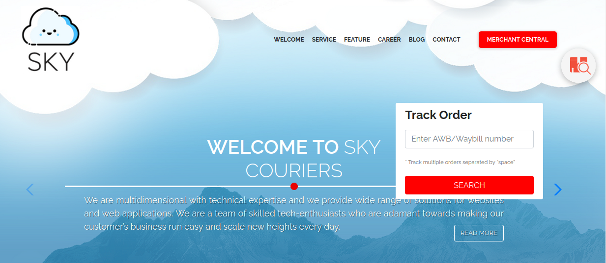

The /v2 and /phpMyAdmin locations look like interesting places to start. Heading over to **/v2/index.php** directs me to **/v2/admin/login.html**:

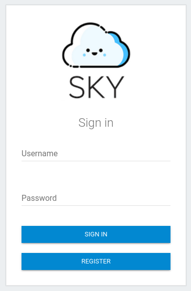

A few random guesses at the admin user doesn't end up being successful. I use the register button to create a new account and then login:

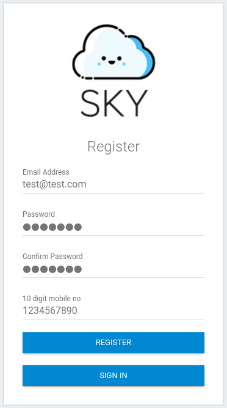


We have a notification up in the top right but nothing displays when trying to open it.

Accessing the account dropdown in the top right let's us view our profile but it states that only the admin can use this function at the moment, and trying to upload a profile picture doesn't work either.

Looking at the links on the left side of the page shows that the only link that actually does anything is the **ResetUser** under the **Users** drop down.

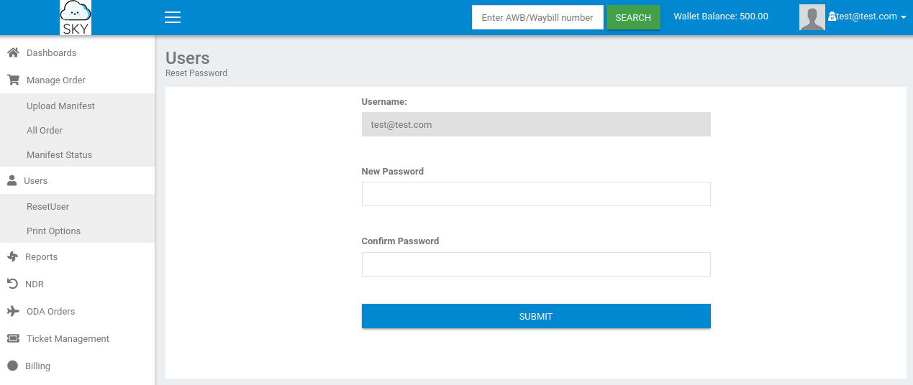

We're not allowed to change the username on this page but maybe we can capture the request in burp suite and modify it there giving us access to the admin account (which was listed in the profile page as: admin@sky.thm).

I enter the information on the reset password screen and capture it in burp suite, and sure enough it looks like we can edit the4 uname:

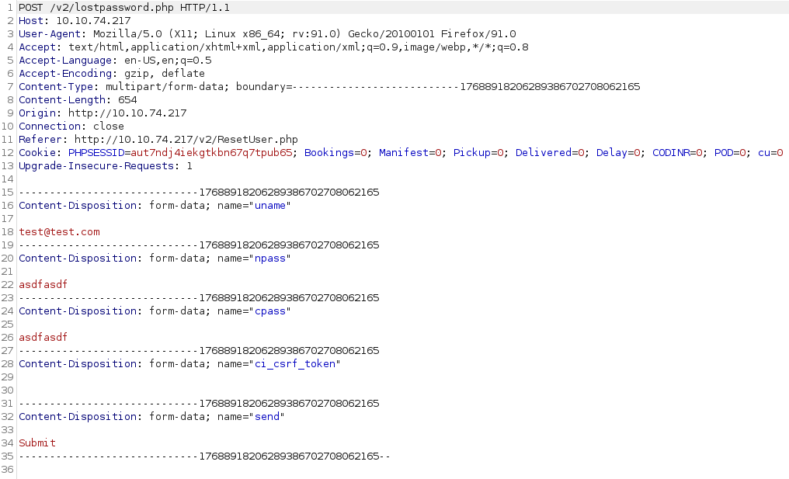

I change it to the admin email and forward the request through burp suite and back in the web browser it tells us the password was changed:

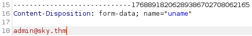

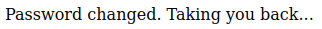

Logging out of my account takes me back to the login screen and I try to login as the admin with the password I just set for them and it works:

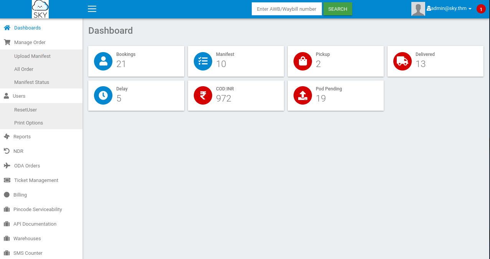

All of the links still don't do anything, and going to edit my profile still has everything as unselectable except the select profile image at the bottom. I use the select image button and navigate to a picture file on my computer but it doesn't change my profile picture icon.

I test to see if the file actually made it to the server since there is no save button or anything. Looking in **/v2/profileimages/<picture I uploaded> does display the picture, so it did upload.

<br>

## System Access

The server uses PHP for sure so let's see if it filters out .php uploads for this. I use the standard pentestmonkey php reverse shell, use the select image button again, and then navigate to it in the profileimages directory which gives me a shell back:

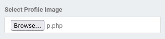

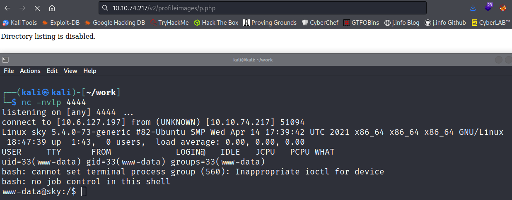

I quickly fix my shell:

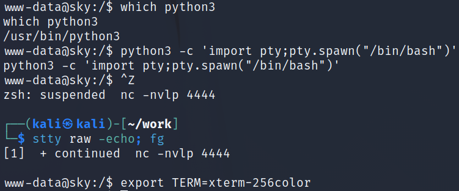

<br>

## System Enumeration

`sudo -l` requires a password.

`getcap -r / 2>/dev/null` doesn't show us any interesting capabilities.

Checking which users have login shells:

`cat /etc/passwd | grep bash`

```
root:x:0:0:root:/root:/bin/bash
webdeveloper:x:1000:1000:webdeveloper:/home/webdeveloper:/bin/bash
```

Checking privileges for the **webdeveloper** user with `id`:

```
uid=1000(webdeveloper) gid=1000(webdeveloper) groups=1000(webdeveloper),24(cdrom),27(sudo),30(dip),46(plugdev)
```

Looking in the webdeveloper home directory reveals the first user flag:

`wc -c /home/webdeveloper/user.txt`

```
33 /home/webdeveloper/user.txt
```

Checking `ss -tunlp` shows us the following ports open locally in addition to the 22 and 80 we've already seen:

```
Netid State  Recv-Q Send-Q      Local Address:Port    Peer Address:Port Process 
udp   UNCONN 0      0           127.0.0.53%lo:53           0.0.0.0:*            
udp   UNCONN 0      0       10.10.74.217%eth0:68           0.0.0.0:*            
tcp   LISTEN 0      511             127.0.0.1:9000         0.0.0.0:*            
tcp   LISTEN 0      4096            127.0.0.1:27017        0.0.0.0:*            
tcp   LISTEN 0      151             127.0.0.1:3306         0.0.0.0:*            
tcp   LISTEN 0      4096        127.0.0.53%lo:53           0.0.0.0:*            
tcp   LISTEN 0      128               0.0.0.0:22           0.0.0.0:*            
tcp   LISTEN 0      70              127.0.0.1:33060        0.0.0.0:*            
tcp   LISTEN 0      511                     *:80                 *:*            
tcp   LISTEN 0      128                  [::]:22              [::]:*
```

I try loggin into the SQL database on port 3306 with a few random passwords and don't have any luck.

Checking out the mongo database on port 27017 via `mongo` gives us the password for the **webdeveloper** account, and we're able to ssh in as them:

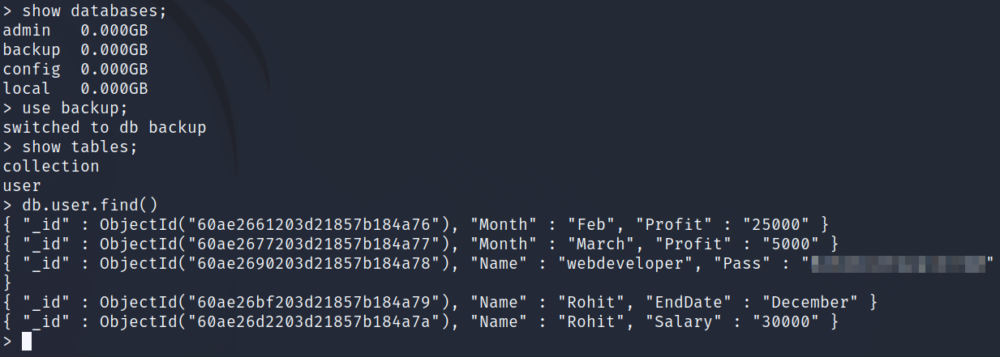

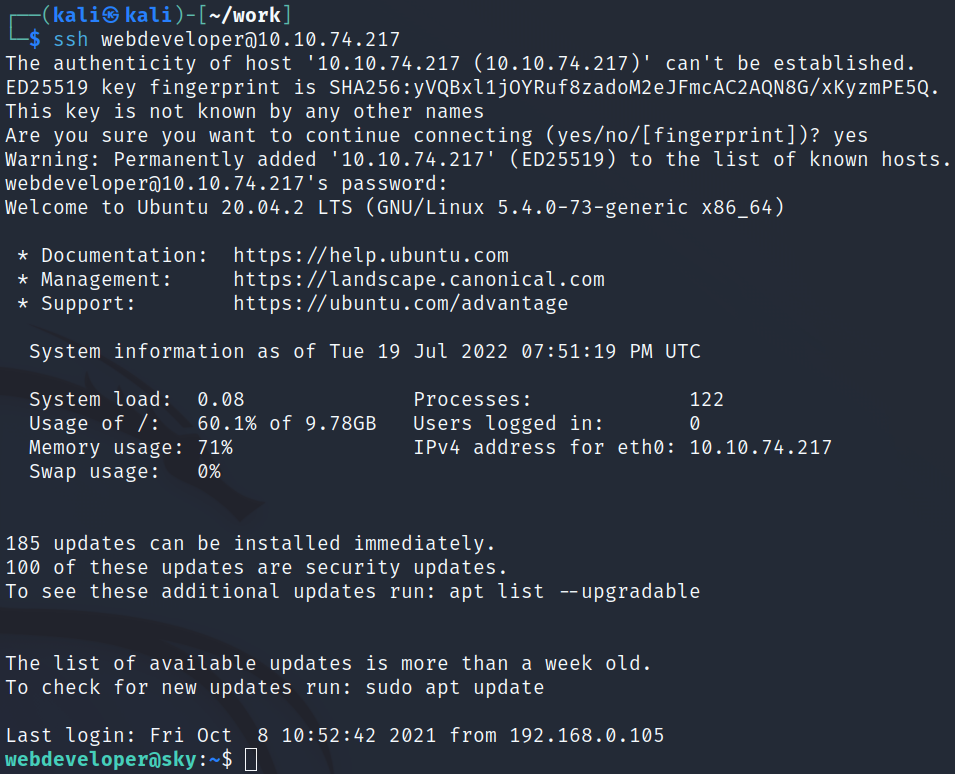

Checking `sudo -l`:

```
Matching Defaults entries for webdeveloper on sky:
    env_reset, mail_badpass,
    secure_path=/usr/local/sbin\:/usr/local/bin\:/usr/sbin\:/usr/bin\:/sbin\:/bin\:/snap/bin,
    env_keep+=LD_PRELOAD

User webdeveloper may run the following commands on sky:
    (ALL : ALL) NOPASSWD: /usr/bin/sky_backup_utility
```

That LD_PRELOAD let's us import custom libraries! More information can be found about this [**at this link I used**](https://whitecr0wz.github.io/posts/LD_PRELOAD/).

<br>

## Root

Using the article above I get things ready by creating a file called **test.c** that will execute a shell upon being ran and then compiling it:

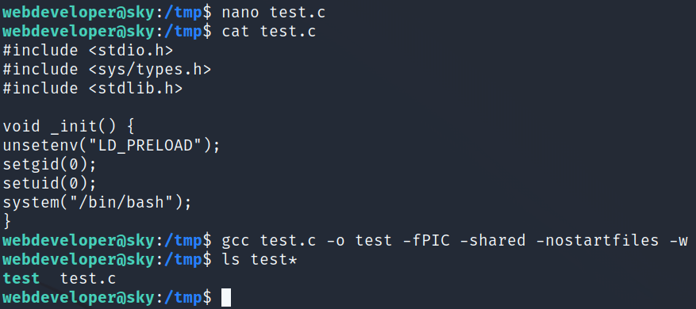

I then run the following command and get root access:

`sudo LD_PRELOAD=/tmp/test /usr/bin/sky_backup_utility`

```
webdeveloper@sky:/tmp$ sudo LD_PRELOAD=/tmp/test /usr/bin/sky_backup_utility
root@sky:/tmp# whoami
root
root@sky:/tmp#
```

Over in **/root** we find our final flag:

`wc -c /root/root.txt`

```
33 /root/root.txt
```

<br>

With that we've completed this CTF!

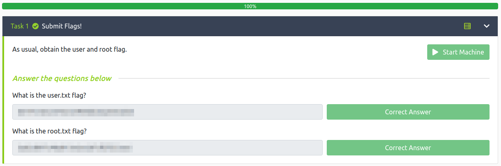

<br>

## Conclusion

A quick run down of what we covered in this CTF:

- Basic enumeration with **nmap** and **gobuster**
- Using **burp suite** to exploit a change password request giving us access to the admin account on the website
- Taking advantage of **poor filtering practices** to upload a reverse php shell into our profile picture to gain an initial foothold on the system
- Finding an open **mongo database** with clear text user credentials in it and using them to laterally move to another user
- The new user was able to run a backup utility as the root user via sudo, and they had **LD_PRELOAD** set allowing us to create a malicious .c script, compile it, and then load it while calling the sudo command giving us root access

<br>

Many thanks to:
- [**StillNoob**](https://tryhackme.com/p/StillNoob) for creating this CTF
- **TryHackMe** for hosting this CTF

<br>

You can visit them at: [**https://tryhackme.com**](https://tryhackme.com)